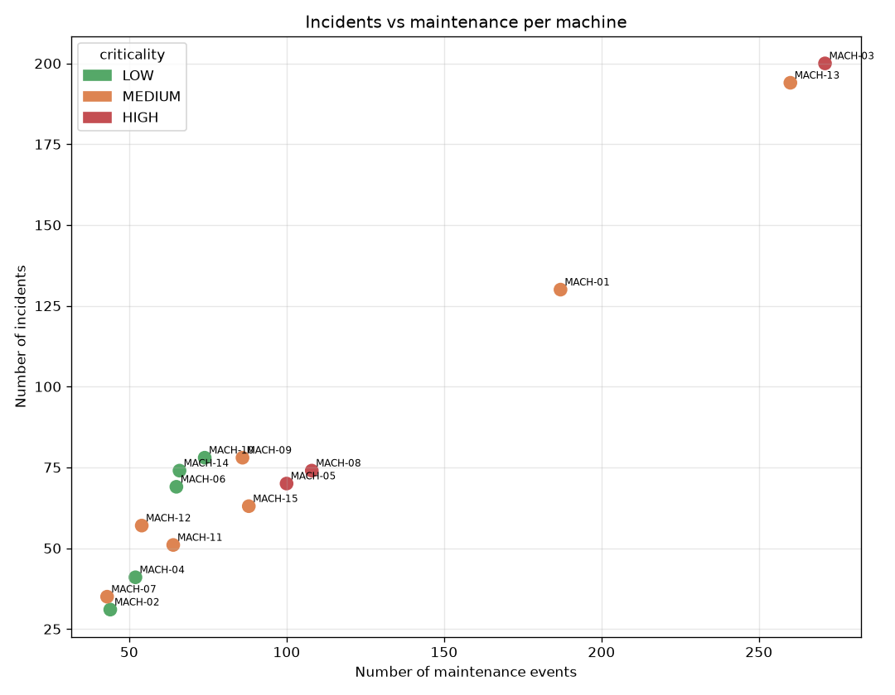
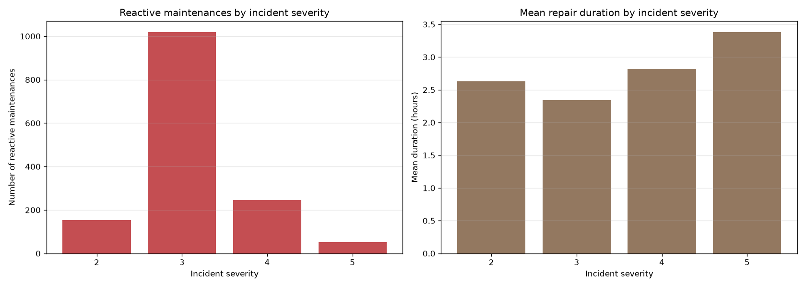
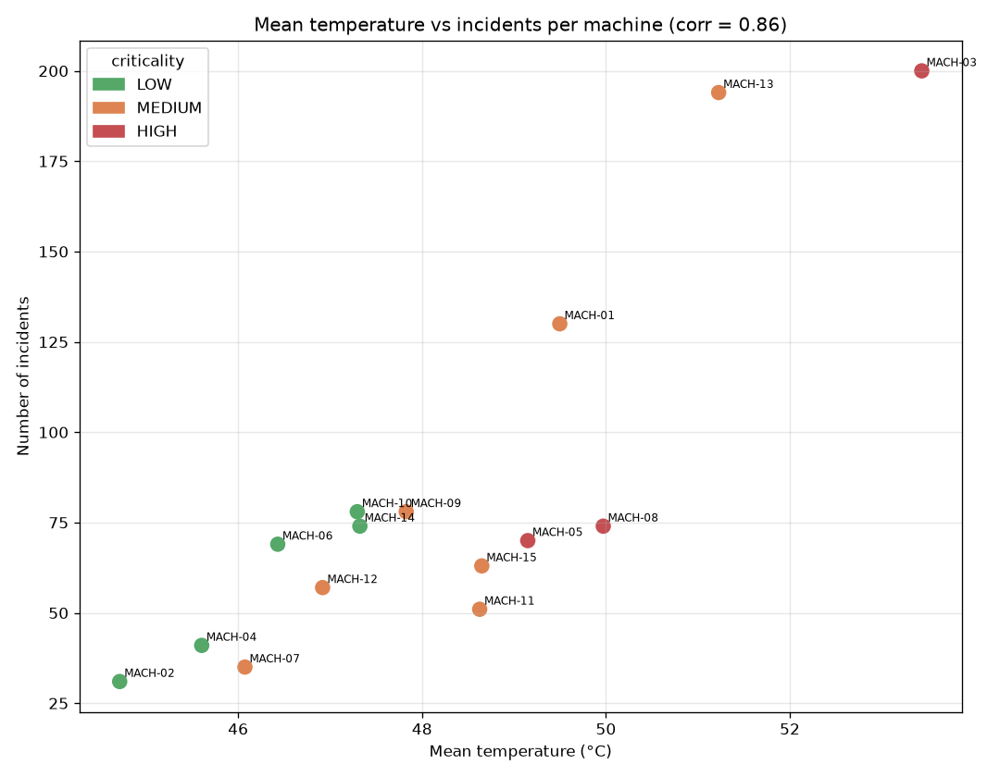

# Cross-source synthesis report

> Run `202606220827` · cross-source summary for business teams.

## Dataset at a glance

| Indicator | Value |
|---|---|
| Machines profiled | 15 |
| Reactive maintenances linked to an incident | 1472 |
| Sources joined | incidents · telemetry · machines |
| Corr. mean temperature ↔ incidents | 0.86 |
| Corr. maintenance count ↔ incidents | 0.98 |

**How to read this report.** The sources are joined per machine (and per incident for the maintenance link). These views relate incidents, telemetry and maintenance to surface which machines and conditions drive failures.

## Cross-source relationships

### Incidents vs maintenance per machine

### Reactive maintenance vs incident severity

### Mean temperature vs incidents per machine

## Notes for business teams

- Machines high on both incidents and maintenance are the clearest preventive targets.
- A positive temperature ↔ incidents correlation would support temperature-based early-warning thresholds.
- Reactive maintenances are all linked to an incident — a basis for a future predictive model.
