# gold — gold dataset report

> Gold layer · per-feature understanding.

## Dataset at a glance

| Indicator | Value |
|---|---|
| Layer | gold |
| Rows | 134280 |
| Columns | 216 |
| Unique machines | 15 |
| Missing values (total) | 16099 |

**How to read this report.** Each feature shows a type-aware synthesis (range, missing, spread, skew, outliers, top values…) and, for numeric features, a boxplot across machines and its distribution (histogram + KDE).

## Per-feature analysis

### machine_id (OK)

- **dtype** str · **count** 134280 · **unique** 15 · **missing** 0 (0.0%)
- **most frequent** `MACH-01` (8952, 6.67%)
- **distinct values**: MACH-01, MACH-02, MACH-03, MACH-04, MACH-05, MACH-06, MACH-07, MACH-08, MACH-09, MACH-10, MACH-11, MACH-12, MACH-13, MACH-14, MACH-15

### window_start

- **dtype** datetime64[us] · **count** 134280 · **unique** 8952 · **missing** 0 (0.0%)
- **range** 2025-06-01 00:00 → 2026-06-08 23:00 (span 372 days)

### window_end

- **dtype** datetime64[us] · **count** 134280 · **unique** 8952 · **missing** 0 (0.0%)
- **range** 2025-06-01 01:00 → 2026-06-09 00:00 (span 372 days)

### split_set

- **dtype** str · **count** 134280 · **unique** 1 · **missing** 0 (0.0%)
- **most frequent** `train` (134280, 100.0%)
- **distinct values**: train

### temperature_c_mean_2h

- **dtype** float64 · **count** 134280 · **unique** 24984 · **missing** 0 (0.0%)
- **range** 32.852 → 80.0 (span 47.148) · **Q1/median/Q3** 44.308 / 48.038 / 52.012
- **mean** 48.185 · **std** 5.156 · **skew** 0.179

**Outliers** — flagged values per method:

| method | normal band | below — n (range) | above — n (range) |
|---|---|---|---|
| IQR (k=1.5) | [32.752, 63.568] | 0 — | 272 [63.595, 80.0] |
| z-score (k=3) | [32.717, 63.654] | 0 — | 268 [63.707, 80.0] |

**Outliers by machine** (IQR k=1.5 and z-score k=3, fences recomputed per machine):

| machine | n | IQR below | IQR above | z-score below | z-score above |
|---|---|---|---|---|---|
| MACH-01 | 8952 | 2 | 24 | 0 | 22 |
| MACH-02 | 8952 | 18 | 2 | 5 | 2 |
| MACH-03 | 8952 | 5 | 21 | 4 | 21 |
| MACH-04 | 8952 | 10 | 29 | 1 | 27 |
| MACH-05 | 8952 | 0 | 39 | 0 | 36 |
| MACH-06 | 8952 | 0 | 0 | 0 | 0 |
| MACH-07 | 8952 | 0 | 6 | 0 | 7 |
| MACH-08 | 8952 | 0 | 22 | 0 | 27 |
| MACH-09 | 8952 | 0 | 25 | 0 | 29 |
| MACH-10 | 8952 | 0 | 11 | 0 | 14 |
| MACH-11 | 8952 | 0 | 26 | 0 | 30 |
| MACH-12 | 8952 | 0 | 16 | 0 | 19 |
| MACH-13 | 8952 | 0 | 11 | 0 | 12 |
| MACH-14 | 8952 | 0 | 26 | 0 | 29 |
| MACH-15 | 8952 | 0 | 25 | 0 | 25 |
| **total** | 134280 | 35 | 283 | 10 | 300 |

### temperature_c_max_2h

- **dtype** float64 · **count** 134280 · **unique** 17992 · **missing** 0 (0.0%)
- **range** 33.383 → 80.0 (span 46.617) · **Q1/median/Q3** 45.055 / 48.818 / 52.771
- **mean** 48.934 · **std** 5.201 · **skew** 0.176

**Outliers** — flagged values per method:

| method | normal band | below — n (range) | above — n (range) |
|---|---|---|---|
| IQR (k=1.5) | [33.481, 64.345] | 2 [33.383, 33.443] | 303 [64.366, 80.0] |
| z-score (k=3) | [33.331, 64.536] | 0 — | 297 [64.542, 80.0] |

**Outliers by machine** (IQR k=1.5 and z-score k=3, fences recomputed per machine):

| machine | n | IQR below | IQR above | z-score below | z-score above |
|---|---|---|---|---|---|
| MACH-01 | 8952 | 1 | 18 | 0 | 16 |
| MACH-02 | 8952 | 18 | 3 | 8 | 2 |
| MACH-03 | 8952 | 5 | 24 | 2 | 22 |
| MACH-04 | 8952 | 10 | 30 | 0 | 28 |
| MACH-05 | 8952 | 1 | 43 | 0 | 40 |
| MACH-06 | 8952 | 0 | 0 | 0 | 0 |
| MACH-07 | 8952 | 0 | 8 | 0 | 8 |
| MACH-08 | 8952 | 0 | 23 | 0 | 28 |
| MACH-09 | 8952 | 0 | 28 | 0 | 33 |
| MACH-10 | 8952 | 0 | 14 | 0 | 16 |
| MACH-11 | 8952 | 0 | 27 | 0 | 31 |
| MACH-12 | 8952 | 0 | 18 | 0 | 22 |
| MACH-13 | 8952 | 0 | 12 | 0 | 16 |
| MACH-14 | 8952 | 0 | 26 | 0 | 30 |
| MACH-15 | 8952 | 0 | 31 | 0 | 28 |
| **total** | 134280 | 35 | 305 | 10 | 320 |

### temperature_c_std_2h

- **dtype** float64 · **count** 134265 · **unique** 4588 · **missing** 15 (0.01%)
- **range** 0.0 → 26.393 (span 26.393) · **Q1/median/Q3** 0.424 / 0.877 / 1.499
- **mean** 1.058 · **std** 0.858 · **skew** 2.757

**Outliers** — flagged values per method:

| method | normal band | below — n (range) | above — n (range) |
|---|---|---|---|
| IQR (k=1.5) | [-1.188, 3.111] | 0 — | 3172 [3.118, 26.393] |
| z-score (k=3) | [-1.516, 3.633] | 0 — | 1410 [3.635, 26.393] |

**Outliers by machine** (IQR k=1.5 and z-score k=3, fences recomputed per machine):

| machine | n | IQR below | IQR above | z-score below | z-score above |
|---|---|---|---|---|---|
| MACH-01 | 8951 | 0 | 142 | 0 | 61 |
| MACH-02 | 8951 | 0 | 114 | 0 | 51 |
| MACH-03 | 8951 | 0 | 147 | 0 | 65 |
| MACH-04 | 8951 | 0 | 123 | 0 | 54 |
| MACH-05 | 8951 | 0 | 163 | 0 | 71 |
| MACH-06 | 8951 | 0 | 194 | 0 | 100 |
| MACH-07 | 8951 | 0 | 210 | 0 | 110 |
| MACH-08 | 8951 | 0 | 238 | 0 | 89 |
| MACH-09 | 8951 | 0 | 335 | 0 | 118 |
| MACH-10 | 8951 | 0 | 318 | 0 | 116 |
| MACH-11 | 8951 | 0 | 274 | 0 | 105 |
| MACH-12 | 8951 | 0 | 282 | 0 | 110 |
| MACH-13 | 8951 | 0 | 222 | 0 | 100 |
| MACH-14 | 8951 | 0 | 222 | 0 | 90 |
| MACH-15 | 8951 | 0 | 155 | 0 | 57 |
| **total** | 134265 | 0 | 3139 | 0 | 1297 |

### temperature_c_mean_3h

- **dtype** float64 · **count** 134280 · **unique** 43891 · **missing** 0 (0.0%)
- **range** 33.285 → 80.0 (span 46.715) · **Q1/median/Q3** 44.359 / 48.032 / 51.972
- **mean** 48.185 · **std** 5.084 · **skew** 0.178

**Outliers** — flagged values per method:

| method | normal band | below — n (range) | above — n (range) |
|---|---|---|---|
| IQR (k=1.5) | [32.941, 63.39] | 0 — | 269 [63.396, 80.0] |
| z-score (k=3) | [32.934, 63.436] | 0 — | 267 [63.488, 80.0] |

**Outliers by machine** (IQR k=1.5 and z-score k=3, fences recomputed per machine):

| machine | n | IQR below | IQR above | z-score below | z-score above |
|---|---|---|---|---|---|
| MACH-01 | 8952 | 0 | 24 | 0 | 22 |
| MACH-02 | 8952 | 18 | 1 | 7 | 1 |
| MACH-03 | 8952 | 6 | 21 | 3 | 21 |
| MACH-04 | 8952 | 13 | 27 | 0 | 25 |
| MACH-05 | 8952 | 0 | 40 | 0 | 36 |
| MACH-06 | 8952 | 0 | 0 | 0 | 0 |
| MACH-07 | 8952 | 0 | 6 | 0 | 7 |
| MACH-08 | 8952 | 0 | 22 | 0 | 25 |
| MACH-09 | 8952 | 0 | 25 | 0 | 28 |
| MACH-10 | 8952 | 0 | 11 | 0 | 15 |
| MACH-11 | 8952 | 0 | 25 | 0 | 29 |
| MACH-12 | 8952 | 0 | 17 | 0 | 21 |
| MACH-13 | 8952 | 0 | 11 | 0 | 15 |
| MACH-14 | 8952 | 0 | 28 | 0 | 31 |
| MACH-15 | 8952 | 0 | 26 | 0 | 26 |
| **total** | 134280 | 37 | 284 | 10 | 302 |

### temperature_c_max_3h

- **dtype** float64 · **count** 134280 · **unique** 17297 · **missing** 0 (0.0%)
- **range** 33.803 → 80.0 (span 46.197) · **Q1/median/Q3** 45.681 / 49.427 / 53.323
- **mean** 49.491 · **std** 5.155 · **skew** 0.159

**Outliers** — flagged values per method:

| method | normal band | below — n (range) | above — n (range) |
|---|---|---|---|
| IQR (k=1.5) | [34.218, 64.786] | 7 [33.803, 34.153] | 334 [64.791, 80.0] |
| z-score (k=3) | [34.027, 64.956] | 4 [33.803, 33.943] | 328 [64.989, 80.0] |

**Outliers by machine** (IQR k=1.5 and z-score k=3, fences recomputed per machine):

| machine | n | IQR below | IQR above | z-score below | z-score above |
|---|---|---|---|---|---|
| MACH-01 | 8952 | 0 | 18 | 0 | 15 |
| MACH-02 | 8952 | 23 | 3 | 13 | 3 |
| MACH-03 | 8952 | 16 | 26 | 9 | 24 |
| MACH-04 | 8952 | 16 | 34 | 0 | 32 |
| MACH-05 | 8952 | 0 | 43 | 0 | 42 |
| MACH-06 | 8952 | 0 | 0 | 0 | 0 |
| MACH-07 | 8952 | 0 | 7 | 0 | 9 |
| MACH-08 | 8952 | 0 | 24 | 0 | 30 |
| MACH-09 | 8952 | 0 | 31 | 0 | 33 |
| MACH-10 | 8952 | 0 | 19 | 0 | 19 |
| MACH-11 | 8952 | 0 | 31 | 0 | 34 |
| MACH-12 | 8952 | 0 | 19 | 0 | 22 |
| MACH-13 | 8952 | 0 | 14 | 0 | 15 |
| MACH-14 | 8952 | 0 | 25 | 0 | 33 |
| MACH-15 | 8952 | 0 | 23 | 0 | 23 |
| **total** | 134280 | 55 | 317 | 22 | 334 |

### temperature_c_std_3h

- **dtype** float64 · **count** 134265 · **unique** 26342 · **missing** 15 (0.01%)
- **range** 0.0 → 21.779 (span 21.779) · **Q1/median/Q3** 0.812 / 1.259 / 1.786
- **mean** 1.368 · **std** 0.798 · **skew** 2.732

**Outliers** — flagged values per method:

| method | normal band | below — n (range) | above — n (range) |
|---|---|---|---|
| IQR (k=1.5) | [-0.65, 3.248] | 0 — | 2797 [3.249, 21.779] |
| z-score (k=3) | [-1.027, 3.763] | 0 — | 994 [3.764, 21.779] |

**Outliers by machine** (IQR k=1.5 and z-score k=3, fences recomputed per machine):

| machine | n | IQR below | IQR above | z-score below | z-score above |
|---|---|---|---|---|---|
| MACH-01 | 8951 | 0 | 99 | 0 | 33 |
| MACH-02 | 8951 | 0 | 57 | 0 | 29 |
| MACH-03 | 8951 | 0 | 84 | 0 | 38 |
| MACH-04 | 8951 | 0 | 56 | 0 | 23 |
| MACH-05 | 8951 | 0 | 101 | 0 | 42 |
| MACH-06 | 8951 | 0 | 115 | 0 | 54 |
| MACH-07 | 8951 | 0 | 147 | 0 | 55 |
| MACH-08 | 8951 | 0 | 226 | 0 | 62 |
| MACH-09 | 8951 | 0 | 249 | 0 | 49 |
| MACH-10 | 8951 | 0 | 173 | 0 | 39 |
| MACH-11 | 8951 | 0 | 193 | 0 | 45 |
| MACH-12 | 8951 | 0 | 245 | 0 | 66 |
| MACH-13 | 8951 | 0 | 246 | 0 | 78 |
| MACH-14 | 8951 | 0 | 154 | 0 | 62 |
| MACH-15 | 8951 | 0 | 99 | 0 | 25 |
| **total** | 134265 | 0 | 2244 | 0 | 700 |

### temperature_c_mean_4h

- **dtype** float64 · **count** 134280 · **unique** 41099 · **missing** 0 (0.0%)
- **range** 33.212 → 80.0 (span 46.788) · **Q1/median/Q3** 44.408 / 48.02 / 51.901
- **mean** 48.185 · **std** 5.003 · **skew** 0.178

**Outliers** — flagged values per method:

| method | normal band | below — n (range) | above — n (range) |
|---|---|---|---|
| IQR (k=1.5) | [33.169, 63.14] | 0 — | 267 [63.156, 80.0] |
| z-score (k=3) | [33.175, 63.195] | 0 — | 265 [63.221, 80.0] |

**Outliers by machine** (IQR k=1.5 and z-score k=3, fences recomputed per machine):

| machine | n | IQR below | IQR above | z-score below | z-score above |
|---|---|---|---|---|---|
| MACH-01 | 8952 | 0 | 24 | 0 | 24 |
| MACH-02 | 8952 | 21 | 1 | 10 | 1 |
| MACH-03 | 8952 | 10 | 22 | 2 | 21 |
| MACH-04 | 8952 | 15 | 28 | 0 | 26 |
| MACH-05 | 8952 | 0 | 38 | 0 | 35 |
| MACH-06 | 8952 | 0 | 0 | 0 | 0 |
| MACH-07 | 8952 | 0 | 6 | 0 | 6 |
| MACH-08 | 8952 | 0 | 22 | 0 | 28 |
| MACH-09 | 8952 | 0 | 25 | 0 | 28 |
| MACH-10 | 8952 | 0 | 11 | 0 | 15 |
| MACH-11 | 8952 | 0 | 27 | 0 | 31 |
| MACH-12 | 8952 | 0 | 17 | 0 | 23 |
| MACH-13 | 8952 | 0 | 11 | 0 | 14 |
| MACH-14 | 8952 | 0 | 25 | 0 | 30 |
| MACH-15 | 8952 | 0 | 24 | 0 | 24 |
| **total** | 134280 | 46 | 281 | 12 | 306 |

### temperature_c_max_4h

- **dtype** float64 · **count** 134280 · **unique** 16770 · **missing** 0 (0.0%)
- **range** 33.853 → 80.0 (span 46.147) · **Q1/median/Q3** 46.258 / 49.993 / 53.8
- **mean** 49.996 · **std** 5.091 · **skew** 0.141

**Outliers** — flagged values per method:

| method | normal band | below — n (range) | above — n (range) |
|---|---|---|---|
| IQR (k=1.5) | [34.945, 65.113] | 8 [33.853, 34.743] | 368 [65.114, 80.0] |
| z-score (k=3) | [34.724, 65.268] | 6 [33.853, 34.723] | 351 [65.296, 80.0] |

**Outliers by machine** (IQR k=1.5 and z-score k=3, fences recomputed per machine):

| machine | n | IQR below | IQR above | z-score below | z-score above |
|---|---|---|---|---|---|
| MACH-01 | 8952 | 0 | 16 | 0 | 16 |
| MACH-02 | 8952 | 26 | 4 | 13 | 4 |
| MACH-03 | 8952 | 37 | 30 | 17 | 24 |
| MACH-04 | 8952 | 31 | 38 | 1 | 33 |
| MACH-05 | 8952 | 1 | 47 | 0 | 45 |
| MACH-06 | 8952 | 0 | 0 | 0 | 0 |
| MACH-07 | 8952 | 0 | 8 | 0 | 10 |
| MACH-08 | 8952 | 0 | 26 | 0 | 32 |
| MACH-09 | 8952 | 0 | 36 | 0 | 36 |
| MACH-10 | 8952 | 0 | 22 | 0 | 22 |
| MACH-11 | 8952 | 0 | 36 | 0 | 37 |
| MACH-12 | 8952 | 0 | 20 | 0 | 24 |
| MACH-13 | 8952 | 0 | 16 | 0 | 17 |
| MACH-14 | 8952 | 0 | 26 | 0 | 34 |
| MACH-15 | 8952 | 0 | 26 | 0 | 26 |
| **total** | 134280 | 95 | 351 | 31 | 360 |

### temperature_c_std_4h

- **dtype** float64 · **count** 134265 · **unique** 31631 · **missing** 15 (0.01%)
- **range** 0.0 → 21.778 (span 21.778) · **Q1/median/Q3** 1.066 / 1.53 / 2.056
- **mean** 1.626 · **std** 0.816 · **skew** 2.542

**Outliers** — flagged values per method:

| method | normal band | below — n (range) | above — n (range) |
|---|---|---|---|
| IQR (k=1.5) | [-0.419, 3.541] | 0 — | 2663 [3.542, 21.778] |
| z-score (k=3) | [-0.822, 4.075] | 0 — | 800 [4.075, 21.778] |

**Outliers by machine** (IQR k=1.5 and z-score k=3, fences recomputed per machine):

| machine | n | IQR below | IQR above | z-score below | z-score above |
|---|---|---|---|---|---|
| MACH-01 | 8951 | 0 | 93 | 0 | 37 |
| MACH-02 | 8951 | 0 | 42 | 0 | 21 |
| MACH-03 | 8951 | 0 | 84 | 0 | 39 |
| MACH-04 | 8951 | 0 | 65 | 0 | 22 |
| MACH-05 | 8951 | 0 | 94 | 0 | 44 |
| MACH-06 | 8951 | 0 | 51 | 0 | 26 |
| MACH-07 | 8951 | 0 | 94 | 0 | 36 |
| MACH-08 | 8951 | 0 | 234 | 0 | 40 |
| MACH-09 | 8951 | 0 | 152 | 0 | 24 |
| MACH-10 | 8951 | 0 | 48 | 0 | 25 |
| MACH-11 | 8951 | 0 | 77 | 0 | 28 |
| MACH-12 | 8951 | 0 | 229 | 0 | 43 |
| MACH-13 | 8951 | 0 | 239 | 0 | 68 |
| MACH-14 | 8951 | 0 | 92 | 0 | 36 |
| MACH-15 | 8951 | 0 | 60 | 0 | 21 |
| **total** | 134265 | 0 | 1654 | 0 | 510 |

### temperature_c_mean_6h

- **dtype** float64 · **count** 134280 · **unique** 52788 · **missing** 0 (0.0%)
- **range** 33.778 → 80.0 (span 46.222) · **Q1/median/Q3** 44.562 / 48.028 / 51.749
- **mean** 48.185 · **std** 4.808 · **skew** 0.185

**Outliers** — flagged values per method:

| method | normal band | below — n (range) | above — n (range) |
|---|---|---|---|
| IQR (k=1.5) | [33.78, 62.531] | 1 [33.778, 33.778] | 282 [62.542, 80.0] |
| z-score (k=3) | [33.762, 62.607] | 0 — | 276 [62.615, 80.0] |

**Outliers by machine** (IQR k=1.5 and z-score k=3, fences recomputed per machine):

| machine | n | IQR below | IQR above | z-score below | z-score above |
|---|---|---|---|---|---|
| MACH-01 | 8952 | 0 | 27 | 0 | 26 |
| MACH-02 | 8952 | 41 | 1 | 8 | 1 |
| MACH-03 | 8952 | 32 | 24 | 5 | 22 |
| MACH-04 | 8952 | 28 | 30 | 1 | 27 |
| MACH-05 | 8952 | 0 | 37 | 0 | 35 |
| MACH-06 | 8952 | 0 | 0 | 0 | 0 |
| MACH-07 | 8952 | 0 | 6 | 0 | 8 |
| MACH-08 | 8952 | 0 | 21 | 0 | 27 |
| MACH-09 | 8952 | 0 | 26 | 0 | 30 |
| MACH-10 | 8952 | 0 | 13 | 0 | 19 |
| MACH-11 | 8952 | 0 | 29 | 0 | 34 |
| MACH-12 | 8952 | 0 | 18 | 0 | 26 |
| MACH-13 | 8952 | 0 | 12 | 0 | 13 |
| MACH-14 | 8952 | 0 | 30 | 0 | 35 |
| MACH-15 | 8952 | 0 | 25 | 0 | 25 |
| **total** | 134280 | 101 | 299 | 14 | 328 |

### temperature_c_max_6h

- **dtype** float64 · **count** 134280 · **unique** 15805 · **missing** 0 (0.0%)
- **range** 34.743 → 80.0 (span 45.257) · **Q1/median/Q3** 47.37 / 51.068 / 54.561
- **mean** 50.931 · **std** 4.898 · **skew** 0.122

**Outliers** — flagged values per method:

| method | normal band | below — n (range) | above — n (range) |
|---|---|---|---|
| IQR (k=1.5) | [36.583, 65.347] | 39 [34.743, 36.555] | 436 [65.367, 80.0] |
| z-score (k=3) | [36.238, 65.623] | 25 [34.743, 36.233] | 410 [65.635, 80.0] |

**Outliers by machine** (IQR k=1.5 and z-score k=3, fences recomputed per machine):

| machine | n | IQR below | IQR above | z-score below | z-score above |
|---|---|---|---|---|---|
| MACH-01 | 8952 | 2 | 20 | 0 | 20 |
| MACH-02 | 8952 | 81 | 6 | 27 | 6 |
| MACH-03 | 8952 | 100 | 45 | 36 | 30 |
| MACH-04 | 8952 | 61 | 46 | 12 | 41 |
| MACH-05 | 8952 | 4 | 54 | 0 | 50 |
| MACH-06 | 8952 | 0 | 0 | 0 | 0 |
| MACH-07 | 8952 | 0 | 9 | 0 | 12 |
| MACH-08 | 8952 | 0 | 31 | 0 | 38 |
| MACH-09 | 8952 | 0 | 49 | 0 | 42 |
| MACH-10 | 8952 | 0 | 29 | 0 | 28 |
| MACH-11 | 8952 | 1 | 53 | 0 | 45 |
| MACH-12 | 8952 | 0 | 22 | 0 | 28 |
| MACH-13 | 8952 | 0 | 20 | 0 | 21 |
| MACH-14 | 8952 | 0 | 30 | 0 | 34 |
| MACH-15 | 8952 | 0 | 25 | 0 | 31 |
| **total** | 134280 | 249 | 439 | 75 | 426 |

### temperature_c_std_6h

- **dtype** float64 · **count** 134265 · **unique** 35382 · **missing** 15 (0.01%)
- **range** 0.0 → 20.186 (span 20.186) · **Q1/median/Q3** 1.434 / 2.014 / 2.632
- **mean** 2.104 · **std** 0.929 · **skew** 1.869

**Outliers** — flagged values per method:

| method | normal band | below — n (range) | above — n (range) |
|---|---|---|---|
| IQR (k=1.5) | [-0.362, 4.428] | 0 — | 1558 [4.428, 20.186] |
| z-score (k=3) | [-0.683, 4.89] | 0 — | 543 [4.893, 20.186] |

**Outliers by machine** (IQR k=1.5 and z-score k=3, fences recomputed per machine):

| machine | n | IQR below | IQR above | z-score below | z-score above |
|---|---|---|---|---|---|
| MACH-01 | 8951 | 0 | 71 | 0 | 42 |
| MACH-02 | 8951 | 0 | 27 | 0 | 14 |
| MACH-03 | 8951 | 0 | 45 | 0 | 37 |
| MACH-04 | 8951 | 0 | 53 | 0 | 34 |
| MACH-05 | 8951 | 0 | 89 | 0 | 58 |
| MACH-06 | 8951 | 0 | 17 | 0 | 17 |
| MACH-07 | 8951 | 0 | 41 | 0 | 21 |
| MACH-08 | 8951 | 0 | 138 | 0 | 27 |
| MACH-09 | 8951 | 0 | 48 | 0 | 25 |
| MACH-10 | 8951 | 0 | 26 | 0 | 26 |
| MACH-11 | 8951 | 0 | 33 | 0 | 27 |
| MACH-12 | 8951 | 0 | 86 | 0 | 19 |
| MACH-13 | 8951 | 0 | 104 | 0 | 42 |
| MACH-14 | 8951 | 0 | 24 | 0 | 20 |
| MACH-15 | 8951 | 0 | 33 | 0 | 23 |
| **total** | 134265 | 0 | 835 | 0 | 432 |

### temperature_c_mean_12h

- **dtype** float64 · **count** 134280 · **unique** 68841 · **missing** 0 (0.0%)
- **range** 35.458 → 76.476 (span 41.018) · **Q1/median/Q3** 45.28 / 48.06 / 50.958
- **mean** 48.183 · **std** 4.011 · **skew** 0.258

**Outliers** — flagged values per method:

| method | normal band | below — n (range) | above — n (range) |
|---|---|---|---|
| IQR (k=1.5) | [36.762, 59.476] | 77 [35.458, 36.75] | 457 [59.478, 76.476] |
| z-score (k=3) | [36.151, 60.215] | 19 [35.458, 36.134] | 398 [60.219, 76.476] |

**Outliers by machine** (IQR k=1.5 and z-score k=3, fences recomputed per machine):

| machine | n | IQR below | IQR above | z-score below | z-score above |
|---|---|---|---|---|---|
| MACH-01 | 8952 | 49 | 36 | 0 | 29 |
| MACH-02 | 8952 | 122 | 2 | 41 | 0 |
| MACH-03 | 8952 | 115 | 38 | 30 | 27 |
| MACH-04 | 8952 | 107 | 41 | 16 | 38 |
| MACH-05 | 8952 | 56 | 35 | 0 | 32 |
| MACH-06 | 8952 | 8 | 0 | 1 | 0 |
| MACH-07 | 8952 | 0 | 22 | 0 | 22 |
| MACH-08 | 8952 | 0 | 37 | 0 | 34 |
| MACH-09 | 8952 | 0 | 53 | 0 | 53 |
| MACH-10 | 8952 | 0 | 31 | 0 | 35 |
| MACH-11 | 8952 | 0 | 47 | 0 | 49 |
| MACH-12 | 8952 | 0 | 35 | 0 | 35 |
| MACH-13 | 8952 | 0 | 20 | 0 | 22 |
| MACH-14 | 8952 | 0 | 41 | 0 | 38 |
| MACH-15 | 8952 | 14 | 37 | 0 | 31 |
| **total** | 134280 | 471 | 475 | 88 | 445 |

### temperature_c_max_12h

- **dtype** float64 · **count** 134280 · **unique** 12167 · **missing** 0 (0.0%)
- **range** 37.118 → 80.0 (span 42.882) · **Q1/median/Q3** 50.401 / 53.385 / 55.995
- **mean** 53.211 · **std** 4.062 · **skew** 0.351

**Outliers** — flagged values per method:

| method | normal band | below — n (range) | above — n (range) |
|---|---|---|---|
| IQR (k=1.5) | [42.01, 64.386] | 277 [37.118, 41.995] | 763 [64.411, 80.0] |
| z-score (k=3) | [41.024, 65.398] | 130 [37.118, 41.02] | 688 [65.433, 80.0] |

**Outliers by machine** (IQR k=1.5 and z-score k=3, fences recomputed per machine):

| machine | n | IQR below | IQR above | z-score below | z-score above |
|---|---|---|---|---|---|
| MACH-01 | 8952 | 17 | 32 | 7 | 32 |
| MACH-02 | 8952 | 107 | 13 | 54 | 12 |
| MACH-03 | 8952 | 177 | 101 | 66 | 79 |
| MACH-04 | 8952 | 123 | 70 | 24 | 65 |
| MACH-05 | 8952 | 23 | 87 | 4 | 80 |
| MACH-06 | 8952 | 5 | 0 | 11 | 0 |
| MACH-07 | 8952 | 15 | 18 | 10 | 18 |
| MACH-08 | 8952 | 50 | 85 | 3 | 58 |
| MACH-09 | 8952 | 69 | 134 | 13 | 74 |
| MACH-10 | 8952 | 25 | 55 | 8 | 48 |
| MACH-11 | 8952 | 18 | 86 | 4 | 83 |
| MACH-12 | 8952 | 52 | 54 | 10 | 50 |
| MACH-13 | 8952 | 33 | 60 | 4 | 33 |
| MACH-14 | 8952 | 2 | 64 | 2 | 64 |
| MACH-15 | 8952 | 6 | 49 | 5 | 49 |
| **total** | 134280 | 722 | 908 | 225 | 745 |

### temperature_c_std_12h

- **dtype** float64 · **count** 134265 · **unique** 42703 · **missing** 15 (0.01%)
- **range** 0.028 → 19.535 (span 19.507) · **Q1/median/Q3** 2.463 / 3.224 / 4.067
- **mean** 3.337 · **std** 1.161 · **skew** 1.075

**Outliers** — flagged values per method:

| method | normal band | below — n (range) | above — n (range) |
|---|---|---|---|
| IQR (k=1.5) | [0.057, 6.473] | 1 [0.028, 0.028] | 633 [6.475, 19.535] |
| z-score (k=3) | [-0.146, 6.819] | 0 — | 485 [6.826, 19.535] |

**Outliers by machine** (IQR k=1.5 and z-score k=3, fences recomputed per machine):

| machine | n | IQR below | IQR above | z-score below | z-score above |
|---|---|---|---|---|---|
| MACH-01 | 8951 | 0 | 36 | 0 | 24 |
| MACH-02 | 8951 | 0 | 58 | 0 | 22 |
| MACH-03 | 8951 | 0 | 62 | 0 | 38 |
| MACH-04 | 8951 | 1 | 65 | 0 | 53 |
| MACH-05 | 8951 | 8 | 103 | 0 | 73 |
| MACH-06 | 8951 | 0 | 1 | 0 | 2 |
| MACH-07 | 8951 | 0 | 18 | 0 | 14 |
| MACH-08 | 8951 | 0 | 53 | 0 | 46 |
| MACH-09 | 8951 | 0 | 52 | 0 | 51 |
| MACH-10 | 8951 | 0 | 34 | 0 | 38 |
| MACH-11 | 8951 | 0 | 47 | 0 | 47 |
| MACH-12 | 8951 | 1 | 26 | 1 | 25 |
| MACH-13 | 8951 | 0 | 63 | 0 | 45 |
| MACH-14 | 8951 | 0 | 36 | 0 | 35 |
| MACH-15 | 8951 | 0 | 28 | 0 | 25 |
| **total** | 134265 | 10 | 682 | 1 | 538 |

### temperature_c_mean_24h

- **dtype** float64 · **count** 134280 · **unique** 71210 · **missing** 0 (0.0%)
- **range** 37.105 → 66.096 (span 28.992) · **Q1/median/Q3** 46.111 / 48.002 / 49.953
- **mean** 48.18 · **std** 2.989 · **skew** 0.489

**Outliers** — flagged values per method:

| method | normal band | below — n (range) | above — n (range) |
|---|---|---|---|
| IQR (k=1.5) | [40.347, 55.717] | 231 [37.105, 40.346] | 1659 [55.717, 66.096] |
| z-score (k=3) | [39.214, 57.146] | 28 [37.105, 39.163] | 645 [57.149, 66.096] |

**Outliers by machine** (IQR k=1.5 and z-score k=3, fences recomputed per machine):

| machine | n | IQR below | IQR above | z-score below | z-score above |
|---|---|---|---|---|---|
| MACH-01 | 8952 | 0 | 36 | 0 | 35 |
| MACH-02 | 8952 | 4 | 0 | 1 | 0 |
| MACH-03 | 8952 | 0 | 39 | 0 | 40 |
| MACH-04 | 8952 | 0 | 53 | 0 | 53 |
| MACH-05 | 8952 | 3 | 65 | 0 | 62 |
| MACH-06 | 8952 | 0 | 0 | 0 | 0 |
| MACH-07 | 8952 | 14 | 30 | 12 | 30 |
| MACH-08 | 8952 | 15 | 72 | 12 | 68 |
| MACH-09 | 8952 | 14 | 85 | 12 | 81 |
| MACH-10 | 8952 | 12 | 47 | 11 | 45 |
| MACH-11 | 8952 | 9 | 91 | 8 | 86 |
| MACH-12 | 8952 | 7 | 67 | 6 | 63 |
| MACH-13 | 8952 | 3 | 71 | 3 | 75 |
| MACH-14 | 8952 | 0 | 64 | 0 | 62 |
| MACH-15 | 8952 | 10 | 46 | 0 | 46 |
| **total** | 134280 | 91 | 766 | 65 | 746 |

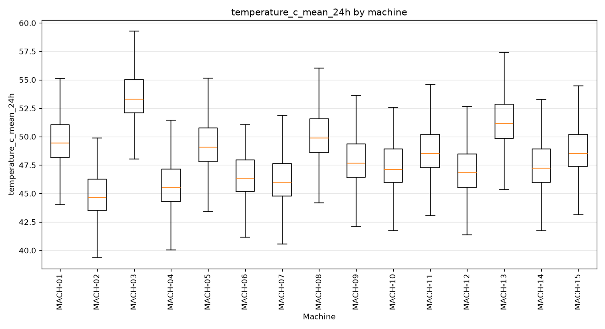

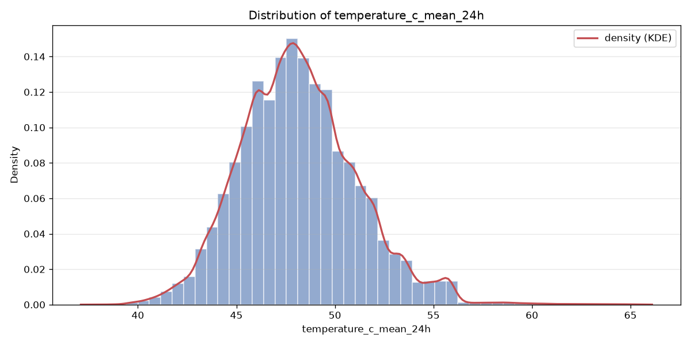

### temperature_c_max_24h

- **dtype** float64 · **count** 134280 · **unique** 6141 · **missing** 0 (0.0%)
- **range** 37.118 → 80.0 (span 42.882) · **Q1/median/Q3** 52.93 / 55.105 / 57.12
- **mean** 55.054 · **std** 3.454 · **skew** 1.001

**Outliers** — flagged values per method:

| method | normal band | below — n (range) | above — n (range) |
|---|---|---|---|
| IQR (k=1.5) | [46.645, 63.405] | 437 [37.118, 46.603] | 1419 [63.42, 80.0] |
| z-score (k=3) | [44.693, 65.415] | 61 [37.118, 44.691] | 1125 [65.433, 80.0] |

**Outliers by machine** (IQR k=1.5 and z-score k=3, fences recomputed per machine):

| machine | n | IQR below | IQR above | z-score below | z-score above |
|---|---|---|---|---|---|
| MACH-01 | 8952 | 28 | 49 | 1 | 49 |
| MACH-02 | 8952 | 1 | 25 | 1 | 25 |
| MACH-03 | 8952 | 0 | 130 | 0 | 130 |
| MACH-04 | 8952 | 1 | 109 | 0 | 104 |
| MACH-05 | 8952 | 41 | 155 | 0 | 144 |
| MACH-06 | 8952 | 229 | 0 | 15 | 0 |
| MACH-07 | 8952 | 270 | 63 | 17 | 30 |
| MACH-08 | 8952 | 176 | 166 | 13 | 118 |
| MACH-09 | 8952 | 180 | 207 | 11 | 109 |
| MACH-10 | 8952 | 187 | 80 | 10 | 77 |
| MACH-11 | 8952 | 152 | 132 | 7 | 104 |
| MACH-12 | 8952 | 125 | 79 | 7 | 74 |
| MACH-13 | 8952 | 148 | 133 | 7 | 78 |
| MACH-14 | 8952 | 202 | 106 | 4 | 103 |
| MACH-15 | 8952 | 175 | 107 | 3 | 74 |
| **total** | 134280 | 1915 | 1541 | 96 | 1219 |

### temperature_c_std_24h

- **dtype** float64 · **count** 134265 · **unique** 35198 · **missing** 15 (0.01%)
- **range** 0.028 → 18.133 (span 18.105) · **Q1/median/Q3** 3.567 / 4.272 / 5.009
- **mean** 4.299 · **std** 0.966 · **skew** 1.342

**Outliers** — flagged values per method:

| method | normal band | below — n (range) | above — n (range) |
|---|---|---|---|
| IQR (k=1.5) | [1.404, 7.172] | 48 [0.028, 1.401] | 788 [7.173, 18.133] |
| z-score (k=3) | [1.4, 7.198] | 47 [0.028, 1.39] | 778 [7.205, 18.133] |

**Outliers by machine** (IQR k=1.5 and z-score k=3, fences recomputed per machine):

| machine | n | IQR below | IQR above | z-score below | z-score above |
|---|---|---|---|---|---|
| MACH-01 | 8951 | 479 | 867 | 0 | 64 |
| MACH-02 | 8951 | 174 | 1183 | 11 | 182 |
| MACH-03 | 8951 | 46 | 1100 | 7 | 117 |
| MACH-04 | 8951 | 125 | 1238 | 1 | 69 |
| MACH-05 | 8951 | 373 | 917 | 2 | 114 |
| MACH-06 | 8951 | 608 | 745 | 45 | 155 |
| MACH-07 | 8951 | 708 | 677 | 91 | 29 |
| MACH-08 | 8951 | 906 | 746 | 17 | 97 |
| MACH-09 | 8951 | 1066 | 523 | 10 | 108 |
| MACH-10 | 8951 | 1076 | 253 | 23 | 77 |
| MACH-11 | 8951 | 1120 | 206 | 13 | 90 |
| MACH-12 | 8951 | 1052 | 347 | 19 | 66 |
| MACH-13 | 8951 | 775 | 666 | 13 | 100 |
| MACH-14 | 8951 | 686 | 726 | 3 | 89 |
| MACH-15 | 8951 | 545 | 877 | 11 | 77 |
| **total** | 134265 | 9739 | 11071 | 266 | 1434 |

### temperature_c_mean_48h

- **dtype** float64 · **count** 134280 · **unique** 74885 · **missing** 0 (0.0%)
- **range** 37.105 → 60.983 (span 23.878) · **Q1/median/Q3** 46.144 / 47.951 / 49.898
- **mean** 48.178 · **std** 2.846 · **skew** 0.481

**Outliers** — flagged values per method:

| method | normal band | below — n (range) | above — n (range) |
|---|---|---|---|
| IQR (k=1.5) | [40.513, 55.528] | 51 [37.105, 40.507] | 1826 [55.529, 60.983] |
| z-score (k=3) | [39.64, 56.716] | 33 [37.105, 39.51] | 512 [56.725, 60.983] |

**Outliers by machine** (IQR k=1.5 and z-score k=3, fences recomputed per machine):

| machine | n | IQR below | IQR above | z-score below | z-score above |
|---|---|---|---|---|---|
| MACH-01 | 8952 | 0 | 46 | 0 | 46 |
| MACH-02 | 8952 | 0 | 0 | 0 | 0 |
| MACH-03 | 8952 | 0 | 37 | 0 | 46 |
| MACH-04 | 8952 | 0 | 32 | 0 | 32 |
| MACH-05 | 8952 | 6 | 86 | 6 | 92 |
| MACH-06 | 8952 | 0 | 0 | 0 | 0 |
| MACH-07 | 8952 | 14 | 46 | 15 | 47 |
| MACH-08 | 8952 | 16 | 73 | 16 | 74 |
| MACH-09 | 8952 | 15 | 113 | 14 | 102 |
| MACH-10 | 8952 | 13 | 58 | 12 | 58 |
| MACH-11 | 8952 | 9 | 108 | 9 | 102 |
| MACH-12 | 8952 | 7 | 69 | 7 | 67 |
| MACH-13 | 8952 | 4 | 36 | 4 | 60 |
| MACH-14 | 8952 | 0 | 64 | 0 | 67 |
| MACH-15 | 8952 | 0 | 58 | 0 | 58 |
| **total** | 134280 | 84 | 826 | 83 | 851 |

### temperature_c_max_48h

- **dtype** float64 · **count** 134280 · **unique** 3674 · **missing** 0 (0.0%)
- **range** 37.118 → 80.0 (span 42.882) · **Q1/median/Q3** 53.905 / 55.831 / 57.735
- **mean** 55.933 · **std** 3.421 · **skew** 1.775

**Outliers** — flagged values per method:

| method | normal band | below — n (range) | above — n (range) |
|---|---|---|---|
| IQR (k=1.5) | [48.16, 63.48] | 237 [37.118, 48.148] | 2281 [63.508, 80.0] |
| z-score (k=3) | [45.671, 66.195] | 69 [37.118, 45.645] | 1379 [66.198, 80.0] |

**Outliers by machine** (IQR k=1.5 and z-score k=3, fences recomputed per machine):

| machine | n | IQR below | IQR above | z-score below | z-score above |
|---|---|---|---|---|---|
| MACH-01 | 8952 | 28 | 122 | 2 | 73 |
| MACH-02 | 8952 | 1 | 49 | 1 | 49 |
| MACH-03 | 8952 | 0 | 202 | 0 | 154 |
| MACH-04 | 8952 | 0 | 181 | 0 | 125 |
| MACH-05 | 8952 | 21 | 275 | 0 | 260 |
| MACH-06 | 8952 | 20 | 0 | 20 | 0 |
| MACH-07 | 8952 | 19 | 111 | 17 | 54 |
| MACH-08 | 8952 | 37 | 287 | 13 | 164 |
| MACH-09 | 8952 | 35 | 327 | 11 | 131 |
| MACH-10 | 8952 | 33 | 128 | 11 | 124 |
| MACH-11 | 8952 | 48 | 204 | 9 | 151 |
| MACH-12 | 8952 | 8 | 127 | 8 | 121 |
| MACH-13 | 8952 | 10 | 229 | 7 | 126 |
| MACH-14 | 8952 | 5 | 177 | 5 | 173 |
| MACH-15 | 8952 | 28 | 179 | 3 | 122 |
| **total** | 134280 | 293 | 2598 | 107 | 1827 |

### temperature_c_std_48h

- **dtype** float64 · **count** 134265 · **unique** 30106 · **missing** 15 (0.01%)
- **range** 0.028 → 13.889 (span 13.86) · **Q1/median/Q3** 3.753 / 4.414 / 4.95
- **mean** 4.371 · **std** 0.87 · **skew** 1.615

**Outliers** — flagged values per method:

| method | normal band | below — n (range) | above — n (range) |
|---|---|---|---|
| IQR (k=1.5) | [1.956, 6.747] | 79 [0.028, 1.948] | 1382 [6.747, 13.889] |
| z-score (k=3) | [1.761, 6.981] | 68 [0.028, 1.753] | 1192 [6.982, 13.889] |

**Outliers by machine** (IQR k=1.5 and z-score k=3, fences recomputed per machine):

| machine | n | IQR below | IQR above | z-score below | z-score above |
|---|---|---|---|---|---|
| MACH-01 | 8951 | 11 | 104 | 6 | 65 |
| MACH-02 | 8951 | 7 | 0 | 7 | 6 |
| MACH-03 | 8951 | 6 | 117 | 6 | 116 |
| MACH-04 | 8951 | 4 | 122 | 1 | 86 |
| MACH-05 | 8951 | 16 | 287 | 2 | 178 |
| MACH-06 | 8951 | 102 | 237 | 25 | 15 |
| MACH-07 | 8951 | 368 | 531 | 25 | 69 |
| MACH-08 | 8951 | 441 | 789 | 12 | 156 |
| MACH-09 | 8951 | 346 | 535 | 10 | 123 |
| MACH-10 | 8951 | 151 | 223 | 10 | 161 |
| MACH-11 | 8951 | 187 | 228 | 7 | 145 |
| MACH-12 | 8951 | 232 | 386 | 7 | 135 |
| MACH-13 | 8951 | 312 | 614 | 12 | 153 |
| MACH-14 | 8951 | 180 | 582 | 19 | 156 |
| MACH-15 | 8951 | 24 | 259 | 13 | 93 |
| **total** | 134265 | 2387 | 5014 | 162 | 1657 |

### pressure_bar_mean_2h

- **dtype** float64 · **count** 134280 · **unique** 19116 · **missing** 0 (0.0%)
- **range** 159.995 → 213.928 (span 53.933) · **Q1/median/Q3** 198.666 / 199.855 / 201.119
- **mean** 199.77 · **std** 2.237 · **skew** -4.611

**Outliers** — flagged values per method:

| method | normal band | below — n (range) | above — n (range) |
|---|---|---|---|
| IQR (k=1.5) | [194.986, 204.798] | 1285 [159.995, 194.978] | 194 [204.824, 213.928] |
| z-score (k=3) | [193.059, 206.482] | 951 [159.995, 193.053] | 126 [206.511, 213.928] |

**Outliers by machine** (IQR k=1.5 and z-score k=3, fences recomputed per machine):

| machine | n | IQR below | IQR above | z-score below | z-score above |
|---|---|---|---|---|---|
| MACH-01 | 8952 | 128 | 11 | 80 | 4 |
| MACH-02 | 8952 | 142 | 53 | 46 | 29 |
| MACH-03 | 8952 | 314 | 15 | 145 | 5 |
| MACH-04 | 8952 | 120 | 5 | 41 | 1 |
| MACH-05 | 8952 | 179 | 19 | 93 | 1 |
| MACH-06 | 8952 | 94 | 48 | 67 | 19 |
| MACH-07 | 8952 | 44 | 25 | 36 | 17 |
| MACH-08 | 8952 | 54 | 9 | 54 | 10 |
| MACH-09 | 8952 | 52 | 10 | 43 | 9 |
| MACH-10 | 8952 | 78 | 17 | 65 | 13 |
| MACH-11 | 8952 | 20 | 2 | 24 | 2 |
| MACH-12 | 8952 | 78 | 0 | 65 | 0 |
| MACH-13 | 8952 | 122 | 0 | 108 | 0 |
| MACH-14 | 8952 | 35 | 0 | 32 | 0 |
| MACH-15 | 8952 | 81 | 4 | 55 | 1 |
| **total** | 134280 | 1541 | 218 | 954 | 111 |

### pressure_bar_max_2h

- **dtype** float64 · **count** 134280 · **unique** 10746 · **missing** 0 (0.0%)
- **range** 160.0 → 215.814 (span 55.814) · **Q1/median/Q3** 199.186 / 200.414 / 201.7
- **mean** 200.338 · **std** 2.251 · **skew** -4.236

**Outliers** — flagged values per method:

| method | normal band | below — n (range) | above — n (range) |
|---|---|---|---|
| IQR (k=1.5) | [195.415, 205.471] | 1154 [160.0, 195.404] | 267 [205.482, 215.814] |
| z-score (k=3) | [193.585, 207.09] | 850 [160.0, 193.564] | 159 [207.093, 215.814] |

**Outliers by machine** (IQR k=1.5 and z-score k=3, fences recomputed per machine):

| machine | n | IQR below | IQR above | z-score below | z-score above |
|---|---|---|---|---|---|
| MACH-01 | 8952 | 116 | 23 | 69 | 7 |
| MACH-02 | 8952 | 128 | 75 | 42 | 33 |
| MACH-03 | 8952 | 280 | 23 | 135 | 7 |
| MACH-04 | 8952 | 107 | 16 | 27 | 6 |
| MACH-05 | 8952 | 149 | 37 | 85 | 4 |
| MACH-06 | 8952 | 89 | 53 | 64 | 28 |
| MACH-07 | 8952 | 42 | 26 | 34 | 16 |
| MACH-08 | 8952 | 47 | 19 | 46 | 19 |
| MACH-09 | 8952 | 54 | 11 | 42 | 11 |
| MACH-10 | 8952 | 72 | 17 | 64 | 13 |
| MACH-11 | 8952 | 18 | 6 | 18 | 6 |
| MACH-12 | 8952 | 76 | 0 | 62 | 0 |
| MACH-13 | 8952 | 111 | 0 | 98 | 0 |
| MACH-14 | 8952 | 33 | 0 | 31 | 0 |
| MACH-15 | 8952 | 70 | 28 | 48 | 10 |
| **total** | 134280 | 1392 | 334 | 865 | 160 |

### pressure_bar_std_2h

- **dtype** float64 · **count** 134265 · **unique** 5865 · **missing** 15 (0.01%)
- **range** 0.0 → 30.307 (span 30.307) · **Q1/median/Q3** 0.31 / 0.661 / 1.131
- **mean** 0.802 · **std** 0.74 · **skew** 7.868

**Outliers** — flagged values per method:

| method | normal band | below — n (range) | above — n (range) |
|---|---|---|---|
| IQR (k=1.5) | [-0.923, 2.364] | 0 — | 2724 [2.365, 30.307] |
| z-score (k=3) | [-1.419, 3.023] | 0 — | 731 [3.024, 30.307] |

**Outliers by machine** (IQR k=1.5 and z-score k=3, fences recomputed per machine):

| machine | n | IQR below | IQR above | z-score below | z-score above |
|---|---|---|---|---|---|
| MACH-01 | 8951 | 0 | 191 | 0 | 44 |
| MACH-02 | 8951 | 0 | 170 | 0 | 63 |
| MACH-03 | 8951 | 0 | 201 | 0 | 43 |
| MACH-04 | 8951 | 0 | 206 | 0 | 73 |
| MACH-05 | 8951 | 0 | 169 | 0 | 33 |
| MACH-06 | 8951 | 0 | 157 | 0 | 40 |
| MACH-07 | 8951 | 0 | 169 | 0 | 42 |
| MACH-08 | 8951 | 0 | 199 | 0 | 72 |
| MACH-09 | 8951 | 0 | 180 | 0 | 50 |
| MACH-10 | 8951 | 0 | 192 | 0 | 37 |
| MACH-11 | 8951 | 0 | 198 | 0 | 74 |
| MACH-12 | 8951 | 0 | 172 | 0 | 43 |
| MACH-13 | 8951 | 0 | 176 | 0 | 63 |
| MACH-14 | 8951 | 0 | 178 | 0 | 78 |
| MACH-15 | 8951 | 0 | 186 | 0 | 72 |
| **total** | 134265 | 0 | 2744 | 0 | 827 |

### pressure_bar_mean_3h

- **dtype** float64 · **count** 134280 · **unique** 25383 · **missing** 0 (0.0%)
- **range** 159.997 → 212.687 (span 52.69) · **Q1/median/Q3** 198.703 / 199.854 / 201.089
- **mean** 199.77 · **std** 2.172 · **skew** -4.779

**Outliers** — flagged values per method:

| method | normal band | below — n (range) | above — n (range) |
|---|---|---|---|
| IQR (k=1.5) | [195.124, 204.668] | 1312 [159.997, 195.121] | 192 [204.69, 212.687] |
| z-score (k=3) | [193.254, 206.286] | 957 [159.997, 193.248] | 128 [206.288, 212.687] |

**Outliers by machine** (IQR k=1.5 and z-score k=3, fences recomputed per machine):

| machine | n | IQR below | IQR above | z-score below | z-score above |
|---|---|---|---|---|---|
| MACH-01 | 8952 | 125 | 7 | 85 | 5 |
| MACH-02 | 8952 | 150 | 54 | 43 | 25 |
| MACH-03 | 8952 | 323 | 14 | 146 | 5 |
| MACH-04 | 8952 | 133 | 0 | 44 | 0 |
| MACH-05 | 8952 | 173 | 14 | 94 | 0 |
| MACH-06 | 8952 | 96 | 48 | 67 | 22 |
| MACH-07 | 8952 | 45 | 26 | 37 | 20 |
| MACH-08 | 8952 | 51 | 6 | 55 | 6 |
| MACH-09 | 8952 | 50 | 11 | 43 | 9 |
| MACH-10 | 8952 | 76 | 17 | 67 | 13 |
| MACH-11 | 8952 | 19 | 3 | 22 | 3 |
| MACH-12 | 8952 | 80 | 0 | 66 | 0 |
| MACH-13 | 8952 | 126 | 0 | 110 | 0 |
| MACH-14 | 8952 | 36 | 0 | 32 | 0 |
| MACH-15 | 8952 | 77 | 1 | 56 | 0 |
| **total** | 134280 | 1560 | 201 | 967 | 108 |

### pressure_bar_max_3h

- **dtype** float64 · **count** 134280 · **unique** 9963 · **missing** 0 (0.0%)
- **range** 160.0 → 215.814 (span 55.814) · **Q1/median/Q3** 199.537 / 200.725 / 201.99
- **mean** 200.659 · **std** 2.165 · **skew** -4.068

**Outliers** — flagged values per method:

| method | normal band | below — n (range) | above — n (range) |
|---|---|---|---|
| IQR (k=1.5) | [195.858, 205.67] | 1085 [160.0, 195.846] | 310 [205.689, 215.814] |
| z-score (k=3) | [194.164, 207.153] | 815 [160.0, 194.163] | 194 [207.172, 215.814] |

**Outliers by machine** (IQR k=1.5 and z-score k=3, fences recomputed per machine):

| machine | n | IQR below | IQR above | z-score below | z-score above |
|---|---|---|---|---|---|
| MACH-01 | 8952 | 111 | 25 | 67 | 9 |
| MACH-02 | 8952 | 137 | 85 | 39 | 39 |
| MACH-03 | 8952 | 275 | 30 | 133 | 8 |
| MACH-04 | 8952 | 98 | 12 | 37 | 9 |
| MACH-05 | 8952 | 135 | 40 | 82 | 6 |
| MACH-06 | 8952 | 86 | 58 | 63 | 32 |
| MACH-07 | 8952 | 39 | 26 | 34 | 19 |
| MACH-08 | 8952 | 42 | 21 | 42 | 25 |
| MACH-09 | 8952 | 50 | 13 | 38 | 13 |
| MACH-10 | 8952 | 68 | 19 | 60 | 14 |
| MACH-11 | 8952 | 15 | 9 | 15 | 9 |
| MACH-12 | 8952 | 76 | 0 | 58 | 0 |
| MACH-13 | 8952 | 103 | 0 | 95 | 0 |
| MACH-14 | 8952 | 31 | 0 | 29 | 0 |
| MACH-15 | 8952 | 54 | 24 | 41 | 15 |
| **total** | 134280 | 1320 | 362 | 833 | 198 |

### pressure_bar_std_3h

- **dtype** float64 · **count** 134265 · **unique** 22216 · **missing** 15 (0.01%)
- **range** 0.0 → 24.745 (span 24.745) · **Q1/median/Q3** 0.542 / 0.847 / 1.211
- **mean** 0.931 · **std** 0.677 · **skew** 9.643

**Outliers** — flagged values per method:

| method | normal band | below — n (range) | above — n (range) |
|---|---|---|---|
| IQR (k=1.5) | [-0.462, 2.214] | 0 — | 2236 [2.215, 24.745] |
| z-score (k=3) | [-1.098, 2.961] | 0 — | 690 [2.961, 24.745] |

**Outliers by machine** (IQR k=1.5 and z-score k=3, fences recomputed per machine):

| machine | n | IQR below | IQR above | z-score below | z-score above |
|---|---|---|---|---|---|
| MACH-01 | 8951 | 0 | 159 | 0 | 59 |
| MACH-02 | 8951 | 0 | 162 | 0 | 71 |
| MACH-03 | 8951 | 0 | 202 | 0 | 65 |
| MACH-04 | 8951 | 0 | 132 | 0 | 55 |
| MACH-05 | 8951 | 0 | 143 | 0 | 37 |
| MACH-06 | 8951 | 0 | 125 | 0 | 42 |
| MACH-07 | 8951 | 0 | 110 | 0 | 24 |
| MACH-08 | 8951 | 0 | 186 | 0 | 93 |
| MACH-09 | 8951 | 0 | 130 | 0 | 23 |
| MACH-10 | 8951 | 0 | 137 | 0 | 22 |
| MACH-11 | 8951 | 0 | 148 | 0 | 65 |
| MACH-12 | 8951 | 0 | 125 | 0 | 32 |
| MACH-13 | 8951 | 0 | 168 | 0 | 56 |
| MACH-14 | 8951 | 0 | 120 | 0 | 28 |
| MACH-15 | 8951 | 0 | 155 | 0 | 67 |
| **total** | 134265 | 0 | 2202 | 0 | 739 |

### pressure_bar_mean_4h

- **dtype** float64 · **count** 134280 · **unique** 35983 · **missing** 0 (0.0%)
- **range** 159.998 → 211.779 (span 51.781) · **Q1/median/Q3** 198.741 / 199.847 / 201.061
- **mean** 199.77 · **std** 2.121 · **skew** -4.885

**Outliers** — flagged values per method:

| method | normal band | below — n (range) | above — n (range) |
|---|---|---|---|
| IQR (k=1.5) | [195.262, 204.54] | 1321 [159.998, 195.262] | 189 [204.549, 211.779] |
| z-score (k=3) | [193.408, 206.132] | 978 [159.998, 193.376] | 120 [206.16, 211.779] |

**Outliers by machine** (IQR k=1.5 and z-score k=3, fences recomputed per machine):

| machine | n | IQR below | IQR above | z-score below | z-score above |
|---|---|---|---|---|---|
| MACH-01 | 8952 | 130 | 8 | 89 | 3 |
| MACH-02 | 8952 | 156 | 55 | 45 | 26 |
| MACH-03 | 8952 | 327 | 12 | 155 | 4 |
| MACH-04 | 8952 | 151 | 0 | 43 | 0 |
| MACH-05 | 8952 | 185 | 10 | 95 | 0 |
| MACH-06 | 8952 | 95 | 49 | 67 | 20 |
| MACH-07 | 8952 | 45 | 27 | 37 | 22 |
| MACH-08 | 8952 | 51 | 2 | 53 | 3 |
| MACH-09 | 8952 | 54 | 13 | 43 | 8 |
| MACH-10 | 8952 | 75 | 16 | 68 | 14 |
| MACH-11 | 8952 | 19 | 0 | 24 | 2 |
| MACH-12 | 8952 | 81 | 0 | 66 | 0 |
| MACH-13 | 8952 | 123 | 0 | 114 | 0 |
| MACH-14 | 8952 | 35 | 0 | 33 | 0 |
| MACH-15 | 8952 | 78 | 0 | 61 | 0 |
| **total** | 134280 | 1605 | 192 | 993 | 102 |

### pressure_bar_max_4h

- **dtype** float64 · **count** 134280 · **unique** 9458 · **missing** 0 (0.0%)
- **range** 160.0 → 215.814 (span 55.814) · **Q1/median/Q3** 199.79 / 200.96 / 202.218
- **mean** 200.9 · **std** 2.087 · **skew** -3.83

**Outliers** — flagged values per method:

| method | normal band | below — n (range) | above — n (range) |
|---|---|---|---|
| IQR (k=1.5) | [196.148, 205.86] | 1008 [160.0, 196.141] | 342 [205.863, 215.814] |
| z-score (k=3) | [194.639, 207.161] | 770 [160.0, 194.628] | 225 [207.249, 215.814] |

**Outliers by machine** (IQR k=1.5 and z-score k=3, fences recomputed per machine):

| machine | n | IQR below | IQR above | z-score below | z-score above |
|---|---|---|---|---|---|
| MACH-01 | 8952 | 95 | 18 | 60 | 10 |
| MACH-02 | 8952 | 128 | 92 | 39 | 45 |
| MACH-03 | 8952 | 252 | 33 | 121 | 9 |
| MACH-04 | 8952 | 111 | 16 | 36 | 8 |
| MACH-05 | 8952 | 123 | 31 | 82 | 8 |
| MACH-06 | 8952 | 81 | 61 | 58 | 36 |
| MACH-07 | 8952 | 37 | 27 | 31 | 23 |
| MACH-08 | 8952 | 36 | 15 | 36 | 31 |
| MACH-09 | 8952 | 50 | 15 | 42 | 15 |
| MACH-10 | 8952 | 64 | 20 | 60 | 15 |
| MACH-11 | 8952 | 13 | 12 | 13 | 12 |
| MACH-12 | 8952 | 71 | 0 | 55 | 0 |
| MACH-13 | 8952 | 94 | 0 | 91 | 0 |
| MACH-14 | 8952 | 29 | 0 | 27 | 0 |
| MACH-15 | 8952 | 49 | 24 | 38 | 20 |
| **total** | 134280 | 1233 | 364 | 789 | 232 |

### pressure_bar_std_4h

- **dtype** float64 · **count** 134265 · **unique** 21074 · **missing** 15 (0.01%)
- **range** 0.0 → 24.08 (span 24.08) · **Q1/median/Q3** 0.669 / 0.941 / 1.256
- **mean** 1.015 · **std** 0.666 · **skew** 10.668

**Outliers** — flagged values per method:

| method | normal band | below — n (range) | above — n (range) |
|---|---|---|---|
| IQR (k=1.5) | [-0.211, 2.137] | 0 — | 2428 [2.137, 24.08] |
| z-score (k=3) | [-0.983, 3.013] | 0 — | 859 [3.013, 24.08] |

**Outliers by machine** (IQR k=1.5 and z-score k=3, fences recomputed per machine):

| machine | n | IQR below | IQR above | z-score below | z-score above |
|---|---|---|---|---|---|
| MACH-01 | 8951 | 0 | 177 | 0 | 68 |
| MACH-02 | 8951 | 0 | 179 | 0 | 85 |
| MACH-03 | 8951 | 0 | 240 | 0 | 88 |
| MACH-04 | 8951 | 0 | 125 | 0 | 51 |
| MACH-05 | 8951 | 0 | 167 | 0 | 54 |
| MACH-06 | 8951 | 0 | 130 | 0 | 54 |
| MACH-07 | 8951 | 0 | 108 | 0 | 27 |
| MACH-08 | 8951 | 0 | 208 | 0 | 106 |
| MACH-09 | 8951 | 0 | 115 | 0 | 34 |
| MACH-10 | 8951 | 0 | 144 | 0 | 35 |
| MACH-11 | 8951 | 0 | 164 | 0 | 68 |
| MACH-12 | 8951 | 0 | 153 | 0 | 41 |
| MACH-13 | 8951 | 0 | 196 | 0 | 64 |
| MACH-14 | 8951 | 0 | 110 | 0 | 17 |
| MACH-15 | 8951 | 0 | 175 | 0 | 78 |
| **total** | 134265 | 0 | 2391 | 0 | 870 |

### pressure_bar_mean_6h

- **dtype** float64 · **count** 134280 · **unique** 39648 · **missing** 0 (0.0%)
- **range** 160.465 → 210.867 (span 50.401) · **Q1/median/Q3** 198.816 / 199.845 / 201.008
- **mean** 199.77 · **std** 2.025 · **skew** -5.091

**Outliers** — flagged values per method:

| method | normal band | below — n (range) | above — n (range) |
|---|---|---|---|
| IQR (k=1.5) | [195.527, 204.297] | 1388 [160.465, 195.523] | 183 [204.316, 210.867] |
| z-score (k=3) | [193.696, 205.844] | 1019 [160.465, 193.694] | 131 [205.867, 210.867] |

**Outliers by machine** (IQR k=1.5 and z-score k=3, fences recomputed per machine):

| machine | n | IQR below | IQR above | z-score below | z-score above |
|---|---|---|---|---|---|
| MACH-01 | 8952 | 135 | 7 | 97 | 2 |
| MACH-02 | 8952 | 170 | 53 | 42 | 27 |
| MACH-03 | 8952 | 360 | 13 | 163 | 4 |
| MACH-04 | 8952 | 174 | 0 | 55 | 0 |
| MACH-05 | 8952 | 191 | 8 | 91 | 0 |
| MACH-06 | 8952 | 98 | 47 | 66 | 23 |
| MACH-07 | 8952 | 46 | 27 | 40 | 26 |
| MACH-08 | 8952 | 52 | 0 | 58 | 1 |
| MACH-09 | 8952 | 58 | 16 | 43 | 9 |
| MACH-10 | 8952 | 75 | 16 | 67 | 14 |
| MACH-11 | 8952 | 20 | 0 | 23 | 0 |
| MACH-12 | 8952 | 84 | 0 | 68 | 0 |
| MACH-13 | 8952 | 131 | 0 | 117 | 0 |
| MACH-14 | 8952 | 36 | 0 | 33 | 0 |
| MACH-15 | 8952 | 80 | 0 | 64 | 0 |
| **total** | 134280 | 1710 | 187 | 1027 | 106 |

### pressure_bar_max_6h

- **dtype** float64 · **count** 134280 · **unique** 8675 · **missing** 0 (0.0%)
- **range** 162.349 → 215.814 (span 53.465) · **Q1/median/Q3** 200.213 / 201.361 / 202.552
- **mean** 201.289 · **std** 1.943 · **skew** -3.33

**Outliers** — flagged values per method:

| method | normal band | below — n (range) | above — n (range) |
|---|---|---|---|
| IQR (k=1.5) | [196.704, 206.06] | 870 [162.349, 196.701] | 396 [206.075, 215.814] |
| z-score (k=3) | [195.459, 207.119] | 688 [162.349, 195.44] | 280 [207.249, 215.814] |

**Outliers by machine** (IQR k=1.5 and z-score k=3, fences recomputed per machine):

| machine | n | IQR below | IQR above | z-score below | z-score above |
|---|---|---|---|---|---|
| MACH-01 | 8952 | 77 | 18 | 52 | 12 |
| MACH-02 | 8952 | 134 | 109 | 34 | 57 |
| MACH-03 | 8952 | 272 | 43 | 117 | 17 |
| MACH-04 | 8952 | 132 | 23 | 34 | 6 |
| MACH-05 | 8952 | 101 | 23 | 73 | 16 |
| MACH-06 | 8952 | 73 | 69 | 56 | 49 |
| MACH-07 | 8952 | 29 | 30 | 27 | 24 |
| MACH-08 | 8952 | 30 | 21 | 30 | 37 |
| MACH-09 | 8952 | 53 | 19 | 41 | 19 |
| MACH-10 | 8952 | 70 | 22 | 56 | 17 |
| MACH-11 | 8952 | 10 | 16 | 10 | 16 |
| MACH-12 | 8952 | 75 | 0 | 59 | 0 |
| MACH-13 | 8952 | 73 | 0 | 73 | 0 |
| MACH-14 | 8952 | 24 | 0 | 24 | 0 |
| MACH-15 | 8952 | 31 | 24 | 28 | 24 |
| **total** | 134280 | 1184 | 417 | 714 | 294 |

### pressure_bar_std_6h

- **dtype** float64 · **count** 134265 · **unique** 20335 · **missing** 15 (0.01%)
- **range** 0.013 → 23.034 (span 23.022) · **Q1/median/Q3** 0.828 / 1.075 / 1.355
- **mean** 1.152 · **std** 0.691 · **skew** 11.062

**Outliers** — flagged values per method:

| method | normal band | below — n (range) | above — n (range) |
|---|---|---|---|
| IQR (k=1.5) | [0.037, 2.146] | 23 [0.013, 0.036] | 2998 [2.147, 23.034] |
| z-score (k=3) | [-0.92, 3.223] | 0 — | 1182 [3.225, 23.034] |

**Outliers by machine** (IQR k=1.5 and z-score k=3, fences recomputed per machine):

| machine | n | IQR below | IQR above | z-score below | z-score above |
|---|---|---|---|---|---|
| MACH-01 | 8951 | 16 | 191 | 0 | 97 |
| MACH-02 | 8951 | 0 | 199 | 0 | 109 |
| MACH-03 | 8951 | 0 | 341 | 0 | 122 |
| MACH-04 | 8951 | 8 | 112 | 0 | 59 |
| MACH-05 | 8951 | 3 | 194 | 0 | 85 |
| MACH-06 | 8951 | 5 | 163 | 0 | 67 |
| MACH-07 | 8951 | 0 | 130 | 0 | 39 |
| MACH-08 | 8951 | 0 | 248 | 0 | 131 |
| MACH-09 | 8951 | 0 | 133 | 0 | 51 |
| MACH-10 | 8951 | 0 | 152 | 0 | 48 |
| MACH-11 | 8951 | 0 | 148 | 0 | 76 |
| MACH-12 | 8951 | 0 | 170 | 0 | 61 |
| MACH-13 | 8951 | 0 | 255 | 0 | 91 |
| MACH-14 | 8951 | 0 | 93 | 0 | 23 |
| MACH-15 | 8951 | 0 | 203 | 0 | 115 |
| **total** | 134265 | 32 | 2732 | 0 | 1174 |

### pressure_bar_mean_12h

- **dtype** float64 · **count** 134280 · **unique** 44291 · **missing** 0 (0.0%)
- **range** 165.421 → 209.328 (span 43.908) · **Q1/median/Q3** 199.086 / 199.856 / 200.733
- **mean** 199.769 · **std** 1.719 · **skew** -6.297

**Outliers** — flagged values per method:

| method | normal band | below — n (range) | above — n (range) |
|---|---|---|---|
| IQR (k=1.5) | [196.615, 203.204] | 1779 [165.421, 196.614] | 206 [203.218, 209.328] |
| z-score (k=3) | [194.612, 204.927] | 1152 [165.421, 194.611] | 144 [204.954, 209.328] |

**Outliers by machine** (IQR k=1.5 and z-score k=3, fences recomputed per machine):

| machine | n | IQR below | IQR above | z-score below | z-score above |
|---|---|---|---|---|---|
| MACH-01 | 8952 | 229 | 8 | 119 | 1 |
| MACH-02 | 8952 | 418 | 81 | 40 | 30 |
| MACH-03 | 8952 | 778 | 16 | 193 | 0 |
| MACH-04 | 8952 | 432 | 0 | 100 | 0 |
| MACH-05 | 8952 | 314 | 12 | 93 | 0 |
| MACH-06 | 8952 | 127 | 54 | 74 | 33 |
| MACH-07 | 8952 | 61 | 30 | 36 | 27 |
| MACH-08 | 8952 | 74 | 0 | 74 | 0 |
| MACH-09 | 8952 | 78 | 29 | 60 | 22 |
| MACH-10 | 8952 | 93 | 19 | 70 | 14 |
| MACH-11 | 8952 | 30 | 0 | 33 | 1 |
| MACH-12 | 8952 | 108 | 0 | 77 | 0 |
| MACH-13 | 8952 | 179 | 0 | 144 | 0 |
| MACH-14 | 8952 | 43 | 0 | 33 | 0 |
| MACH-15 | 8952 | 115 | 0 | 89 | 0 |
| **total** | 134280 | 3079 | 249 | 1235 | 128 |

### pressure_bar_max_12h

- **dtype** float64 · **count** 134280 · **unique** 6772 · **missing** 0 (0.0%)
- **range** 173.053 → 215.814 (span 42.761) · **Q1/median/Q3** 201.269 / 202.271 / 203.121
- **mean** 202.153 · **std** 1.548 · **skew** -2.363

**Outliers** — flagged values per method:

| method | normal band | below — n (range) | above — n (range) |
|---|---|---|---|
| IQR (k=1.5) | [198.491, 205.899] | 967 [173.053, 198.489] | 603 [205.914, 215.814] |
| z-score (k=3) | [197.509, 206.798] | 509 [173.053, 197.482] | 472 [206.806, 215.814] |

**Outliers by machine** (IQR k=1.5 and z-score k=3, fences recomputed per machine):

| machine | n | IQR below | IQR above | z-score below | z-score above |
|---|---|---|---|---|---|
| MACH-01 | 8952 | 53 | 18 | 34 | 18 |
| MACH-02 | 8952 | 150 | 140 | 25 | 100 |
| MACH-03 | 8952 | 390 | 139 | 62 | 50 |
| MACH-04 | 8952 | 169 | 41 | 65 | 12 |
| MACH-05 | 8952 | 98 | 23 | 57 | 23 |
| MACH-06 | 8952 | 69 | 93 | 49 | 77 |
| MACH-07 | 8952 | 19 | 36 | 19 | 36 |
| MACH-08 | 8952 | 24 | 83 | 16 | 67 |
| MACH-09 | 8952 | 75 | 34 | 47 | 31 |
| MACH-10 | 8952 | 78 | 29 | 45 | 27 |
| MACH-11 | 8952 | 20 | 37 | 4 | 30 |
| MACH-12 | 8952 | 78 | 0 | 55 | 0 |
| MACH-13 | 8952 | 65 | 0 | 60 | 0 |
| MACH-14 | 8952 | 22 | 0 | 20 | 0 |
| MACH-15 | 8952 | 17 | 48 | 16 | 48 |
| **total** | 134280 | 1327 | 721 | 574 | 519 |

### pressure_bar_std_12h

- **dtype** float64 · **count** 134265 · **unique** 21662 · **missing** 15 (0.01%)
- **range** 0.023 → 21.569 (span 21.546) · **Q1/median/Q3** 1.133 / 1.388 / 1.696
- **mean** 1.498 · **std** 0.803 · **skew** 9.556

**Outliers** — flagged values per method:

| method | normal band | below — n (range) | above — n (range) |
|---|---|---|---|
| IQR (k=1.5) | [0.289, 2.54] | 22 [0.023, 0.286] | 3348 [2.54, 21.569] |
| z-score (k=3) | [-0.91, 3.905] | 0 — | 1692 [3.907, 21.569] |

**Outliers by machine** (IQR k=1.5 and z-score k=3, fences recomputed per machine):

| machine | n | IQR below | IQR above | z-score below | z-score above |
|---|---|---|---|---|---|
| MACH-01 | 8951 | 12 | 260 | 0 | 165 |
| MACH-02 | 8951 | 10 | 336 | 0 | 117 |
| MACH-03 | 8951 | 1 | 523 | 0 | 224 |
| MACH-04 | 8951 | 8 | 152 | 0 | 82 |
| MACH-05 | 8951 | 3 | 284 | 0 | 121 |
| MACH-06 | 8951 | 2 | 242 | 0 | 73 |
| MACH-07 | 8951 | 1 | 139 | 0 | 61 |
| MACH-08 | 8951 | 0 | 263 | 0 | 180 |
| MACH-09 | 8951 | 4 | 105 | 0 | 73 |
| MACH-10 | 8951 | 2 | 151 | 0 | 88 |
| MACH-11 | 8951 | 0 | 112 | 0 | 89 |
| MACH-12 | 8951 | 4 | 150 | 0 | 85 |
| MACH-13 | 8951 | 0 | 273 | 0 | 165 |
| MACH-14 | 8951 | 3 | 96 | 0 | 39 |
| MACH-15 | 8951 | 4 | 227 | 0 | 163 |
| **total** | 134265 | 54 | 3313 | 0 | 1725 |

### pressure_bar_mean_24h

- **dtype** float64 · **count** 134280 · **unique** 29197 · **missing** 0 (0.0%)
- **range** 173.925 → 207.656 (span 33.732) · **Q1/median/Q3** 199.567 / 199.984 / 200.291
- **mean** 199.768 · **std** 1.317 · **skew** -8.823

**Outliers** — flagged values per method:

| method | normal band | below — n (range) | above — n (range) |
|---|---|---|---|
| IQR (k=1.5) | [198.482, 201.376] | 6980 [173.925, 198.482] | 372 [201.378, 207.656] |
| z-score (k=3) | [195.817, 203.719] | 1443 [173.925, 195.816] | 181 [203.725, 207.656] |

**Outliers by machine** (IQR k=1.5 and z-score k=3, fences recomputed per machine):

| machine | n | IQR below | IQR above | z-score below | z-score above |
|---|---|---|---|---|---|
| MACH-01 | 8952 | 1211 | 22 | 196 | 0 |
| MACH-02 | 8952 | 1205 | 140 | 49 | 40 |
| MACH-03 | 8952 | 1115 | 17 | 278 | 0 |
| MACH-04 | 8952 | 1244 | 0 | 53 | 0 |
| MACH-05 | 8952 | 1177 | 31 | 109 | 0 |
| MACH-06 | 8952 | 1289 | 105 | 87 | 34 |
| MACH-07 | 8952 | 1162 | 47 | 42 | 29 |
| MACH-08 | 8952 | 1133 | 23 | 146 | 0 |
| MACH-09 | 8952 | 1168 | 44 | 71 | 24 |
| MACH-10 | 8952 | 1190 | 45 | 85 | 19 |
| MACH-11 | 8952 | 1077 | 16 | 75 | 1 |
| MACH-12 | 8952 | 1268 | 0 | 85 | 0 |
| MACH-13 | 8952 | 1148 | 0 | 233 | 0 |
| MACH-14 | 8952 | 1206 | 0 | 43 | 0 |
| MACH-15 | 8952 | 1174 | 4 | 158 | 0 |
| **total** | 134280 | 17767 | 494 | 1710 | 147 |

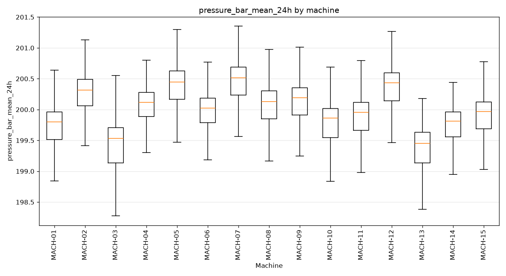

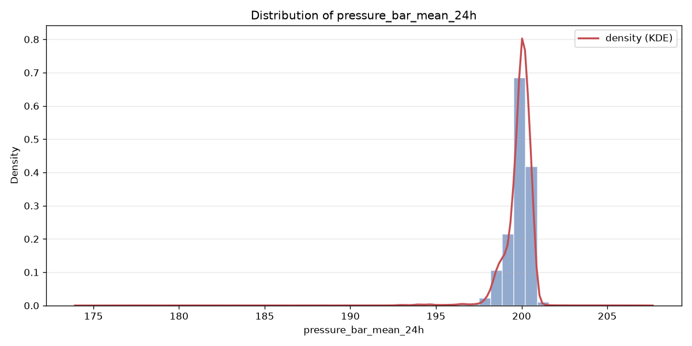

### pressure_bar_max_24h

- **dtype** float64 · **count** 134280 · **unique** 4061 · **missing** 0 (0.0%)
- **range** 187.209 → 215.814 (span 28.605) · **Q1/median/Q3** 202.414 / 203.021 / 203.563
- **mean** 202.96 · **std** 1.144 · **skew** 0.322

**Outliers** — flagged values per method:

| method | normal band | below — n (range) | above — n (range) |
|---|---|---|---|
| IQR (k=1.5) | [200.69, 205.286] | 2038 [187.209, 200.689] | 1285 [205.31, 215.814] |
| z-score (k=3) | [199.527, 206.393] | 361 [187.209, 199.523] | 764 [206.515, 215.814] |

**Outliers by machine** (IQR k=1.5 and z-score k=3, fences recomputed per machine):

| machine | n | IQR below | IQR above | z-score below | z-score above |
|---|---|---|---|---|---|
| MACH-01 | 8952 | 281 | 109 | 6 | 30 |
| MACH-02 | 8952 | 102 | 214 | 13 | 163 |
| MACH-03 | 8952 | 184 | 246 | 39 | 83 |
| MACH-04 | 8952 | 29 | 66 | 2 | 42 |
| MACH-05 | 8952 | 186 | 123 | 37 | 35 |
| MACH-06 | 8952 | 440 | 130 | 41 | 127 |
| MACH-07 | 8952 | 563 | 72 | 15 | 48 |
| MACH-08 | 8952 | 560 | 132 | 36 | 107 |
| MACH-09 | 8952 | 609 | 121 | 47 | 44 |
| MACH-10 | 8952 | 517 | 90 | 42 | 40 |
| MACH-11 | 8952 | 616 | 163 | 22 | 54 |
| MACH-12 | 8952 | 662 | 96 | 45 | 0 |
| MACH-13 | 8952 | 550 | 72 | 59 | 0 |
| MACH-14 | 8952 | 481 | 48 | 36 | 0 |
| MACH-15 | 8952 | 195 | 116 | 20 | 83 |
| **total** | 134280 | 5975 | 1798 | 460 | 856 |

### pressure_bar_std_24h

- **dtype** float64 · **count** 134265 · **unique** 20052 · **missing** 15 (0.01%)
- **range** 0.023 → 19.318 (span 19.296) · **Q1/median/Q3** 1.429 / 1.695 / 1.971
- **mean** 1.798 · **std** 0.896 · **skew** 8.984

**Outliers** — flagged values per method:

| method | normal band | below — n (range) | above — n (range) |
|---|---|---|---|
| IQR (k=1.5) | [0.616, 2.784] | 20 [0.023, 0.614] | 3875 [2.784, 19.318] |
| z-score (k=3) | [-0.89, 4.487] | 0 — | 1984 [4.488, 19.318] |

**Outliers by machine** (IQR k=1.5 and z-score k=3, fences recomputed per machine):

| machine | n | IQR below | IQR above | z-score below | z-score above |
|---|---|---|---|---|---|
| MACH-01 | 8951 | 53 | 647 | 0 | 213 |
| MACH-02 | 8951 | 13 | 608 | 0 | 85 |
| MACH-03 | 8951 | 1 | 797 | 0 | 365 |
| MACH-04 | 8951 | 12 | 471 | 0 | 129 |
| MACH-05 | 8951 | 11 | 521 | 0 | 118 |
| MACH-06 | 8951 | 114 | 620 | 0 | 110 |
| MACH-07 | 8951 | 195 | 334 | 0 | 79 |
| MACH-08 | 8951 | 168 | 443 | 0 | 249 |
| MACH-09 | 8951 | 209 | 192 | 0 | 62 |
| MACH-10 | 8951 | 259 | 298 | 0 | 102 |
| MACH-11 | 8951 | 165 | 190 | 3 | 135 |
| MACH-12 | 8951 | 158 | 268 | 0 | 96 |
| MACH-13 | 8951 | 106 | 420 | 0 | 258 |
| MACH-14 | 8951 | 121 | 249 | 0 | 55 |
| MACH-15 | 8951 | 65 | 554 | 0 | 228 |
| **total** | 134265 | 1650 | 6612 | 3 | 2284 |

### pressure_bar_mean_48h

- **dtype** float64 · **count** 134280 · **unique** 25570 · **missing** 0 (0.0%)
- **range** 183.252 → 204.66 (span 21.408) · **Q1/median/Q3** 199.526 / 199.914 / 200.223
- **mean** 199.767 · **std** 1.089 · **skew** -7.238

**Outliers** — flagged values per method:

| method | normal band | below — n (range) | above — n (range) |
|---|---|---|---|
| IQR (k=1.5) | [198.48, 201.268] | 3826 [183.252, 198.48] | 441 [201.269, 204.66] |
| z-score (k=3) | [196.499, 203.036] | 1620 [183.252, 196.498] | 238 [203.066, 204.66] |

**Outliers by machine** (IQR k=1.5 and z-score k=3, fences recomputed per machine):

| machine | n | IQR below | IQR above | z-score below | z-score above |
|---|---|---|---|---|---|
| MACH-01 | 8952 | 334 | 0 | 185 | 0 |
| MACH-02 | 8952 | 138 | 138 | 68 | 35 |
| MACH-03 | 8952 | 637 | 3 | 254 | 0 |
| MACH-04 | 8952 | 88 | 0 | 87 | 0 |
| MACH-05 | 8952 | 294 | 6 | 146 | 0 |
| MACH-06 | 8952 | 265 | 112 | 118 | 0 |
| MACH-07 | 8952 | 146 | 61 | 63 | 39 |
| MACH-08 | 8952 | 303 | 0 | 232 | 0 |
| MACH-09 | 8952 | 214 | 55 | 94 | 30 |
| MACH-10 | 8952 | 263 | 60 | 121 | 16 |
| MACH-11 | 8952 | 136 | 0 | 138 | 0 |
| MACH-12 | 8952 | 262 | 0 | 121 | 0 |
| MACH-13 | 8952 | 429 | 0 | 222 | 0 |
| MACH-14 | 8952 | 113 | 0 | 63 | 0 |
| MACH-15 | 8952 | 250 | 0 | 178 | 0 |
| **total** | 134280 | 3872 | 435 | 2090 | 120 |

### pressure_bar_max_48h

- **dtype** float64 · **count** 134280 · **unique** 2646 · **missing** 0 (0.0%)
- **range** 195.198 → 215.814 (span 20.616) · **Q1/median/Q3** 202.938 / 203.405 / 203.865
- **mean** 203.449 · **std** 1.015 · **skew** 3.47

**Outliers** — flagged values per method:

| method | normal band | below — n (range) | above — n (range) |
|---|---|---|---|
| IQR (k=1.5) | [201.547, 205.256] | 1480 [195.198, 201.543] | 2197 [205.31, 215.814] |
| z-score (k=3) | [200.403, 206.494] | 165 [195.198, 200.269] | 1268 [206.515, 215.814] |

**Outliers by machine** (IQR k=1.5 and z-score k=3, fences recomputed per machine):

| machine | n | IQR below | IQR above | z-score below | z-score above |
|---|---|---|---|---|---|
| MACH-01 | 8952 | 103 | 205 | 11 | 54 |
| MACH-02 | 8952 | 22 | 286 | 2 | 251 |
| MACH-03 | 8952 | 64 | 294 | 0 | 131 |
| MACH-04 | 8952 | 2 | 66 | 2 | 48 |
| MACH-05 | 8952 | 77 | 267 | 17 | 59 |
| MACH-06 | 8952 | 61 | 202 | 17 | 199 |
| MACH-07 | 8952 | 122 | 120 | 15 | 72 |
| MACH-08 | 8952 | 41 | 197 | 15 | 175 |
| MACH-09 | 8952 | 97 | 121 | 16 | 69 |
| MACH-10 | 8952 | 145 | 162 | 32 | 64 |
| MACH-11 | 8952 | 33 | 205 | 14 | 100 |
| MACH-12 | 8952 | 46 | 192 | 29 | 96 |
| MACH-13 | 8952 | 164 | 144 | 86 | 48 |
| MACH-14 | 8952 | 107 | 96 | 67 | 48 |
| MACH-15 | 8952 | 29 | 236 | 3 | 137 |
| **total** | 134280 | 1113 | 2793 | 326 | 1551 |

### pressure_bar_std_48h

- **dtype** float64 · **count** 134265 · **unique** 18827 · **missing** 15 (0.01%)
- **range** 0.023 → 15.816 (span 15.794) · **Q1/median/Q3** 1.514 / 1.763 / 1.963
- **mean** 1.873 · **std** 1.001 · **skew** 8.14

**Outliers** — flagged values per method:

| method | normal band | below — n (range) | above — n (range) |
|---|---|---|---|
| IQR (k=1.5) | [0.841, 2.637] | 25 [0.023, 0.827] | 5883 [2.637, 15.816] |
| z-score (k=3) | [-1.132, 4.877] | 0 — | 1865 [4.877, 15.816] |

**Outliers by machine** (IQR k=1.5 and z-score k=3, fences recomputed per machine):

| machine | n | IQR below | IQR above | z-score below | z-score above |
|---|---|---|---|---|---|
| MACH-01 | 8951 | 2 | 528 | 0 | 219 |
| MACH-02 | 8951 | 2 | 503 | 0 | 75 |
| MACH-03 | 8951 | 0 | 863 | 0 | 293 |
| MACH-04 | 8951 | 1 | 223 | 1 | 191 |
| MACH-05 | 8951 | 3 | 475 | 0 | 134 |
| MACH-06 | 8951 | 5 | 567 | 0 | 123 |
| MACH-07 | 8951 | 28 | 314 | 0 | 66 |
| MACH-08 | 8951 | 27 | 609 | 0 | 392 |
| MACH-09 | 8951 | 59 | 342 | 0 | 76 |
| MACH-10 | 8951 | 60 | 447 | 0 | 135 |
| MACH-11 | 8951 | 90 | 298 | 5 | 221 |
| MACH-12 | 8951 | 48 | 455 | 0 | 135 |
| MACH-13 | 8951 | 44 | 581 | 0 | 312 |
| MACH-14 | 8951 | 46 | 160 | 0 | 69 |
| MACH-15 | 8951 | 8 | 517 | 0 | 306 |
| **total** | 134265 | 423 | 6882 | 6 | 2747 |

### voltage_mean_v_mean_2h

- **dtype** float64 · **count** 134280 · **unique** 7275 · **missing** 0 (0.0%)
- **range** 221.315 → 242.0 (span 20.685) · **Q1/median/Q3** 226.055 / 227.405 / 229.12
- **mean** 227.63 · **std** 2.259 · **skew** 0.383

**Outliers** — flagged values per method:

| method | normal band | below — n (range) | above — n (range) |
|---|---|---|---|
| IQR (k=1.5) | [221.458, 233.718] | 6 [221.315, 221.45] | 548 [233.72, 242.0] |
| z-score (k=3) | [220.854, 234.407] | 0 — | 361 [234.418, 242.0] |

**Outliers by machine** (IQR k=1.5 and z-score k=3, fences recomputed per machine):

| machine | n | IQR below | IQR above | z-score below | z-score above |
|---|---|---|---|---|---|
| MACH-01 | 8952 | 59 | 109 | 0 | 78 |
| MACH-02 | 8952 | 143 | 41 | 34 | 33 |
| MACH-03 | 8952 | 128 | 146 | 2 | 101 |
| MACH-04 | 8952 | 134 | 45 | 22 | 35 |
| MACH-05 | 8952 | 63 | 137 | 1 | 93 |
| MACH-06 | 8952 | 7 | 22 | 0 | 17 |
| MACH-07 | 8952 | 0 | 3 | 0 | 3 |
| MACH-08 | 8952 | 0 | 77 | 0 | 78 |
| MACH-09 | 8952 | 0 | 20 | 0 | 28 |
| MACH-10 | 8952 | 0 | 16 | 0 | 29 |
| MACH-11 | 8952 | 0 | 10 | 0 | 19 |
| MACH-12 | 8952 | 0 | 9 | 0 | 19 |
| MACH-13 | 8952 | 0 | 116 | 0 | 103 |
| MACH-14 | 8952 | 0 | 49 | 0 | 41 |
| MACH-15 | 8952 | 16 | 64 | 0 | 50 |
| **total** | 134280 | 550 | 864 | 59 | 727 |

### voltage_mean_v_max_2h

- **dtype** float64 · **count** 134280 · **unique** 3740 · **missing** 0 (0.0%)
- **range** 221.38 → 242.0 (span 20.62) · **Q1/median/Q3** 226.4 / 227.76 / 229.48
- **mean** 227.981 · **std** 2.285 · **skew** 0.412

**Outliers** — flagged values per method:

| method | normal band | below — n (range) | above — n (range) |
|---|---|---|---|
| IQR (k=1.5) | [221.78, 234.1] | 11 [221.38, 221.77] | 632 [234.1, 242.0] |
| z-score (k=3) | [221.127, 234.836] | 0 — | 398 [234.838, 242.0] |

**Outliers by machine** (IQR k=1.5 and z-score k=3, fences recomputed per machine):

| machine | n | IQR below | IQR above | z-score below | z-score above |
|---|---|---|---|---|---|
| MACH-01 | 8952 | 52 | 125 | 0 | 82 |
| MACH-02 | 8952 | 132 | 54 | 21 | 38 |
| MACH-03 | 8952 | 120 | 155 | 1 | 104 |
| MACH-04 | 8952 | 127 | 53 | 19 | 34 |
| MACH-05 | 8952 | 42 | 152 | 1 | 93 |
| MACH-06 | 8952 | 8 | 27 | 1 | 23 |
| MACH-07 | 8952 | 0 | 4 | 0 | 4 |
| MACH-08 | 8952 | 0 | 89 | 0 | 85 |
| MACH-09 | 8952 | 0 | 35 | 0 | 37 |
| MACH-10 | 8952 | 0 | 22 | 0 | 31 |
| MACH-11 | 8952 | 0 | 17 | 0 | 23 |
| MACH-12 | 8952 | 0 | 11 | 0 | 16 |
| MACH-13 | 8952 | 0 | 128 | 0 | 110 |
| MACH-14 | 8952 | 0 | 49 | 0 | 44 |
| MACH-15 | 8952 | 13 | 64 | 0 | 53 |
| **total** | 134280 | 494 | 985 | 43 | 777 |

### voltage_mean_v_std_2h

- **dtype** float64 · **count** 134265 · **unique** 2960 · **missing** 15 (0.01%)
- **range** 0.0 → 11.314 (span 11.314) · **Q1/median/Q3** 0.198 / 0.41 / 0.707
- **mean** 0.496 · **std** 0.404 · **skew** 2.595

**Outliers** — flagged values per method:

| method | normal band | below — n (range) | above — n (range) |
|---|---|---|---|
| IQR (k=1.5) | [-0.566, 1.471] | 0 — | 2745 [1.471, 11.314] |
| z-score (k=3) | [-0.715, 1.707] | 0 — | 1116 [1.707, 11.314] |

**Outliers by machine** (IQR k=1.5 and z-score k=3, fences recomputed per machine):

| machine | n | IQR below | IQR above | z-score below | z-score above |
|---|---|---|---|---|---|
| MACH-01 | 8951 | 0 | 183 | 0 | 64 |
| MACH-02 | 8951 | 0 | 157 | 0 | 78 |
| MACH-03 | 8951 | 0 | 179 | 0 | 51 |
| MACH-04 | 8951 | 0 | 180 | 0 | 81 |
| MACH-05 | 8951 | 0 | 178 | 0 | 80 |
| MACH-06 | 8951 | 0 | 165 | 0 | 76 |
| MACH-07 | 8951 | 0 | 163 | 0 | 86 |
| MACH-08 | 8951 | 0 | 196 | 0 | 80 |
| MACH-09 | 8951 | 0 | 212 | 0 | 96 |
| MACH-10 | 8951 | 0 | 180 | 0 | 87 |
| MACH-11 | 8951 | 0 | 168 | 0 | 94 |
| MACH-12 | 8951 | 0 | 202 | 0 | 90 |
| MACH-13 | 8951 | 0 | 160 | 0 | 53 |
| MACH-14 | 8951 | 0 | 152 | 0 | 66 |
| MACH-15 | 8951 | 0 | 162 | 0 | 71 |
| **total** | 134265 | 0 | 2637 | 0 | 1153 |

### voltage_mean_v_mean_3h

- **dtype** float64 · **count** 134280 · **unique** 9753 · **missing** 0 (0.0%)
- **range** 221.45 → 242.0 (span 20.55) · **Q1/median/Q3** 226.067 / 227.4 / 229.1
- **mean** 227.63 · **std** 2.237 · **skew** 0.382

**Outliers** — flagged values per method:

| method | normal band | below — n (range) | above — n (range) |
|---|---|---|---|
| IQR (k=1.5) | [221.517, 233.65] | 1 [221.45, 221.45] | 517 [233.65, 242.0] |
| z-score (k=3) | [220.919, 234.341] | 0 — | 347 [234.35, 242.0] |

**Outliers by machine** (IQR k=1.5 and z-score k=3, fences recomputed per machine):

| machine | n | IQR below | IQR above | z-score below | z-score above |
|---|---|---|---|---|---|
| MACH-01 | 8952 | 66 | 117 | 0 | 78 |
| MACH-02 | 8952 | 180 | 41 | 36 | 33 |
| MACH-03 | 8952 | 141 | 154 | 3 | 104 |
| MACH-04 | 8952 | 164 | 48 | 23 | 36 |
| MACH-05 | 8952 | 76 | 136 | 0 | 94 |
| MACH-06 | 8952 | 1 | 18 | 0 | 18 |
| MACH-07 | 8952 | 0 | 3 | 0 | 3 |
| MACH-08 | 8952 | 0 | 76 | 0 | 79 |
| MACH-09 | 8952 | 0 | 19 | 0 | 27 |
| MACH-10 | 8952 | 0 | 17 | 0 | 29 |
| MACH-11 | 8952 | 0 | 9 | 0 | 17 |
| MACH-12 | 8952 | 0 | 10 | 0 | 21 |
| MACH-13 | 8952 | 0 | 107 | 0 | 100 |
| MACH-14 | 8952 | 0 | 43 | 0 | 41 |
| MACH-15 | 8952 | 9 | 65 | 0 | 51 |
| **total** | 134280 | 637 | 863 | 62 | 731 |

### voltage_mean_v_max_3h

- **dtype** float64 · **count** 134280 · **unique** 3369 · **missing** 0 (0.0%)
- **range** 221.45 → 242.0 (span 20.55) · **Q1/median/Q3** 226.6 / 227.95 / 229.66
- **mean** 228.183 · **std** 2.277 · **skew** 0.445

**Outliers** — flagged values per method:

| method | normal band | below — n (range) | above — n (range) |
|---|---|---|---|
| IQR (k=1.5) | [222.01, 234.25] | 8 [221.45, 221.95] | 656 [234.252, 242.0] |
| z-score (k=3) | [221.351, 235.016] | 0 — | 449 [235.022, 242.0] |

**Outliers by machine** (IQR k=1.5 and z-score k=3, fences recomputed per machine):

| machine | n | IQR below | IQR above | z-score below | z-score above |
|---|---|---|---|---|---|
| MACH-01 | 8952 | 42 | 134 | 0 | 94 |
| MACH-02 | 8952 | 146 | 54 | 23 | 42 |
| MACH-03 | 8952 | 161 | 170 | 0 | 110 |
| MACH-04 | 8952 | 113 | 57 | 14 | 40 |
| MACH-05 | 8952 | 60 | 166 | 0 | 102 |
| MACH-06 | 8952 | 1 | 28 | 0 | 28 |
| MACH-07 | 8952 | 0 | 4 | 0 | 5 |
| MACH-08 | 8952 | 0 | 96 | 0 | 93 |
| MACH-09 | 8952 | 0 | 35 | 0 | 44 |
| MACH-10 | 8952 | 0 | 28 | 0 | 33 |
| MACH-11 | 8952 | 0 | 23 | 0 | 26 |
| MACH-12 | 8952 | 0 | 14 | 0 | 18 |
| MACH-13 | 8952 | 0 | 145 | 0 | 123 |
| MACH-14 | 8952 | 0 | 51 | 0 | 49 |
| MACH-15 | 8952 | 13 | 69 | 0 | 61 |
| **total** | 134280 | 536 | 1074 | 37 | 868 |

### voltage_mean_v_std_3h

- **dtype** float64 · **count** 134265 · **unique** 11679 · **missing** 15 (0.01%)
- **range** 0.0 → 9.158 (span 9.158) · **Q1/median/Q3** 0.344 / 0.533 / 0.761
- **mean** 0.579 · **std** 0.345 · **skew** 3.016

**Outliers** — flagged values per method:

| method | normal band | below — n (range) | above — n (range) |
|---|---|---|---|
| IQR (k=1.5) | [-0.283, 1.388] | 0 — | 2138 [1.388, 9.158] |
| z-score (k=3) | [-0.455, 1.614] | 0 — | 811 [1.615, 9.158] |

**Outliers by machine** (IQR k=1.5 and z-score k=3, fences recomputed per machine):

| machine | n | IQR below | IQR above | z-score below | z-score above |
|---|---|---|---|---|---|
| MACH-01 | 8951 | 0 | 160 | 0 | 58 |
| MACH-02 | 8951 | 0 | 102 | 0 | 44 |
| MACH-03 | 8951 | 0 | 158 | 0 | 49 |
| MACH-04 | 8951 | 0 | 134 | 0 | 41 |
| MACH-05 | 8951 | 0 | 132 | 0 | 52 |
| MACH-06 | 8951 | 0 | 111 | 0 | 59 |
| MACH-07 | 8951 | 0 | 130 | 0 | 68 |
| MACH-08 | 8951 | 0 | 174 | 0 | 72 |
| MACH-09 | 8951 | 0 | 151 | 0 | 55 |
| MACH-10 | 8951 | 0 | 148 | 0 | 53 |
| MACH-11 | 8951 | 0 | 159 | 0 | 75 |
| MACH-12 | 8951 | 0 | 147 | 0 | 60 |
| MACH-13 | 8951 | 0 | 158 | 0 | 63 |
| MACH-14 | 8951 | 0 | 123 | 0 | 51 |
| MACH-15 | 8951 | 0 | 124 | 0 | 57 |
| **total** | 134265 | 0 | 2111 | 0 | 857 |

### voltage_mean_v_mean_4h

- **dtype** float64 · **count** 134280 · **unique** 12198 · **missing** 0 (0.0%)
- **range** 221.45 → 242.0 (span 20.55) · **Q1/median/Q3** 226.07 / 227.4 / 229.085
- **mean** 227.63 · **std** 2.22 · **skew** 0.381

**Outliers** — flagged values per method:

| method | normal band | below — n (range) | above — n (range) |
|---|---|---|---|
| IQR (k=1.5) | [221.547, 233.608] | 1 [221.45, 221.45] | 494 [233.611, 242.0] |
| z-score (k=3) | [220.971, 234.29] | 0 — | 344 [234.291, 242.0] |

**Outliers by machine** (IQR k=1.5 and z-score k=3, fences recomputed per machine):

| machine | n | IQR below | IQR above | z-score below | z-score above |
|---|---|---|---|---|---|
| MACH-01 | 8952 | 66 | 114 | 0 | 79 |
| MACH-02 | 8952 | 198 | 42 | 34 | 33 |
| MACH-03 | 8952 | 191 | 159 | 0 | 104 |
| MACH-04 | 8952 | 173 | 50 | 24 | 35 |
| MACH-05 | 8952 | 73 | 138 | 0 | 100 |
| MACH-06 | 8952 | 0 | 19 | 0 | 19 |
| MACH-07 | 8952 | 0 | 3 | 0 | 3 |
| MACH-08 | 8952 | 0 | 73 | 0 | 77 |
| MACH-09 | 8952 | 0 | 17 | 0 | 27 |
| MACH-10 | 8952 | 0 | 17 | 0 | 29 |
| MACH-11 | 8952 | 0 | 9 | 0 | 18 |
| MACH-12 | 8952 | 0 | 10 | 0 | 19 |
| MACH-13 | 8952 | 0 | 119 | 0 | 107 |
| MACH-14 | 8952 | 0 | 44 | 0 | 43 |
| MACH-15 | 8952 | 5 | 64 | 0 | 52 |
| **total** | 134280 | 706 | 878 | 58 | 745 |

### voltage_mean_v_max_4h

- **dtype** float64 · **count** 134280 · **unique** 3138 · **missing** 0 (0.0%)
- **range** 221.45 → 242.0 (span 20.55) · **Q1/median/Q3** 226.75 / 228.09 / 229.8
- **mean** 228.339 · **std** 2.272 · **skew** 0.476

**Outliers** — flagged values per method:

| method | normal band | below — n (range) | above — n (range) |
|---|---|---|---|
| IQR (k=1.5) | [222.175, 234.375] | 6 [221.45, 222.15] | 683 [234.376, 242.0] |
| z-score (k=3) | [221.522, 235.155] | 1 [221.45, 221.45] | 497 [235.172, 242.0] |

**Outliers by machine** (IQR k=1.5 and z-score k=3, fences recomputed per machine):

| machine | n | IQR below | IQR above | z-score below | z-score above |
|---|---|---|---|---|---|
| MACH-01 | 8952 | 32 | 148 | 0 | 97 |
| MACH-02 | 8952 | 170 | 58 | 23 | 50 |
| MACH-03 | 8952 | 177 | 187 | 0 | 120 |
| MACH-04 | 8952 | 117 | 63 | 15 | 43 |
| MACH-05 | 8952 | 43 | 167 | 0 | 114 |
| MACH-06 | 8952 | 1 | 33 | 1 | 33 |
| MACH-07 | 8952 | 0 | 5 | 0 | 6 |
| MACH-08 | 8952 | 0 | 104 | 0 | 104 |
| MACH-09 | 8952 | 0 | 42 | 0 | 53 |
| MACH-10 | 8952 | 0 | 35 | 0 | 39 |
| MACH-11 | 8952 | 0 | 29 | 0 | 32 |
| MACH-12 | 8952 | 0 | 17 | 0 | 21 |
| MACH-13 | 8952 | 0 | 166 | 0 | 139 |
| MACH-14 | 8952 | 0 | 56 | 0 | 53 |
| MACH-15 | 8952 | 12 | 77 | 0 | 65 |
| **total** | 134280 | 552 | 1187 | 39 | 969 |

### voltage_mean_v_std_4h

- **dtype** float64 · **count** 134265 · **unique** 14123 · **missing** 15 (0.01%)
- **range** 0.0 → 8.665 (span 8.665) · **Q1/median/Q3** 0.424 / 0.597 / 0.796
- **mean** 0.634 · **std** 0.323 · **skew** 3.439

**Outliers** — flagged values per method:

| method | normal band | below — n (range) | above — n (range) |
|---|---|---|---|
| IQR (k=1.5) | [-0.135, 1.355] | 0 — | 2255 [1.355, 8.665] |
| z-score (k=3) | [-0.335, 1.604] | 0 — | 865 [1.604, 8.665] |

**Outliers by machine** (IQR k=1.5 and z-score k=3, fences recomputed per machine):

| machine | n | IQR below | IQR above | z-score below | z-score above |
|---|---|---|---|---|---|
| MACH-01 | 8951 | 0 | 193 | 0 | 73 |
| MACH-02 | 8951 | 0 | 90 | 0 | 38 |
| MACH-03 | 8951 | 0 | 191 | 0 | 76 |
| MACH-04 | 8951 | 0 | 95 | 0 | 45 |
| MACH-05 | 8951 | 0 | 146 | 0 | 63 |
| MACH-06 | 8951 | 0 | 111 | 0 | 52 |
| MACH-07 | 8951 | 0 | 128 | 0 | 69 |
| MACH-08 | 8951 | 0 | 209 | 0 | 69 |
| MACH-09 | 8951 | 0 | 119 | 0 | 43 |
| MACH-10 | 8951 | 0 | 124 | 0 | 51 |
| MACH-11 | 8951 | 0 | 133 | 0 | 61 |
| MACH-12 | 8951 | 0 | 141 | 0 | 52 |
| MACH-13 | 8951 | 0 | 185 | 0 | 79 |
| MACH-14 | 8951 | 0 | 127 | 0 | 52 |
| MACH-15 | 8951 | 0 | 142 | 0 | 62 |
| **total** | 134265 | 0 | 2134 | 0 | 885 |

### voltage_mean_v_mean_6h

- **dtype** float64 · **count** 134280 · **unique** 16678 · **missing** 0 (0.0%)
- **range** 221.45 → 241.781 (span 20.331) · **Q1/median/Q3** 226.087 / 227.393 / 229.048
- **mean** 227.63 · **std** 2.187 · **skew** 0.382

**Outliers** — flagged values per method:

| method | normal band | below — n (range) | above — n (range) |
|---|---|---|---|
| IQR (k=1.5) | [221.644, 233.491] | 1 [221.45, 221.45] | 482 [233.493, 241.781] |
| z-score (k=3) | [221.068, 234.192] | 0 — | 333 [234.208, 241.781] |

**Outliers by machine** (IQR k=1.5 and z-score k=3, fences recomputed per machine):

| machine | n | IQR below | IQR above | z-score below | z-score above |
|---|---|---|---|---|---|
| MACH-01 | 8952 | 59 | 111 | 0 | 81 |
| MACH-02 | 8952 | 251 | 48 | 39 | 36 |
| MACH-03 | 8952 | 265 | 178 | 1 | 111 |
| MACH-04 | 8952 | 247 | 54 | 28 | 33 |
| MACH-05 | 8952 | 72 | 132 | 0 | 100 |
| MACH-06 | 8952 | 0 | 12 | 0 | 13 |
| MACH-07 | 8952 | 0 | 2 | 0 | 4 |
| MACH-08 | 8952 | 0 | 74 | 0 | 80 |
| MACH-09 | 8952 | 0 | 17 | 0 | 29 |
| MACH-10 | 8952 | 0 | 15 | 0 | 30 |
| MACH-11 | 8952 | 0 | 9 | 0 | 17 |
| MACH-12 | 8952 | 0 | 11 | 0 | 18 |
| MACH-13 | 8952 | 0 | 124 | 0 | 112 |
| MACH-14 | 8952 | 0 | 45 | 0 | 46 |
| MACH-15 | 8952 | 8 | 65 | 0 | 60 |
| **total** | 134280 | 902 | 897 | 68 | 770 |

### voltage_mean_v_max_6h

- **dtype** float64 · **count** 134280 · **unique** 2904 · **missing** 0 (0.0%)
- **range** 221.45 → 242.0 (span 20.55) · **Q1/median/Q3** 227.0 / 228.34 / 230.02
- **mean** 228.594 · **std** 2.258 · **skew** 0.541

**Outliers** — flagged values per method:

| method | normal band | below — n (range) | above — n (range) |
|---|---|---|---|
| IQR (k=1.5) | [222.47, 234.55] | 3 [221.45, 222.43] | 781 [234.556, 242.0] |
| z-score (k=3) | [221.821, 235.368] | 1 [221.45, 221.45] | 602 [235.404, 242.0] |

**Outliers by machine** (IQR k=1.5 and z-score k=3, fences recomputed per machine):

| machine | n | IQR below | IQR above | z-score below | z-score above |
|---|---|---|---|---|---|
| MACH-01 | 8952 | 17 | 168 | 0 | 94 |
| MACH-02 | 8952 | 174 | 76 | 22 | 60 |
| MACH-03 | 8952 | 286 | 231 | 0 | 144 |
| MACH-04 | 8952 | 163 | 77 | 9 | 56 |
| MACH-05 | 8952 | 33 | 192 | 0 | 115 |
| MACH-06 | 8952 | 1 | 35 | 1 | 44 |
| MACH-07 | 8952 | 0 | 7 | 1 | 7 |
| MACH-08 | 8952 | 0 | 126 | 0 | 120 |
| MACH-09 | 8952 | 0 | 70 | 0 | 58 |
| MACH-10 | 8952 | 0 | 51 | 0 | 47 |
| MACH-11 | 8952 | 1 | 44 | 1 | 44 |
| MACH-12 | 8952 | 1 | 23 | 1 | 29 |
| MACH-13 | 8952 | 0 | 203 | 0 | 170 |
| MACH-14 | 8952 | 0 | 64 | 0 | 64 |
| MACH-15 | 8952 | 8 | 88 | 0 | 77 |
| **total** | 134280 | 684 | 1455 | 35 | 1129 |

### voltage_mean_v_std_6h

- **dtype** float64 · **count** 134265 · **unique** 14270 · **missing** 15 (0.01%)
- **range** 0.047 → 7.966 (span 7.919) · **Q1/median/Q3** 0.528 / 0.687 / 0.871
- **mean** 0.726 · **std** 0.317 · **skew** 3.73

**Outliers** — flagged values per method:

| method | normal band | below — n (range) | above — n (range) |
|---|---|---|---|
| IQR (k=1.5) | [0.015, 1.385] | 0 — | 2880 [1.385, 7.966] |
| z-score (k=3) | [-0.224, 1.677] | 0 — | 1075 [1.677, 7.966] |

**Outliers by machine** (IQR k=1.5 and z-score k=3, fences recomputed per machine):

| machine | n | IQR below | IQR above | z-score below | z-score above |
|---|---|---|---|---|---|
| MACH-01 | 8951 | 0 | 206 | 0 | 103 |
| MACH-02 | 8951 | 0 | 99 | 0 | 56 |
| MACH-03 | 8951 | 0 | 226 | 0 | 130 |
| MACH-04 | 8951 | 0 | 115 | 0 | 55 |
| MACH-05 | 8951 | 0 | 187 | 0 | 92 |
| MACH-06 | 8951 | 0 | 102 | 0 | 59 |
| MACH-07 | 8951 | 0 | 132 | 0 | 67 |
| MACH-08 | 8951 | 0 | 222 | 0 | 75 |
| MACH-09 | 8951 | 0 | 122 | 0 | 52 |
| MACH-10 | 8951 | 0 | 101 | 0 | 50 |
| MACH-11 | 8951 | 0 | 110 | 0 | 65 |
| MACH-12 | 8951 | 0 | 137 | 0 | 45 |
| MACH-13 | 8951 | 0 | 276 | 0 | 117 |
| MACH-14 | 8951 | 0 | 174 | 0 | 58 |
| MACH-15 | 8951 | 0 | 156 | 0 | 72 |
| **total** | 134265 | 0 | 2365 | 0 | 1096 |

### voltage_mean_v_mean_12h

- **dtype** float64 · **count** 134280 · **unique** 27001 · **missing** 0 (0.0%)
- **range** 221.45 → 239.815 (span 18.365) · **Q1/median/Q3** 226.129 / 227.325 / 229.028
- **mean** 227.63 · **std** 2.087 · **skew** 0.413

**Outliers** — flagged values per method:

| method | normal band | below — n (range) | above — n (range) |
|---|---|---|---|
| IQR (k=1.5) | [221.781, 233.377] | 1 [221.45, 221.45] | 401 [233.382, 239.815] |
| z-score (k=3) | [221.369, 233.891] | 0 — | 283 [233.9, 239.815] |

**Outliers by machine** (IQR k=1.5 and z-score k=3, fences recomputed per machine):

| machine | n | IQR below | IQR above | z-score below | z-score above |
|---|---|---|---|---|---|
| MACH-01 | 8952 | 220 | 137 | 0 | 102 |
| MACH-02 | 8952 | 463 | 58 | 82 | 35 |
| MACH-03 | 8952 | 524 | 260 | 1 | 134 |
| MACH-04 | 8952 | 503 | 94 | 66 | 44 |
| MACH-05 | 8952 | 273 | 139 | 0 | 97 |
| MACH-06 | 8952 | 14 | 13 | 3 | 14 |
| MACH-07 | 8952 | 0 | 0 | 2 | 4 |
| MACH-08 | 8952 | 0 | 97 | 0 | 91 |
| MACH-09 | 8952 | 0 | 29 | 0 | 45 |
| MACH-10 | 8952 | 0 | 20 | 0 | 51 |
| MACH-11 | 8952 | 0 | 13 | 1 | 25 |
| MACH-12 | 8952 | 1 | 24 | 1 | 31 |
| MACH-13 | 8952 | 0 | 187 | 0 | 143 |
| MACH-14 | 8952 | 0 | 58 | 0 | 54 |
| MACH-15 | 8952 | 33 | 82 | 0 | 73 |
| **total** | 134280 | 2031 | 1211 | 156 | 943 |

### voltage_mean_v_max_12h

- **dtype** float64 · **count** 134280 · **unique** 2422 · **missing** 0 (0.0%)
- **range** 221.45 → 242.0 (span 20.55) · **Q1/median/Q3** 227.57 / 228.93 / 230.55
- **mean** 229.177 · **std** 2.205 · **skew** 0.726

**Outliers** — flagged values per method:

| method | normal band | below — n (range) | above — n (range) |
|---|---|---|---|
| IQR (k=1.5) | [223.1, 235.02] | 4 [221.45, 222.76] | 1048 [235.022, 242.0] |
| z-score (k=3) | [222.562, 235.792] | 2 [221.45, 222.42] | 880 [235.796, 242.0] |

**Outliers by machine** (IQR k=1.5 and z-score k=3, fences recomputed per machine):

| machine | n | IQR below | IQR above | z-score below | z-score above |
|---|---|---|---|---|---|
| MACH-01 | 8952 | 24 | 251 | 0 | 136 |
| MACH-02 | 8952 | 187 | 130 | 21 | 78 |
| MACH-03 | 8952 | 338 | 449 | 0 | 219 |
| MACH-04 | 8952 | 208 | 144 | 8 | 82 |
| MACH-05 | 8952 | 21 | 270 | 0 | 135 |
| MACH-06 | 8952 | 4 | 65 | 5 | 65 |
| MACH-07 | 8952 | 5 | 13 | 10 | 13 |
| MACH-08 | 8952 | 36 | 224 | 0 | 156 |
| MACH-09 | 8952 | 26 | 154 | 2 | 124 |
| MACH-10 | 8952 | 31 | 136 | 7 | 87 |
| MACH-11 | 8952 | 25 | 108 | 4 | 80 |
| MACH-12 | 8952 | 38 | 96 | 4 | 53 |
| MACH-13 | 8952 | 9 | 363 | 0 | 246 |
| MACH-14 | 8952 | 0 | 110 | 0 | 91 |
| MACH-15 | 8952 | 1 | 129 | 0 | 118 |
| **total** | 134280 | 953 | 2642 | 61 | 1683 |

### voltage_mean_v_std_12h

- **dtype** float64 · **count** 134265 · **unique** 15504 · **missing** 15 (0.01%)
- **range** 0.063 → 6.985 (span 6.922) · **Q1/median/Q3** 0.731 / 0.905 / 1.121
- **mean** 0.957 · **std** 0.35 · **skew** 2.96

**Outliers** — flagged values per method:

| method | normal band | below — n (range) | above — n (range) |
|---|---|---|---|
| IQR (k=1.5) | [0.146, 1.706] | 3 [0.063, 0.092] | 2707 [1.706, 6.985] |
| z-score (k=3) | [-0.092, 2.007] | 0 — | 1342 [2.007, 6.985] |

**Outliers by machine** (IQR k=1.5 and z-score k=3, fences recomputed per machine):

| machine | n | IQR below | IQR above | z-score below | z-score above |
|---|---|---|---|---|---|
| MACH-01 | 8951 | 2 | 321 | 0 | 141 |
| MACH-02 | 8951 | 0 | 204 | 0 | 96 |
| MACH-03 | 8951 | 0 | 382 | 0 | 189 |
| MACH-04 | 8951 | 1 | 154 | 0 | 84 |
| MACH-05 | 8951 | 0 | 266 | 0 | 140 |
| MACH-06 | 8951 | 0 | 130 | 0 | 70 |
| MACH-07 | 8951 | 0 | 112 | 0 | 54 |
| MACH-08 | 8951 | 2 | 197 | 0 | 102 |
| MACH-09 | 8951 | 0 | 77 | 0 | 58 |
| MACH-10 | 8951 | 0 | 83 | 0 | 71 |
| MACH-11 | 8951 | 0 | 58 | 0 | 52 |
| MACH-12 | 8951 | 0 | 44 | 0 | 34 |
| MACH-13 | 8951 | 1 | 372 | 0 | 193 |
| MACH-14 | 8951 | 1 | 164 | 0 | 70 |
| MACH-15 | 8951 | 0 | 163 | 0 | 102 |
| **total** | 134265 | 7 | 2727 | 0 | 1456 |

### voltage_mean_v_mean_24h

- **dtype** float64 · **count** 134280 · **unique** 36639 · **missing** 0 (0.0%)
- **range** 221.45 → 238.257 (span 16.807) · **Q1/median/Q3** 226.4 / 227.514 / 229.082
- **mean** 227.629 · **std** 1.981 · **skew** 0.456

**Outliers** — flagged values per method:

| method | normal band | below — n (range) | above — n (range) |
|---|---|---|---|
| IQR (k=1.5) | [222.377, 233.104] | 4 [221.45, 222.21] | 311 [233.109, 238.257] |
| z-score (k=3) | [221.686, 233.572] | 1 [221.45, 221.45] | 237 [233.574, 238.257] |

**Outliers by machine** (IQR k=1.5 and z-score k=3, fences recomputed per machine):

| machine | n | IQR below | IQR above | z-score below | z-score above |
|---|---|---|---|---|---|
| MACH-01 | 8952 | 1228 | 350 | 0 | 119 |
| MACH-02 | 8952 | 1267 | 175 | 14 | 59 |
| MACH-03 | 8952 | 1263 | 567 | 0 | 137 |
| MACH-04 | 8952 | 1320 | 225 | 6 | 88 |
| MACH-05 | 8952 | 1247 | 328 | 0 | 105 |
| MACH-06 | 8952 | 1291 | 115 | 68 | 15 |
| MACH-07 | 8952 | 1271 | 85 | 66 | 21 |
| MACH-08 | 8952 | 1273 | 402 | 9 | 114 |
| MACH-09 | 8952 | 1251 | 215 | 14 | 122 |
| MACH-10 | 8952 | 1298 | 230 | 15 | 94 |
| MACH-11 | 8952 | 1270 | 154 | 17 | 87 |
| MACH-12 | 8952 | 1322 | 246 | 14 | 74 |
| MACH-13 | 8952 | 1227 | 709 | 0 | 205 |
| MACH-14 | 8952 | 1229 | 279 | 0 | 86 |
| MACH-15 | 8952 | 1305 | 288 | 0 | 108 |
| **total** | 134280 | 19062 | 4368 | 223 | 1434 |

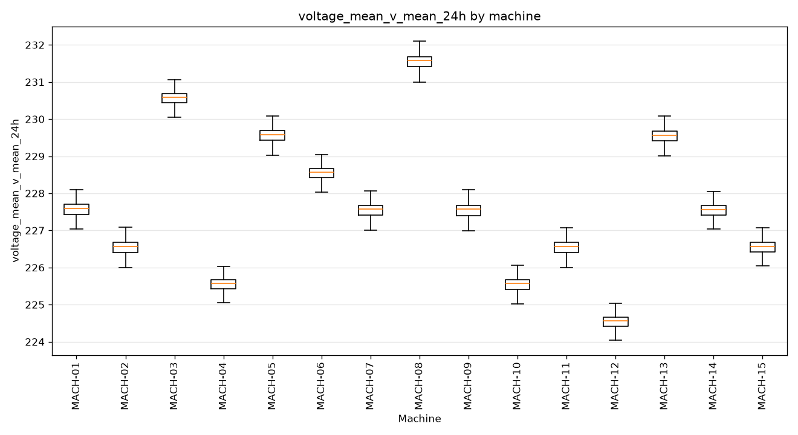

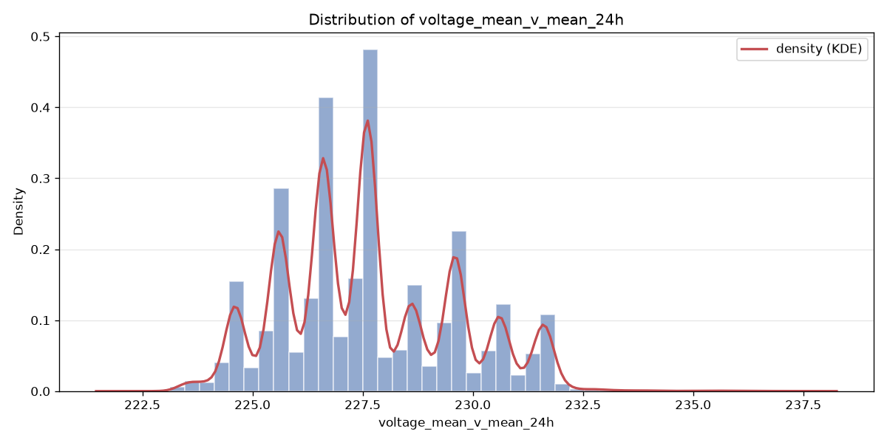

### voltage_mean_v_max_24h

- **dtype** float64 · **count** 134280 · **unique** 1745 · **missing** 0 (0.0%)
- **range** 221.45 → 242.0 (span 20.55) · **Q1/median/Q3** 228.14 / 229.53 / 231.23
- **mean** 229.741 · **std** 2.199 · **skew** 0.908

**Outliers** — flagged values per method:

| method | normal band | below — n (range) | above — n (range) |
|---|---|---|---|
| IQR (k=1.5) | [223.505, 235.865] | 8 [221.45, 223.44] | 1430 [235.875, 242.0] |
| z-score (k=3) | [223.145, 236.337] | 4 [221.45, 222.76] | 1364 [236.34, 242.0] |

**Outliers by machine** (IQR k=1.5 and z-score k=3, fences recomputed per machine):

| machine | n | IQR below | IQR above | z-score below | z-score above |
|---|---|---|---|---|---|
| MACH-01 | 8952 | 349 | 558 | 0 | 178 |
| MACH-02 | 8952 | 92 | 239 | 1 | 134 |
| MACH-03 | 8952 | 30 | 676 | 0 | 267 |
| MACH-04 | 8952 | 27 | 261 | 0 | 105 |
| MACH-05 | 8952 | 137 | 520 | 0 | 176 |
| MACH-06 | 8952 | 560 | 200 | 23 | 148 |
| MACH-07 | 8952 | 706 | 194 | 56 | 26 |
| MACH-08 | 8952 | 614 | 431 | 3 | 198 |
| MACH-09 | 8952 | 694 | 417 | 11 | 178 |
| MACH-10 | 8952 | 552 | 257 | 9 | 154 |
| MACH-11 | 8952 | 635 | 308 | 8 | 151 |
| MACH-12 | 8952 | 676 | 229 | 8 | 101 |
| MACH-13 | 8952 | 667 | 730 | 0 | 362 |
| MACH-14 | 8952 | 641 | 296 | 1 | 157 |
| MACH-15 | 8952 | 312 | 282 | 0 | 188 |
| **total** | 134280 | 6692 | 5598 | 120 | 2523 |

### voltage_mean_v_std_24h

- **dtype** float64 · **count** 134265 · **unique** 14608 · **missing** 15 (0.01%)
- **range** 0.063 → 5.938 (span 5.875) · **Q1/median/Q3** 0.933 / 1.125 / 1.326
- **mean** 1.154 · **std** 0.336 · **skew** 3.015

**Outliers** — flagged values per method:

| method | normal band | below — n (range) | above — n (range) |
|---|---|---|---|
| IQR (k=1.5) | [0.344, 1.916] | 13 [0.063, 0.344] | 2467 [1.916, 5.938] |
| z-score (k=3) | [0.145, 2.163] | 3 [0.063, 0.092] | 1774 [2.163, 5.938] |

**Outliers by machine** (IQR k=1.5 and z-score k=3, fences recomputed per machine):

| machine | n | IQR below | IQR above | z-score below | z-score above |
|---|---|---|---|---|---|
| MACH-01 | 8951 | 72 | 923 | 0 | 145 |
| MACH-02 | 8951 | 0 | 576 | 0 | 132 |
| MACH-03 | 8951 | 1 | 672 | 0 | 259 |
| MACH-04 | 8951 | 1 | 527 | 0 | 89 |
| MACH-05 | 8951 | 29 | 818 | 0 | 184 |
| MACH-06 | 8951 | 193 | 559 | 18 | 102 |
| MACH-07 | 8951 | 188 | 297 | 13 | 73 |
| MACH-08 | 8951 | 268 | 483 | 2 | 161 |
| MACH-09 | 8951 | 420 | 324 | 10 | 109 |
| MACH-10 | 8951 | 402 | 244 | 8 | 146 |
| MACH-11 | 8951 | 390 | 194 | 11 | 85 |
| MACH-12 | 8951 | 329 | 135 | 20 | 65 |
| MACH-13 | 8951 | 158 | 659 | 0 | 213 |
| MACH-14 | 8951 | 181 | 493 | 0 | 99 |
| MACH-15 | 8951 | 92 | 639 | 0 | 149 |
| **total** | 134265 | 2724 | 7543 | 82 | 2011 |

### voltage_mean_v_mean_48h

- **dtype** float64 · **count** 134280 · **unique** 48729 · **missing** 0 (0.0%)
- **range** 221.45 → 236.085 (span 14.635) · **Q1/median/Q3** 226.266 / 227.492 / 229.069
- **mean** 227.628 · **std** 1.955 · **skew** 0.44

**Outliers** — flagged values per method:

| method | normal band | below — n (range) | above — n (range) |
|---|---|---|---|
| IQR (k=1.5) | [222.06, 233.275] | 2 [221.45, 221.935] | 203 [233.275, 236.085] |
| z-score (k=3) | [221.763, 233.494] | 1 [221.45, 221.45] | 140 [233.539, 236.085] |

**Outliers by machine** (IQR k=1.5 and z-score k=3, fences recomputed per machine):

| machine | n | IQR below | IQR above | z-score below | z-score above |
|---|---|---|---|---|---|
| MACH-01 | 8952 | 14 | 335 | 0 | 131 |
| MACH-02 | 8952 | 13 | 109 | 13 | 68 |
| MACH-03 | 8952 | 18 | 489 | 0 | 145 |
| MACH-04 | 8952 | 18 | 166 | 14 | 127 |
| MACH-05 | 8952 | 17 | 331 | 4 | 130 |
| MACH-06 | 8952 | 26 | 28 | 26 | 23 |
| MACH-07 | 8952 | 37 | 42 | 37 | 41 |
| MACH-08 | 8952 | 41 | 372 | 16 | 123 |
| MACH-09 | 8952 | 37 | 182 | 34 | 85 |
| MACH-10 | 8952 | 35 | 194 | 27 | 82 |
| MACH-11 | 8952 | 31 | 165 | 25 | 102 |
| MACH-12 | 8952 | 35 | 149 | 30 | 90 |
| MACH-13 | 8952 | 26 | 684 | 2 | 236 |
| MACH-14 | 8952 | 17 | 283 | 0 | 106 |
| MACH-15 | 8952 | 8 | 255 | 0 | 85 |
| **total** | 134280 | 373 | 3784 | 228 | 1574 |

### voltage_mean_v_max_48h

- **dtype** float64 · **count** 134280 · **unique** 1477 · **missing** 0 (0.0%)
- **range** 221.45 → 242.0 (span 20.55) · **Q1/median/Q3** 228.53 / 229.77 / 231.63
- **mean** 230.128 · **std** 2.278 · **skew** 1.114

**Outliers** — flagged values per method:

| method | normal band | below — n (range) | above — n (range) |
|---|---|---|---|
| IQR (k=1.5) | [223.88, 236.28] | 9 [221.45, 223.64] | 2252 [236.34, 242.0] |
| z-score (k=3) | [223.294, 236.961] | 4 [221.45, 222.76] | 1894 [236.972, 242.0] |

**Outliers by machine** (IQR k=1.5 and z-score k=3, fences recomputed per machine):

| machine | n | IQR below | IQR above | z-score below | z-score above |
|---|---|---|---|---|---|
| MACH-01 | 8952 | 4 | 839 | 0 | 198 |
| MACH-02 | 8952 | 26 | 450 | 1 | 248 |
| MACH-03 | 8952 | 1 | 926 | 0 | 282 |
| MACH-04 | 8952 | 24 | 527 | 0 | 150 |
| MACH-05 | 8952 | 24 | 850 | 0 | 174 |
| MACH-06 | 8952 | 89 | 392 | 21 | 244 |
| MACH-07 | 8952 | 41 | 338 | 40 | 50 |
| MACH-08 | 8952 | 65 | 719 | 3 | 279 |
| MACH-09 | 8952 | 38 | 662 | 11 | 250 |
| MACH-10 | 8952 | 50 | 451 | 10 | 199 |
| MACH-11 | 8952 | 32 | 522 | 32 | 268 |
| MACH-12 | 8952 | 33 | 371 | 10 | 149 |
| MACH-13 | 8952 | 30 | 1065 | 0 | 357 |
| MACH-14 | 8952 | 31 | 488 | 1 | 108 |
| MACH-15 | 8952 | 32 | 474 | 0 | 348 |
| **total** | 134280 | 520 | 9074 | 129 | 3304 |

### voltage_mean_v_std_48h

- **dtype** float64 · **count** 134265 · **unique** 13676 · **missing** 15 (0.01%)
- **range** 0.063 → 4.99 (span 4.927) · **Q1/median/Q3** 1.0 / 1.184 / 1.328
- **mean** 1.191 · **std** 0.317 · **skew** 3.376

**Outliers** — flagged values per method:

| method | normal band | below — n (range) | above — n (range) |
|---|---|---|---|
| IQR (k=1.5) | [0.508, 1.82] | 40 [0.063, 0.497] | 3606 [1.82, 4.99] |
| z-score (k=3) | [0.241, 2.141] | 5 [0.063, 0.212] | 1969 [2.141, 4.99] |

**Outliers by machine** (IQR k=1.5 and z-score k=3, fences recomputed per machine):

| machine | n | IQR below | IQR above | z-score below | z-score above |
|---|---|---|---|---|---|
| MACH-01 | 8951 | 4 | 502 | 0 | 191 |
| MACH-02 | 8951 | 0 | 200 | 0 | 171 |
| MACH-03 | 8951 | 0 | 558 | 0 | 253 |
| MACH-04 | 8951 | 0 | 161 | 0 | 119 |
| MACH-05 | 8951 | 5 | 593 | 0 | 140 |
| MACH-06 | 8951 | 25 | 222 | 17 | 137 |
| MACH-07 | 8951 | 36 | 153 | 15 | 75 |
| MACH-08 | 8951 | 37 | 599 | 3 | 220 |
| MACH-09 | 8951 | 49 | 512 | 13 | 214 |
| MACH-10 | 8951 | 101 | 424 | 12 | 282 |
| MACH-11 | 8951 | 54 | 311 | 33 | 172 |
| MACH-12 | 8951 | 58 | 231 | 29 | 108 |
| MACH-13 | 8951 | 40 | 875 | 0 | 253 |
| MACH-14 | 8951 | 14 | 474 | 0 | 85 |
| MACH-15 | 8951 | 7 | 426 | 0 | 238 |
| **total** | 134265 | 430 | 6241 | 122 | 2658 |

### rotation_mean_rpm_mean_2h

- **dtype** float64 · **count** 134280 · **unique** 43276 · **missing** 0 (0.0%)
- **range** 1100.0 → 1900.0 (span 800.0) · **Q1/median/Q3** 1560.644 / 1590.21 / 1619.692
- **mean** 1589.185 · **std** 42.894 · **skew** -0.362

**Outliers** — flagged values per method:

| method | normal band | below — n (range) | above — n (range) |
|---|---|---|---|
| IQR (k=1.5) | [1472.072, 1708.264] | 456 [1100.0, 1471.974] | 328 [1708.447, 1900.0] |
| z-score (k=3) | [1460.503, 1717.867] | 357 [1100.0, 1460.416] | 284 [1718.078, 1900.0] |

**Outliers by machine** (IQR k=1.5 and z-score k=3, fences recomputed per machine):

| machine | n | IQR below | IQR above | z-score below | z-score above |
|---|---|---|---|---|---|
| MACH-01 | 8952 | 233 | 83 | 33 | 58 |
| MACH-02 | 8952 | 470 | 32 | 62 | 2 |
| MACH-03 | 8952 | 505 | 128 | 58 | 35 |
| MACH-04 | 8952 | 394 | 74 | 28 | 33 |
| MACH-05 | 8952 | 263 | 58 | 26 | 38 |
| MACH-06 | 8952 | 76 | 14 | 37 | 12 |
| MACH-07 | 8952 | 22 | 35 | 21 | 28 |
| MACH-08 | 8952 | 16 | 3 | 18 | 4 |
| MACH-09 | 8952 | 22 | 4 | 25 | 4 |
| MACH-10 | 8952 | 13 | 6 | 22 | 9 |
| MACH-11 | 8952 | 2 | 7 | 3 | 14 |
| MACH-12 | 8952 | 5 | 8 | 7 | 11 |
| MACH-13 | 8952 | 94 | 56 | 77 | 43 |
| MACH-14 | 8952 | 11 | 12 | 8 | 11 |
| MACH-15 | 8952 | 105 | 17 | 27 | 14 |
| **total** | 134280 | 2231 | 537 | 452 | 316 |

### rotation_mean_rpm_max_2h

- **dtype** float64 · **count** 134280 · **unique** 24253 · **missing** 0 (0.0%)
- **range** 1100.0 → 1900.0 (span 800.0) · **Q1/median/Q3** 1571.87 / 1602.248 / 1631.77
- **mean** 1601.285 · **std** 43.988 · **skew** -0.045

**Outliers** — flagged values per method:

| method | normal band | below — n (range) | above — n (range) |
|---|---|---|---|
| IQR (k=1.5) | [1482.02, 1721.62] | 374 [1100.0, 1481.724] | 440 [1721.773, 1900.0] |
| z-score (k=3) | [1469.321, 1733.25] | 267 [1100.0, 1468.807] | 371 [1733.567, 1900.0] |

**Outliers by machine** (IQR k=1.5 and z-score k=3, fences recomputed per machine):

| machine | n | IQR below | IQR above | z-score below | z-score above |
|---|---|---|---|---|---|
| MACH-01 | 8952 | 184 | 105 | 17 | 64 |
| MACH-02 | 8952 | 329 | 26 | 57 | 3 |
| MACH-03 | 8952 | 368 | 138 | 44 | 56 |
| MACH-04 | 8952 | 267 | 68 | 18 | 39 |
| MACH-05 | 8952 | 192 | 69 | 15 | 40 |
| MACH-06 | 8952 | 62 | 20 | 32 | 15 |
| MACH-07 | 8952 | 20 | 28 | 19 | 25 |
| MACH-08 | 8952 | 9 | 8 | 12 | 8 |
| MACH-09 | 8952 | 17 | 10 | 20 | 12 |
| MACH-10 | 8952 | 11 | 9 | 18 | 9 |
| MACH-11 | 8952 | 2 | 10 | 3 | 15 |
| MACH-12 | 8952 | 1 | 13 | 1 | 16 |
| MACH-13 | 8952 | 66 | 87 | 55 | 71 |
| MACH-14 | 8952 | 8 | 21 | 6 | 21 |
| MACH-15 | 8952 | 94 | 26 | 22 | 19 |
| **total** | 134280 | 1630 | 638 | 339 | 413 |

### rotation_mean_rpm_std_2h

- **dtype** float64 · **count** 134265 · **unique** 7115 · **missing** 15 (0.01%)
- **range** 0.0 → 565.685 (span 565.685) · **Q1/median/Q3** 6.364 / 13.789 / 23.971
- **mean** 17.114 · **std** 15.908 · **skew** 5.154

**Outliers** — flagged values per method:

| method | normal band | below — n (range) | above — n (range) |
|---|---|---|---|
| IQR (k=1.5) | [-20.046, 50.381] | 0 — | 3421 [50.417, 565.685] |
| z-score (k=3) | [-30.61, 64.838] | 0 — | 1115 [64.842, 565.685] |

**Outliers by machine** (IQR k=1.5 and z-score k=3, fences recomputed per machine):

| machine | n | IQR below | IQR above | z-score below | z-score above |
|---|---|---|---|---|---|
| MACH-01 | 8951 | 0 | 250 | 0 | 84 |
| MACH-02 | 8951 | 0 | 170 | 0 | 87 |
| MACH-03 | 8951 | 0 | 302 | 0 | 98 |
| MACH-04 | 8951 | 0 | 192 | 0 | 76 |
| MACH-05 | 8951 | 0 | 227 | 0 | 92 |
| MACH-06 | 8951 | 0 | 208 | 0 | 77 |
| MACH-07 | 8951 | 0 | 208 | 0 | 70 |
| MACH-08 | 8951 | 0 | 221 | 0 | 89 |
| MACH-09 | 8951 | 0 | 227 | 0 | 87 |
| MACH-10 | 8951 | 0 | 234 | 0 | 97 |
| MACH-11 | 8951 | 0 | 198 | 0 | 97 |
| MACH-12 | 8951 | 0 | 257 | 0 | 96 |
| MACH-13 | 8951 | 0 | 318 | 0 | 101 |
| MACH-14 | 8951 | 0 | 211 | 0 | 94 |
| MACH-15 | 8951 | 0 | 196 | 0 | 82 |
| **total** | 134265 | 0 | 3419 | 0 | 1327 |

### rotation_mean_rpm_mean_3h

- **dtype** float64 · **count** 134280 · **unique** 54735 · **missing** 0 (0.0%)
- **range** 1100.0 → 1900.0 (span 800.0) · **Q1/median/Q3** 1561.538 / 1590.012 / 1619.334
- **mean** 1589.184 · **std** 41.44 · **skew** -0.349

**Outliers** — flagged values per method:

| method | normal band | below — n (range) | above — n (range) |
|---|---|---|---|
| IQR (k=1.5) | [1474.845, 1706.027] | 429 [1100.0, 1474.781] | 321 [1706.137, 1900.0] |
| z-score (k=3) | [1464.865, 1713.503] | 367 [1100.0, 1464.422] | 274 [1713.569, 1900.0] |

**Outliers by machine** (IQR k=1.5 and z-score k=3, fences recomputed per machine):

| machine | n | IQR below | IQR above | z-score below | z-score above |
|---|---|---|---|---|---|
| MACH-01 | 8952 | 308 | 83 | 34 | 59 |
| MACH-02 | 8952 | 594 | 25 | 62 | 2 |
| MACH-03 | 8952 | 644 | 145 | 61 | 29 |
| MACH-04 | 8952 | 536 | 90 | 30 | 36 |
| MACH-05 | 8952 | 369 | 57 | 29 | 39 |
| MACH-06 | 8952 | 79 | 16 | 39 | 13 |
| MACH-07 | 8952 | 23 | 34 | 23 | 33 |
| MACH-08 | 8952 | 19 | 2 | 20 | 2 |
| MACH-09 | 8952 | 20 | 2 | 25 | 5 |
| MACH-10 | 8952 | 11 | 7 | 20 | 7 |
| MACH-11 | 8952 | 0 | 7 | 3 | 14 |
| MACH-12 | 8952 | 4 | 7 | 7 | 14 |
| MACH-13 | 8952 | 94 | 52 | 74 | 43 |
| MACH-14 | 8952 | 11 | 10 | 11 | 10 |
| MACH-15 | 8952 | 131 | 17 | 27 | 14 |
| **total** | 134280 | 2843 | 554 | 465 | 320 |

### rotation_mean_rpm_max_3h

- **dtype** float64 · **count** 134280 · **unique** 21957 · **missing** 0 (0.0%)
- **range** 1100.0 → 1900.0 (span 800.0) · **Q1/median/Q3** 1579.229 / 1609.081 / 1637.77
- **mean** 1608.019 · **std** 43.106 · **skew** 0.167

**Outliers** — flagged values per method:

| method | normal band | below — n (range) | above — n (range) |
|---|---|---|---|
| IQR (k=1.5) | [1491.418, 1725.581] | 326 [1100.0, 1491.309] | 529 [1725.842, 1900.0] |
| z-score (k=3) | [1478.7, 1737.338] | 241 [1100.0, 1478.481] | 450 [1737.47, 1900.0] |

**Outliers by machine** (IQR k=1.5 and z-score k=3, fences recomputed per machine):

| machine | n | IQR below | IQR above | z-score below | z-score above |
|---|---|---|---|---|---|
| MACH-01 | 8952 | 178 | 118 | 9 | 72 |
| MACH-02 | 8952 | 401 | 32 | 53 | 3 |
| MACH-03 | 8952 | 459 | 173 | 34 | 76 |
| MACH-04 | 8952 | 349 | 81 | 13 | 42 |
| MACH-05 | 8952 | 243 | 75 | 11 | 45 |
| MACH-06 | 8952 | 70 | 24 | 33 | 18 |
| MACH-07 | 8952 | 16 | 29 | 16 | 29 |
| MACH-08 | 8952 | 7 | 11 | 8 | 11 |
| MACH-09 | 8952 | 14 | 15 | 19 | 15 |
| MACH-10 | 8952 | 11 | 11 | 20 | 11 |
| MACH-11 | 8952 | 0 | 13 | 1 | 19 |
| MACH-12 | 8952 | 0 | 17 | 0 | 20 |
| MACH-13 | 8952 | 50 | 106 | 36 | 91 |
| MACH-14 | 8952 | 7 | 21 | 7 | 21 |
| MACH-15 | 8952 | 94 | 29 | 19 | 22 |
| **total** | 134280 | 1899 | 755 | 279 | 495 |

### rotation_mean_rpm_std_3h

- **dtype** float64 · **count** 134265 · **unique** 61166 · **missing** 15 (0.01%)
- **range** 0.0 → 461.88 (span 461.88) · **Q1/median/Q3** 11.199 / 17.668 / 25.566
- **mean** 19.779 · **std** 14.224 · **skew** 5.679

**Outliers** — flagged values per method:

| method | normal band | below — n (range) | above — n (range) |
|---|---|---|---|
| IQR (k=1.5) | [-10.353, 47.118] | 0 — | 3221 [47.126, 461.88] |
| z-score (k=3) | [-22.892, 62.451] | 0 — | 1008 [62.457, 461.88] |

**Outliers by machine** (IQR k=1.5 and z-score k=3, fences recomputed per machine):

| machine | n | IQR below | IQR above | z-score below | z-score above |
|---|---|---|---|---|---|
| MACH-01 | 8951 | 0 | 269 | 0 | 100 |
| MACH-02 | 8951 | 0 | 110 | 0 | 47 |
| MACH-03 | 8951 | 0 | 272 | 0 | 116 |
| MACH-04 | 8951 | 0 | 154 | 0 | 62 |
| MACH-05 | 8951 | 0 | 209 | 0 | 72 |
| MACH-06 | 8951 | 0 | 185 | 0 | 57 |
| MACH-07 | 8951 | 0 | 168 | 0 | 53 |
| MACH-08 | 8951 | 0 | 219 | 0 | 78 |
| MACH-09 | 8951 | 0 | 245 | 0 | 75 |
| MACH-10 | 8951 | 0 | 227 | 0 | 64 |
| MACH-11 | 8951 | 0 | 175 | 0 | 75 |
| MACH-12 | 8951 | 0 | 225 | 0 | 78 |
| MACH-13 | 8951 | 0 | 353 | 0 | 121 |
| MACH-14 | 8951 | 0 | 167 | 0 | 97 |
| MACH-15 | 8951 | 0 | 191 | 0 | 71 |
| **total** | 134265 | 0 | 3169 | 0 | 1166 |

### rotation_mean_rpm_mean_4h

- **dtype** float64 · **count** 134280 · **unique** 61455 · **missing** 0 (0.0%)
- **range** 1100.0 → 1900.0 (span 800.0) · **Q1/median/Q3** 1562.334 / 1589.773 / 1619.032
- **mean** 1589.181 · **std** 40.366 · **skew** -0.345

**Outliers** — flagged values per method:

| method | normal band | below — n (range) | above — n (range) |
|---|---|---|---|
| IQR (k=1.5) | [1477.287, 1704.079] | 416 [1100.0, 1477.256] | 311 [1704.13, 1900.0] |
| z-score (k=3) | [1468.084, 1710.279] | 351 [1100.0, 1467.767] | 273 [1710.303, 1900.0] |

**Outliers by machine** (IQR k=1.5 and z-score k=3, fences recomputed per machine):

| machine | n | IQR below | IQR above | z-score below | z-score above |
|---|---|---|---|---|---|
| MACH-01 | 8952 | 377 | 86 | 34 | 58 |
| MACH-02 | 8952 | 702 | 23 | 65 | 2 |
| MACH-03 | 8952 | 750 | 154 | 59 | 28 |
| MACH-04 | 8952 | 650 | 102 | 32 | 35 |
| MACH-05 | 8952 | 446 | 52 | 32 | 42 |
| MACH-06 | 8952 | 77 | 17 | 41 | 13 |
| MACH-07 | 8952 | 23 | 33 | 22 | 33 |
| MACH-08 | 8952 | 16 | 2 | 22 | 3 |
| MACH-09 | 8952 | 16 | 0 | 23 | 3 |
| MACH-10 | 8952 | 11 | 7 | 23 | 8 |
| MACH-11 | 8952 | 0 | 8 | 3 | 12 |
| MACH-12 | 8952 | 2 | 6 | 6 | 12 |
| MACH-13 | 8952 | 98 | 54 | 81 | 42 |
| MACH-14 | 8952 | 8 | 12 | 8 | 12 |
| MACH-15 | 8952 | 157 | 19 | 25 | 15 |
| **total** | 134280 | 3333 | 575 | 476 | 318 |

### rotation_mean_rpm_max_4h

- **dtype** float64 · **count** 134280 · **unique** 20427 · **missing** 0 (0.0%)
- **range** 1100.0 → 1900.0 (span 800.0) · **Q1/median/Q3** 1584.832 / 1614.07 / 1642.17
- **mean** 1612.967 · **std** 42.53 · **skew** 0.319

**Outliers** — flagged values per method:

| method | normal band | below — n (range) | above — n (range) |
|---|---|---|---|
| IQR (k=1.5) | [1498.825, 1728.177] | 301 [1100.0, 1498.794] | 613 [1729.563, 1900.0] |
| z-score (k=3) | [1485.376, 1740.558] | 199 [1100.0, 1484.393] | 518 [1740.773, 1900.0] |

**Outliers by machine** (IQR k=1.5 and z-score k=3, fences recomputed per machine):

| machine | n | IQR below | IQR above | z-score below | z-score above |
|---|---|---|---|---|---|
| MACH-01 | 8952 | 172 | 129 | 10 | 81 |
| MACH-02 | 8952 | 456 | 38 | 45 | 4 |
| MACH-03 | 8952 | 502 | 218 | 28 | 96 |
| MACH-04 | 8952 | 392 | 89 | 3 | 44 |
| MACH-05 | 8952 | 232 | 68 | 10 | 51 |
| MACH-06 | 8952 | 76 | 29 | 34 | 23 |
| MACH-07 | 8952 | 16 | 32 | 14 | 27 |
| MACH-08 | 8952 | 5 | 14 | 6 | 14 |
| MACH-09 | 8952 | 15 | 20 | 17 | 20 |
| MACH-10 | 8952 | 18 | 13 | 21 | 13 |
| MACH-11 | 8952 | 0 | 16 | 0 | 21 |
| MACH-12 | 8952 | 0 | 20 | 0 | 20 |
| MACH-13 | 8952 | 38 | 124 | 27 | 104 |
| MACH-14 | 8952 | 3 | 26 | 3 | 26 |
| MACH-15 | 8952 | 97 | 34 | 17 | 26 |
| **total** | 134280 | 2022 | 870 | 235 | 570 |

### rotation_mean_rpm_std_4h

- **dtype** float64 · **count** 134265 · **unique** 102714 · **missing** 15 (0.01%)
- **range** 0.0 → 393.548 (span 393.548) · **Q1/median/Q3** 13.643 / 19.569 / 26.54
- **mean** 21.424 · **std** 13.633 · **skew** 5.975

**Outliers** — flagged values per method:

| method | normal band | below — n (range) | above — n (range) |
|---|---|---|---|
| IQR (k=1.5) | [-5.704, 45.887] | 0 — | 3325 [45.892, 393.548] |
| z-score (k=3) | [-19.474, 62.322] | 0 — | 1060 [62.339, 393.548] |

**Outliers by machine** (IQR k=1.5 and z-score k=3, fences recomputed per machine):

| machine | n | IQR below | IQR above | z-score below | z-score above |
|---|---|---|---|---|---|
| MACH-01 | 8951 | 0 | 271 | 0 | 113 |
| MACH-02 | 8951 | 0 | 107 | 0 | 34 |
| MACH-03 | 8951 | 0 | 283 | 0 | 129 |
| MACH-04 | 8951 | 0 | 145 | 0 | 52 |
| MACH-05 | 8951 | 0 | 187 | 0 | 76 |
| MACH-06 | 8951 | 0 | 178 | 0 | 47 |
| MACH-07 | 8951 | 0 | 146 | 0 | 48 |
| MACH-08 | 8951 | 0 | 219 | 0 | 64 |
| MACH-09 | 8951 | 0 | 222 | 0 | 73 |
| MACH-10 | 8951 | 0 | 176 | 0 | 47 |
| MACH-11 | 8951 | 0 | 185 | 0 | 72 |
| MACH-12 | 8951 | 0 | 193 | 0 | 62 |
| MACH-13 | 8951 | 0 | 401 | 0 | 135 |
| MACH-14 | 8951 | 0 | 183 | 0 | 76 |
| MACH-15 | 8951 | 0 | 193 | 0 | 65 |
| **total** | 134265 | 0 | 3089 | 0 | 1093 |

### rotation_mean_rpm_mean_6h

- **dtype** float64 · **count** 134280 · **unique** 75994 · **missing** 0 (0.0%)
- **range** 1159.176 → 1900.0 (span 740.824) · **Q1/median/Q3** 1563.832 / 1589.327 / 1618.286
- **mean** 1589.175 · **std** 38.547 · **skew** -0.337

**Outliers** — flagged values per method:

| method | normal band | below — n (range) | above — n (range) |
|---|---|---|---|
| IQR (k=1.5) | [1482.15, 1699.968] | 404 [1159.176, 1482.126] | 302 [1700.028, 1900.0] |
| z-score (k=3) | [1473.535, 1704.814] | 346 [1159.176, 1473.267] | 276 [1704.866, 1900.0] |

**Outliers by machine** (IQR k=1.5 and z-score k=3, fences recomputed per machine):

| machine | n | IQR below | IQR above | z-score below | z-score above |
|---|---|---|---|---|---|
| MACH-01 | 8952 | 468 | 92 | 30 | 69 |
| MACH-02 | 8952 | 828 | 17 | 62 | 2 |
| MACH-03 | 8952 | 932 | 177 | 62 | 28 |
| MACH-04 | 8952 | 810 | 105 | 36 | 34 |
| MACH-05 | 8952 | 558 | 56 | 37 | 36 |
| MACH-06 | 8952 | 89 | 19 | 47 | 11 |
| MACH-07 | 8952 | 26 | 39 | 26 | 37 |
| MACH-08 | 8952 | 16 | 1 | 19 | 2 |
| MACH-09 | 8952 | 16 | 0 | 18 | 0 |
| MACH-10 | 8952 | 16 | 8 | 28 | 12 |
| MACH-11 | 8952 | 0 | 7 | 2 | 15 |
| MACH-12 | 8952 | 0 | 6 | 2 | 9 |
| MACH-13 | 8952 | 101 | 55 | 84 | 45 |
| MACH-14 | 8952 | 9 | 11 | 9 | 12 |
| MACH-15 | 8952 | 170 | 20 | 27 | 16 |
| **total** | 134280 | 4039 | 613 | 489 | 328 |

### rotation_mean_rpm_max_6h

- **dtype** float64 · **count** 134280 · **unique** 18204 · **missing** 0 (0.0%)
- **range** 1323.913 → 1900.0 (span 576.087) · **Q1/median/Q3** 1593.663 / 1621.709 / 1648.57
- **mean** 1620.68 · **std** 41.606 · **skew** 0.535

**Outliers** — flagged values per method:

| method | normal band | below — n (range) | above — n (range) |
|---|---|---|---|
| IQR (k=1.5) | [1511.303, 1730.93] | 401 [1323.913, 1511.294] | 774 [1730.959, 1900.0] |
| z-score (k=3) | [1495.861, 1745.499] | 160 [1323.913, 1495.409] | 642 [1746.444, 1900.0] |

**Outliers by machine** (IQR k=1.5 and z-score k=3, fences recomputed per machine):

| machine | n | IQR below | IQR above | z-score below | z-score above |
|---|---|---|---|---|---|
| MACH-01 | 8952 | 145 | 137 | 4 | 98 |
| MACH-02 | 8952 | 499 | 43 | 55 | 0 |
| MACH-03 | 8952 | 602 | 267 | 21 | 120 |
| MACH-04 | 8952 | 421 | 108 | 3 | 52 |
| MACH-05 | 8952 | 250 | 83 | 11 | 56 |
| MACH-06 | 8952 | 80 | 41 | 29 | 27 |
| MACH-07 | 8952 | 14 | 38 | 14 | 33 |
| MACH-08 | 8952 | 4 | 20 | 4 | 20 |
| MACH-09 | 8952 | 14 | 28 | 14 | 28 |
| MACH-10 | 8952 | 23 | 17 | 23 | 17 |
| MACH-11 | 8952 | 0 | 31 | 0 | 23 |
| MACH-12 | 8952 | 1 | 26 | 0 | 26 |
| MACH-13 | 8952 | 28 | 166 | 17 | 139 |
| MACH-14 | 8952 | 5 | 30 | 3 | 28 |
| MACH-15 | 8952 | 99 | 38 | 13 | 28 |
| **total** | 134280 | 2185 | 1073 | 211 | 695 |

### rotation_mean_rpm_std_6h

- **dtype** float64 · **count** 134265 · **unique** 107966 · **missing** 15 (0.01%)
- **range** 0.0 → 347.349 (span 347.349) · **Q1/median/Q3** 16.782 / 22.007 / 28.474
- **mean** 23.964 · **std** 13.363 · **skew** 6.041

**Outliers** — flagged values per method:

| method | normal band | below — n (range) | above — n (range) |
|---|---|---|---|
| IQR (k=1.5) | [-0.755, 46.011] | 0 — | 3664 [46.013, 347.349] |
| z-score (k=3) | [-16.124, 64.052] | 0 — | 1178 [64.053, 347.349] |

**Outliers by machine** (IQR k=1.5 and z-score k=3, fences recomputed per machine):

| machine | n | IQR below | IQR above | z-score below | z-score above |
|---|---|---|---|---|---|
| MACH-01 | 8951 | 2 | 318 | 0 | 135 |
| MACH-02 | 8951 | 12 | 112 | 0 | 34 |
| MACH-03 | 8951 | 2 | 372 | 0 | 140 |
| MACH-04 | 8951 | 10 | 151 | 0 | 61 |
| MACH-05 | 8951 | 12 | 197 | 0 | 85 |
| MACH-06 | 8951 | 4 | 188 | 0 | 58 |
| MACH-07 | 8951 | 0 | 211 | 0 | 50 |
| MACH-08 | 8951 | 0 | 189 | 0 | 70 |
| MACH-09 | 8951 | 0 | 171 | 0 | 75 |
| MACH-10 | 8951 | 0 | 95 | 0 | 50 |
| MACH-11 | 8951 | 0 | 107 | 0 | 49 |
| MACH-12 | 8951 | 0 | 122 | 0 | 54 |
| MACH-13 | 8951 | 0 | 432 | 0 | 163 |
| MACH-14 | 8951 | 0 | 148 | 0 | 56 |
| MACH-15 | 8951 | 5 | 187 | 0 | 68 |
| **total** | 134265 | 47 | 3000 | 0 | 1148 |

### rotation_mean_rpm_mean_12h

- **dtype** float64 · **count** 134280 · **unique** 91179 · **missing** 0 (0.0%)
- **range** 1319.271 → 1843.917 (span 524.646) · **Q1/median/Q3** 1568.461 / 1588.091 / 1614.881
- **mean** 1589.153 · **std** 33.606 · **skew** -0.365

**Outliers** — flagged values per method:

| method | normal band | below — n (range) | above — n (range) |
|---|---|---|---|
| IQR (k=1.5) | [1498.832, 1684.511] | 586 [1319.271, 1498.805] | 314 [1684.533, 1843.917] |
| z-score (k=3) | [1488.335, 1689.972] | 389 [1319.271, 1488.308] | 261 [1690.159, 1843.917] |

**Outliers by machine** (IQR k=1.5 and z-score k=3, fences recomputed per machine):

| machine | n | IQR below | IQR above | z-score below | z-score above |
|---|---|---|---|---|---|
| MACH-01 | 8952 | 706 | 132 | 33 | 82 |
| MACH-02 | 8952 | 1149 | 25 | 61 | 0 |
| MACH-03 | 8952 | 1230 | 245 | 72 | 32 |
| MACH-04 | 8952 | 1087 | 129 | 53 | 46 |
| MACH-05 | 8952 | 780 | 58 | 45 | 28 |
| MACH-06 | 8952 | 405 | 30 | 58 | 16 |
| MACH-07 | 8952 | 60 | 64 | 32 | 47 |
| MACH-08 | 8952 | 23 | 0 | 22 | 0 |
| MACH-09 | 8952 | 20 | 0 | 20 | 0 |
| MACH-10 | 8952 | 31 | 22 | 31 | 28 |
| MACH-11 | 8952 | 0 | 8 | 2 | 14 |
| MACH-12 | 8952 | 0 | 4 | 0 | 12 |
| MACH-13 | 8952 | 143 | 63 | 101 | 33 |
| MACH-14 | 8952 | 54 | 16 | 13 | 16 |
| MACH-15 | 8952 | 442 | 26 | 29 | 17 |
| **total** | 134280 | 6130 | 822 | 572 | 371 |

### rotation_mean_rpm_max_12h

- **dtype** float64 · **count** 134280 · **unique** 13781 · **missing** 0 (0.0%)
- **range** 1345.263 → 1900.0 (span 554.737) · **Q1/median/Q3** 1612.06 / 1637.537 / 1660.148
- **mean** 1636.246 · **std** 39.648 · **skew** 1.099

**Outliers** — flagged values per method:

| method | normal band | below — n (range) | above — n (range) |
|---|---|---|---|
| IQR (k=1.5) | [1539.928, 1732.28] | 903 [1345.263, 1539.767] | 1264 [1732.423, 1900.0] |
| z-score (k=3) | [1517.301, 1755.191] | 134 [1345.263, 1517.181] | 1048 [1756.957, 1900.0] |

**Outliers by machine** (IQR k=1.5 and z-score k=3, fences recomputed per machine):

| machine | n | IQR below | IQR above | z-score below | z-score above |
|---|---|---|---|---|---|
| MACH-01 | 8952 | 209 | 202 | 0 | 142 |
| MACH-02 | 8952 | 605 | 85 | 76 | 0 |
| MACH-03 | 8952 | 743 | 494 | 14 | 186 |
| MACH-04 | 8952 | 601 | 172 | 4 | 74 |
| MACH-05 | 8952 | 305 | 113 | 13 | 64 |
| MACH-06 | 8952 | 201 | 77 | 18 | 39 |
| MACH-07 | 8952 | 97 | 59 | 8 | 51 |
| MACH-08 | 8952 | 203 | 62 | 13 | 38 |
| MACH-09 | 8952 | 310 | 103 | 12 | 52 |
| MACH-10 | 8952 | 322 | 80 | 21 | 29 |
| MACH-11 | 8952 | 411 | 100 | 0 | 41 |
| MACH-12 | 8952 | 232 | 98 | 4 | 44 |
| MACH-13 | 8952 | 139 | 330 | 2 | 184 |
| MACH-14 | 8952 | 63 | 66 | 4 | 40 |
| MACH-15 | 8952 | 105 | 58 | 4 | 46 |
| **total** | 134280 | 4546 | 2099 | 193 | 1030 |

### rotation_mean_rpm_std_12h

- **dtype** float64 · **count** 134265 · **unique** 109458 · **missing** 15 (0.01%)
- **range** 0.15 → 253.268 (span 253.118) · **Q1/median/Q3** 21.965 / 27.125 / 34.582
- **mean** 29.692 · **std** 13.861 · **skew** 5.02

**Outliers** — flagged values per method:

| method | normal band | below — n (range) | above — n (range) |
|---|---|---|---|
| IQR (k=1.5) | [3.041, 53.507] | 21 [0.15, 2.767] | 3146 [53.508, 253.268] |
| z-score (k=3) | [-11.89, 71.274] | 0 — | 1506 [71.288, 253.268] |

**Outliers by machine** (IQR k=1.5 and z-score k=3, fences recomputed per machine):

| machine | n | IQR below | IQR above | z-score below | z-score above |
|---|---|---|---|---|---|
| MACH-01 | 8951 | 18 | 474 | 0 | 202 |
| MACH-02 | 8951 | 10 | 231 | 0 | 48 |
| MACH-03 | 8951 | 6 | 614 | 0 | 191 |
| MACH-04 | 8951 | 19 | 238 | 0 | 106 |
| MACH-05 | 8951 | 14 | 282 | 0 | 116 |
| MACH-06 | 8951 | 3 | 257 | 0 | 73 |
| MACH-07 | 8951 | 3 | 277 | 0 | 74 |
| MACH-08 | 8951 | 2 | 142 | 0 | 98 |
| MACH-09 | 8951 | 0 | 110 | 0 | 80 |
| MACH-10 | 8951 | 0 | 70 | 0 | 62 |
| MACH-11 | 8951 | 0 | 53 | 0 | 49 |
| MACH-12 | 8951 | 0 | 82 | 0 | 69 |
| MACH-13 | 8951 | 0 | 497 | 0 | 224 |
| MACH-14 | 8951 | 7 | 120 | 4 | 44 |
| MACH-15 | 8951 | 17 | 259 | 0 | 106 |
| **total** | 134265 | 99 | 3706 | 4 | 1542 |

### rotation_mean_rpm_mean_24h

- **dtype** float64 · **count** 134280 · **unique** 93675 · **missing** 0 (0.0%)
- **range** 1343.067 → 1766.4 (span 423.333) · **Q1/median/Q3** 1571.702 / 1594.958 / 1603.857
- **mean** 1589.111 · **std** 27.704 · **skew** -0.407

**Outliers** — flagged values per method:

| method | normal band | below — n (range) | above — n (range) |
|---|---|---|---|
| IQR (k=1.5) | [1523.469, 1652.09] | 2222 [1343.067, 1523.467] | 529 [1652.125, 1766.4] |
| z-score (k=3) | [1505.998, 1672.224] | 445 [1343.067, 1505.53] | 270 [1672.588, 1766.4] |

**Outliers by machine** (IQR k=1.5 and z-score k=3, fences recomputed per machine):

| machine | n | IQR below | IQR above | z-score below | z-score above |
|---|---|---|---|---|---|
| MACH-01 | 8952 | 1329 | 233 | 39 | 76 |
| MACH-02 | 8952 | 1502 | 26 | 68 | 0 |
| MACH-03 | 8952 | 1165 | 211 | 78 | 41 |
| MACH-04 | 8952 | 1474 | 148 | 13 | 55 |
| MACH-05 | 8952 | 1475 | 111 | 29 | 34 |
| MACH-06 | 8952 | 1479 | 92 | 84 | 6 |
| MACH-07 | 8952 | 1530 | 157 | 43 | 57 |
| MACH-08 | 8952 | 1430 | 19 | 66 | 0 |
| MACH-09 | 8952 | 1447 | 70 | 57 | 0 |
| MACH-10 | 8952 | 1423 | 112 | 47 | 36 |
| MACH-11 | 8952 | 1456 | 114 | 48 | 10 |
| MACH-12 | 8952 | 1485 | 151 | 32 | 28 |
| MACH-13 | 8952 | 1308 | 150 | 136 | 25 |
| MACH-14 | 8952 | 1463 | 107 | 50 | 31 |
| MACH-15 | 8952 | 1357 | 94 | 44 | 3 |
| **total** | 134280 | 21323 | 1795 | 834 | 402 |

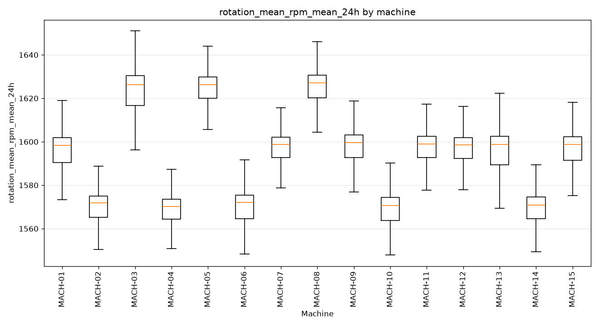

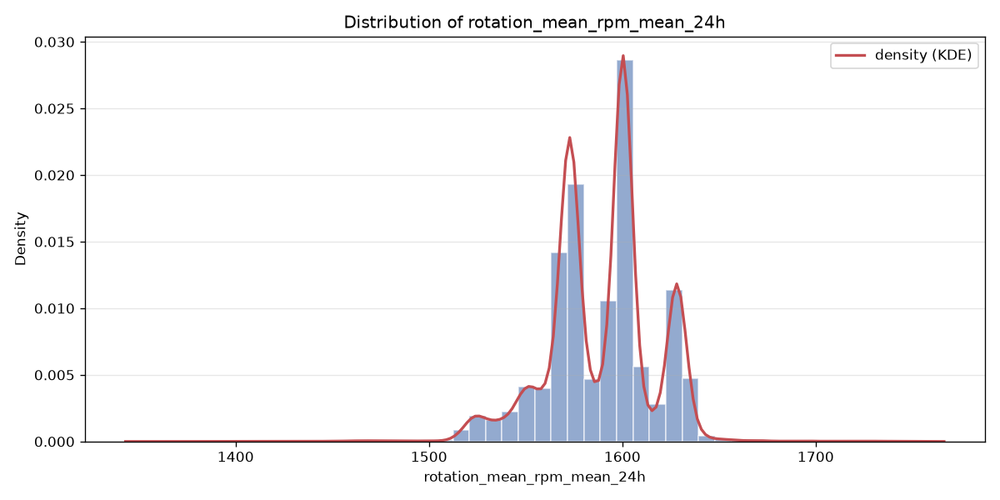

### rotation_mean_rpm_max_24h

- **dtype** float64 · **count** 134280 · **unique** 8277 · **missing** 0 (0.0%)
- **range** 1449.063 → 1900.0 (span 450.937) · **Q1/median/Q3** 1629.072 / 1653.329 / 1669.367
- **mean** 1652.003 · **std** 38.328 · **skew** 2.09

**Outliers** — flagged values per method:

| method | normal band | below — n (range) | above — n (range) |
|---|---|---|---|
| IQR (k=1.5) | [1568.629, 1729.81] | 1198 [1449.063, 1568.409] | 2415 [1730.16, 1900.0] |
| z-score (k=3) | [1537.019, 1766.987] | 73 [1449.063, 1534.763] | 1769 [1767.829, 1900.0] |

**Outliers by machine** (IQR k=1.5 and z-score k=3, fences recomputed per machine):

| machine | n | IQR below | IQR above | z-score below | z-score above |
|---|---|---|---|---|---|
| MACH-01 | 8952 | 615 | 539 | 0 | 231 |
| MACH-02 | 8952 | 345 | 145 | 88 | 25 |
| MACH-03 | 8952 | 192 | 616 | 2 | 237 |
| MACH-04 | 8952 | 269 | 289 | 1 | 124 |
| MACH-05 | 8952 | 509 | 296 | 19 | 112 |
| MACH-06 | 8952 | 710 | 198 | 15 | 75 |
| MACH-07 | 8952 | 840 | 191 | 12 | 85 |
| MACH-08 | 8952 | 738 | 123 | 86 | 74 |
| MACH-09 | 8952 | 701 | 295 | 1 | 96 |
| MACH-10 | 8952 | 813 | 229 | 31 | 53 |
| MACH-11 | 8952 | 728 | 196 | 37 | 76 |
| MACH-12 | 8952 | 770 | 216 | 34 | 80 |
| MACH-13 | 8952 | 768 | 693 | 0 | 279 |
| MACH-14 | 8952 | 724 | 214 | 58 | 76 |
| MACH-15 | 8952 | 684 | 159 | 4 | 82 |
| **total** | 134280 | 9406 | 4399 | 388 | 1705 |

### rotation_mean_rpm_std_24h

- **dtype** float64 · **count** 134265 · **unique** 109346 · **missing** 15 (0.01%)
- **range** 1.626 → 222.413 (span 220.787) · **Q1/median/Q3** 26.958 / 33.428 / 39.937
- **mean** 34.962 · **std** 13.542 · **skew** 4.309

**Outliers** — flagged values per method:

| method | normal band | below — n (range) | above — n (range) |
|---|---|---|---|
| IQR (k=1.5) | [7.489, 59.406] | 14 [1.626, 7.0] | 3229 [59.407, 222.413] |
| z-score (k=3) | [-5.664, 75.588] | 0 — | 2120 [75.624, 222.413] |

**Outliers by machine** (IQR k=1.5 and z-score k=3, fences recomputed per machine):

| machine | n | IQR below | IQR above | z-score below | z-score above |
|---|---|---|---|---|---|
| MACH-01 | 8951 | 16 | 1043 | 0 | 260 |
| MACH-02 | 8951 | 3 | 670 | 0 | 98 |
| MACH-03 | 8951 | 0 | 566 | 0 | 269 |
| MACH-04 | 8951 | 15 | 653 | 0 | 102 |
| MACH-05 | 8951 | 9 | 702 | 1 | 163 |
| MACH-06 | 8951 | 15 | 676 | 0 | 140 |
| MACH-07 | 8951 | 56 | 660 | 0 | 125 |
| MACH-08 | 8951 | 318 | 494 | 1 | 146 |
| MACH-09 | 8951 | 365 | 367 | 0 | 165 |
| MACH-10 | 8951 | 616 | 257 | 2 | 115 |
| MACH-11 | 8951 | 388 | 212 | 20 | 56 |
| MACH-12 | 8951 | 387 | 289 | 4 | 126 |
| MACH-13 | 8951 | 89 | 901 | 0 | 361 |
| MACH-14 | 8951 | 63 | 441 | 12 | 89 |
| MACH-15 | 8951 | 46 | 779 | 0 | 146 |
| **total** | 134265 | 2386 | 8710 | 40 | 2361 |

### rotation_mean_rpm_mean_48h

- **dtype** float64 · **count** 134280 · **unique** 108027 · **missing** 0 (0.0%)
- **range** 1439.578 → 1703.484 (span 263.906) · **Q1/median/Q3** 1572.398 / 1593.238 / 1602.723
- **mean** 1589.085 · **std** 24.511 · **skew** -0.067

**Outliers** — flagged values per method:

| method | normal band | below — n (range) | above — n (range) |
|---|---|---|---|
| IQR (k=1.5) | [1526.912, 1648.21] | 605 [1439.578, 1526.853] | 525 [1648.244, 1703.484] |
| z-score (k=3) | [1515.552, 1662.619] | 382 [1439.578, 1515.528] | 289 [1663.066, 1703.484] |

**Outliers by machine** (IQR k=1.5 and z-score k=3, fences recomputed per machine):

| machine | n | IQR below | IQR above | z-score below | z-score above |
|---|---|---|---|---|---|
| MACH-01 | 8952 | 70 | 178 | 46 | 146 |
| MACH-02 | 8952 | 107 | 0 | 99 | 0 |
| MACH-03 | 8952 | 156 | 103 | 129 | 46 |
| MACH-04 | 8952 | 28 | 89 | 24 | 51 |
| MACH-05 | 8952 | 24 | 53 | 21 | 50 |
| MACH-06 | 8952 | 141 | 0 | 125 | 0 |
| MACH-07 | 8952 | 84 | 121 | 69 | 92 |
| MACH-08 | 8952 | 84 | 0 | 96 | 0 |
| MACH-09 | 8952 | 87 | 0 | 86 | 0 |
| MACH-10 | 8952 | 89 | 57 | 80 | 52 |
| MACH-11 | 8952 | 30 | 22 | 31 | 16 |
| MACH-12 | 8952 | 26 | 55 | 28 | 39 |
| MACH-13 | 8952 | 221 | 62 | 150 | 31 |
| MACH-14 | 8952 | 14 | 51 | 16 | 48 |
| MACH-15 | 8952 | 77 | 8 | 74 | 0 |
| **total** | 134280 | 1238 | 799 | 1074 | 571 |

### rotation_mean_rpm_max_48h

- **dtype** float64 · **count** 134280 · **unique** 3939 · **missing** 0 (0.0%)
- **range** 1503.124 → 1900.0 (span 396.876) · **Q1/median/Q3** 1641.394 / 1662.07 / 1677.57
- **mean** 1664.465 · **std** 39.88 · **skew** 3.014

**Outliers** — flagged values per method:

| method | normal band | below — n (range) | above — n (range) |
|---|---|---|---|
| IQR (k=1.5) | [1587.13, 1731.834] | 244 [1503.124, 1586.97] | 4023 [1731.96, 1900.0] |
| z-score (k=3) | [1544.824, 1784.105] | 57 [1503.124, 1541.774] | 2711 [1784.672, 1900.0] |

**Outliers by machine** (IQR k=1.5 and z-score k=3, fences recomputed per machine):

| machine | n | IQR below | IQR above | z-score below | z-score above |
|---|---|---|---|---|---|
| MACH-01 | 8952 | 32 | 931 | 0 | 369 |
| MACH-02 | 8952 | 33 | 241 | 28 | 97 |
| MACH-03 | 8952 | 36 | 1012 | 0 | 328 |
| MACH-04 | 8952 | 38 | 454 | 1 | 124 |
| MACH-05 | 8952 | 66 | 560 | 19 | 203 |
| MACH-06 | 8952 | 36 | 270 | 4 | 99 |
| MACH-07 | 8952 | 58 | 292 | 15 | 157 |
| MACH-08 | 8952 | 64 | 243 | 17 | 146 |
| MACH-09 | 8952 | 56 | 439 | 15 | 192 |
| MACH-10 | 8952 | 86 | 245 | 29 | 101 |
| MACH-11 | 8952 | 64 | 317 | 29 | 148 |
| MACH-12 | 8952 | 33 | 312 | 29 | 152 |
| MACH-13 | 8952 | 33 | 1141 | 0 | 468 |
| MACH-14 | 8952 | 29 | 399 | 29 | 198 |
| MACH-15 | 8952 | 33 | 303 | 4 | 153 |
| **total** | 134280 | 697 | 7159 | 219 | 2935 |

### rotation_mean_rpm_std_48h

- **dtype** float64 · **count** 134265 · **unique** 106622 · **missing** 15 (0.01%)
- **range** 1.626 → 178.394 (span 176.768) · **Q1/median/Q3** 29.929 / 36.804 / 41.177
- **mean** 37.14 · **std** 12.939 · **skew** 3.964

**Outliers** — flagged values per method:

| method | normal band | below — n (range) | above — n (range) |
|---|---|---|---|
| IQR (k=1.5) | [13.058, 58.049] | 34 [1.626, 12.782] | 4502 [58.052, 178.394] |
| z-score (k=3) | [-1.678, 75.957] | 0 — | 2409 [75.96, 178.394] |

**Outliers by machine** (IQR k=1.5 and z-score k=3, fences recomputed per machine):

| machine | n | IQR below | IQR above | z-score below | z-score above |
|---|---|---|---|---|---|
| MACH-01 | 8951 | 1 | 606 | 0 | 276 |
| MACH-02 | 8951 | 2 | 180 | 0 | 164 |
| MACH-03 | 8951 | 0 | 546 | 0 | 298 |
| MACH-04 | 8951 | 0 | 162 | 0 | 111 |
| MACH-05 | 8951 | 1 | 236 | 1 | 191 |
| MACH-06 | 8951 | 3 | 332 | 0 | 184 |
| MACH-07 | 8951 | 9 | 246 | 2 | 191 |
| MACH-08 | 8951 | 23 | 448 | 1 | 186 |
| MACH-09 | 8951 | 39 | 483 | 3 | 153 |
| MACH-10 | 8951 | 50 | 411 | 21 | 177 |
| MACH-11 | 8951 | 49 | 288 | 32 | 167 |
| MACH-12 | 8951 | 30 | 349 | 25 | 191 |
| MACH-13 | 8951 | 5 | 1007 | 0 | 398 |
| MACH-14 | 8951 | 27 | 189 | 18 | 102 |
| MACH-15 | 8951 | 0 | 299 | 0 | 183 |
| **total** | 134265 | 239 | 5782 | 103 | 2972 |

### pieces_produced_mean_2h

- **dtype** float64 · **count** 134280 · **unique** 215 · **missing** 0 (0.0%)
- **range** 0.0 → 107.5 (span 107.5) · **Q1/median/Q3** 29.5 / 49.5 / 67.0
- **mean** 49.536 · **std** 23.744 · **skew** 0.068

**Outliers** — flagged values per method:

| method | normal band | below — n (range) | above — n (range) |
|---|---|---|---|
| IQR (k=1.5) | [-26.75, 123.25] | 0 — | 0 — |
| z-score (k=3) | [-21.695, 120.768] | 0 — | 0 — |

**Outliers by machine** (IQR k=1.5 and z-score k=3, fences recomputed per machine):

| machine | n | IQR below | IQR above | z-score below | z-score above |
|---|---|---|---|---|---|
| MACH-01 | 8952 | 0 | 0 | 0 | 0 |
| MACH-02 | 8952 | 0 | 0 | 0 | 0 |
| MACH-03 | 8952 | 0 | 0 | 0 | 0 |
| MACH-04 | 8952 | 0 | 0 | 0 | 0 |
| MACH-05 | 8952 | 0 | 0 | 0 | 0 |
| MACH-06 | 8952 | 0 | 0 | 0 | 0 |
| MACH-07 | 8952 | 0 | 0 | 0 | 0 |
| MACH-08 | 8952 | 0 | 0 | 0 | 0 |
| MACH-09 | 8952 | 0 | 0 | 0 | 0 |
| MACH-10 | 8952 | 0 | 0 | 0 | 0 |
| MACH-11 | 8952 | 0 | 0 | 0 | 0 |
| MACH-12 | 8952 | 0 | 0 | 0 | 0 |
| MACH-13 | 8952 | 0 | 0 | 0 | 0 |
| MACH-14 | 8952 | 0 | 0 | 0 | 0 |
| MACH-15 | 8952 | 0 | 0 | 0 | 0 |
| **total** | 134280 | 0 | 0 | 0 | 0 |

### pieces_produced_max_2h

- **dtype** float64 · **count** 134280 · **unique** 115 · **missing** 0 (0.0%)
- **range** 0.0 → 114.0 (span 114.0) · **Q1/median/Q3** 33.0 / 53.0 / 72.0
- **mean** 53.801 · **std** 24.515 · **skew** 0.042

**Outliers** — flagged values per method:

| method | normal band | below — n (range) | above — n (range) |
|---|---|---|---|
| IQR (k=1.5) | [-25.5, 130.5] | 0 — | 0 — |
| z-score (k=3) | [-19.746, 127.347] | 0 — | 0 — |

**Outliers by machine** (IQR k=1.5 and z-score k=3, fences recomputed per machine):

| machine | n | IQR below | IQR above | z-score below | z-score above |
|---|---|---|---|---|---|
| MACH-01 | 8952 | 0 | 0 | 0 | 0 |
| MACH-02 | 8952 | 0 | 0 | 0 | 0 |
| MACH-03 | 8952 | 0 | 0 | 0 | 0 |
| MACH-04 | 8952 | 0 | 0 | 0 | 0 |
| MACH-05 | 8952 | 0 | 0 | 0 | 0 |
| MACH-06 | 8952 | 0 | 0 | 0 | 0 |
| MACH-07 | 8952 | 0 | 0 | 0 | 0 |
| MACH-08 | 8952 | 0 | 0 | 0 | 0 |
| MACH-09 | 8952 | 0 | 0 | 0 | 0 |
| MACH-10 | 8952 | 0 | 0 | 0 | 0 |
| MACH-11 | 8952 | 0 | 0 | 0 | 0 |
| MACH-12 | 8952 | 0 | 0 | 0 | 0 |
| MACH-13 | 8952 | 0 | 0 | 0 | 0 |
| MACH-14 | 8952 | 0 | 0 | 0 | 0 |
| MACH-15 | 8952 | 0 | 0 | 0 | 0 |
| **total** | 134280 | 0 | 0 | 0 | 0 |

### pieces_produced_std_2h

- **dtype** float64 · **count** 134265 · **unique** 80 · **missing** 15 (0.01%)
- **range** 0.0 → 57.983 (span 57.983) · **Q1/median/Q3** 2.121 / 4.243 / 7.778
- **mean** 6.031 · **std** 6.608 · **skew** 2.484

**Outliers** — flagged values per method:

| method | normal band | below — n (range) | above — n (range) |
|---|---|---|---|
| IQR (k=1.5) | [-6.364, 16.264] | 0 — | 9485 [16.971, 57.983] |
| z-score (k=3) | [-13.794, 25.857] | 0 — | 3711 [26.163, 57.983] |

**Outliers by machine** (IQR k=1.5 and z-score k=3, fences recomputed per machine):

| machine | n | IQR below | IQR above | z-score below | z-score above |
|---|---|---|---|---|---|
| MACH-01 | 8951 | 0 | 624 | 0 | 300 |
| MACH-02 | 8951 | 0 | 651 | 0 | 281 |
| MACH-03 | 8951 | 0 | 634 | 0 | 282 |
| MACH-04 | 8951 | 0 | 592 | 0 | 275 |
| MACH-05 | 8951 | 0 | 669 | 0 | 318 |
| MACH-06 | 8951 | 0 | 720 | 0 | 283 |
| MACH-07 | 8951 | 0 | 675 | 0 | 304 |
| MACH-08 | 8951 | 0 | 639 | 0 | 275 |
| MACH-09 | 8951 | 0 | 631 | 0 | 290 |
| MACH-10 | 8951 | 0 | 620 | 0 | 288 |
| MACH-11 | 8951 | 0 | 692 | 0 | 279 |
| MACH-12 | 8951 | 0 | 601 | 0 | 279 |
| MACH-13 | 8951 | 0 | 663 | 0 | 277 |
| MACH-14 | 8951 | 0 | 662 | 0 | 312 |
| MACH-15 | 8951 | 0 | 710 | 0 | 293 |
| **total** | 134265 | 0 | 9783 | 0 | 4336 |

### pieces_produced_mean_3h

- **dtype** float64 · **count** 134280 · **unique** 318 · **missing** 0 (0.0%)
- **range** 0.0 → 106.0 (span 106.0) · **Q1/median/Q3** 31.0 / 49.333 / 66.667
- **mean** 49.535 · **std** 23.242 · **skew** 0.054

**Outliers** — flagged values per method:

| method | normal band | below — n (range) | above — n (range) |
|---|---|---|---|
| IQR (k=1.5) | [-22.5, 120.167] | 0 — | 0 — |
| z-score (k=3) | [-20.191, 119.261] | 0 — | 0 — |

**Outliers by machine** (IQR k=1.5 and z-score k=3, fences recomputed per machine):

| machine | n | IQR below | IQR above | z-score below | z-score above |
|---|---|---|---|---|---|
| MACH-01 | 8952 | 0 | 0 | 0 | 0 |
| MACH-02 | 8952 | 0 | 0 | 0 | 0 |
| MACH-03 | 8952 | 0 | 0 | 0 | 0 |
| MACH-04 | 8952 | 0 | 0 | 0 | 0 |
| MACH-05 | 8952 | 0 | 0 | 0 | 0 |
| MACH-06 | 8952 | 0 | 0 | 0 | 0 |
| MACH-07 | 8952 | 0 | 0 | 0 | 0 |
| MACH-08 | 8952 | 0 | 0 | 0 | 0 |
| MACH-09 | 8952 | 0 | 0 | 0 | 0 |
| MACH-10 | 8952 | 0 | 0 | 0 | 0 |
| MACH-11 | 8952 | 0 | 0 | 0 | 0 |
| MACH-12 | 8952 | 0 | 0 | 0 | 0 |
| MACH-13 | 8952 | 0 | 0 | 0 | 0 |
| MACH-14 | 8952 | 0 | 0 | 0 | 0 |
| MACH-15 | 8952 | 0 | 0 | 0 | 0 |
| **total** | 134280 | 0 | 0 | 0 | 0 |

### pieces_produced_max_3h

- **dtype** float64 · **count** 134280 · **unique** 115 · **missing** 0 (0.0%)
- **range** 0.0 → 114.0 (span 114.0) · **Q1/median/Q3** 38.0 / 55.0 / 75.0
- **mean** 56.46 · **std** 24.404 · **skew** -0.013

**Outliers** — flagged values per method:

| method | normal band | below — n (range) | above — n (range) |
|---|---|---|---|
| IQR (k=1.5) | [-17.5, 130.5] | 0 — | 0 — |
| z-score (k=3) | [-16.751, 129.672] | 0 — | 0 — |

**Outliers by machine** (IQR k=1.5 and z-score k=3, fences recomputed per machine):

| machine | n | IQR below | IQR above | z-score below | z-score above |
|---|---|---|---|---|---|
| MACH-01 | 8952 | 0 | 0 | 0 | 0 |
| MACH-02 | 8952 | 0 | 0 | 0 | 0 |
| MACH-03 | 8952 | 0 | 0 | 0 | 0 |
| MACH-04 | 8952 | 0 | 0 | 0 | 0 |
| MACH-05 | 8952 | 0 | 0 | 0 | 0 |
| MACH-06 | 8952 | 0 | 0 | 0 | 0 |
| MACH-07 | 8952 | 0 | 0 | 0 | 0 |
| MACH-08 | 8952 | 0 | 0 | 0 | 0 |
| MACH-09 | 8952 | 0 | 0 | 0 | 0 |
| MACH-10 | 8952 | 0 | 0 | 0 | 0 |
| MACH-11 | 8952 | 0 | 0 | 0 | 0 |
| MACH-12 | 8952 | 0 | 0 | 0 | 0 |
| MACH-13 | 8952 | 0 | 0 | 0 | 0 |
| MACH-14 | 8952 | 0 | 0 | 0 | 0 |
| MACH-15 | 8952 | 0 | 0 | 0 | 0 |
| **total** | 134280 | 0 | 0 | 0 | 0 |

### pieces_produced_std_3h

- **dtype** float64 · **count** 134265 · **unique** 1013 · **missing** 15 (0.01%)
- **range** 0.0 → 48.0 (span 48.0) · **Q1/median/Q3** 3.215 / 5.292 / 8.718
- **mean** 7.343 · **std** 6.447 · **skew** 1.869

**Outliers** — flagged values per method:

| method | normal band | below — n (range) | above — n (range) |
|---|---|---|---|
| IQR (k=1.5) | [-5.04, 16.973] | 0 — | 13155 [17.0, 48.0] |
| z-score (k=3) | [-12.0, 26.685] | 0 — | 3130 [26.69, 48.0] |

**Outliers by machine** (IQR k=1.5 and z-score k=3, fences recomputed per machine):

| machine | n | IQR below | IQR above | z-score below | z-score above |
|---|---|---|---|---|---|
| MACH-01 | 8951 | 0 | 1174 | 0 | 97 |
| MACH-02 | 8951 | 0 | 1060 | 0 | 124 |
| MACH-03 | 8951 | 0 | 1071 | 0 | 108 |
| MACH-04 | 8951 | 0 | 1111 | 0 | 123 |
| MACH-05 | 8951 | 0 | 1124 | 0 | 118 |
| MACH-06 | 8951 | 0 | 1083 | 0 | 104 |
| MACH-07 | 8951 | 0 | 1110 | 0 | 114 |
| MACH-08 | 8951 | 0 | 1108 | 0 | 110 |
| MACH-09 | 8951 | 0 | 1111 | 0 | 108 |
| MACH-10 | 8951 | 0 | 1096 | 0 | 93 |
| MACH-11 | 8951 | 0 | 1094 | 0 | 124 |
| MACH-12 | 8951 | 0 | 1070 | 0 | 111 |
| MACH-13 | 8951 | 0 | 1137 | 0 | 119 |
| MACH-14 | 8951 | 0 | 1124 | 0 | 133 |
| MACH-15 | 8951 | 0 | 1159 | 0 | 119 |
| **total** | 134265 | 0 | 16632 | 0 | 1705 |

### pieces_produced_mean_4h

- **dtype** float64 · **count** 134280 · **unique** 415 · **missing** 0 (0.0%)
- **range** 0.0 → 103.75 (span 103.75) · **Q1/median/Q3** 31.75 / 49.25 / 65.75
- **mean** 49.533 · **std** 22.808 · **skew** 0.043

**Outliers** — flagged values per method:

| method | normal band | below — n (range) | above — n (range) |
|---|---|---|---|
| IQR (k=1.5) | [-19.25, 116.75] | 0 — | 0 — |
| z-score (k=3) | [-18.891, 117.957] | 0 — | 0 — |

**Outliers by machine** (IQR k=1.5 and z-score k=3, fences recomputed per machine):

| machine | n | IQR below | IQR above | z-score below | z-score above |
|---|---|---|---|---|---|
| MACH-01 | 8952 | 0 | 0 | 0 | 0 |
| MACH-02 | 8952 | 0 | 0 | 0 | 0 |
| MACH-03 | 8952 | 0 | 0 | 0 | 0 |
| MACH-04 | 8952 | 0 | 0 | 0 | 0 |
| MACH-05 | 8952 | 0 | 0 | 0 | 0 |
| MACH-06 | 8952 | 0 | 0 | 0 | 0 |
| MACH-07 | 8952 | 0 | 0 | 0 | 0 |
| MACH-08 | 8952 | 0 | 0 | 0 | 0 |
| MACH-09 | 8952 | 0 | 0 | 0 | 0 |
| MACH-10 | 8952 | 0 | 0 | 0 | 0 |
| MACH-11 | 8952 | 0 | 0 | 0 | 0 |
| MACH-12 | 8952 | 0 | 0 | 0 | 0 |
| MACH-13 | 8952 | 0 | 0 | 0 | 0 |
| MACH-14 | 8952 | 0 | 0 | 0 | 0 |
| MACH-15 | 8952 | 0 | 0 | 0 | 0 |
| **total** | 134280 | 0 | 0 | 0 | 0 |

### pieces_produced_max_4h

- **dtype** float64 · **count** 134280 · **unique** 115 · **missing** 0 (0.0%)
- **range** 0.0 → 114.0 (span 114.0) · **Q1/median/Q3** 43.0 / 57.0 / 77.0
- **mean** 58.574 · **std** 24.223 · **skew** -0.071

**Outliers** — flagged values per method:

| method | normal band | below — n (range) | above — n (range) |
|---|---|---|---|
| IQR (k=1.5) | [-8.0, 128.0] | 0 — | 0 — |
| z-score (k=3) | [-14.095, 131.244] | 0 — | 0 — |

**Outliers by machine** (IQR k=1.5 and z-score k=3, fences recomputed per machine):

| machine | n | IQR below | IQR above | z-score below | z-score above |
|---|---|---|---|---|---|
| MACH-01 | 8952 | 0 | 0 | 0 | 0 |
| MACH-02 | 8952 | 0 | 0 | 0 | 0 |
| MACH-03 | 8952 | 0 | 0 | 0 | 0 |
| MACH-04 | 8952 | 0 | 0 | 0 | 0 |
| MACH-05 | 8952 | 0 | 0 | 0 | 0 |
| MACH-06 | 8952 | 0 | 0 | 0 | 0 |
| MACH-07 | 8952 | 0 | 0 | 0 | 0 |
| MACH-08 | 8952 | 0 | 0 | 0 | 0 |
| MACH-09 | 8952 | 0 | 0 | 0 | 0 |
| MACH-10 | 8952 | 0 | 0 | 0 | 0 |
| MACH-11 | 8952 | 0 | 0 | 0 | 0 |
| MACH-12 | 8952 | 0 | 0 | 0 | 0 |
| MACH-13 | 8952 | 0 | 0 | 0 | 0 |
| MACH-14 | 8952 | 0 | 0 | 0 | 0 |
| MACH-15 | 8952 | 0 | 0 | 0 | 0 |
| **total** | 134280 | 0 | 0 | 0 | 0 |

### pieces_produced_std_4h

- **dtype** float64 · **count** 134265 · **unique** 4035 · **missing** 15 (0.01%)
- **range** 0.0 → 45.697 (span 45.697) · **Q1/median/Q3** 3.862 / 5.909 / 10.5
- **mean** 8.293 · **std** 6.544 · **skew** 1.512

**Outliers** — flagged values per method:

| method | normal band | below — n (range) | above — n (range) |
|---|---|---|---|
| IQR (k=1.5) | [-6.095, 20.457] | 0 — | 10166 [20.461, 45.697] |
| z-score (k=3) | [-11.339, 27.924] | 0 — | 2007 [27.928, 45.697] |

**Outliers by machine** (IQR k=1.5 and z-score k=3, fences recomputed per machine):

| machine | n | IQR below | IQR above | z-score below | z-score above |
|---|---|---|---|---|---|
| MACH-01 | 8951 | 0 | 973 | 0 | 38 |
| MACH-02 | 8951 | 0 | 927 | 0 | 27 |
| MACH-03 | 8951 | 0 | 867 | 0 | 24 |
| MACH-04 | 8951 | 0 | 1019 | 0 | 28 |
| MACH-05 | 8951 | 0 | 924 | 0 | 22 |
| MACH-06 | 8951 | 0 | 941 | 0 | 23 |
| MACH-07 | 8951 | 0 | 1009 | 0 | 24 |
| MACH-08 | 8951 | 0 | 949 | 0 | 32 |
| MACH-09 | 8951 | 0 | 1005 | 0 | 23 |
| MACH-10 | 8951 | 0 | 977 | 0 | 23 |
| MACH-11 | 8951 | 0 | 835 | 0 | 30 |
| MACH-12 | 8951 | 0 | 917 | 0 | 21 |
| MACH-13 | 8951 | 0 | 932 | 0 | 29 |
| MACH-14 | 8951 | 0 | 953 | 0 | 24 |
| MACH-15 | 8951 | 0 | 981 | 0 | 25 |
| **total** | 134265 | 0 | 14209 | 0 | 393 |

### pieces_produced_mean_6h

- **dtype** float64 · **count** 134280 · **unique** 605 · **missing** 0 (0.0%)
- **range** 0.0 → 100.333 (span 100.333) · **Q1/median/Q3** 33.833 / 49.0 / 65.0
- **mean** 49.528 · **std** 21.996 · **skew** 0.025

**Outliers** — flagged values per method:

| method | normal band | below — n (range) | above — n (range) |
|---|---|---|---|
| IQR (k=1.5) | [-12.917, 111.75] | 0 — | 0 — |
| z-score (k=3) | [-16.46, 115.517] | 0 — | 0 — |

**Outliers by machine** (IQR k=1.5 and z-score k=3, fences recomputed per machine):

| machine | n | IQR below | IQR above | z-score below | z-score above |
|---|---|---|---|---|---|
| MACH-01 | 8952 | 0 | 0 | 0 | 0 |
| MACH-02 | 8952 | 0 | 0 | 0 | 0 |
| MACH-03 | 8952 | 0 | 0 | 0 | 0 |
| MACH-04 | 8952 | 0 | 0 | 0 | 0 |
| MACH-05 | 8952 | 0 | 0 | 0 | 0 |
| MACH-06 | 8952 | 0 | 0 | 0 | 0 |
| MACH-07 | 8952 | 0 | 0 | 0 | 0 |
| MACH-08 | 8952 | 0 | 0 | 0 | 0 |
| MACH-09 | 8952 | 0 | 0 | 0 | 0 |
| MACH-10 | 8952 | 0 | 0 | 0 | 0 |
| MACH-11 | 8952 | 0 | 0 | 0 | 0 |
| MACH-12 | 8952 | 0 | 0 | 0 | 0 |
| MACH-13 | 8952 | 0 | 0 | 0 | 0 |
| MACH-14 | 8952 | 0 | 0 | 0 | 0 |
| MACH-15 | 8952 | 0 | 0 | 0 | 0 |
| **total** | 134280 | 0 | 0 | 0 | 0 |

### pieces_produced_max_6h

- **dtype** float64 · **count** 134280 · **unique** 114 · **missing** 0 (0.0%)
- **range** 0.0 → 114.0 (span 114.0) · **Q1/median/Q3** 50.0 / 61.0 / 80.0
- **mean** 62.097 · **std** 23.672 · **skew** -0.185

**Outliers** — flagged values per method:

| method | normal band | below — n (range) | above — n (range) |
|---|---|---|---|
| IQR (k=1.5) | [5.0, 125.0] | 38 [0.0, 4.0] | 0 — |
| z-score (k=3) | [-8.919, 133.113] | 0 — | 0 — |

**Outliers by machine** (IQR k=1.5 and z-score k=3, fences recomputed per machine):

| machine | n | IQR below | IQR above | z-score below | z-score above |
|---|---|---|---|---|---|
| MACH-01 | 8952 | 1889 | 0 | 19 | 0 |
| MACH-02 | 8952 | 1901 | 0 | 2 | 0 |
| MACH-03 | 8952 | 1832 | 0 | 4 | 0 |
| MACH-04 | 8952 | 1915 | 0 | 0 | 0 |
| MACH-05 | 8952 | 1924 | 0 | 2 | 0 |
| MACH-06 | 8952 | 1890 | 0 | 0 | 0 |
| MACH-07 | 8952 | 1892 | 0 | 0 | 0 |
| MACH-08 | 8952 | 1883 | 0 | 0 | 0 |
| MACH-09 | 8952 | 1942 | 0 | 6 | 0 |
| MACH-10 | 8952 | 1876 | 0 | 0 | 0 |
| MACH-11 | 8952 | 1911 | 0 | 0 | 0 |
| MACH-12 | 8952 | 1909 | 0 | 0 | 0 |
| MACH-13 | 8952 | 1804 | 0 | 8 | 0 |
| MACH-14 | 8952 | 1898 | 0 | 0 | 0 |
| MACH-15 | 8952 | 1915 | 0 | 0 | 0 |
| **total** | 134280 | 28381 | 0 | 41 | 0 |

### pieces_produced_std_6h

- **dtype** float64 · **count** 134265 · **unique** 8713 · **missing** 15 (0.01%)
- **range** 0.0 → 45.32 (span 45.32) · **Q1/median/Q3** 4.665 / 7.26 / 14.283
- **mean** 9.915 · **std** 6.773 · **skew** 1.038

**Outliers** — flagged values per method:

| method | normal band | below — n (range) | above — n (range) |
|---|---|---|---|
| IQR (k=1.5) | [-9.761, 28.709] | 0 — | 1323 [28.711, 45.32] |
| z-score (k=3) | [-10.404, 30.234] | 0 — | 691 [30.237, 45.32] |

**Outliers by machine** (IQR k=1.5 and z-score k=3, fences recomputed per machine):

| machine | n | IQR below | IQR above | z-score below | z-score above |
|---|---|---|---|---|---|
| MACH-01 | 8951 | 0 | 9 | 0 | 18 |
| MACH-02 | 8951 | 0 | 0 | 0 | 4 |
| MACH-03 | 8951 | 0 | 4 | 0 | 9 |
| MACH-04 | 8951 | 0 | 1 | 0 | 5 |
| MACH-05 | 8951 | 0 | 0 | 0 | 3 |
| MACH-06 | 8951 | 0 | 0 | 0 | 0 |
| MACH-07 | 8951 | 0 | 0 | 0 | 1 |
| MACH-08 | 8951 | 0 | 1 | 0 | 7 |
| MACH-09 | 8951 | 0 | 0 | 0 | 2 |
| MACH-10 | 8951 | 0 | 1 | 0 | 5 |
| MACH-11 | 8951 | 0 | 1 | 0 | 4 |
| MACH-12 | 8951 | 0 | 1 | 0 | 3 |
| MACH-13 | 8951 | 0 | 6 | 0 | 9 |
| MACH-14 | 8951 | 0 | 0 | 0 | 4 |
| MACH-15 | 8951 | 0 | 0 | 0 | 2 |
| **total** | 134265 | 0 | 24 | 0 | 76 |

### pieces_produced_mean_12h

- **dtype** float64 · **count** 134280 · **unique** 1171 · **missing** 0 (0.0%)
- **range** 0.417 → 94.667 (span 94.25) · **Q1/median/Q3** 37.083 / 48.917 / 62.917
- **mean** 49.512 · **std** 19.723 · **skew** -0.057

**Outliers** — flagged values per method:

| method | normal band | below — n (range) | above — n (range) |
|---|---|---|---|
| IQR (k=1.5) | [-1.667, 101.667] | 0 — | 0 — |
| z-score (k=3) | [-9.657, 108.681] | 0 — | 0 — |

**Outliers by machine** (IQR k=1.5 and z-score k=3, fences recomputed per machine):

| machine | n | IQR below | IQR above | z-score below | z-score above |
|---|---|---|---|---|---|
| MACH-01 | 8952 | 946 | 0 | 3 | 0 |
| MACH-02 | 8952 | 949 | 0 | 0 | 0 |
| MACH-03 | 8952 | 932 | 0 | 0 | 0 |
| MACH-04 | 8952 | 912 | 0 | 0 | 0 |
| MACH-05 | 8952 | 939 | 0 | 0 | 0 |
| MACH-06 | 8952 | 922 | 0 | 0 | 0 |
| MACH-07 | 8952 | 940 | 0 | 0 | 0 |
| MACH-08 | 8952 | 909 | 0 | 0 | 0 |
| MACH-09 | 8952 | 939 | 0 | 1 | 0 |
| MACH-10 | 8952 | 951 | 0 | 0 | 0 |
| MACH-11 | 8952 | 936 | 0 | 0 | 0 |
| MACH-12 | 8952 | 933 | 0 | 0 | 0 |
| MACH-13 | 8952 | 970 | 0 | 1 | 0 |
| MACH-14 | 8952 | 945 | 0 | 0 | 0 |
| MACH-15 | 8952 | 956 | 0 | 0 | 0 |
| **total** | 134280 | 14079 | 0 | 5 | 0 |

### pieces_produced_max_12h

- **dtype** float64 · **count** 134280 · **unique** 112 · **missing** 0 (0.0%)
- **range** 3.0 → 114.0 (span 111.0) · **Q1/median/Q3** 54.0 / 68.0 / 85.0
- **mean** 67.812 · **std** 22.261 · **skew** -0.295

**Outliers** — flagged values per method:

| method | normal band | below — n (range) | above — n (range) |
|---|---|---|---|
| IQR (k=1.5) | [7.5, 131.5] | 8 [3.0, 7.0] | 0 — |
| z-score (k=3) | [1.029, 134.596] | 0 — | 0 — |

**Outliers by machine** (IQR k=1.5 and z-score k=3, fences recomputed per machine):

| machine | n | IQR below | IQR above | z-score below | z-score above |
|---|---|---|---|---|---|
| MACH-01 | 8952 | 1130 | 0 | 165 | 0 |
| MACH-02 | 8952 | 1147 | 12 | 177 | 0 |
| MACH-03 | 8952 | 1169 | 12 | 167 | 0 |
| MACH-04 | 8952 | 1133 | 12 | 123 | 0 |
| MACH-05 | 8952 | 1164 | 24 | 74 | 0 |
| MACH-06 | 8952 | 1181 | 34 | 132 | 0 |
| MACH-07 | 8952 | 1142 | 0 | 201 | 0 |
| MACH-08 | 8952 | 1148 | 12 | 194 | 0 |
| MACH-09 | 8952 | 1165 | 12 | 122 | 0 |
| MACH-10 | 8952 | 1193 | 36 | 133 | 0 |
| MACH-11 | 8952 | 1151 | 48 | 160 | 0 |
| MACH-12 | 8952 | 1143 | 0 | 120 | 0 |
| MACH-13 | 8952 | 1155 | 12 | 150 | 0 |
| MACH-14 | 8952 | 1135 | 0 | 153 | 0 |
| MACH-15 | 8952 | 1102 | 12 | 204 | 0 |
| **total** | 134280 | 17258 | 226 | 2275 | 0 |

### pieces_produced_std_12h

- **dtype** float64 · **count** 134265 · **unique** 24663 · **missing** 15 (0.01%)
- **range** 0.0 → 44.551 (span 44.551) · **Q1/median/Q3** 7.077 / 13.507 / 18.666
- **mean** 13.615 · **std** 7.033 · **skew** 0.35

**Outliers** — flagged values per method:

| method | normal band | below — n (range) | above — n (range) |
|---|---|---|---|
| IQR (k=1.5) | [-10.305, 36.049] | 0 — | 94 [36.097, 44.551] |
| z-score (k=3) | [-7.484, 34.714] | 0 — | 214 [34.722, 44.551] |

**Outliers by machine** (IQR k=1.5 and z-score k=3, fences recomputed per machine):

| machine | n | IQR below | IQR above | z-score below | z-score above |
|---|---|---|---|---|---|
| MACH-01 | 8951 | 0 | 0 | 0 | 2 |
| MACH-02 | 8951 | 0 | 0 | 0 | 0 |
| MACH-03 | 8951 | 0 | 0 | 0 | 2 |
| MACH-04 | 8951 | 0 | 0 | 0 | 0 |
| MACH-05 | 8951 | 0 | 0 | 0 | 0 |
| MACH-06 | 8951 | 0 | 0 | 0 | 0 |
| MACH-07 | 8951 | 0 | 0 | 0 | 0 |
| MACH-08 | 8951 | 0 | 0 | 0 | 0 |
| MACH-09 | 8951 | 0 | 0 | 0 | 0 |
| MACH-10 | 8951 | 0 | 0 | 0 | 0 |
| MACH-11 | 8951 | 0 | 0 | 0 | 0 |
| MACH-12 | 8951 | 0 | 0 | 0 | 0 |
| MACH-13 | 8951 | 0 | 0 | 0 | 1 |
| MACH-14 | 8951 | 0 | 0 | 0 | 0 |
| MACH-15 | 8951 | 0 | 0 | 0 | 0 |
| **total** | 134265 | 0 | 0 | 0 | 5 |

### pieces_produced_mean_24h

- **dtype** float64 · **count** 134280 · **unique** 1935 · **missing** 0 (0.0%)
- **range** 3.0 → 80.417 (span 77.417) · **Q1/median/Q3** 40.25 / 48.542 / 62.042
- **mean** 49.48 · **std** 16.752 · **skew** -0.213

**Outliers** — flagged values per method:

| method | normal band | below — n (range) | above — n (range) |
|---|---|---|---|
| IQR (k=1.5) | [7.562, 94.729] | 36 [3.0, 7.542] | 0 — |
| z-score (k=3) | [-0.775, 99.735] | 0 — | 0 — |

**Outliers by machine** (IQR k=1.5 and z-score k=3, fences recomputed per machine):

| machine | n | IQR below | IQR above | z-score below | z-score above |
|---|---|---|---|---|---|
| MACH-01 | 8952 | 1449 | 0 | 39 | 0 |
| MACH-02 | 8952 | 1693 | 0 | 31 | 0 |
| MACH-03 | 8952 | 1358 | 0 | 35 | 0 |
| MACH-04 | 8952 | 1768 | 0 | 37 | 0 |
| MACH-05 | 8952 | 1612 | 0 | 30 | 0 |
| MACH-06 | 8952 | 1624 | 0 | 18 | 0 |
| MACH-07 | 8952 | 1730 | 0 | 28 | 0 |
| MACH-08 | 8952 | 1556 | 0 | 19 | 0 |
| MACH-09 | 8952 | 1645 | 0 | 29 | 0 |
| MACH-10 | 8952 | 1578 | 0 | 19 | 0 |
| MACH-11 | 8952 | 1659 | 0 | 24 | 0 |
| MACH-12 | 8952 | 1675 | 0 | 19 | 0 |
| MACH-13 | 8952 | 1390 | 0 | 41 | 0 |
| MACH-14 | 8952 | 1729 | 0 | 19 | 0 |
| MACH-15 | 8952 | 1620 | 0 | 22 | 0 |
| **total** | 134280 | 24086 | 0 | 410 | 0 |

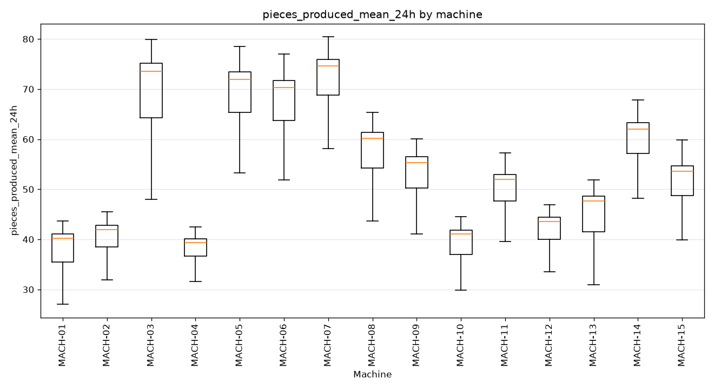

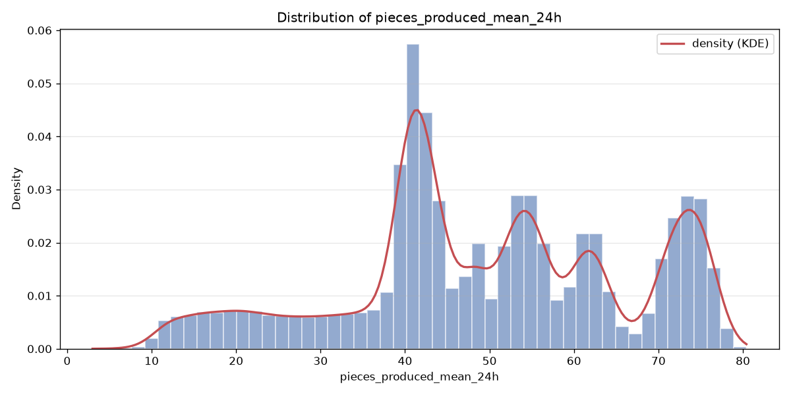

### pieces_produced_max_24h

- **dtype** float64 · **count** 134280 · **unique** 110 · **missing** 0 (0.0%)
- **range** 3.0 → 114.0 (span 111.0) · **Q1/median/Q3** 57.0 / 72.0 / 90.0
- **mean** 73.069 · **std** 19.5 · **skew** -0.046

**Outliers** — flagged values per method:

| method | normal band | below — n (range) | above — n (range) |
|---|---|---|---|
| IQR (k=1.5) | [7.5, 139.5] | 4 [3.0, 6.0] | 0 — |
| z-score (k=3) | [14.568, 131.57] | 34 [3.0, 14.0] | 0 — |

**Outliers by machine** (IQR k=1.5 and z-score k=3, fences recomputed per machine):

| machine | n | IQR below | IQR above | z-score below | z-score above |
|---|---|---|---|---|---|
| MACH-01 | 8952 | 620 | 96 | 442 | 0 |
| MACH-02 | 8952 | 528 | 24 | 442 | 0 |
| MACH-03 | 8952 | 616 | 24 | 428 | 0 |
| MACH-04 | 8952 | 614 | 24 | 437 | 0 |
| MACH-05 | 8952 | 603 | 96 | 442 | 0 |
| MACH-06 | 8952 | 605 | 10 | 431 | 0 |
| MACH-07 | 8952 | 711 | 48 | 432 | 0 |
| MACH-08 | 8952 | 596 | 24 | 437 | 0 |
| MACH-09 | 8952 | 564 | 24 | 441 | 0 |
| MACH-10 | 8952 | 655 | 288 | 422 | 0 |
| MACH-11 | 8952 | 613 | 0 | 451 | 0 |
| MACH-12 | 8952 | 538 | 0 | 442 | 0 |
| MACH-13 | 8952 | 573 | 24 | 425 | 0 |
| MACH-14 | 8952 | 611 | 0 | 428 | 0 |
| MACH-15 | 8952 | 600 | 72 | 444 | 0 |
| **total** | 134280 | 9047 | 754 | 6544 | 0 |

### pieces_produced_std_24h

- **dtype** float64 · **count** 134265 · **unique** 51110 · **missing** 15 (0.01%)
- **range** 0.0 → 43.286 (span 43.286) · **Q1/median/Q3** 13.256 / 17.011 / 21.364
- **mean** 17.541 · **std** 5.529 · **skew** 0.474

**Outliers** — flagged values per method:

| method | normal band | below — n (range) | above — n (range) |
|---|---|---|---|
| IQR (k=1.5) | [1.093, 33.526] | 5 [0.0, 1.0] | 1151 [33.526, 43.286] |
| z-score (k=3) | [0.953, 34.129] | 4 [0.0, 0.707] | 821 [34.13, 43.286] |

**Outliers by machine** (IQR k=1.5 and z-score k=3, fences recomputed per machine):

| machine | n | IQR below | IQR above | z-score below | z-score above |
|---|---|---|---|---|---|
| MACH-01 | 8951 | 464 | 1066 | 115 | 7 |
| MACH-02 | 8951 | 514 | 1133 | 114 | 8 |
| MACH-03 | 8951 | 490 | 1082 | 99 | 15 |
| MACH-04 | 8951 | 491 | 1116 | 144 | 5 |
| MACH-05 | 8951 | 534 | 1142 | 135 | 8 |
| MACH-06 | 8951 | 496 | 1004 | 147 | 4 |
| MACH-07 | 8951 | 517 | 1126 | 139 | 0 |
| MACH-08 | 8951 | 483 | 1064 | 120 | 0 |
| MACH-09 | 8951 | 482 | 1116 | 101 | 6 |
| MACH-10 | 8951 | 500 | 1072 | 145 | 0 |
| MACH-11 | 8951 | 472 | 1009 | 113 | 2 |
| MACH-12 | 8951 | 485 | 1086 | 122 | 3 |
| MACH-13 | 8951 | 489 | 1190 | 89 | 8 |
| MACH-14 | 8951 | 502 | 1146 | 136 | 4 |
| MACH-15 | 8951 | 490 | 1164 | 125 | 7 |
| **total** | 134265 | 7409 | 16516 | 1844 | 77 |

### pieces_produced_mean_48h

- **dtype** float64 · **count** 134280 · **unique** 3359 · **missing** 0 (0.0%)
- **range** 3.0 → 78.604 (span 75.604) · **Q1/median/Q3** 39.792 / 47.125 / 60.438
- **mean** 49.458 · **std** 14.364 · **skew** 0.266

**Outliers** — flagged values per method:

| method | normal band | below — n (range) | above — n (range) |
|---|---|---|---|
| IQR (k=1.5) | [8.823, 91.406] | 19 [3.0, 8.778] | 0 — |
| z-score (k=3) | [6.366, 92.551] | 4 [3.0, 6.0] | 0 — |

**Outliers by machine** (IQR k=1.5 and z-score k=3, fences recomputed per machine):

| machine | n | IQR below | IQR above | z-score below | z-score above |
|---|---|---|---|---|---|
| MACH-01 | 8952 | 30 | 0 | 33 | 0 |
| MACH-02 | 8952 | 30 | 0 | 32 | 0 |
| MACH-03 | 8952 | 32 | 0 | 34 | 0 |
| MACH-04 | 8952 | 26 | 0 | 32 | 0 |
| MACH-05 | 8952 | 31 | 0 | 33 | 0 |
| MACH-06 | 8952 | 29 | 0 | 32 | 0 |
| MACH-07 | 8952 | 30 | 0 | 33 | 0 |
| MACH-08 | 8952 | 29 | 0 | 32 | 0 |
| MACH-09 | 8952 | 31 | 0 | 41 | 0 |
| MACH-10 | 8952 | 30 | 0 | 32 | 0 |
| MACH-11 | 8952 | 26 | 0 | 32 | 0 |
| MACH-12 | 8952 | 31 | 0 | 33 | 0 |
| MACH-13 | 8952 | 30 | 0 | 32 | 0 |
| MACH-14 | 8952 | 31 | 0 | 33 | 0 |
| MACH-15 | 8952 | 29 | 0 | 32 | 0 |
| **total** | 134280 | 445 | 0 | 496 | 0 |

### pieces_produced_max_48h

- **dtype** float64 · **count** 134280 · **unique** 106 · **missing** 0 (0.0%)
- **range** 3.0 → 114.0 (span 111.0) · **Q1/median/Q3** 59.0 / 75.0 / 94.0
- **mean** 76.807 · **std** 17.957 · **skew** 0.231

**Outliers** — flagged values per method:

| method | normal band | below — n (range) | above — n (range) |
|---|---|---|---|
| IQR (k=1.5) | [6.5, 146.5] | 4 [3.0, 6.0] | 0 — |
| z-score (k=3) | [22.938, 130.677] | 171 [3.0, 22.0] | 0 — |

**Outliers by machine** (IQR k=1.5 and z-score k=3, fences recomputed per machine):

| machine | n | IQR below | IQR above | z-score below | z-score above |
|---|---|---|---|---|---|
| MACH-01 | 8952 | 68 | 0 | 30 | 0 |
| MACH-02 | 8952 | 59 | 48 | 30 | 0 |
| MACH-03 | 8952 | 49 | 48 | 31 | 0 |
| MACH-04 | 8952 | 103 | 48 | 29 | 0 |
| MACH-05 | 8952 | 47 | 0 | 47 | 0 |
| MACH-06 | 8952 | 87 | 58 | 32 | 0 |
| MACH-07 | 8952 | 31 | 48 | 30 | 0 |
| MACH-08 | 8952 | 91 | 48 | 29 | 0 |
| MACH-09 | 8952 | 79 | 48 | 37 | 0 |
| MACH-10 | 8952 | 51 | 48 | 42 | 0 |
| MACH-11 | 8952 | 116 | 192 | 30 | 0 |
| MACH-12 | 8952 | 76 | 48 | 31 | 0 |
| MACH-13 | 8952 | 121 | 48 | 30 | 0 |
| MACH-14 | 8952 | 68 | 0 | 29 | 0 |
| MACH-15 | 8952 | 85 | 192 | 29 | 0 |
| **total** | 134280 | 1131 | 874 | 486 | 0 |

### pieces_produced_std_48h

- **dtype** float64 · **count** 134265 · **unique** 80521 · **missing** 15 (0.01%)
- **range** 0.0 → 38.516 (span 38.516) · **Q1/median/Q3** 14.972 / 18.432 / 22.712
- **mean** 19.367 · **std** 5.683 · **skew** 0.628

**Outliers** — flagged values per method:

| method | normal band | below — n (range) | above — n (range) |
|---|---|---|---|
| IQR (k=1.5) | [3.361, 34.323] | 20 [0.0, 3.338] | 294 [34.328, 38.516] |
| z-score (k=3) | [2.319, 36.415] | 12 [0.0, 2.121] | 23 [36.552, 38.516] |

**Outliers by machine** (IQR k=1.5 and z-score k=3, fences recomputed per machine):

| machine | n | IQR below | IQR above | z-score below | z-score above |
|---|---|---|---|---|---|
| MACH-01 | 8951 | 18 | 0 | 28 | 0 |
| MACH-02 | 8951 | 9 | 0 | 28 | 0 |
| MACH-03 | 8951 | 24 | 0 | 28 | 0 |
| MACH-04 | 8951 | 21 | 0 | 28 | 0 |
| MACH-05 | 8951 | 20 | 0 | 28 | 0 |
| MACH-06 | 8951 | 21 | 0 | 28 | 0 |
| MACH-07 | 8951 | 25 | 0 | 28 | 0 |
| MACH-08 | 8951 | 8 | 0 | 24 | 0 |
| MACH-09 | 8951 | 0 | 0 | 17 | 0 |
| MACH-10 | 8951 | 23 | 0 | 28 | 0 |
| MACH-11 | 8951 | 22 | 0 | 27 | 0 |
| MACH-12 | 8951 | 23 | 0 | 28 | 0 |
| MACH-13 | 8951 | 22 | 0 | 25 | 0 |
| MACH-14 | 8951 | 25 | 0 | 28 | 0 |
| MACH-15 | 8951 | 5 | 0 | 23 | 0 |
| **total** | 134265 | 266 | 0 | 396 | 0 |

### temperature_c_trend_2h

- **dtype** float64 · **count** 134265 · **unique** 6153 · **missing** 15 (0.01%)
- **range** -37.326 → 10.03 (span 47.356) · **Q1/median/Q3** -1.23 / 0.0 / 1.25
- **mean** 0.0 · **std** 1.927 · **skew** -0.531

**Outliers** — flagged values per method:

| method | normal band | below — n (range) | above — n (range) |
|---|---|---|---|
| IQR (k=1.5) | [-4.95, 4.97] | 963 [-37.326, -4.95] | 806 [4.973, 10.03] |
| z-score (k=3) | [-5.78, 5.781] | 403 [-37.326, -5.79] | 272 [5.79, 10.03] |

**Outliers by machine** (IQR k=1.5 and z-score k=3, fences recomputed per machine):

| machine | n | IQR below | IQR above | z-score below | z-score above |
|---|---|---|---|---|---|
| MACH-01 | 8951 | 24 | 29 | 16 | 15 |
| MACH-02 | 8951 | 8 | 24 | 4 | 9 |
| MACH-03 | 8951 | 37 | 18 | 23 | 6 |
| MACH-04 | 8951 | 36 | 18 | 13 | 5 |
| MACH-05 | 8951 | 53 | 13 | 29 | 3 |
| MACH-06 | 8951 | 83 | 16 | 38 | 5 |
| MACH-07 | 8951 | 99 | 16 | 32 | 6 |
| MACH-08 | 8951 | 109 | 20 | 40 | 4 |
| MACH-09 | 8951 | 151 | 68 | 51 | 8 |
| MACH-10 | 8951 | 111 | 86 | 31 | 17 |
| MACH-11 | 8951 | 80 | 112 | 23 | 26 |
| MACH-12 | 8951 | 51 | 129 | 19 | 41 |
| MACH-13 | 8951 | 28 | 95 | 17 | 31 |
| MACH-14 | 8951 | 25 | 83 | 14 | 31 |
| MACH-15 | 8951 | 18 | 50 | 7 | 15 |
| **total** | 134265 | 913 | 777 | 357 | 222 |

### temperature_c_trend_3h

- **dtype** float64 · **count** 134265 · **unique** 7151 · **missing** 15 (0.01%)
- **range** -19.053 → 7.046 (span 26.099) · **Q1/median/Q3** -0.985 / 0.0 / 1.0
- **mean** 0.0 · **std** 1.381 · **skew** -0.327

**Outliers** — flagged values per method:

| method | normal band | below — n (range) | above — n (range) |
|---|---|---|---|
| IQR (k=1.5) | [-3.962, 3.978] | 267 [-19.053, -3.97] | 134 [3.98, 7.046] |
| z-score (k=3) | [-4.143, 4.144] | 214 [-19.053, -4.145] | 96 [4.145, 7.046] |

**Outliers by machine** (IQR k=1.5 and z-score k=3, fences recomputed per machine):

| machine | n | IQR below | IQR above | z-score below | z-score above |
|---|---|---|---|---|---|
| MACH-01 | 8951 | 15 | 3 | 15 | 2 |
| MACH-02 | 8951 | 3 | 1 | 3 | 1 |
| MACH-03 | 8951 | 22 | 2 | 16 | 2 |
| MACH-04 | 8951 | 8 | 8 | 8 | 5 |
| MACH-05 | 8951 | 23 | 0 | 23 | 0 |
| MACH-06 | 8951 | 7 | 0 | 6 | 0 |
| MACH-07 | 8951 | 13 | 0 | 11 | 0 |
| MACH-08 | 8951 | 35 | 0 | 19 | 0 |
| MACH-09 | 8951 | 30 | 0 | 12 | 0 |
| MACH-10 | 8951 | 14 | 4 | 10 | 2 |
| MACH-11 | 8951 | 11 | 13 | 10 | 3 |
| MACH-12 | 8951 | 10 | 23 | 10 | 8 |
| MACH-13 | 8951 | 15 | 17 | 15 | 8 |
| MACH-14 | 8951 | 10 | 14 | 10 | 7 |
| MACH-15 | 8951 | 9 | 1 | 9 | 1 |
| **total** | 134265 | 225 | 86 | 177 | 39 |

### temperature_c_trend_4h

- **dtype** float64 · **count** 134265 · **unique** 14096 · **missing** 15 (0.01%)
- **range** -15.164 → 5.07 (span 20.234) · **Q1/median/Q3** -0.936 / 0.003 / 0.95
- **mean** 0.0 · **std** 1.214 · **skew** -0.215

**Outliers** — flagged values per method:

| method | normal band | below — n (range) | above — n (range) |
|---|---|---|---|
| IQR (k=1.5) | [-3.765, 3.779] | 146 [-15.164, -3.785] | 19 [3.8, 5.07] |
| z-score (k=3) | [-3.641, 3.642] | 154 [-15.164, -3.648] | 30 [3.643, 5.07] |

**Outliers by machine** (IQR k=1.5 and z-score k=3, fences recomputed per machine):

| machine | n | IQR below | IQR above | z-score below | z-score above |
|---|---|---|---|---|---|
| MACH-01 | 8951 | 8 | 1 | 13 | 1 |
| MACH-02 | 8951 | 3 | 1 | 3 | 1 |
| MACH-03 | 8951 | 17 | 0 | 16 | 0 |
| MACH-04 | 8951 | 11 | 5 | 11 | 5 |
| MACH-05 | 8951 | 22 | 0 | 23 | 0 |
| MACH-06 | 8951 | 1 | 0 | 1 | 0 |
| MACH-07 | 8951 | 3 | 0 | 3 | 0 |
| MACH-08 | 8951 | 13 | 0 | 13 | 0 |
| MACH-09 | 8951 | 15 | 0 | 15 | 0 |
| MACH-10 | 8951 | 8 | 3 | 9 | 4 |
| MACH-11 | 8951 | 9 | 0 | 9 | 1 |
| MACH-12 | 8951 | 9 | 0 | 9 | 0 |
| MACH-13 | 8951 | 14 | 2 | 15 | 2 |
| MACH-14 | 8951 | 7 | 0 | 7 | 2 |
| MACH-15 | 8951 | 10 | 0 | 10 | 0 |
| **total** | 134265 | 150 | 12 | 157 | 16 |

### temperature_c_trend_5h

- **dtype** float64 · **count** 134265 · **unique** 13715 · **missing** 15 (0.01%)
- **range** -11.594 → 4.803 (span 16.397) · **Q1/median/Q3** -0.917 / 0.004 / 0.928
- **mean** 0.0 · **std** 1.132 · **skew** -0.149

**Outliers** — flagged values per method:

| method | normal band | below — n (range) | above — n (range) |
|---|---|---|---|
| IQR (k=1.5) | [-3.684, 3.696] | 130 [-11.594, -3.691] | 9 [3.732, 4.803] |
| z-score (k=3) | [-3.395, 3.396] | 146 [-11.594, -3.425] | 18 [3.419, 4.803] |

**Outliers by machine** (IQR k=1.5 and z-score k=3, fences recomputed per machine):

| machine | n | IQR below | IQR above | z-score below | z-score above |
|---|---|---|---|---|---|
| MACH-01 | 8951 | 4 | 0 | 6 | 1 |
| MACH-02 | 8951 | 3 | 1 | 3 | 1 |
| MACH-03 | 8951 | 18 | 1 | 16 | 0 |
| MACH-04 | 8951 | 12 | 4 | 13 | 5 |
| MACH-05 | 8951 | 17 | 0 | 21 | 0 |
| MACH-06 | 8951 | 0 | 0 | 0 | 0 |
| MACH-07 | 8951 | 2 | 0 | 3 | 0 |
| MACH-08 | 8951 | 11 | 0 | 15 | 0 |
| MACH-09 | 8951 | 13 | 0 | 15 | 0 |
| MACH-10 | 8951 | 8 | 1 | 10 | 3 |
| MACH-11 | 8951 | 9 | 0 | 11 | 0 |
| MACH-12 | 8951 | 8 | 0 | 9 | 0 |
| MACH-13 | 8951 | 11 | 0 | 11 | 0 |
| MACH-14 | 8951 | 8 | 0 | 9 | 0 |
| MACH-15 | 8951 | 9 | 0 | 10 | 0 |
| **total** | 134265 | 133 | 7 | 152 | 10 |

### temperature_c_trend_6h

- **dtype** float64 · **count** 134265 · **unique** 23515 · **missing** 15 (0.01%)
- **range** -9.615 → 4.301 (span 13.915) · **Q1/median/Q3** -0.897 / 0.004 / 0.908
- **mean** 0.0 · **std** 1.078 · **skew** -0.107

**Outliers** — flagged values per method:

| method | normal band | below — n (range) | above — n (range) |
|---|---|---|---|
| IQR (k=1.5) | [-3.605, 3.615] | 107 [-9.615, -3.644] | 7 [3.725, 4.301] |
| z-score (k=3) | [-3.233, 3.233] | 137 [-9.615, -3.241] | 16 [3.243, 4.301] |

**Outliers by machine** (IQR k=1.5 and z-score k=3, fences recomputed per machine):

| machine | n | IQR below | IQR above | z-score below | z-score above |
|---|---|---|---|---|---|
| MACH-01 | 8951 | 4 | 1 | 5 | 2 |
| MACH-02 | 8951 | 3 | 1 | 3 | 1 |
| MACH-03 | 8951 | 13 | 0 | 13 | 0 |
| MACH-04 | 8951 | 12 | 5 | 14 | 5 |
| MACH-05 | 8951 | 14 | 0 | 17 | 0 |
| MACH-06 | 8951 | 0 | 0 | 0 | 0 |
| MACH-07 | 8951 | 3 | 0 | 4 | 0 |
| MACH-08 | 8951 | 11 | 0 | 11 | 0 |
| MACH-09 | 8951 | 15 | 0 | 17 | 0 |
| MACH-10 | 8951 | 6 | 0 | 8 | 2 |
| MACH-11 | 8951 | 8 | 0 | 9 | 0 |
| MACH-12 | 8951 | 5 | 0 | 7 | 0 |
| MACH-13 | 8951 | 4 | 0 | 10 | 0 |
| MACH-14 | 8951 | 5 | 0 | 6 | 0 |
| MACH-15 | 8951 | 7 | 0 | 10 | 0 |
| **total** | 134265 | 110 | 7 | 134 | 10 |

### pressure_bar_trend_2h

- **dtype** float64 · **count** 134265 · **unique** 9741 · **missing** 15 (0.01%)
- **range** -15.683 → 42.86 (span 58.543) · **Q1/median/Q3** -0.946 / -0.009 / 0.922
- **mean** 0.0 · **std** 1.544 · **skew** 2.312

**Outliers** — flagged values per method:

| method | normal band | below — n (range) | above — n (range) |
|---|---|---|---|
| IQR (k=1.5) | [-3.748, 3.724] | 709 [-15.683, -3.749] | 806 [3.724, 42.86] |
| z-score (k=3) | [-4.632, 4.632] | 207 [-15.683, -4.635] | 294 [4.633, 42.86] |

**Outliers by machine** (IQR k=1.5 and z-score k=3, fences recomputed per machine):

| machine | n | IQR below | IQR above | z-score below | z-score above |
|---|---|---|---|---|---|
| MACH-01 | 8951 | 53 | 63 | 12 | 24 |
| MACH-02 | 8951 | 53 | 52 | 24 | 27 |
| MACH-03 | 8951 | 48 | 66 | 8 | 31 |
| MACH-04 | 8951 | 44 | 40 | 18 | 16 |
| MACH-05 | 8951 | 45 | 44 | 11 | 17 |
| MACH-06 | 8951 | 39 | 45 | 13 | 17 |
| MACH-07 | 8951 | 62 | 35 | 12 | 8 |
| MACH-08 | 8951 | 62 | 57 | 26 | 29 |
| MACH-09 | 8951 | 43 | 53 | 11 | 13 |
| MACH-10 | 8951 | 40 | 54 | 11 | 14 |
| MACH-11 | 8951 | 56 | 56 | 24 | 25 |
| MACH-12 | 8951 | 34 | 53 | 6 | 16 |
| MACH-13 | 8951 | 37 | 72 | 14 | 28 |
| MACH-14 | 8951 | 38 | 60 | 11 | 17 |
| MACH-15 | 8951 | 47 | 59 | 17 | 29 |
| **total** | 134265 | 701 | 809 | 218 | 311 |

### pressure_bar_trend_3h

- **dtype** float64 · **count** 134265 · **unique** 10921 · **missing** 15 (0.01%)
- **range** -9.925 → 21.43 (span 31.355) · **Q1/median/Q3** -0.535 / -0.009 / 0.519
- **mean** 0.0 · **std** 0.892 · **skew** 2.747

**Outliers** — flagged values per method:

| method | normal band | below — n (range) | above — n (range) |
|---|---|---|---|
| IQR (k=1.5) | [-2.117, 2.101] | 758 [-9.925, -2.118] | 784 [2.103, 21.43] |
| z-score (k=3) | [-2.676, 2.676] | 247 [-9.925, -2.676] | 367 [2.682, 21.43] |

**Outliers by machine** (IQR k=1.5 and z-score k=3, fences recomputed per machine):

| machine | n | IQR below | IQR above | z-score below | z-score above |
|---|---|---|---|---|---|
| MACH-01 | 8951 | 61 | 51 | 25 | 31 |
| MACH-02 | 8951 | 58 | 53 | 25 | 27 |
| MACH-03 | 8951 | 79 | 80 | 14 | 51 |
| MACH-04 | 8951 | 42 | 40 | 24 | 20 |
| MACH-05 | 8951 | 66 | 49 | 12 | 24 |
| MACH-06 | 8951 | 49 | 34 | 13 | 18 |
| MACH-07 | 8951 | 48 | 38 | 12 | 14 |
| MACH-08 | 8951 | 72 | 55 | 32 | 36 |
| MACH-09 | 8951 | 62 | 33 | 14 | 10 |
| MACH-10 | 8951 | 49 | 38 | 10 | 17 |
| MACH-11 | 8951 | 41 | 53 | 19 | 20 |
| MACH-12 | 8951 | 31 | 59 | 10 | 22 |
| MACH-13 | 8951 | 40 | 90 | 9 | 41 |
| MACH-14 | 8951 | 20 | 42 | 5 | 16 |
| MACH-15 | 8951 | 40 | 64 | 18 | 33 |
| **total** | 134265 | 758 | 779 | 242 | 380 |

### pressure_bar_trend_4h

- **dtype** float64 · **count** 134265 · **unique** 27174 · **missing** 15 (0.01%)
- **range** -6.068 → 16.773 (span 22.841) · **Q1/median/Q3** -0.401 / -0.007 / 0.388
- **mean** 0.0 · **std** 0.668 · **skew** 2.85

**Outliers** — flagged values per method:

| method | normal band | below — n (range) | above — n (range) |
|---|---|---|---|
| IQR (k=1.5) | [-1.583, 1.571] | 789 [-6.068, -1.583] | 738 [1.571, 16.773] |
| z-score (k=3) | [-2.004, 2.004] | 307 [-6.068, -2.004] | 419 [2.006, 16.773] |

**Outliers by machine** (IQR k=1.5 and z-score k=3, fences recomputed per machine):

| machine | n | IQR below | IQR above | z-score below | z-score above |
|---|---|---|---|---|---|
| MACH-01 | 8951 | 58 | 54 | 28 | 35 |
| MACH-02 | 8951 | 76 | 50 | 32 | 27 |
| MACH-03 | 8951 | 119 | 93 | 26 | 66 |
| MACH-04 | 8951 | 30 | 36 | 16 | 16 |
| MACH-05 | 8951 | 65 | 44 | 19 | 32 |
| MACH-06 | 8951 | 55 | 34 | 22 | 19 |
| MACH-07 | 8951 | 41 | 19 | 14 | 14 |
| MACH-08 | 8951 | 71 | 52 | 30 | 39 |
| MACH-09 | 8951 | 50 | 21 | 21 | 15 |
| MACH-10 | 8951 | 39 | 30 | 12 | 19 |
| MACH-11 | 8951 | 40 | 37 | 14 | 22 |
| MACH-12 | 8951 | 29 | 53 | 20 | 22 |
| MACH-13 | 8951 | 37 | 79 | 19 | 47 |
| MACH-14 | 8951 | 15 | 42 | 5 | 14 |
| MACH-15 | 8951 | 45 | 57 | 23 | 34 |
| **total** | 134265 | 770 | 701 | 301 | 421 |

### pressure_bar_trend_5h

- **dtype** float64 · **count** 134265 · **unique** 23346 · **missing** 15 (0.01%)
- **range** -4.291 → 12.822 (span 17.113) · **Q1/median/Q3** -0.343 / -0.007 / 0.335
- **mean** 0.0 · **std** 0.56 · **skew** 2.673

**Outliers** — flagged values per method:

| method | normal band | below — n (range) | above — n (range) |
|---|---|---|---|
| IQR (k=1.5) | [-1.36, 1.353] | 692 [-4.291, -1.361] | 631 [1.356, 12.822] |
| z-score (k=3) | [-1.679, 1.679] | 359 [-4.291, -1.68] | 450 [1.683, 12.822] |

**Outliers by machine** (IQR k=1.5 and z-score k=3, fences recomputed per machine):

| machine | n | IQR below | IQR above | z-score below | z-score above |
|---|---|---|---|---|---|
| MACH-01 | 8951 | 60 | 51 | 36 | 39 |
| MACH-02 | 8951 | 59 | 48 | 32 | 30 |
| MACH-03 | 8951 | 136 | 108 | 44 | 78 |
| MACH-04 | 8951 | 23 | 31 | 11 | 20 |
| MACH-05 | 8951 | 69 | 42 | 30 | 32 |
| MACH-06 | 8951 | 50 | 27 | 24 | 21 |
| MACH-07 | 8951 | 36 | 13 | 14 | 13 |
| MACH-08 | 8951 | 46 | 45 | 26 | 41 |
| MACH-09 | 8951 | 38 | 18 | 24 | 14 |
| MACH-10 | 8951 | 29 | 27 | 14 | 23 |
| MACH-11 | 8951 | 14 | 22 | 12 | 19 |
| MACH-12 | 8951 | 28 | 41 | 21 | 25 |
| MACH-13 | 8951 | 43 | 71 | 24 | 49 |
| MACH-14 | 8951 | 13 | 16 | 6 | 10 |
| MACH-15 | 8951 | 35 | 40 | 24 | 32 |
| **total** | 134265 | 679 | 600 | 342 | 446 |

### pressure_bar_trend_6h

- **dtype** float64 · **count** 134265 · **unique** 21080 · **missing** 15 (0.01%)
- **range** -4.029 → 10.926 (span 14.955) · **Q1/median/Q3** -0.315 / -0.006 / 0.31
- **mean** 0.0 · **std** 0.497 · **skew** 2.357

**Outliers** — flagged values per method:

| method | normal band | below — n (range) | above — n (range) |
|---|---|---|---|
| IQR (k=1.5) | [-1.252, 1.248] | 620 [-4.029, -1.253] | 560 [1.251, 10.926] |
| z-score (k=3) | [-1.491, 1.491] | 386 [-4.029, -1.492] | 456 [1.491, 10.926] |

**Outliers by machine** (IQR k=1.5 and z-score k=3, fences recomputed per machine):

| machine | n | IQR below | IQR above | z-score below | z-score above |
|---|---|---|---|---|---|
| MACH-01 | 8951 | 63 | 47 | 43 | 42 |
| MACH-02 | 8951 | 60 | 42 | 35 | 31 |
| MACH-03 | 8951 | 148 | 118 | 53 | 76 |
| MACH-04 | 8951 | 16 | 24 | 13 | 18 |
| MACH-05 | 8951 | 70 | 43 | 35 | 35 |
| MACH-06 | 8951 | 42 | 23 | 23 | 19 |
| MACH-07 | 8951 | 26 | 18 | 17 | 14 |
| MACH-08 | 8951 | 29 | 39 | 20 | 38 |
| MACH-09 | 8951 | 25 | 17 | 25 | 16 |
| MACH-10 | 8951 | 25 | 26 | 16 | 25 |
| MACH-11 | 8951 | 13 | 15 | 13 | 15 |
| MACH-12 | 8951 | 28 | 32 | 23 | 30 |
| MACH-13 | 8951 | 41 | 53 | 25 | 50 |
| MACH-14 | 8951 | 14 | 10 | 11 | 9 |
| MACH-15 | 8951 | 36 | 37 | 32 | 33 |
| **total** | 134265 | 636 | 544 | 384 | 451 |

### voltage_mean_v_trend_2h

- **dtype** float64 · **count** 134265 · **unique** 4071 · **missing** 15 (0.01%)
- **range** -16.0 → 4.03 (span 20.03) · **Q1/median/Q3** -0.58 / 0.01 / 0.59
- **mean** 0.0 · **std** 0.905 · **skew** -0.562

**Outliers** — flagged values per method:

| method | normal band | below — n (range) | above — n (range) |
|---|---|---|---|
| IQR (k=1.5) | [-2.335, 2.345] | 777 [-16.0, -2.34] | 575 [2.348, 4.03] |
| z-score (k=3) | [-2.714, 2.714] | 365 [-16.0, -2.72] | 176 [2.719, 4.03] |

**Outliers by machine** (IQR k=1.5 and z-score k=3, fences recomputed per machine):

| machine | n | IQR below | IQR above | z-score below | z-score above |
|---|---|---|---|---|---|
| MACH-01 | 8951 | 47 | 35 | 27 | 15 |
| MACH-02 | 8951 | 43 | 23 | 18 | 7 |
| MACH-03 | 8951 | 53 | 25 | 28 | 3 |
| MACH-04 | 8951 | 46 | 32 | 21 | 11 |
| MACH-05 | 8951 | 69 | 46 | 32 | 7 |
| MACH-06 | 8951 | 48 | 21 | 18 | 8 |
| MACH-07 | 8951 | 48 | 37 | 22 | 16 |
| MACH-08 | 8951 | 74 | 35 | 35 | 6 |
| MACH-09 | 8951 | 60 | 47 | 32 | 12 |
| MACH-10 | 8951 | 53 | 42 | 23 | 15 |
| MACH-11 | 8951 | 44 | 33 | 27 | 14 |
| MACH-12 | 8951 | 49 | 55 | 25 | 14 |
| MACH-13 | 8951 | 54 | 48 | 34 | 6 |
| MACH-14 | 8951 | 35 | 35 | 22 | 14 |
| MACH-15 | 8951 | 50 | 42 | 20 | 14 |
| **total** | 134265 | 773 | 556 | 384 | 162 |

### voltage_mean_v_trend_3h

- **dtype** float64 · **count** 134265 · **unique** 4588 · **missing** 15 (0.01%)
- **range** -7.86 → 2.728 (span 10.588) · **Q1/median/Q3** -0.335 / 0.005 / 0.34
- **mean** 0.0 · **std** 0.522 · **skew** -0.59

**Outliers** — flagged values per method:

| method | normal band | below — n (range) | above — n (range) |
|---|---|---|---|
| IQR (k=1.5) | [-1.348, 1.353] | 799 [-7.86, -1.348] | 553 [1.353, 2.728] |
| z-score (k=3) | [-1.567, 1.568] | 437 [-7.86, -1.57] | 154 [1.57, 2.728] |

**Outliers by machine** (IQR k=1.5 and z-score k=3, fences recomputed per machine):

| machine | n | IQR below | IQR above | z-score below | z-score above |
|---|---|---|---|---|---|
| MACH-01 | 8951 | 52 | 44 | 40 | 8 |
| MACH-02 | 8951 | 38 | 35 | 20 | 9 |
| MACH-03 | 8951 | 68 | 48 | 46 | 8 |
| MACH-04 | 8951 | 39 | 20 | 23 | 7 |
| MACH-05 | 8951 | 56 | 33 | 34 | 10 |
| MACH-06 | 8951 | 44 | 23 | 19 | 7 |
| MACH-07 | 8951 | 67 | 19 | 29 | 7 |
| MACH-08 | 8951 | 93 | 22 | 43 | 8 |
| MACH-09 | 8951 | 65 | 24 | 29 | 5 |
| MACH-10 | 8951 | 50 | 31 | 25 | 13 |
| MACH-11 | 8951 | 34 | 46 | 18 | 13 |
| MACH-12 | 8951 | 30 | 50 | 16 | 18 |
| MACH-13 | 8951 | 65 | 47 | 48 | 11 |
| MACH-14 | 8951 | 36 | 35 | 23 | 10 |
| MACH-15 | 8951 | 41 | 41 | 26 | 18 |
| **total** | 134265 | 778 | 518 | 439 | 152 |

### voltage_mean_v_trend_4h

- **dtype** float64 · **count** 134265 · **unique** 8407 · **missing** 15 (0.01%)
- **range** -5.771 → 2.267 (span 8.037) · **Q1/median/Q3** -0.254 / 0.004 / 0.262
- **mean** 0.0 · **std** 0.393 · **skew** -0.547

**Outliers** — flagged values per method:

| method | normal band | below — n (range) | above — n (range) |
|---|---|---|---|
| IQR (k=1.5) | [-1.028, 1.036] | 719 [-5.771, -1.029] | 451 [1.036, 2.267] |
| z-score (k=3) | [-1.18, 1.18] | 445 [-5.771, -1.18] | 161 [1.184, 2.267] |

**Outliers by machine** (IQR k=1.5 and z-score k=3, fences recomputed per machine):

| machine | n | IQR below | IQR above | z-score below | z-score above |
|---|---|---|---|---|---|
| MACH-01 | 8951 | 50 | 42 | 41 | 15 |
| MACH-02 | 8951 | 35 | 21 | 25 | 10 |
| MACH-03 | 8951 | 93 | 61 | 58 | 23 |
| MACH-04 | 8951 | 34 | 28 | 22 | 13 |
| MACH-05 | 8951 | 57 | 31 | 37 | 10 |
| MACH-06 | 8951 | 30 | 12 | 20 | 6 |
| MACH-07 | 8951 | 50 | 6 | 22 | 1 |
| MACH-08 | 8951 | 86 | 14 | 41 | 5 |
| MACH-09 | 8951 | 46 | 6 | 20 | 0 |
| MACH-10 | 8951 | 31 | 17 | 19 | 8 |
| MACH-11 | 8951 | 19 | 26 | 14 | 12 |
| MACH-12 | 8951 | 14 | 28 | 12 | 15 |
| MACH-13 | 8951 | 71 | 52 | 58 | 10 |
| MACH-14 | 8951 | 28 | 29 | 24 | 10 |
| MACH-15 | 8951 | 39 | 33 | 27 | 14 |
| **total** | 134265 | 683 | 406 | 440 | 152 |

### voltage_mean_v_trend_5h

- **dtype** float64 · **count** 134265 · **unique** 7930 · **missing** 15 (0.01%)
- **range** -4.396 → 2.189 (span 6.585) · **Q1/median/Q3** -0.223 / 0.003 / 0.228
- **mean** 0.0 · **std** 0.332 · **skew** -0.459

**Outliers** — flagged values per method:

| method | normal band | below — n (range) | above — n (range) |
|---|---|---|---|
| IQR (k=1.5) | [-0.899, 0.904] | 602 [-4.396, -0.9] | 352 [0.905, 2.189] |
| z-score (k=3) | [-0.997, 0.998] | 439 [-4.396, -0.997] | 183 [0.999, 2.189] |

**Outliers by machine** (IQR k=1.5 and z-score k=3, fences recomputed per machine):

| machine | n | IQR below | IQR above | z-score below | z-score above |
|---|---|---|---|---|---|
| MACH-01 | 8951 | 52 | 41 | 39 | 25 |
| MACH-02 | 8951 | 37 | 23 | 26 | 7 |
| MACH-03 | 8951 | 82 | 70 | 58 | 31 |
| MACH-04 | 8951 | 28 | 25 | 21 | 13 |
| MACH-05 | 8951 | 46 | 29 | 37 | 18 |
| MACH-06 | 8951 | 26 | 10 | 15 | 7 |
| MACH-07 | 8951 | 32 | 1 | 18 | 1 |
| MACH-08 | 8951 | 54 | 9 | 36 | 6 |
| MACH-09 | 8951 | 21 | 2 | 19 | 0 |
| MACH-10 | 8951 | 18 | 10 | 16 | 8 |
| MACH-11 | 8951 | 12 | 5 | 11 | 4 |
| MACH-12 | 8951 | 9 | 9 | 9 | 7 |
| MACH-13 | 8951 | 74 | 37 | 64 | 14 |
| MACH-14 | 8951 | 32 | 14 | 25 | 6 |
| MACH-15 | 8951 | 35 | 18 | 29 | 13 |
| **total** | 134265 | 558 | 303 | 423 | 160 |

### voltage_mean_v_trend_6h

- **dtype** float64 · **count** 134265 · **unique** 10654 · **missing** 15 (0.01%)
- **range** -3.579 → 1.952 (span 5.53) · **Q1/median/Q3** -0.206 / 0.002 / 0.211
- **mean** 0.0 · **std** 0.298 · **skew** -0.369

**Outliers** — flagged values per method:

| method | normal band | below — n (range) | above — n (range) |
|---|---|---|---|
| IQR (k=1.5) | [-0.833, 0.838] | 497 [-3.579, -0.833] | 257 [0.838, 1.952] |
| z-score (k=3) | [-0.893, 0.893] | 409 [-3.579, -0.894] | 175 [0.896, 1.952] |

**Outliers by machine** (IQR k=1.5 and z-score k=3, fences recomputed per machine):

| machine | n | IQR below | IQR above | z-score below | z-score above |
|---|---|---|---|---|---|
| MACH-01 | 8951 | 51 | 38 | 44 | 27 |
| MACH-02 | 8951 | 31 | 15 | 25 | 8 |
| MACH-03 | 8951 | 83 | 74 | 61 | 39 |
| MACH-04 | 8951 | 26 | 24 | 23 | 15 |
| MACH-05 | 8951 | 50 | 32 | 44 | 21 |
| MACH-06 | 8951 | 15 | 7 | 12 | 7 |
| MACH-07 | 8951 | 14 | 0 | 8 | 0 |
| MACH-08 | 8951 | 42 | 7 | 35 | 7 |
| MACH-09 | 8951 | 16 | 1 | 16 | 1 |
| MACH-10 | 8951 | 14 | 7 | 14 | 8 |
| MACH-11 | 8951 | 8 | 3 | 8 | 4 |
| MACH-12 | 8951 | 6 | 1 | 8 | 2 |
| MACH-13 | 8951 | 68 | 23 | 61 | 13 |
| MACH-14 | 8951 | 21 | 6 | 20 | 4 |
| MACH-15 | 8951 | 36 | 10 | 34 | 10 |
| **total** | 134265 | 481 | 248 | 413 | 166 |

### rotation_mean_rpm_trend_2h

- **dtype** float64 · **count** 134265 · **unique** 8248 · **missing** 15 (0.01%)
- **range** -800.0 → 800.0 (span 1600.0) · **Q1/median/Q3** -19.6 / 0.0 / 19.5
- **mean** 0.002 · **std** 33.044 · **skew** 0.305

**Outliers** — flagged values per method:

| method | normal band | below — n (range) | above — n (range) |
|---|---|---|---|
| IQR (k=1.5) | [-78.25, 78.15] | 1112 [-800.0, -78.3] | 1158 [78.2, 800.0] |
| z-score (k=3) | [-99.131, 99.135] | 406 [-800.0, -99.2] | 423 [99.166, 800.0] |

**Outliers by machine** (IQR k=1.5 and z-score k=3, fences recomputed per machine):

| machine | n | IQR below | IQR above | z-score below | z-score above |
|---|---|---|---|---|---|
| MACH-01 | 8951 | 87 | 102 | 33 | 43 |
| MACH-02 | 8951 | 42 | 53 | 17 | 18 |
| MACH-03 | 8951 | 106 | 105 | 45 | 46 |
| MACH-04 | 8951 | 67 | 51 | 27 | 20 |
| MACH-05 | 8951 | 82 | 74 | 27 | 33 |
| MACH-06 | 8951 | 54 | 64 | 26 | 25 |
| MACH-07 | 8951 | 85 | 59 | 26 | 16 |
| MACH-08 | 8951 | 86 | 68 | 31 | 31 |
| MACH-09 | 8951 | 79 | 70 | 27 | 30 |
| MACH-10 | 8951 | 77 | 74 | 28 | 23 |
| MACH-11 | 8951 | 66 | 76 | 26 | 32 |
| MACH-12 | 8951 | 56 | 80 | 26 | 26 |
| MACH-13 | 8951 | 124 | 128 | 53 | 48 |
| MACH-14 | 8951 | 46 | 74 | 25 | 35 |
| MACH-15 | 8951 | 56 | 71 | 31 | 34 |
| **total** | 134265 | 1113 | 1149 | 448 | 460 |

### rotation_mean_rpm_trend_3h

- **dtype** float64 · **count** 134265 · **unique** 8838 · **missing** 15 (0.01%)
- **range** -375.408 → 277.826 (span 653.234) · **Q1/median/Q3** -10.8 / 0.0 / 10.8
- **mean** 0.002 · **std** 18.558 · **skew** 0.14

**Outliers** — flagged values per method:

| method | normal band | below — n (range) | above — n (range) |
|---|---|---|---|
| IQR (k=1.5) | [-43.2, 43.2] | 1215 [-375.408, -43.202] | 1209 [43.206, 277.826] |
| z-score (k=3) | [-55.671, 55.675] | 404 [-375.408, -55.704] | 435 [55.694, 277.826] |

**Outliers by machine** (IQR k=1.5 and z-score k=3, fences recomputed per machine):

| machine | n | IQR below | IQR above | z-score below | z-score above |
|---|---|---|---|---|---|
| MACH-01 | 8951 | 82 | 120 | 35 | 41 |
| MACH-02 | 8951 | 36 | 48 | 16 | 18 |
| MACH-03 | 8951 | 97 | 107 | 52 | 48 |
| MACH-04 | 8951 | 59 | 42 | 29 | 20 |
| MACH-05 | 8951 | 89 | 49 | 30 | 26 |
| MACH-06 | 8951 | 74 | 52 | 21 | 24 |
| MACH-07 | 8951 | 86 | 50 | 31 | 17 |
| MACH-08 | 8951 | 126 | 51 | 30 | 26 |
| MACH-09 | 8951 | 118 | 66 | 37 | 27 |
| MACH-10 | 8951 | 97 | 93 | 24 | 25 |
| MACH-11 | 8951 | 78 | 80 | 20 | 21 |
| MACH-12 | 8951 | 53 | 87 | 14 | 31 |
| MACH-13 | 8951 | 119 | 143 | 60 | 46 |
| MACH-14 | 8951 | 34 | 96 | 15 | 36 |
| MACH-15 | 8951 | 56 | 97 | 22 | 31 |
| **total** | 134265 | 1204 | 1181 | 436 | 437 |

### rotation_mean_rpm_trend_4h

- **dtype** float64 · **count** 134265 · **unique** 16768 · **missing** 15 (0.01%)
- **range** -275.901 → 192.881 (span 468.782) · **Q1/median/Q3** -7.87 / 0.04 / 7.88
- **mean** 0.004 · **std** 13.484 · **skew** 0.121

**Outliers** — flagged values per method:

| method | normal band | below — n (range) | above — n (range) |
|---|---|---|---|
| IQR (k=1.5) | [-31.495, 31.505] | 1252 [-275.901, -31.5] | 1138 [31.509, 192.881] |
| z-score (k=3) | [-40.448, 40.456] | 423 [-275.901, -40.49] | 435 [40.459, 192.881] |

**Outliers by machine** (IQR k=1.5 and z-score k=3, fences recomputed per machine):

| machine | n | IQR below | IQR above | z-score below | z-score above |
|---|---|---|---|---|---|
| MACH-01 | 8951 | 77 | 100 | 45 | 45 |
| MACH-02 | 8951 | 34 | 42 | 7 | 17 |
| MACH-03 | 8951 | 102 | 104 | 53 | 55 |
| MACH-04 | 8951 | 50 | 45 | 26 | 19 |
| MACH-05 | 8951 | 100 | 38 | 31 | 24 |
| MACH-06 | 8951 | 94 | 37 | 26 | 16 |
| MACH-07 | 8951 | 93 | 26 | 26 | 15 |
| MACH-08 | 8951 | 125 | 43 | 30 | 23 |
| MACH-09 | 8951 | 124 | 62 | 30 | 25 |
| MACH-10 | 8951 | 94 | 57 | 16 | 19 |
| MACH-11 | 8951 | 67 | 76 | 13 | 18 |
| MACH-12 | 8951 | 37 | 98 | 12 | 33 |
| MACH-13 | 8951 | 135 | 151 | 60 | 53 |
| MACH-14 | 8951 | 16 | 82 | 9 | 18 |
| MACH-15 | 8951 | 35 | 87 | 18 | 30 |
| **total** | 134265 | 1183 | 1048 | 402 | 410 |

### rotation_mean_rpm_trend_5h

- **dtype** float64 · **count** 134265 · **unique** 16067 · **missing** 15 (0.01%)
- **range** -206.072 → 153.845 (span 359.918) · **Q1/median/Q3** -6.5 / 0.1 / 6.56
- **mean** 0.005 · **std** 10.974 · **skew** 0.127

**Outliers** — flagged values per method:

| method | normal band | below — n (range) | above — n (range) |
|---|---|---|---|
| IQR (k=1.5) | [-26.09, 26.15] | 1156 [-206.072, -26.092] | 993 [26.168, 153.845] |
| z-score (k=3) | [-32.918, 32.928] | 425 [-206.072, -32.932] | 395 [32.95, 153.845] |

**Outliers by machine** (IQR k=1.5 and z-score k=3, fences recomputed per machine):

| machine | n | IQR below | IQR above | z-score below | z-score above |
|---|---|---|---|---|---|
| MACH-01 | 8951 | 79 | 101 | 48 | 48 |
| MACH-02 | 8951 | 16 | 43 | 8 | 17 |
| MACH-03 | 8951 | 111 | 110 | 55 | 56 |
| MACH-04 | 8951 | 40 | 30 | 23 | 15 |
| MACH-05 | 8951 | 70 | 30 | 33 | 20 |
| MACH-06 | 8951 | 95 | 21 | 24 | 17 |
| MACH-07 | 8951 | 100 | 25 | 29 | 16 |
| MACH-08 | 8951 | 130 | 29 | 25 | 19 |
| MACH-09 | 8951 | 90 | 37 | 25 | 16 |
| MACH-10 | 8951 | 76 | 38 | 17 | 15 |
| MACH-11 | 8951 | 35 | 45 | 10 | 3 |
| MACH-12 | 8951 | 24 | 74 | 12 | 23 |
| MACH-13 | 8951 | 128 | 130 | 64 | 60 |
| MACH-14 | 8951 | 13 | 62 | 8 | 16 |
| MACH-15 | 8951 | 29 | 65 | 20 | 27 |
| **total** | 134265 | 1036 | 840 | 401 | 368 |

### rotation_mean_rpm_trend_6h

- **dtype** float64 · **count** 134265 · **unique** 28051 · **missing** 15 (0.01%)
- **range** -151.248 → 133.476 (span 284.724) · **Q1/median/Q3** -5.763 / 0.08 / 5.88
- **mean** 0.006 · **std** 9.484 · **skew** 0.1

**Outliers** — flagged values per method:

| method | normal band | below — n (range) | above — n (range) |
|---|---|---|---|
| IQR (k=1.5) | [-23.227, 23.344] | 940 [-151.248, -23.246] | 788 [23.357, 133.476] |
| z-score (k=3) | [-28.447, 28.459] | 418 [-151.248, -28.448] | 359 [28.485, 133.476] |

**Outliers by machine** (IQR k=1.5 and z-score k=3, fences recomputed per machine):

| machine | n | IQR below | IQR above | z-score below | z-score above |
|---|---|---|---|---|---|
| MACH-01 | 8951 | 77 | 101 | 51 | 46 |
| MACH-02 | 8951 | 11 | 27 | 7 | 16 |
| MACH-03 | 8951 | 103 | 100 | 53 | 55 |
| MACH-04 | 8951 | 42 | 28 | 24 | 16 |
| MACH-05 | 8951 | 60 | 29 | 35 | 21 |
| MACH-06 | 8951 | 91 | 19 | 28 | 17 |
| MACH-07 | 8951 | 80 | 20 | 23 | 15 |
| MACH-08 | 8951 | 83 | 23 | 21 | 16 |
| MACH-09 | 8951 | 57 | 15 | 21 | 11 |
| MACH-10 | 8951 | 35 | 18 | 17 | 14 |
| MACH-11 | 8951 | 13 | 10 | 9 | 3 |
| MACH-12 | 8951 | 12 | 39 | 10 | 17 |
| MACH-13 | 8951 | 115 | 104 | 66 | 66 |
| MACH-14 | 8951 | 7 | 28 | 3 | 10 |
| MACH-15 | 8951 | 34 | 38 | 23 | 25 |
| **total** | 134265 | 820 | 599 | 391 | 348 |

### pieces_produced_trend_2h

- **dtype** float64 · **count** 134265 · **unique** 154 · **missing** 15 (0.01%)
- **range** -82.0 → 81.0 (span 163.0) · **Q1/median/Q3** -6.0 / 0.0 / 6.0
- **mean** 0.002 · **std** 12.653 · **skew** -0.006

**Outliers** — flagged values per method:

| method | normal band | below — n (range) | above — n (range) |
|---|---|---|---|
| IQR (k=1.5) | [-24.0, 24.0] | 4389 [-82.0, -25.0] | 4472 [25.0, 81.0] |
| z-score (k=3) | [-37.957, 37.962] | 1712 [-82.0, -38.0] | 1701 [38.0, 81.0] |

**Outliers by machine** (IQR k=1.5 and z-score k=3, fences recomputed per machine):

| machine | n | IQR below | IQR above | z-score below | z-score above |
|---|---|---|---|---|---|
| MACH-01 | 8951 | 322 | 328 | 97 | 117 |
| MACH-02 | 8951 | 267 | 276 | 124 | 121 |
| MACH-03 | 8951 | 295 | 324 | 107 | 122 |
| MACH-04 | 8951 | 318 | 324 | 117 | 121 |
| MACH-05 | 8951 | 298 | 303 | 119 | 107 |
| MACH-06 | 8951 | 289 | 285 | 113 | 122 |
| MACH-07 | 8951 | 303 | 305 | 123 | 122 |
| MACH-08 | 8951 | 285 | 275 | 112 | 101 |
| MACH-09 | 8951 | 304 | 306 | 144 | 118 |
| MACH-10 | 8951 | 328 | 339 | 105 | 129 |
| MACH-11 | 8951 | 296 | 274 | 132 | 116 |
| MACH-12 | 8951 | 286 | 289 | 120 | 133 |
| MACH-13 | 8951 | 310 | 323 | 112 | 109 |
| MACH-14 | 8951 | 298 | 295 | 123 | 128 |
| MACH-15 | 8951 | 304 | 307 | 112 | 117 |
| **total** | 134265 | 4503 | 4553 | 1760 | 1783 |

### pieces_produced_trend_3h

- **dtype** float64 · **count** 134265 · **unique** 161 · **missing** 15 (0.01%)
- **range** -40.5 → 48.0 (span 88.5) · **Q1/median/Q3** -3.0 / 0.0 / 3.0
- **mean** 0.002 · **std** 7.949 · **skew** 0.003

**Outliers** — flagged values per method:

| method | normal band | below — n (range) | above — n (range) |
|---|---|---|---|
| IQR (k=1.5) | [-12.0, 12.0] | 8357 [-40.5, -12.5] | 8444 [12.5, 48.0] |
| z-score (k=3) | [-23.844, 23.849] | 1336 [-40.5, -24.0] | 1320 [24.0, 48.0] |

**Outliers by machine** (IQR k=1.5 and z-score k=3, fences recomputed per machine):

| machine | n | IQR below | IQR above | z-score below | z-score above |
|---|---|---|---|---|---|
| MACH-01 | 8951 | 517 | 528 | 36 | 37 |
| MACH-02 | 8951 | 531 | 539 | 36 | 31 |
| MACH-03 | 8951 | 523 | 536 | 37 | 38 |
| MACH-04 | 8951 | 483 | 507 | 41 | 37 |
| MACH-05 | 8951 | 520 | 523 | 51 | 47 |
| MACH-06 | 8951 | 496 | 499 | 33 | 44 |
| MACH-07 | 8951 | 531 | 543 | 50 | 34 |
| MACH-08 | 8951 | 540 | 546 | 40 | 42 |
| MACH-09 | 8951 | 490 | 506 | 40 | 36 |
| MACH-10 | 8951 | 519 | 523 | 50 | 29 |
| MACH-11 | 8951 | 574 | 557 | 49 | 43 |
| MACH-12 | 8951 | 563 | 567 | 42 | 39 |
| MACH-13 | 8951 | 493 | 504 | 40 | 40 |
| MACH-14 | 8951 | 569 | 538 | 35 | 42 |
| MACH-15 | 8951 | 586 | 610 | 40 | 32 |
| **total** | 134265 | 7935 | 8026 | 620 | 571 |

### pieces_produced_trend_4h

- **dtype** float64 · **count** 134265 · **unique** 541 · **missing** 15 (0.01%)
- **range** -29.8 → 33.3 (span 63.1) · **Q1/median/Q3** -2.3 / 0.0 / 2.4
- **mean** 0.004 · **std** 6.245 · **skew** -0.058

**Outliers** — flagged values per method:

| method | normal band | below — n (range) | above — n (range) |
|---|---|---|---|
| IQR (k=1.5) | [-9.35, 9.45] | 10128 [-29.8, -9.4] | 9753 [9.5, 33.3] |
| z-score (k=3) | [-18.731, 18.738] | 970 [-29.8, -18.8] | 797 [18.8, 33.3] |

**Outliers by machine** (IQR k=1.5 and z-score k=3, fences recomputed per machine):

| machine | n | IQR below | IQR above | z-score below | z-score above |
|---|---|---|---|---|---|
| MACH-01 | 8951 | 758 | 720 | 12 | 19 |
| MACH-02 | 8951 | 720 | 667 | 23 | 5 |
| MACH-03 | 8951 | 715 | 704 | 17 | 14 |
| MACH-04 | 8951 | 711 | 730 | 24 | 10 |
| MACH-05 | 8951 | 736 | 717 | 19 | 8 |
| MACH-06 | 8951 | 711 | 698 | 12 | 16 |
| MACH-07 | 8951 | 722 | 723 | 14 | 12 |
| MACH-08 | 8951 | 707 | 694 | 25 | 16 |
| MACH-09 | 8951 | 718 | 676 | 18 | 14 |
| MACH-10 | 8951 | 692 | 646 | 25 | 7 |
| MACH-11 | 8951 | 659 | 606 | 17 | 16 |
| MACH-12 | 8951 | 689 | 658 | 20 | 14 |
| MACH-13 | 8951 | 666 | 698 | 16 | 17 |
| MACH-14 | 8951 | 725 | 670 | 20 | 11 |
| MACH-15 | 8951 | 725 | 685 | 23 | 16 |
| **total** | 134265 | 10654 | 10292 | 285 | 195 |

### pieces_produced_trend_5h

- **dtype** float64 · **count** 134265 · **unique** 435 · **missing** 15 (0.01%)
- **range** -24.4 → 27.2 (span 51.6) · **Q1/median/Q3** -1.9 / 0.0 / 2.0
- **mean** 0.004 · **std** 5.325 · **skew** -0.111

**Outliers** — flagged values per method:

| method | normal band | below — n (range) | above — n (range) |
|---|---|---|---|
| IQR (k=1.5) | [-7.75, 7.85] | 11438 [-24.4, -7.8] | 10569 [7.9, 27.2] |
| z-score (k=3) | [-15.972, 15.98] | 720 [-24.4, -16.0] | 441 [16.0, 27.2] |

**Outliers by machine** (IQR k=1.5 and z-score k=3, fences recomputed per machine):

| machine | n | IQR below | IQR above | z-score below | z-score above |
|---|---|---|---|---|---|
| MACH-01 | 8951 | 822 | 768 | 7 | 13 |
| MACH-02 | 8951 | 761 | 722 | 13 | 0 |
| MACH-03 | 8951 | 792 | 775 | 11 | 7 |
| MACH-04 | 8951 | 760 | 719 | 10 | 3 |
| MACH-05 | 8951 | 787 | 744 | 6 | 1 |
| MACH-06 | 8951 | 782 | 723 | 5 | 0 |
| MACH-07 | 8951 | 790 | 780 | 9 | 0 |
| MACH-08 | 8951 | 807 | 760 | 12 | 2 |
| MACH-09 | 8951 | 813 | 709 | 11 | 1 |
| MACH-10 | 8951 | 776 | 694 | 13 | 1 |
| MACH-11 | 8951 | 755 | 668 | 12 | 1 |
| MACH-12 | 8951 | 773 | 693 | 10 | 3 |
| MACH-13 | 8951 | 716 | 680 | 4 | 8 |
| MACH-14 | 8951 | 826 | 752 | 11 | 2 |
| MACH-15 | 8951 | 798 | 713 | 5 | 0 |
| **total** | 134265 | 11758 | 10900 | 139 | 42 |

### pieces_produced_trend_6h

- **dtype** float64 · **count** 134265 · **unique** 1218 · **missing** 15 (0.01%)
- **range** -22.0 → 22.143 (span 44.143) · **Q1/median/Q3** -1.714 / 0.057 / 1.943
- **mean** 0.005 · **std** 4.734 · **skew** -0.145

**Outliers** — flagged values per method:

| method | normal band | below — n (range) | above — n (range) |
|---|---|---|---|
| IQR (k=1.5) | [-7.2, 7.429] | 10736 [-22.0, -7.229] | 9040 [7.457, 22.143] |
| z-score (k=3) | [-14.197, 14.207] | 476 [-22.0, -14.2] | 160 [14.229, 22.143] |

**Outliers by machine** (IQR k=1.5 and z-score k=3, fences recomputed per machine):

| machine | n | IQR below | IQR above | z-score below | z-score above |
|---|---|---|---|---|---|
| MACH-01 | 8951 | 839 | 737 | 3 | 9 |
| MACH-02 | 8951 | 813 | 681 | 7 | 0 |
| MACH-03 | 8951 | 753 | 632 | 7 | 6 |
| MACH-04 | 8951 | 831 | 730 | 4 | 3 |
| MACH-05 | 8951 | 826 | 723 | 3 | 0 |
| MACH-06 | 8951 | 810 | 686 | 1 | 0 |
| MACH-07 | 8951 | 838 | 775 | 3 | 0 |
| MACH-08 | 8951 | 824 | 690 | 8 | 1 |
| MACH-09 | 8951 | 853 | 696 | 3 | 2 |
| MACH-10 | 8951 | 774 | 603 | 7 | 0 |
| MACH-11 | 8951 | 740 | 602 | 3 | 0 |
| MACH-12 | 8951 | 809 | 648 | 4 | 0 |
| MACH-13 | 8951 | 758 | 625 | 3 | 6 |
| MACH-14 | 8951 | 828 | 685 | 5 | 0 |
| MACH-15 | 8951 | 804 | 676 | 6 | 0 |
| **total** | 134265 | 12100 | 10189 | 67 | 27 |

### temperature_c_z_24h

- **dtype** float64 · **count** 134265 · **unique** 37739 · **missing** 15 (0.01%)
- **range** -3.422 → 3.026 (span 6.448) · **Q1/median/Q3** -0.869 / -0.005 / 0.87
- **mean** 0.003 · **std** 1.01 · **skew** 0.03

**Outliers** — flagged values per method:

| method | normal band | below — n (range) | above — n (range) |
|---|---|---|---|
| IQR (k=1.5) | [-3.476, 3.477] | 0 — | 0 — |
| z-score (k=3) | [-3.029, 3.034] | 4 [-3.422, -3.054] | 0 — |

**Outliers by machine** (IQR k=1.5 and z-score k=3, fences recomputed per machine):

| machine | n | IQR below | IQR above | z-score below | z-score above |
|---|---|---|---|---|---|
| MACH-01 | 8951 | 1 | 0 | 1 | 0 |
| MACH-02 | 8951 | 1 | 0 | 1 | 0 |
| MACH-03 | 8951 | 0 | 0 | 0 | 0 |
| MACH-04 | 8951 | 0 | 0 | 0 | 0 |
| MACH-05 | 8951 | 0 | 0 | 0 | 0 |
| MACH-06 | 8951 | 0 | 0 | 0 | 0 |
| MACH-07 | 8951 | 0 | 0 | 0 | 0 |
| MACH-08 | 8951 | 0 | 0 | 0 | 0 |
| MACH-09 | 8951 | 0 | 0 | 0 | 0 |
| MACH-10 | 8951 | 0 | 0 | 0 | 0 |
| MACH-11 | 8951 | 0 | 0 | 0 | 0 |
| MACH-12 | 8951 | 0 | 0 | 0 | 0 |
| MACH-13 | 8951 | 0 | 0 | 0 | 0 |
| MACH-14 | 8951 | 0 | 0 | 1 | 0 |
| MACH-15 | 8951 | 0 | 0 | 0 | 0 |
| **total** | 134265 | 2 | 0 | 3 | 0 |

### temperature_c_z_machine

- **dtype** float64 · **count** 134280 · **unique** 24094 · **missing** 0 (0.0%)
- **range** -3.295 → 8.608 (span 11.903) · **Q1/median/Q3** -0.772 / -0.017 / 0.781
- **mean** 0.0 · **std** 1.0 · **skew** 0.155

**Outliers** — flagged values per method:

| method | normal band | below — n (range) | above — n (range) |
|---|---|---|---|
| IQR (k=1.5) | [-3.101, 3.109] | 9 [-3.295, -3.103] | 277 [3.112, 8.608] |
| z-score (k=3) | [-3.0, 3.0] | 19 [-3.295, -3.005] | 301 [3.014, 8.608] |

**Outliers by machine** (IQR k=1.5 and z-score k=3, fences recomputed per machine):

| machine | n | IQR below | IQR above | z-score below | z-score above |
|---|---|---|---|---|---|
| MACH-01 | 8952 | 6 | 23 | 2 | 20 |
| MACH-02 | 8952 | 18 | 2 | 8 | 2 |
| MACH-03 | 8952 | 9 | 23 | 5 | 22 |
| MACH-04 | 8952 | 11 | 25 | 3 | 25 |
| MACH-05 | 8952 | 2 | 41 | 1 | 36 |
| MACH-06 | 8952 | 0 | 0 | 0 | 0 |
| MACH-07 | 8952 | 0 | 6 | 0 | 7 |
| MACH-08 | 8952 | 0 | 23 | 0 | 27 |
| MACH-09 | 8952 | 0 | 27 | 0 | 30 |
| MACH-10 | 8952 | 0 | 11 | 0 | 14 |
| MACH-11 | 8952 | 0 | 23 | 0 | 28 |
| MACH-12 | 8952 | 0 | 17 | 0 | 20 |
| MACH-13 | 8952 | 0 | 11 | 0 | 15 |
| MACH-14 | 8952 | 0 | 28 | 0 | 31 |
| MACH-15 | 8952 | 0 | 25 | 0 | 24 |
| **total** | 134280 | 46 | 285 | 19 | 301 |

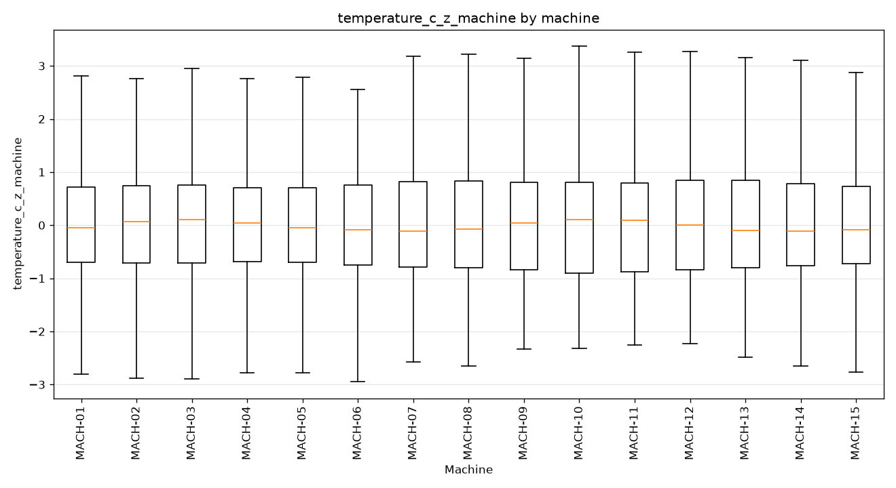

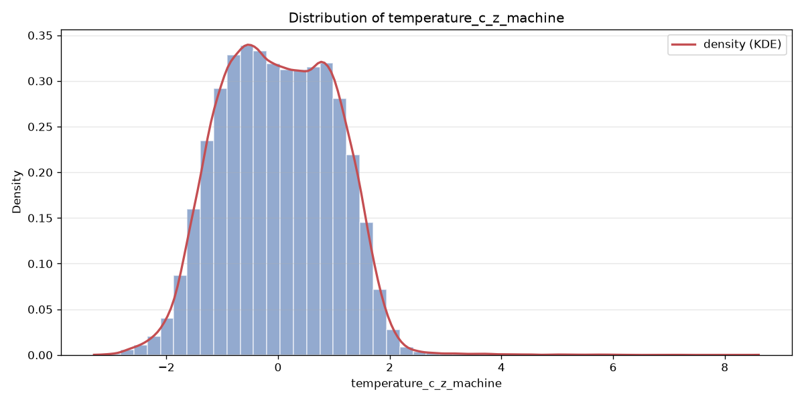

### pressure_bar_z_24h

- **dtype** float64 · **count** 134265 · **unique** 40346 · **missing** 15 (0.01%)
- **range** -3.789 → 4.127 (span 7.916) · **Q1/median/Q3** -0.774 / -0.001 / 0.771
- **mean** -0.006 · **std** 1.021 · **skew** -0.021

**Outliers** — flagged values per method:

| method | normal band | below — n (range) | above — n (range) |
|---|---|---|---|
| IQR (k=1.5) | [-3.092, 3.089] | 49 [-3.789, -3.093] | 22 [3.091, 4.127] |
| z-score (k=3) | [-3.069, 3.057] | 54 [-3.789, -3.069] | 24 [3.07, 4.127] |

**Outliers by machine** (IQR k=1.5 and z-score k=3, fences recomputed per machine):

| machine | n | IQR below | IQR above | z-score below | z-score above |
|---|---|---|---|---|---|
| MACH-01 | 8951 | 14 | 1 | 8 | 1 |
| MACH-02 | 8951 | 7 | 3 | 4 | 2 |
| MACH-03 | 8951 | 7 | 4 | 4 | 2 |
| MACH-04 | 8951 | 6 | 2 | 6 | 0 |
| MACH-05 | 8951 | 8 | 7 | 5 | 4 |
| MACH-06 | 8951 | 1 | 0 | 1 | 0 |
| MACH-07 | 8951 | 0 | 2 | 0 | 5 |
| MACH-08 | 8951 | 0 | 0 | 1 | 1 |
| MACH-09 | 8951 | 2 | 0 | 2 | 0 |
| MACH-10 | 8951 | 0 | 1 | 1 | 1 |
| MACH-11 | 8951 | 0 | 0 | 0 | 1 |
| MACH-12 | 8951 | 0 | 0 | 1 | 0 |
| MACH-13 | 8951 | 0 | 0 | 0 | 1 |
| MACH-14 | 8951 | 3 | 2 | 3 | 2 |
| MACH-15 | 8951 | 14 | 5 | 10 | 4 |
| **total** | 134265 | 62 | 27 | 46 | 24 |

### pressure_bar_z_machine

- **dtype** float64 · **count** 134280 · **unique** 32807 · **missing** 0 (0.0%)
- **range** -17.925 → 6.778 (span 24.703) · **Q1/median/Q3** -0.518 / 0.038 / 0.609
- **mean** 0.0 · **std** 1.0 · **skew** -3.488

**Outliers** — flagged values per method:

| method | normal band | below — n (range) | above — n (range) |
|---|---|---|---|
| IQR (k=1.5) | [-2.208, 2.299] | 1427 [-17.925, -2.21] | 301 [2.303, 6.778] |
| z-score (k=3) | [-3.0, 3.0] | 898 [-17.925, -3.003] | 129 [3.004, 6.778] |

**Outliers by machine** (IQR k=1.5 and z-score k=3, fences recomputed per machine):

| machine | n | IQR below | IQR above | z-score below | z-score above |
|---|---|---|---|---|---|
| MACH-01 | 8952 | 118 | 18 | 74 | 4 |
| MACH-02 | 8952 | 123 | 59 | 45 | 31 |
| MACH-03 | 8952 | 297 | 21 | 135 | 6 |
| MACH-04 | 8952 | 89 | 17 | 33 | 4 |
| MACH-05 | 8952 | 153 | 29 | 89 | 3 |
| MACH-06 | 8952 | 101 | 49 | 65 | 20 |
| MACH-07 | 8952 | 46 | 22 | 35 | 14 |
| MACH-08 | 8952 | 57 | 15 | 51 | 14 |
| MACH-09 | 8952 | 53 | 12 | 42 | 9 |
| MACH-10 | 8952 | 77 | 17 | 63 | 12 |
| MACH-11 | 8952 | 21 | 3 | 22 | 5 |
| MACH-12 | 8952 | 78 | 0 | 63 | 0 |
| MACH-13 | 8952 | 120 | 0 | 96 | 0 |
| MACH-14 | 8952 | 40 | 2 | 30 | 0 |
| MACH-15 | 8952 | 74 | 19 | 55 | 7 |
| **total** | 134280 | 1447 | 283 | 898 | 129 |

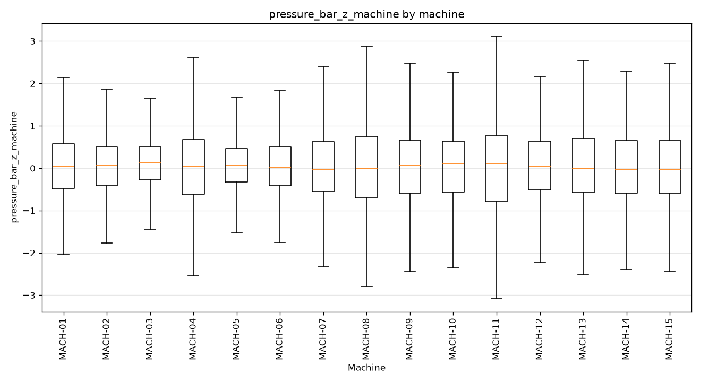

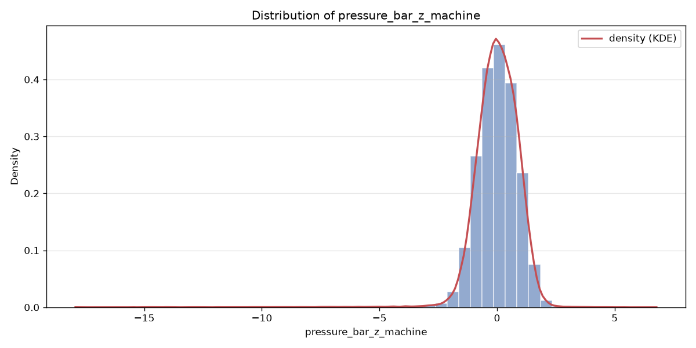

### voltage_mean_v_z_24h

- **dtype** float64 · **count** 134265 · **unique** 40496 · **missing** 15 (0.01%)
- **range** -3.489 → 3.657 (span 7.146) · **Q1/median/Q3** -0.775 / -0.007 / 0.78
- **mean** 0.009 · **std** 1.024 · **skew** 0.07

**Outliers** — flagged values per method:

| method | normal band | below — n (range) | above — n (range) |
|---|---|---|---|
| IQR (k=1.5) | [-3.107, 3.112] | 13 [-3.489, -3.112] | 26 [3.113, 3.657] |
| z-score (k=3) | [-3.065, 3.082] | 17 [-3.489, -3.075] | 35 [3.083, 3.657] |

**Outliers by machine** (IQR k=1.5 and z-score k=3, fences recomputed per machine):

| machine | n | IQR below | IQR above | z-score below | z-score above |
|---|---|---|---|---|---|
| MACH-01 | 8951 | 5 | 19 | 3 | 4 |
| MACH-02 | 8951 | 3 | 4 | 2 | 1 |
| MACH-03 | 8951 | 4 | 4 | 3 | 2 |
| MACH-04 | 8951 | 2 | 4 | 2 | 3 |
| MACH-05 | 8951 | 0 | 12 | 0 | 6 |
| MACH-06 | 8951 | 0 | 2 | 0 | 2 |
| MACH-07 | 8951 | 0 | 1 | 0 | 2 |
| MACH-08 | 8951 | 0 | 0 | 0 | 0 |
| MACH-09 | 8951 | 0 | 0 | 0 | 0 |
| MACH-10 | 8951 | 0 | 0 | 0 | 0 |
| MACH-11 | 8951 | 0 | 0 | 0 | 0 |
| MACH-12 | 8951 | 0 | 1 | 0 | 2 |
| MACH-13 | 8951 | 0 | 3 | 0 | 6 |
| MACH-14 | 8951 | 3 | 0 | 3 | 0 |
| MACH-15 | 8951 | 5 | 4 | 3 | 2 |
| **total** | 134265 | 22 | 54 | 16 | 30 |

### voltage_mean_v_z_machine

- **dtype** float64 · **count** 134280 · **unique** 11586 · **missing** 0 (0.0%)
- **range** -3.577 → 11.877 (span 15.454) · **Q1/median/Q3** -0.688 / -0.024 / 0.681
- **mean** 0.0 · **std** 1.0 · **skew** 0.64

**Outliers** — flagged values per method:

| method | normal band | below — n (range) | above — n (range) |
|---|---|---|---|
| IQR (k=1.5) | [-2.743, 2.735] | 169 [-3.577, -2.743] | 814 [2.738, 11.877] |
| z-score (k=3) | [-3.0, 3.0] | 62 [-3.577, -3.004] | 676 [3.001, 11.877] |

**Outliers by machine** (IQR k=1.5 and z-score k=3, fences recomputed per machine):

| machine | n | IQR below | IQR above | z-score below | z-score above |
|---|---|---|---|---|---|
| MACH-01 | 8952 | 52 | 115 | 1 | 73 |
| MACH-02 | 8952 | 91 | 47 | 19 | 29 |
| MACH-03 | 8952 | 88 | 134 | 8 | 91 |
| MACH-04 | 8952 | 89 | 48 | 24 | 28 |
| MACH-05 | 8952 | 47 | 149 | 4 | 82 |
| MACH-06 | 8952 | 18 | 26 | 3 | 19 |
| MACH-07 | 8952 | 1 | 5 | 1 | 5 |
| MACH-08 | 8952 | 0 | 82 | 0 | 74 |
| MACH-09 | 8952 | 0 | 26 | 0 | 29 |
| MACH-10 | 8952 | 0 | 21 | 0 | 26 |
| MACH-11 | 8952 | 0 | 13 | 0 | 16 |
| MACH-12 | 8952 | 0 | 9 | 0 | 18 |
| MACH-13 | 8952 | 1 | 120 | 0 | 99 |
| MACH-14 | 8952 | 3 | 52 | 1 | 38 |
| MACH-15 | 8952 | 21 | 63 | 1 | 49 |
| **total** | 134280 | 411 | 910 | 62 | 676 |

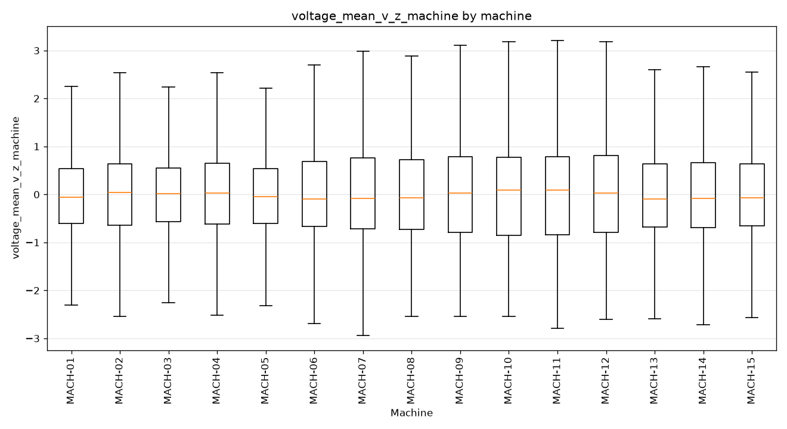

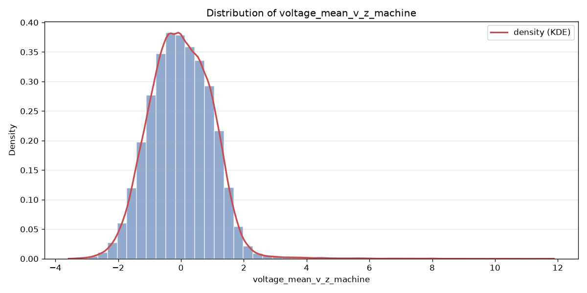

### rotation_mean_rpm_z_24h

- **dtype** float64 · **count** 134265 · **unique** 41829 · **missing** 15 (0.01%)
- **range** -4.46 → 4.357 (span 8.817) · **Q1/median/Q3** -0.774 / 0.033 / 0.778
- **mean** 0.009 · **std** 1.06 · **skew** -0.014

**Outliers** — flagged values per method:

| method | normal band | below — n (range) | above — n (range) |
|---|---|---|---|
| IQR (k=1.5) | [-3.101, 3.105] | 90 [-4.46, -3.102] | 98 [3.106, 4.357] |
| z-score (k=3) | [-3.172, 3.19] | 78 [-4.46, -3.174] | 69 [3.194, 4.357] |

**Outliers by machine** (IQR k=1.5 and z-score k=3, fences recomputed per machine):

| machine | n | IQR below | IQR above | z-score below | z-score above |
|---|---|---|---|---|---|
| MACH-01 | 8951 | 13 | 32 | 5 | 11 |
| MACH-02 | 8951 | 2 | 10 | 2 | 3 |
| MACH-03 | 8951 | 26 | 16 | 14 | 7 |
| MACH-04 | 8951 | 5 | 8 | 2 | 6 |
| MACH-05 | 8951 | 7 | 8 | 7 | 4 |
| MACH-06 | 8951 | 4 | 3 | 4 | 3 |
| MACH-07 | 8951 | 2 | 1 | 2 | 1 |
| MACH-08 | 8951 | 6 | 0 | 6 | 0 |
| MACH-09 | 8951 | 1 | 5 | 1 | 6 |
| MACH-10 | 8951 | 2 | 3 | 3 | 3 |
| MACH-11 | 8951 | 1 | 2 | 1 | 3 |
| MACH-12 | 8951 | 3 | 1 | 3 | 1 |
| MACH-13 | 8951 | 18 | 17 | 14 | 11 |
| MACH-14 | 8951 | 5 | 6 | 4 | 5 |
| MACH-15 | 8951 | 9 | 9 | 6 | 5 |
| **total** | 134265 | 104 | 121 | 74 | 69 |

### rotation_mean_rpm_z_machine

- **dtype** float64 · **count** 134280 · **unique** 22511 · **missing** 0 (0.0%)
- **range** -13.069 → 10.159 (span 23.228) · **Q1/median/Q3** -0.633 / 0.057 / 0.681
- **mean** 0.0 · **std** 1.0 · **skew** -0.512

**Outliers** — flagged values per method:

| method | normal band | below — n (range) | above — n (range) |
|---|---|---|---|
| IQR (k=1.5) | [-2.604, 2.652] | 758 [-13.069, -2.604] | 388 [2.656, 10.159] |
| z-score (k=3) | [-3.0, 3.0] | 427 [-13.069, -3.001] | 297 [3.003, 10.159] |

**Outliers by machine** (IQR k=1.5 and z-score k=3, fences recomputed per machine):

| machine | n | IQR below | IQR above | z-score below | z-score above |
|---|---|---|---|---|---|
| MACH-01 | 8952 | 142 | 81 | 30 | 51 |
| MACH-02 | 8952 | 254 | 25 | 61 | 3 |
| MACH-03 | 8952 | 243 | 91 | 61 | 36 |
| MACH-04 | 8952 | 181 | 63 | 17 | 30 |
| MACH-05 | 8952 | 136 | 58 | 24 | 28 |
| MACH-06 | 8952 | 74 | 21 | 37 | 11 |
| MACH-07 | 8952 | 29 | 30 | 20 | 21 |
| MACH-08 | 8952 | 19 | 5 | 20 | 5 |
| MACH-09 | 8952 | 23 | 5 | 27 | 8 |
| MACH-10 | 8952 | 13 | 7 | 17 | 9 |
| MACH-11 | 8952 | 4 | 8 | 5 | 11 |
| MACH-12 | 8952 | 4 | 9 | 5 | 12 |
| MACH-13 | 8952 | 95 | 62 | 69 | 47 |
| MACH-14 | 8952 | 17 | 15 | 8 | 12 |
| MACH-15 | 8952 | 85 | 21 | 26 | 13 |
| **total** | 134280 | 1319 | 501 | 427 | 297 |

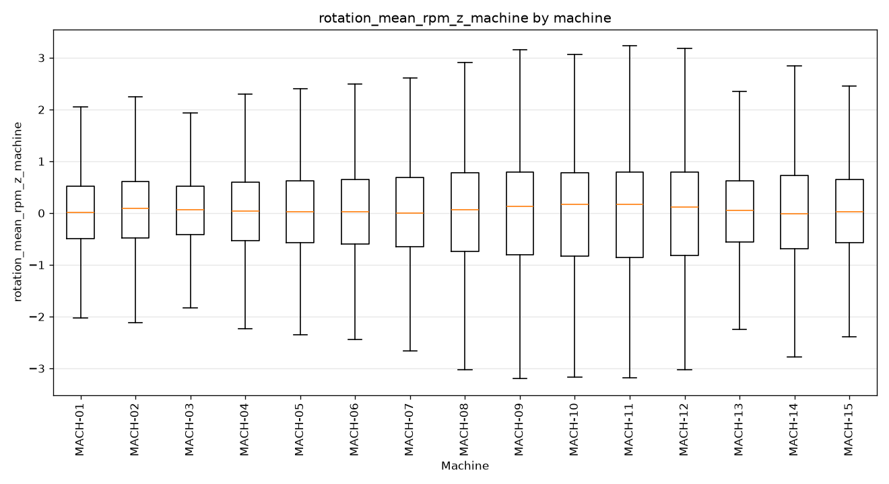

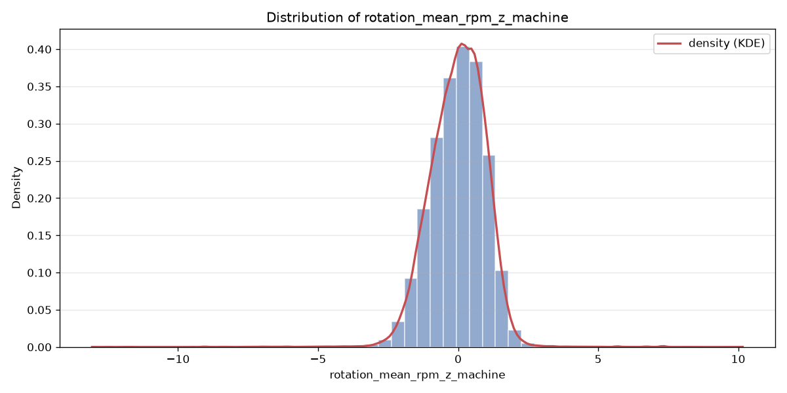

### pieces_produced_z_24h

- **dtype** float64 · **count** 134264 · **unique** 39499 · **missing** 16 (0.01%)
- **range** -3.102 → 4.206 (span 7.308) · **Q1/median/Q3** -1.071 / 0.394 / 0.793
- **mean** 0.049 · **std** 1.146 · **skew** -0.081

**Outliers** — flagged values per method:

| method | normal band | below — n (range) | above — n (range) |
|---|---|---|---|
| IQR (k=1.5) | [-3.867, 3.588] | 0 — | 291 [3.589, 4.206] |
| z-score (k=3) | [-3.388, 3.487] | 0 — | 433 [3.487, 4.206] |

**Outliers by machine** (IQR k=1.5 and z-score k=3, fences recomputed per machine):

| machine | n | IQR below | IQR above | z-score below | z-score above |
|---|---|---|---|---|---|
| MACH-01 | 8950 | 0 | 26 | 0 | 36 |
| MACH-02 | 8951 | 0 | 12 | 0 | 25 |
| MACH-03 | 8951 | 0 | 13 | 0 | 24 |
| MACH-04 | 8951 | 0 | 26 | 0 | 32 |
| MACH-05 | 8951 | 0 | 20 | 0 | 26 |
| MACH-06 | 8951 | 0 | 9 | 0 | 22 |
| MACH-07 | 8951 | 0 | 22 | 0 | 31 |
| MACH-08 | 8951 | 0 | 18 | 0 | 26 |
| MACH-09 | 8951 | 0 | 18 | 0 | 26 |
| MACH-10 | 8951 | 0 | 24 | 0 | 32 |
| MACH-11 | 8951 | 0 | 15 | 0 | 30 |
| MACH-12 | 8951 | 0 | 16 | 0 | 26 |
| MACH-13 | 8951 | 0 | 29 | 0 | 36 |
| MACH-14 | 8951 | 0 | 24 | 0 | 32 |
| MACH-15 | 8951 | 0 | 21 | 0 | 28 |
| **total** | 134264 | 0 | 293 | 0 | 432 |

### pieces_produced_z_machine

- **dtype** float64 · **count** 134280 · **unique** 1272 · **missing** 0 (0.0%)
- **range** -2.346 → 1.812 (span 4.158) · **Q1/median/Q3** -0.903 / 0.508 / 0.822
- **mean** -0.0 · **std** 1.0 · **skew** -0.555

**Outliers** — flagged values per method:

| method | normal band | below — n (range) | above — n (range) |
|---|---|---|---|
| IQR (k=1.5) | [-3.492, 3.411] | 0 — | 0 — |
| z-score (k=3) | [-3.0, 3.0] | 0 — | 0 — |

**Outliers by machine** (IQR k=1.5 and z-score k=3, fences recomputed per machine):

| machine | n | IQR below | IQR above | z-score below | z-score above |
|---|---|---|---|---|---|
| MACH-01 | 8952 | 0 | 0 | 0 | 0 |
| MACH-02 | 8952 | 0 | 0 | 0 | 0 |
| MACH-03 | 8952 | 0 | 0 | 0 | 0 |
| MACH-04 | 8952 | 0 | 0 | 0 | 0 |
| MACH-05 | 8952 | 0 | 0 | 0 | 0 |
| MACH-06 | 8952 | 0 | 0 | 0 | 0 |
| MACH-07 | 8952 | 0 | 0 | 0 | 0 |
| MACH-08 | 8952 | 0 | 0 | 0 | 0 |
| MACH-09 | 8952 | 0 | 0 | 0 | 0 |
| MACH-10 | 8952 | 0 | 0 | 0 | 0 |
| MACH-11 | 8952 | 0 | 0 | 0 | 0 |
| MACH-12 | 8952 | 0 | 0 | 0 | 0 |
| MACH-13 | 8952 | 0 | 0 | 0 | 0 |
| MACH-14 | 8952 | 0 | 0 | 0 | 0 |
| MACH-15 | 8952 | 0 | 0 | 0 | 0 |
| **total** | 134280 | 0 | 0 | 0 | 0 |

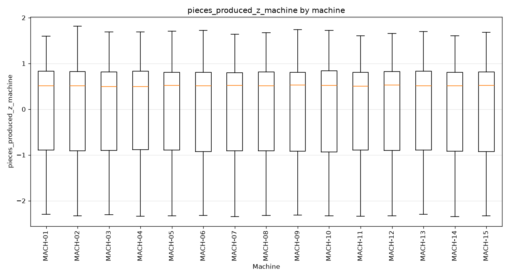

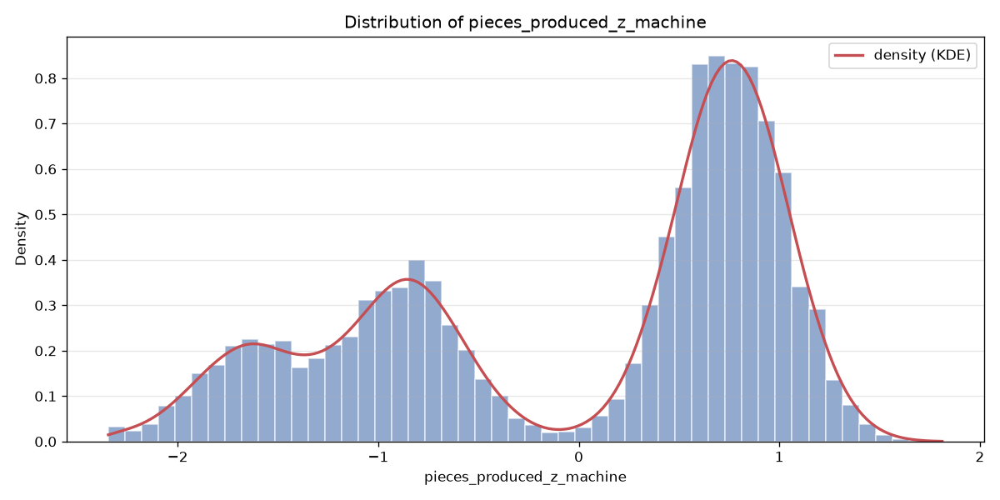

### inc_count_6h

- **dtype** float64 · **count** 134280 · **unique** 5 · **missing** 0 (0.0%)
- **range** 0.0 → 4.0 (span 4.0) · **Q1/median/Q3** 0.0 / 0.0 / 0.0
- **mean** 0.056 · **std** 0.273 · **skew** 5.673

**Outliers** — flagged values per method:

| method | normal band | below — n (range) | above — n (range) |
|---|---|---|---|
| IQR (k=1.5) | [0.0, 0.0] | 0 — | 6099 [1.0, 4.0] |
| z-score (k=3) | [-0.765, 0.876] | 0 — | 6099 [1.0, 4.0] |

**Outliers by machine** (IQR k=1.5 and z-score k=3, fences recomputed per machine):

| machine | n | IQR below | IQR above | z-score below | z-score above |
|---|---|---|---|---|---|
| MACH-01 | 8952 | 0 | 589 | 0 | 186 |
| MACH-02 | 8952 | 0 | 179 | 0 | 179 |
| MACH-03 | 8952 | 0 | 756 | 0 | 402 |
| MACH-04 | 8952 | 0 | 228 | 0 | 228 |
| MACH-05 | 8952 | 0 | 374 | 0 | 374 |
| MACH-06 | 8952 | 0 | 387 | 0 | 387 |
| MACH-07 | 8952 | 0 | 204 | 0 | 204 |
| MACH-08 | 8952 | 0 | 412 | 0 | 412 |
| MACH-09 | 8952 | 0 | 430 | 0 | 430 |
| MACH-10 | 8952 | 0 | 444 | 0 | 444 |
| MACH-11 | 8952 | 0 | 275 | 0 | 275 |
| MACH-12 | 8952 | 0 | 304 | 0 | 304 |
| MACH-13 | 8952 | 0 | 756 | 0 | 382 |
| MACH-14 | 8952 | 0 | 425 | 0 | 425 |
| MACH-15 | 8952 | 0 | 336 | 0 | 336 |
| **total** | 134280 | 0 | 6099 | 0 | 4968 |
- **distinct values**: 0.0, 1.0, 2.0, 3.0, 4.0

### inc_sevmax_6h

- **dtype** float64 · **count** 134280 · **unique** 5 · **missing** 0 (0.0%)
- **range** 0.0 → 5.0 (span 5.0) · **Q1/median/Q3** 0.0 / 0.0 / 0.0
- **mean** 0.136 · **std** 0.644 · **skew** 4.822

**Outliers** — flagged values per method:

| method | normal band | below — n (range) | above — n (range) |
|---|---|---|---|
| IQR (k=1.5) | [0.0, 0.0] | 0 — | 6099 [2.0, 5.0] |
| z-score (k=3) | [-1.795, 2.068] | 0 — | 4632 [3.0, 5.0] |

**Outliers by machine** (IQR k=1.5 and z-score k=3, fences recomputed per machine):

| machine | n | IQR below | IQR above | z-score below | z-score above |
|---|---|---|---|---|---|
| MACH-01 | 8952 | 0 | 589 | 0 | 461 |
| MACH-02 | 8952 | 0 | 179 | 0 | 179 |
| MACH-03 | 8952 | 0 | 756 | 0 | 204 |
| MACH-04 | 8952 | 0 | 228 | 0 | 228 |
| MACH-05 | 8952 | 0 | 374 | 0 | 295 |
| MACH-06 | 8952 | 0 | 387 | 0 | 271 |
| MACH-07 | 8952 | 0 | 204 | 0 | 204 |
| MACH-08 | 8952 | 0 | 412 | 0 | 412 |
| MACH-09 | 8952 | 0 | 430 | 0 | 281 |
| MACH-10 | 8952 | 0 | 444 | 0 | 286 |
| MACH-11 | 8952 | 0 | 275 | 0 | 275 |
| MACH-12 | 8952 | 0 | 304 | 0 | 304 |
| MACH-13 | 8952 | 0 | 756 | 0 | 697 |
| MACH-14 | 8952 | 0 | 425 | 0 | 264 |
| MACH-15 | 8952 | 0 | 336 | 0 | 336 |
| **total** | 134280 | 0 | 6099 | 0 | 4697 |
- **distinct values**: 0.0, 2.0, 3.0, 4.0, 5.0

### inc_count_12h

- **dtype** float64 · **count** 134280 · **unique** 6 · **missing** 0 (0.0%)
- **range** 0.0 → 5.0 (span 5.0) · **Q1/median/Q3** 0.0 / 0.0 / 0.0
- **mean** 0.111 · **std** 0.389 · **skew** 4.104

**Outliers** — flagged values per method:

| method | normal band | below — n (range) | above — n (range) |
|---|---|---|---|
| IQR (k=1.5) | [0.0, 0.0] | 0 — | 11865 [1.0, 5.0] |
| z-score (k=3) | [-1.057, 1.28] | 0 — | 2688 [2.0, 5.0] |

**Outliers by machine** (IQR k=1.5 and z-score k=3, fences recomputed per machine):

| machine | n | IQR below | IQR above | z-score below | z-score above |
|---|---|---|---|---|---|
| MACH-01 | 8952 | 0 | 1139 | 0 | 376 |
| MACH-02 | 8952 | 0 | 352 | 0 | 352 |
| MACH-03 | 8952 | 0 | 1429 | 0 | 123 |
| MACH-04 | 8952 | 0 | 441 | 0 | 441 |
| MACH-05 | 8952 | 0 | 746 | 0 | 83 |
| MACH-06 | 8952 | 0 | 750 | 0 | 75 |
| MACH-07 | 8952 | 0 | 408 | 0 | 408 |
| MACH-08 | 8952 | 0 | 813 | 0 | 75 |
| MACH-09 | 8952 | 0 | 832 | 0 | 94 |
| MACH-10 | 8952 | 0 | 870 | 0 | 56 |
| MACH-11 | 8952 | 0 | 545 | 0 | 545 |
| MACH-12 | 8952 | 0 | 597 | 0 | 49 |
| MACH-13 | 8952 | 0 | 1474 | 0 | 59 |
| MACH-14 | 8952 | 0 | 821 | 0 | 67 |
| MACH-15 | 8952 | 0 | 648 | 0 | 103 |
| **total** | 134280 | 0 | 11865 | 0 | 2906 |
- **distinct values**: 0.0, 1.0, 2.0, 3.0, 4.0, 5.0

### inc_sevmax_12h

- **dtype** float64 · **count** 134280 · **unique** 5 · **missing** 0 (0.0%)
- **range** 0.0 → 5.0 (span 5.0) · **Q1/median/Q3** 0.0 / 0.0 / 0.0
- **mean** 0.266 · **std** 0.881 · **skew** 3.25

**Outliers** — flagged values per method:

| method | normal band | below — n (range) | above — n (range) |
|---|---|---|---|
| IQR (k=1.5) | [0.0, 0.0] | 0 — | 11865 [2.0, 5.0] |
| z-score (k=3) | [-2.379, 2.91] | 0 — | 9047 [3.0, 5.0] |

**Outliers by machine** (IQR k=1.5 and z-score k=3, fences recomputed per machine):

| machine | n | IQR below | IQR above | z-score below | z-score above |
|---|---|---|---|---|---|
| MACH-01 | 8952 | 0 | 1139 | 0 | 276 |
| MACH-02 | 8952 | 0 | 352 | 0 | 352 |
| MACH-03 | 8952 | 0 | 1429 | 0 | 216 |
| MACH-04 | 8952 | 0 | 441 | 0 | 319 |
| MACH-05 | 8952 | 0 | 746 | 0 | 589 |
| MACH-06 | 8952 | 0 | 750 | 0 | 531 |
| MACH-07 | 8952 | 0 | 408 | 0 | 408 |
| MACH-08 | 8952 | 0 | 813 | 0 | 570 |
| MACH-09 | 8952 | 0 | 832 | 0 | 168 |
| MACH-10 | 8952 | 0 | 870 | 0 | 560 |
| MACH-11 | 8952 | 0 | 545 | 0 | 324 |
| MACH-12 | 8952 | 0 | 597 | 0 | 365 |
| MACH-13 | 8952 | 0 | 1474 | 0 | 0 |
| MACH-14 | 8952 | 0 | 821 | 0 | 510 |
| MACH-15 | 8952 | 0 | 648 | 0 | 440 |
| **total** | 134280 | 0 | 11865 | 0 | 5628 |
- **distinct values**: 0.0, 2.0, 3.0, 4.0, 5.0

### inc_count_24h

- **dtype** float64 · **count** 134280 · **unique** 7 · **missing** 0 (0.0%)
- **range** 0.0 → 6.0 (span 6.0) · **Q1/median/Q3** 0.0 / 0.0 / 0.0
- **mean** 0.223 · **std** 0.556 · **skew** 3.004

**Outliers** — flagged values per method:

| method | normal band | below — n (range) | above — n (range) |
|---|---|---|---|
| IQR (k=1.5) | [0.0, 0.0] | 0 — | 22568 [1.0, 6.0] |
| z-score (k=3) | [-1.445, 1.89] | 0 — | 5932 [2.0, 6.0] |

**Outliers by machine** (IQR k=1.5 and z-score k=3, fences recomputed per machine):

| machine | n | IQR below | IQR above | z-score below | z-score above |
|---|---|---|---|---|---|
| MACH-01 | 8952 | 0 | 2150 | 0 | 144 |
| MACH-02 | 8952 | 0 | 678 | 0 | 47 |
| MACH-03 | 8952 | 0 | 391 | 0 | 185 |
| MACH-04 | 8952 | 0 | 842 | 0 | 125 |
| MACH-05 | 8952 | 0 | 1463 | 0 | 190 |
| MACH-06 | 8952 | 0 | 1386 | 0 | 255 |
| MACH-07 | 8952 | 0 | 816 | 0 | 816 |
| MACH-08 | 8952 | 0 | 1562 | 0 | 213 |
| MACH-09 | 8952 | 0 | 1592 | 0 | 258 |
| MACH-10 | 8952 | 0 | 1687 | 0 | 163 |
| MACH-11 | 8952 | 0 | 1066 | 0 | 153 |
| MACH-12 | 8952 | 0 | 1163 | 0 | 114 |
| MACH-13 | 8952 | 0 | 221 | 0 | 77 |
| MACH-14 | 8952 | 0 | 1580 | 0 | 196 |
| MACH-15 | 8952 | 0 | 1190 | 0 | 273 |
| **total** | 134280 | 0 | 17787 | 0 | 3209 |
- **distinct values**: 0.0, 1.0, 2.0, 3.0, 4.0, 5.0, 6.0

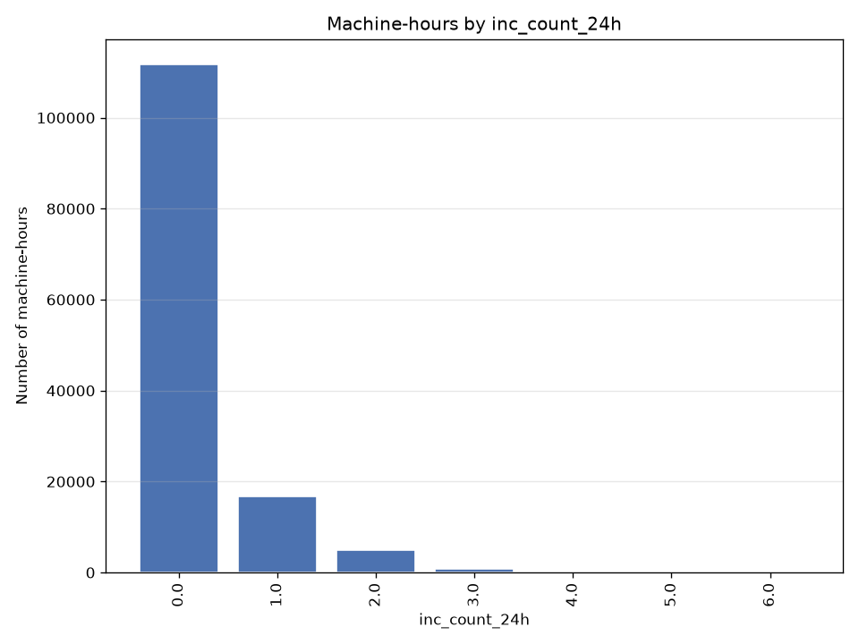

### inc_sevmax_24h

- **dtype** float64 · **count** 134280 · **unique** 5 · **missing** 0 (0.0%)
- **range** 0.0 → 5.0 (span 5.0) · **Q1/median/Q3** 0.0 / 0.0 / 0.0
- **mean** 0.508 · **std** 1.171 · **skew** 2.064

**Outliers** — flagged values per method:

| method | normal band | below — n (range) | above — n (range) |
|---|---|---|---|
| IQR (k=1.5) | [0.0, 0.0] | 0 — | 22568 [2.0, 5.0] |
| z-score (k=3) | [-3.004, 4.019] | 0 — | 903 [5.0, 5.0] |

**Outliers by machine** (IQR k=1.5 and z-score k=3, fences recomputed per machine):

| machine | n | IQR below | IQR above | z-score below | z-score above |
|---|---|---|---|---|---|
| MACH-01 | 8952 | 0 | 2150 | 0 | 0 |
| MACH-02 | 8952 | 0 | 678 | 0 | 558 |
| MACH-03 | 8952 | 0 | 0 | 0 | 0 |
| MACH-04 | 8952 | 0 | 842 | 0 | 192 |
| MACH-05 | 8952 | 0 | 1463 | 0 | 192 |
| MACH-06 | 8952 | 0 | 1386 | 0 | 448 |
| MACH-07 | 8952 | 0 | 816 | 0 | 600 |
| MACH-08 | 8952 | 0 | 1562 | 0 | 48 |
| MACH-09 | 8952 | 0 | 1592 | 0 | 264 |
| MACH-10 | 8952 | 0 | 1687 | 0 | 0 |
| MACH-11 | 8952 | 0 | 1066 | 0 | 643 |
| MACH-12 | 8952 | 0 | 1163 | 0 | 288 |
| MACH-13 | 8952 | 0 | 0 | 0 | 0 |
| MACH-14 | 8952 | 0 | 1580 | 0 | 362 |
| MACH-15 | 8952 | 0 | 1190 | 0 | 72 |
| **total** | 134280 | 0 | 17175 | 0 | 3667 |
- **distinct values**: 0.0, 2.0, 3.0, 4.0, 5.0

### inc_count_48h

- **dtype** float64 · **count** 134280 · **unique** 11 · **missing** 0 (0.0%)
- **range** 0.0 → 10.0 (span 10.0) · **Q1/median/Q3** 0.0 / 0.0 / 1.0
- **mean** 0.445 · **std** 0.969 · **skew** 3.08

**Outliers** — flagged values per method:

| method | normal band | below — n (range) | above — n (range) |
|---|---|---|---|
| IQR (k=1.5) | [-1.5, 2.5] | 0 — | 6811 [3.0, 10.0] |
| z-score (k=3) | [-2.463, 3.353] | 0 — | 3355 [4.0, 10.0] |

**Outliers by machine** (IQR k=1.5 and z-score k=3, fences recomputed per machine):

| machine | n | IQR below | IQR above | z-score below | z-score above |
|---|---|---|---|---|---|
| MACH-01 | 8952 | 0 | 1078 | 0 | 113 |
| MACH-02 | 8952 | 0 | 1182 | 0 | 187 |
| MACH-03 | 8952 | 0 | 279 | 0 | 157 |
| MACH-04 | 8952 | 0 | 1298 | 0 | 149 |
| MACH-05 | 8952 | 0 | 242 | 0 | 242 |
| MACH-06 | 8952 | 0 | 1938 | 0 | 356 |
| MACH-07 | 8952 | 0 | 1376 | 0 | 256 |
| MACH-08 | 8952 | 0 | 134 | 0 | 134 |
| MACH-09 | 8952 | 0 | 373 | 0 | 373 |
| MACH-10 | 8952 | 0 | 197 | 0 | 197 |
| MACH-11 | 8952 | 0 | 1896 | 0 | 170 |
| MACH-12 | 8952 | 0 | 1722 | 0 | 144 |
| MACH-13 | 8952 | 0 | 112 | 0 | 112 |
| MACH-14 | 8952 | 0 | 201 | 0 | 201 |
| MACH-15 | 8952 | 0 | 2083 | 0 | 224 |
| **total** | 134280 | 0 | 14111 | 0 | 3015 |
- **distinct values**: 0.0, 1.0, 10.0, 2.0, 3.0, 4.0, 5.0, 6.0, 7.0, 8.0, 9.0

### inc_sevmax_48h

- **dtype** float64 · **count** 134280 · **unique** 5 · **missing** 0 (0.0%)
- **range** 0.0 → 5.0 (span 5.0) · **Q1/median/Q3** 0.0 / 0.0 / 2.0
- **mean** 0.798 · **std** 1.417 · **skew** 1.393

**Outliers** — flagged values per method:

| method | normal band | below — n (range) | above — n (range) |
|---|---|---|---|
| IQR (k=1.5) | [-3.0, 5.0] | 0 — | 0 — |
| z-score (k=3) | [-3.453, 5.048] | 0 — | 0 — |

**Outliers by machine** (IQR k=1.5 and z-score k=3, fences recomputed per machine):

| machine | n | IQR below | IQR above | z-score below | z-score above |
|---|---|---|---|---|---|
| MACH-01 | 8952 | 0 | 0 | 0 | 0 |
| MACH-02 | 8952 | 0 | 1182 | 0 | 144 |
| MACH-03 | 8952 | 0 | 0 | 0 | 0 |
| MACH-04 | 8952 | 0 | 1298 | 0 | 367 |
| MACH-05 | 8952 | 0 | 0 | 0 | 0 |
| MACH-06 | 8952 | 0 | 1938 | 0 | 0 |
| MACH-07 | 8952 | 0 | 1376 | 0 | 240 |
| MACH-08 | 8952 | 0 | 0 | 0 | 0 |
| MACH-09 | 8952 | 0 | 0 | 0 | 0 |
| MACH-10 | 8952 | 0 | 0 | 0 | 0 |
| MACH-11 | 8952 | 0 | 1896 | 0 | 96 |
| MACH-12 | 8952 | 0 | 1722 | 0 | 0 |
| MACH-13 | 8952 | 0 | 0 | 0 | 0 |
| MACH-14 | 8952 | 0 | 0 | 0 | 0 |
| MACH-15 | 8952 | 0 | 2083 | 0 | 0 |
| **total** | 134280 | 0 | 11495 | 0 | 847 |
- **distinct values**: 0.0, 2.0, 3.0, 4.0, 5.0

### inc_count_7d

- **dtype** float64 · **count** 134280 · **unique** 21 · **missing** 0 (0.0%)
- **range** 0.0 → 20.0 (span 20.0) · **Q1/median/Q3** 0.0 / 1.0 / 2.0
- **mean** 1.549 · **std** 2.261 · **skew** 2.294

**Outliers** — flagged values per method:

| method | normal band | below — n (range) | above — n (range) |
|---|---|---|---|
| IQR (k=1.5) | [-3.0, 5.0] | 0 — | 9390 [6.0, 20.0] |
| z-score (k=3) | [-5.233, 8.331] | 0 — | 2673 [9.0, 20.0] |

**Outliers by machine** (IQR k=1.5 and z-score k=3, fences recomputed per machine):

| machine | n | IQR below | IQR above | z-score below | z-score above |
|---|---|---|---|---|---|
| MACH-01 | 8952 | 0 | 107 | 0 | 107 |
| MACH-02 | 8952 | 0 | 457 | 0 | 237 |
| MACH-03 | 8952 | 0 | 90 | 0 | 90 |
| MACH-04 | 8952 | 0 | 919 | 0 | 257 |
| MACH-05 | 8952 | 0 | 394 | 0 | 226 |
| MACH-06 | 8952 | 0 | 506 | 0 | 133 |
| MACH-07 | 8952 | 0 | 691 | 0 | 244 |
| MACH-08 | 8952 | 0 | 241 | 0 | 241 |
| MACH-09 | 8952 | 0 | 441 | 0 | 160 |
| MACH-10 | 8952 | 0 | 0 | 0 | 44 |
| MACH-11 | 8952 | 0 | 642 | 0 | 165 |
| MACH-12 | 8952 | 0 | 1431 | 0 | 312 |
| MACH-13 | 8952 | 0 | 8 | 0 | 38 |
| MACH-14 | 8952 | 0 | 242 | 0 | 0 |
| MACH-15 | 8952 | 0 | 320 | 0 | 320 |
| **total** | 134280 | 0 | 6489 | 0 | 2574 |

### inc_sevmax_7d

- **dtype** float64 · **count** 134280 · **unique** 5 · **missing** 0 (0.0%)
- **range** 0.0 → 5.0 (span 5.0) · **Q1/median/Q3** 0.0 / 2.0 / 3.0
- **mean** 1.844 · **std** 1.74 · **skew** 0.111

**Outliers** — flagged values per method:

| method | normal band | below — n (range) | above — n (range) |
|---|---|---|---|
| IQR (k=1.5) | [-4.5, 7.5] | 0 — | 0 — |
| z-score (k=3) | [-3.376, 7.063] | 0 — | 0 — |

**Outliers by machine** (IQR k=1.5 and z-score k=3, fences recomputed per machine):

| machine | n | IQR below | IQR above | z-score below | z-score above |
|---|---|---|---|---|---|
| MACH-01 | 8952 | 0 | 0 | 0 | 0 |
| MACH-02 | 8952 | 0 | 0 | 0 | 0 |
| MACH-03 | 8952 | 0 | 0 | 0 | 0 |
| MACH-04 | 8952 | 0 | 0 | 0 | 0 |
| MACH-05 | 8952 | 0 | 0 | 0 | 0 |
| MACH-06 | 8952 | 0 | 0 | 0 | 0 |
| MACH-07 | 8952 | 0 | 0 | 0 | 0 |
| MACH-08 | 8952 | 0 | 0 | 0 | 0 |
| MACH-09 | 8952 | 0 | 0 | 0 | 0 |
| MACH-10 | 8952 | 0 | 0 | 0 | 0 |
| MACH-11 | 8952 | 0 | 0 | 0 | 0 |
| MACH-12 | 8952 | 0 | 0 | 0 | 0 |
| MACH-13 | 8952 | 0 | 0 | 0 | 0 |
| MACH-14 | 8952 | 0 | 0 | 0 | 0 |
| MACH-15 | 8952 | 0 | 0 | 0 | 0 |
| **total** | 134280 | 0 | 0 | 0 | 0 |
- **distinct values**: 0.0, 2.0, 3.0, 4.0, 5.0

### inc_hours_since_last

- **dtype** float64 · **count** 130252 · **unique** 1842 · **missing** 4028 (3.0%)
- **range** 0.0 → 1841.0 (span 1841.0) · **Q1/median/Q3** 44.0 / 130.0 / 286.0
- **mean** 209.075 · **std** 235.9 · **skew** 2.128

**Outliers** — flagged values per method:

| method | normal band | below — n (range) | above — n (range) |
|---|---|---|---|
| IQR (k=1.5) | [-319.0, 649.0] | 0 — | 8234 [650.0, 1841.0] |
| z-score (k=3) | [-498.627, 916.776] | 0 — | 2372 [917.0, 1841.0] |

**Outliers by machine** (IQR k=1.5 and z-score k=3, fences recomputed per machine):

| machine | n | IQR below | IQR above | z-score below | z-score above |
|---|---|---|---|---|---|
| MACH-01 | 8858 | 0 | 635 | 0 | 243 |
| MACH-02 | 8101 | 0 | 57 | 0 | 36 |
| MACH-03 | 8735 | 0 | 650 | 0 | 321 |
| MACH-04 | 8619 | 0 | 23 | 0 | 0 |
| MACH-05 | 8639 | 0 | 348 | 0 | 136 |
| MACH-06 | 8947 | 0 | 867 | 0 | 196 |
| MACH-07 | 8678 | 0 | 0 | 0 | 0 |
| MACH-08 | 8575 | 0 | 252 | 0 | 89 |
| MACH-09 | 8444 | 0 | 353 | 0 | 192 |
| MACH-10 | 8923 | 0 | 297 | 0 | 206 |
| MACH-11 | 8464 | 0 | 310 | 0 | 18 |
| MACH-12 | 8651 | 0 | 167 | 0 | 18 |
| MACH-13 | 8808 | 0 | 448 | 0 | 160 |
| MACH-14 | 8879 | 0 | 609 | 0 | 289 |
| MACH-15 | 8931 | 0 | 67 | 0 | 46 |
| **total** | 130252 | 0 | 5083 | 0 | 1950 |

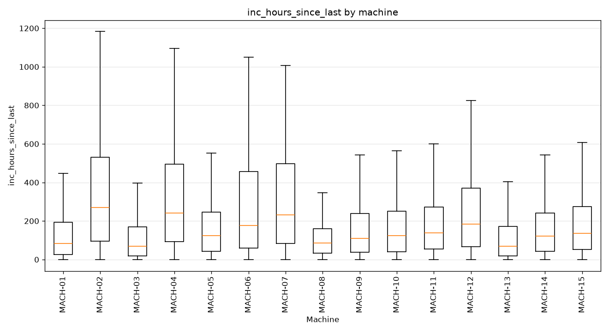

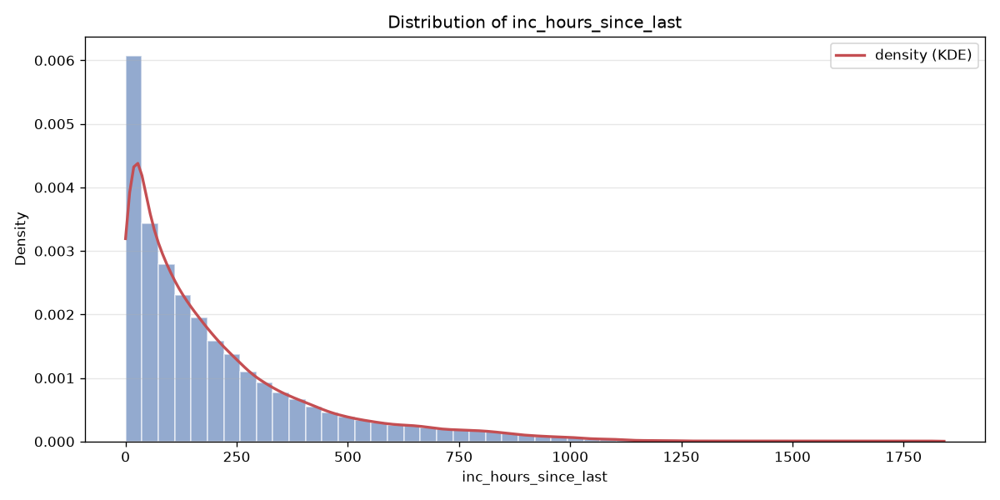

### sig_surchauffe_count_6h

- **dtype** float64 · **count** 134280 · **unique** 4 · **missing** 0 (0.0%)
- **range** 0.0 → 3.0 (span 3.0) · **Q1/median/Q3** 0.0 / 0.0 / 0.0
- **mean** 0.006 · **std** 0.089 · **skew** 16.651

**Outliers** — flagged values per method:

| method | normal band | below — n (range) | above — n (range) |
|---|---|---|---|
| IQR (k=1.5) | [0.0, 0.0] | 0 — | 678 [1.0, 3.0] |
| z-score (k=3) | [-0.26, 0.272] | 0 — | 678 [1.0, 3.0] |

**Outliers by machine** (IQR k=1.5 and z-score k=3, fences recomputed per machine):

| machine | n | IQR below | IQR above | z-score below | z-score above |
|---|---|---|---|---|---|
| MACH-01 | 8952 | 0 | 48 | 0 | 48 |
| MACH-02 | 8952 | 0 | 6 | 0 | 6 |
| MACH-03 | 8952 | 0 | 35 | 0 | 35 |
| MACH-04 | 8952 | 0 | 60 | 0 | 60 |
| MACH-05 | 8952 | 0 | 55 | 0 | 55 |
| MACH-06 | 8952 | 0 | 36 | 0 | 36 |
| MACH-07 | 8952 | 0 | 24 | 0 | 24 |
| MACH-08 | 8952 | 0 | 36 | 0 | 36 |
| MACH-09 | 8952 | 0 | 60 | 0 | 60 |
| MACH-10 | 8952 | 0 | 36 | 0 | 36 |
| MACH-11 | 8952 | 0 | 54 | 0 | 54 |
| MACH-12 | 8952 | 0 | 36 | 0 | 36 |
| MACH-13 | 8952 | 0 | 42 | 0 | 42 |
| MACH-14 | 8952 | 0 | 120 | 0 | 120 |
| MACH-15 | 8952 | 0 | 30 | 0 | 30 |
| **total** | 134280 | 0 | 678 | 0 | 678 |
- **distinct values**: 0.0, 1.0, 2.0, 3.0

### sig_surchauffe_count_12h

- **dtype** float64 · **count** 134280 · **unique** 4 · **missing** 0 (0.0%)
- **range** 0.0 → 3.0 (span 3.0) · **Q1/median/Q3** 0.0 / 0.0 / 0.0
- **mean** 0.012 · **std** 0.126 · **skew** 11.914

**Outliers** — flagged values per method:

| method | normal band | below — n (range) | above — n (range) |
|---|---|---|---|
| IQR (k=1.5) | [0.0, 0.0] | 0 — | 1345 [1.0, 3.0] |
| z-score (k=3) | [-0.366, 0.39] | 0 — | 1345 [1.0, 3.0] |

**Outliers by machine** (IQR k=1.5 and z-score k=3, fences recomputed per machine):

| machine | n | IQR below | IQR above | z-score below | z-score above |
|---|---|---|---|---|---|
| MACH-01 | 8952 | 0 | 96 | 0 | 96 |
| MACH-02 | 8952 | 0 | 12 | 0 | 12 |
| MACH-03 | 8952 | 0 | 65 | 0 | 65 |
| MACH-04 | 8952 | 0 | 120 | 0 | 120 |
| MACH-05 | 8952 | 0 | 109 | 0 | 109 |
| MACH-06 | 8952 | 0 | 72 | 0 | 72 |
| MACH-07 | 8952 | 0 | 48 | 0 | 48 |
| MACH-08 | 8952 | 0 | 72 | 0 | 72 |
| MACH-09 | 8952 | 0 | 120 | 0 | 120 |
| MACH-10 | 8952 | 0 | 72 | 0 | 72 |
| MACH-11 | 8952 | 0 | 108 | 0 | 108 |
| MACH-12 | 8952 | 0 | 72 | 0 | 72 |
| MACH-13 | 8952 | 0 | 84 | 0 | 84 |
| MACH-14 | 8952 | 0 | 235 | 0 | 235 |
| MACH-15 | 8952 | 0 | 60 | 0 | 60 |
| **total** | 134280 | 0 | 1345 | 0 | 1345 |
- **distinct values**: 0.0, 1.0, 2.0, 3.0

### sig_surchauffe_count_24h

- **dtype** float64 · **count** 134280 · **unique** 4 · **missing** 0 (0.0%)
- **range** 0.0 → 3.0 (span 3.0) · **Q1/median/Q3** 0.0 / 0.0 / 0.0
- **mean** 0.024 · **std** 0.178 · **skew** 8.425

**Outliers** — flagged values per method:

| method | normal band | below — n (range) | above — n (range) |
|---|---|---|---|
| IQR (k=1.5) | [0.0, 0.0] | 0 — | 2669 [1.0, 3.0] |
| z-score (k=3) | [-0.511, 0.559] | 0 — | 2669 [1.0, 3.0] |

**Outliers by machine** (IQR k=1.5 and z-score k=3, fences recomputed per machine):

| machine | n | IQR below | IQR above | z-score below | z-score above |
|---|---|---|---|---|---|
| MACH-01 | 8952 | 0 | 192 | 0 | 192 |
| MACH-02 | 8952 | 0 | 24 | 0 | 24 |
| MACH-03 | 8952 | 0 | 125 | 0 | 125 |
| MACH-04 | 8952 | 0 | 240 | 0 | 240 |
| MACH-05 | 8952 | 0 | 216 | 0 | 216 |
| MACH-06 | 8952 | 0 | 144 | 0 | 144 |
| MACH-07 | 8952 | 0 | 96 | 0 | 96 |
| MACH-08 | 8952 | 0 | 144 | 0 | 144 |
| MACH-09 | 8952 | 0 | 240 | 0 | 240 |
| MACH-10 | 8952 | 0 | 144 | 0 | 144 |
| MACH-11 | 8952 | 0 | 216 | 0 | 216 |
| MACH-12 | 8952 | 0 | 144 | 0 | 144 |
| MACH-13 | 8952 | 0 | 168 | 0 | 168 |
| MACH-14 | 8952 | 0 | 456 | 0 | 456 |
| MACH-15 | 8952 | 0 | 120 | 0 | 120 |
| **total** | 134280 | 0 | 2669 | 0 | 2669 |
- **distinct values**: 0.0, 1.0, 2.0, 3.0

### sig_surchauffe_count_48h

- **dtype** float64 · **count** 134280 · **unique** 6 · **missing** 0 (0.0%)
- **range** 0.0 → 5.0 (span 5.0) · **Q1/median/Q3** 0.0 / 0.0 / 0.0
- **mean** 0.048 · **std** 0.305 · **skew** 8.415

**Outliers** — flagged values per method:

| method | normal band | below — n (range) | above — n (range) |
|---|---|---|---|
| IQR (k=1.5) | [0.0, 0.0] | 0 — | 4359 [1.0, 5.0] |
| z-score (k=3) | [-0.868, 0.964] | 0 — | 4359 [1.0, 5.0] |

**Outliers by machine** (IQR k=1.5 and z-score k=3, fences recomputed per machine):

| machine | n | IQR below | IQR above | z-score below | z-score above |
|---|---|---|---|---|---|
| MACH-01 | 8952 | 0 | 336 | 0 | 336 |
| MACH-02 | 8952 | 0 | 48 | 0 | 48 |
| MACH-03 | 8952 | 0 | 197 | 0 | 72 |
| MACH-04 | 8952 | 0 | 336 | 0 | 168 |
| MACH-05 | 8952 | 0 | 384 | 0 | 384 |
| MACH-06 | 8952 | 0 | 240 | 0 | 240 |
| MACH-07 | 8952 | 0 | 192 | 0 | 192 |
| MACH-08 | 8952 | 0 | 274 | 0 | 274 |
| MACH-09 | 8952 | 0 | 384 | 0 | 96 |
| MACH-10 | 8952 | 0 | 240 | 0 | 240 |
| MACH-11 | 8952 | 0 | 336 | 0 | 144 |
| MACH-12 | 8952 | 0 | 240 | 0 | 240 |
| MACH-13 | 8952 | 0 | 240 | 0 | 144 |
| MACH-14 | 8952 | 0 | 720 | 0 | 209 |
| MACH-15 | 8952 | 0 | 192 | 0 | 192 |
| **total** | 134280 | 0 | 4359 | 0 | 2979 |
- **distinct values**: 0.0, 1.0, 2.0, 3.0, 4.0, 5.0

### sig_surchauffe_count_7d

- **dtype** float64 · **count** 134280 · **unique** 7 · **missing** 0 (0.0%)
- **range** 0.0 → 6.0 (span 6.0) · **Q1/median/Q3** 0.0 / 0.0 / 0.0
- **mean** 0.168 · **std** 0.666 · **skew** 5.325

**Outliers** — flagged values per method:

| method | normal band | below — n (range) | above — n (range) |
|---|---|---|---|
| IQR (k=1.5) | [0.0, 0.0] | 0 — | 12461 [1.0, 6.0] |
| z-score (k=3) | [-1.83, 2.165] | 0 — | 3030 [3.0, 6.0] |

**Outliers by machine** (IQR k=1.5 and z-score k=3, fences recomputed per machine):

| machine | n | IQR below | IQR above | z-score below | z-score above |
|---|---|---|---|---|---|
| MACH-01 | 8952 | 0 | 944 | 0 | 280 |
| MACH-02 | 8952 | 0 | 168 | 0 | 168 |
| MACH-03 | 8952 | 0 | 557 | 0 | 192 |
| MACH-04 | 8952 | 0 | 816 | 0 | 408 |
| MACH-05 | 8952 | 0 | 1224 | 0 | 169 |
| MACH-06 | 8952 | 0 | 720 | 0 | 168 |
| MACH-07 | 8952 | 0 | 584 | 0 | 584 |
| MACH-08 | 8952 | 0 | 874 | 0 | 134 |
| MACH-09 | 8952 | 0 | 1104 | 0 | 288 |
| MACH-10 | 8952 | 0 | 657 | 0 | 168 |
| MACH-11 | 8952 | 0 | 936 | 0 | 336 |
| MACH-12 | 8952 | 0 | 720 | 0 | 168 |
| MACH-13 | 8952 | 0 | 600 | 0 | 336 |
| MACH-14 | 8952 | 0 | 2005 | 0 | 511 |
| MACH-15 | 8952 | 0 | 552 | 0 | 168 |
| **total** | 134280 | 0 | 12461 | 0 | 4078 |
- **distinct values**: 0.0, 1.0, 2.0, 3.0, 4.0, 5.0, 6.0

### sig_baisse_pression_count_6h

- **dtype** float64 · **count** 134280 · **unique** 4 · **missing** 0 (0.0%)
- **range** 0.0 → 3.0 (span 3.0) · **Q1/median/Q3** 0.0 / 0.0 / 0.0
- **mean** 0.008 · **std** 0.102 · **skew** 15.503

**Outliers** — flagged values per method:

| method | normal band | below — n (range) | above — n (range) |
|---|---|---|---|
| IQR (k=1.5) | [0.0, 0.0] | 0 — | 810 [1.0, 3.0] |
| z-score (k=3) | [-0.3, 0.315] | 0 — | 810 [1.0, 3.0] |

**Outliers by machine** (IQR k=1.5 and z-score k=3, fences recomputed per machine):

| machine | n | IQR below | IQR above | z-score below | z-score above |
|---|---|---|---|---|---|
| MACH-01 | 8952 | 0 | 72 | 0 | 72 |
| MACH-02 | 8952 | 0 | 48 | 0 | 48 |
| MACH-03 | 8952 | 0 | 132 | 0 | 132 |
| MACH-04 | 8952 | 0 | 6 | 0 | 6 |
| MACH-05 | 8952 | 0 | 48 | 0 | 48 |
| MACH-06 | 8952 | 0 | 54 | 0 | 54 |
| MACH-07 | 8952 | 0 | 30 | 0 | 30 |
| MACH-08 | 8952 | 0 | 42 | 0 | 42 |
| MACH-09 | 8952 | 0 | 30 | 0 | 30 |
| MACH-10 | 8952 | 0 | 90 | 0 | 90 |
| MACH-11 | 8952 | 0 | 36 | 0 | 36 |
| MACH-12 | 8952 | 0 | 66 | 0 | 66 |
| MACH-13 | 8952 | 0 | 90 | 0 | 90 |
| MACH-14 | 8952 | 0 | 18 | 0 | 18 |
| MACH-15 | 8952 | 0 | 48 | 0 | 48 |
| **total** | 134280 | 0 | 810 | 0 | 810 |
- **distinct values**: 0.0, 1.0, 2.0, 3.0

### sig_baisse_pression_count_12h

- **dtype** float64 · **count** 134280 · **unique** 4 · **missing** 0 (0.0%)
- **range** 0.0 → 3.0 (span 3.0) · **Q1/median/Q3** 0.0 / 0.0 / 0.0
- **mean** 0.015 · **std** 0.145 · **skew** 10.925

**Outliers** — flagged values per method:

| method | normal band | below — n (range) | above — n (range) |
|---|---|---|---|
| IQR (k=1.5) | [0.0, 0.0] | 0 — | 1616 [1.0, 3.0] |
| z-score (k=3) | [-0.419, 0.449] | 0 — | 1616 [1.0, 3.0] |

**Outliers by machine** (IQR k=1.5 and z-score k=3, fences recomputed per machine):

| machine | n | IQR below | IQR above | z-score below | z-score above |
|---|---|---|---|---|---|
| MACH-01 | 8952 | 0 | 144 | 0 | 144 |
| MACH-02 | 8952 | 0 | 96 | 0 | 96 |
| MACH-03 | 8952 | 0 | 263 | 0 | 263 |
| MACH-04 | 8952 | 0 | 12 | 0 | 12 |
| MACH-05 | 8952 | 0 | 96 | 0 | 96 |
| MACH-06 | 8952 | 0 | 105 | 0 | 105 |
| MACH-07 | 8952 | 0 | 60 | 0 | 60 |
| MACH-08 | 8952 | 0 | 84 | 0 | 84 |
| MACH-09 | 8952 | 0 | 60 | 0 | 60 |
| MACH-10 | 8952 | 0 | 180 | 0 | 180 |
| MACH-11 | 8952 | 0 | 72 | 0 | 72 |
| MACH-12 | 8952 | 0 | 132 | 0 | 132 |
| MACH-13 | 8952 | 0 | 180 | 0 | 180 |
| MACH-14 | 8952 | 0 | 36 | 0 | 36 |
| MACH-15 | 8952 | 0 | 96 | 0 | 96 |
| **total** | 134280 | 0 | 1616 | 0 | 1616 |
- **distinct values**: 0.0, 1.0, 2.0, 3.0

### sig_baisse_pression_count_24h

- **dtype** float64 · **count** 134280 · **unique** 4 · **missing** 0 (0.0%)
- **range** 0.0 → 3.0 (span 3.0) · **Q1/median/Q3** 0.0 / 0.0 / 0.0
- **mean** 0.03 · **std** 0.205 · **skew** 7.718

**Outliers** — flagged values per method:

| method | normal band | below — n (range) | above — n (range) |
|---|---|---|---|
| IQR (k=1.5) | [0.0, 0.0] | 0 — | 3212 [1.0, 3.0] |
| z-score (k=3) | [-0.584, 0.644] | 0 — | 3212 [1.0, 3.0] |

**Outliers by machine** (IQR k=1.5 and z-score k=3, fences recomputed per machine):

| machine | n | IQR below | IQR above | z-score below | z-score above |
|---|---|---|---|---|---|
| MACH-01 | 8952 | 0 | 288 | 0 | 288 |
| MACH-02 | 8952 | 0 | 192 | 0 | 192 |
| MACH-03 | 8952 | 0 | 515 | 0 | 336 |
| MACH-04 | 8952 | 0 | 24 | 0 | 24 |
| MACH-05 | 8952 | 0 | 192 | 0 | 192 |
| MACH-06 | 8952 | 0 | 201 | 0 | 201 |
| MACH-07 | 8952 | 0 | 120 | 0 | 120 |
| MACH-08 | 8952 | 0 | 168 | 0 | 168 |
| MACH-09 | 8952 | 0 | 120 | 0 | 120 |
| MACH-10 | 8952 | 0 | 360 | 0 | 360 |
| MACH-11 | 8952 | 0 | 144 | 0 | 144 |
| MACH-12 | 8952 | 0 | 264 | 0 | 264 |
| MACH-13 | 8952 | 0 | 360 | 0 | 192 |
| MACH-14 | 8952 | 0 | 72 | 0 | 72 |
| MACH-15 | 8952 | 0 | 192 | 0 | 192 |
| **total** | 134280 | 0 | 3212 | 0 | 2865 |
- **distinct values**: 0.0, 1.0, 2.0, 3.0

### sig_baisse_pression_count_48h

- **dtype** float64 · **count** 134280 · **unique** 6 · **missing** 0 (0.0%)
- **range** 0.0 → 5.0 (span 5.0) · **Q1/median/Q3** 0.0 / 0.0 / 0.0
- **mean** 0.06 · **std** 0.359 · **skew** 7.661

**Outliers** — flagged values per method:

| method | normal band | below — n (range) | above — n (range) |
|---|---|---|---|
| IQR (k=1.5) | [0.0, 0.0] | 0 — | 4940 [1.0, 5.0] |
| z-score (k=3) | [-1.016, 1.136] | 0 — | 1763 [2.0, 5.0] |

**Outliers by machine** (IQR k=1.5 and z-score k=3, fences recomputed per machine):

| machine | n | IQR below | IQR above | z-score below | z-score above |
|---|---|---|---|---|---|
| MACH-01 | 8952 | 0 | 432 | 0 | 168 |
| MACH-02 | 8952 | 0 | 288 | 0 | 288 |
| MACH-03 | 8952 | 0 | 683 | 0 | 371 |
| MACH-04 | 8952 | 0 | 48 | 0 | 48 |
| MACH-05 | 8952 | 0 | 288 | 0 | 288 |
| MACH-06 | 8952 | 0 | 297 | 0 | 297 |
| MACH-07 | 8952 | 0 | 192 | 0 | 192 |
| MACH-08 | 8952 | 0 | 336 | 0 | 336 |
| MACH-09 | 8952 | 0 | 192 | 0 | 192 |
| MACH-10 | 8952 | 0 | 528 | 0 | 192 |
| MACH-11 | 8952 | 0 | 288 | 0 | 288 |
| MACH-12 | 8952 | 0 | 384 | 0 | 168 |
| MACH-13 | 8952 | 0 | 504 | 0 | 288 |
| MACH-14 | 8952 | 0 | 96 | 0 | 96 |
| MACH-15 | 8952 | 0 | 384 | 0 | 384 |
| **total** | 134280 | 0 | 4940 | 0 | 3596 |
- **distinct values**: 0.0, 1.0, 2.0, 3.0, 4.0, 5.0

### sig_baisse_pression_count_7d

- **dtype** float64 · **count** 134280 · **unique** 11 · **missing** 0 (0.0%)
- **range** 0.0 → 10.0 (span 10.0) · **Q1/median/Q3** 0.0 / 0.0 / 0.0
- **mean** 0.209 · **std** 0.829 · **skew** 5.498

**Outliers** — flagged values per method:

| method | normal band | below — n (range) | above — n (range) |
|---|---|---|---|
| IQR (k=1.5) | [0.0, 0.0] | 0 — | 12998 [1.0, 10.0] |
| z-score (k=3) | [-2.278, 2.695] | 0 — | 4405 [3.0, 10.0] |

**Outliers by machine** (IQR k=1.5 and z-score k=3, fences recomputed per machine):

| machine | n | IQR below | IQR above | z-score below | z-score above |
|---|---|---|---|---|---|
| MACH-01 | 8952 | 0 | 1125 | 0 | 387 |
| MACH-02 | 8952 | 0 | 690 | 0 | 288 |
| MACH-03 | 8952 | 0 | 1427 | 0 | 133 |
| MACH-04 | 8952 | 0 | 168 | 0 | 168 |
| MACH-05 | 8952 | 0 | 768 | 0 | 288 |
| MACH-06 | 8952 | 0 | 757 | 0 | 264 |
| MACH-07 | 8952 | 0 | 548 | 0 | 168 |
| MACH-08 | 8952 | 0 | 1071 | 0 | 105 |
| MACH-09 | 8952 | 0 | 552 | 0 | 168 |
| MACH-10 | 8952 | 0 | 1368 | 0 | 528 |
| MACH-11 | 8952 | 0 | 966 | 0 | 0 |
| MACH-12 | 8952 | 0 | 984 | 0 | 408 |
| MACH-13 | 8952 | 0 | 1014 | 0 | 458 |
| MACH-14 | 8952 | 0 | 216 | 0 | 168 |
| MACH-15 | 8952 | 0 | 1344 | 0 | 0 |
| **total** | 134280 | 0 | 12998 | 0 | 3531 |
- **distinct values**: 0.0, 1.0, 10.0, 2.0, 3.0, 4.0, 5.0, 6.0, 7.0, 8.0, 9.0

### sig_vibration_count_6h

- **dtype** float64 · **count** 134280 · **unique** 3 · **missing** 0 (0.0%)
- **range** 0.0 → 2.0 (span 2.0) · **Q1/median/Q3** 0.0 / 0.0 / 0.0
- **mean** 0.008 · **std** 0.102 · **skew** 14.24

**Outliers** — flagged values per method:

| method | normal band | below — n (range) | above — n (range) |
|---|---|---|---|
| IQR (k=1.5) | [0.0, 0.0] | 0 — | 912 [1.0, 2.0] |
| z-score (k=3) | [-0.297, 0.313] | 0 — | 912 [1.0, 2.0] |

**Outliers by machine** (IQR k=1.5 and z-score k=3, fences recomputed per machine):

| machine | n | IQR below | IQR above | z-score below | z-score above |
|---|---|---|---|---|---|
| MACH-01 | 8952 | 0 | 120 | 0 | 120 |
| MACH-02 | 8952 | 0 | 12 | 0 | 12 |
| MACH-03 | 8952 | 0 | 90 | 0 | 90 |
| MACH-04 | 8952 | 0 | 36 | 0 | 36 |
| MACH-05 | 8952 | 0 | 66 | 0 | 66 |
| MACH-06 | 8952 | 0 | 54 | 0 | 54 |
| MACH-07 | 8952 | 0 | 48 | 0 | 48 |
| MACH-08 | 8952 | 0 | 42 | 0 | 42 |
| MACH-09 | 8952 | 0 | 66 | 0 | 66 |
| MACH-10 | 8952 | 0 | 36 | 0 | 36 |
| MACH-11 | 8952 | 0 | 36 | 0 | 36 |
| MACH-12 | 8952 | 0 | 60 | 0 | 60 |
| MACH-13 | 8952 | 0 | 180 | 0 | 180 |
| MACH-14 | 8952 | 0 | 24 | 0 | 24 |
| MACH-15 | 8952 | 0 | 42 | 0 | 42 |
| **total** | 134280 | 0 | 912 | 0 | 912 |
- **distinct values**: 0.0, 1.0, 2.0

### sig_vibration_count_12h

- **dtype** float64 · **count** 134280 · **unique** 4 · **missing** 0 (0.0%)
- **range** 0.0 → 3.0 (span 3.0) · **Q1/median/Q3** 0.0 / 0.0 / 0.0
- **mean** 0.016 · **std** 0.144 · **skew** 10.223

**Outliers** — flagged values per method:

| method | normal band | below — n (range) | above — n (range) |
|---|---|---|---|
| IQR (k=1.5) | [0.0, 0.0] | 0 — | 1814 [1.0, 3.0] |
| z-score (k=3) | [-0.417, 0.449] | 0 — | 1814 [1.0, 3.0] |

**Outliers by machine** (IQR k=1.5 and z-score k=3, fences recomputed per machine):

| machine | n | IQR below | IQR above | z-score below | z-score above |
|---|---|---|---|---|---|
| MACH-01 | 8952 | 0 | 230 | 0 | 230 |
| MACH-02 | 8952 | 0 | 24 | 0 | 24 |
| MACH-03 | 8952 | 0 | 180 | 0 | 180 |
| MACH-04 | 8952 | 0 | 72 | 0 | 72 |
| MACH-05 | 8952 | 0 | 132 | 0 | 132 |
| MACH-06 | 8952 | 0 | 108 | 0 | 108 |
| MACH-07 | 8952 | 0 | 96 | 0 | 96 |
| MACH-08 | 8952 | 0 | 84 | 0 | 84 |
| MACH-09 | 8952 | 0 | 132 | 0 | 132 |
| MACH-10 | 8952 | 0 | 72 | 0 | 72 |
| MACH-11 | 8952 | 0 | 72 | 0 | 72 |
| MACH-12 | 8952 | 0 | 120 | 0 | 120 |
| MACH-13 | 8952 | 0 | 360 | 0 | 360 |
| MACH-14 | 8952 | 0 | 48 | 0 | 48 |
| MACH-15 | 8952 | 0 | 84 | 0 | 84 |
| **total** | 134280 | 0 | 1814 | 0 | 1814 |
- **distinct values**: 0.0, 1.0, 2.0, 3.0

### sig_vibration_count_24h

- **dtype** float64 · **count** 134280 · **unique** 5 · **missing** 0 (0.0%)
- **range** 0.0 → 4.0 (span 4.0) · **Q1/median/Q3** 0.0 / 0.0 / 0.0
- **mean** 0.032 · **std** 0.206 · **skew** 7.473

**Outliers** — flagged values per method:

| method | normal band | below — n (range) | above — n (range) |
|---|---|---|---|
| IQR (k=1.5) | [0.0, 0.0] | 0 — | 3593 [1.0, 4.0] |
| z-score (k=3) | [-0.585, 0.649] | 0 — | 3593 [1.0, 4.0] |

**Outliers by machine** (IQR k=1.5 and z-score k=3, fences recomputed per machine):

| machine | n | IQR below | IQR above | z-score below | z-score above |
|---|---|---|---|---|---|
| MACH-01 | 8952 | 0 | 425 | 0 | 144 |
| MACH-02 | 8952 | 0 | 48 | 0 | 48 |
| MACH-03 | 8952 | 0 | 360 | 0 | 192 |
| MACH-04 | 8952 | 0 | 144 | 0 | 144 |
| MACH-05 | 8952 | 0 | 264 | 0 | 264 |
| MACH-06 | 8952 | 0 | 216 | 0 | 216 |
| MACH-07 | 8952 | 0 | 192 | 0 | 192 |
| MACH-08 | 8952 | 0 | 168 | 0 | 168 |
| MACH-09 | 8952 | 0 | 264 | 0 | 264 |
| MACH-10 | 8952 | 0 | 144 | 0 | 144 |
| MACH-11 | 8952 | 0 | 144 | 0 | 144 |
| MACH-12 | 8952 | 0 | 240 | 0 | 240 |
| MACH-13 | 8952 | 0 | 720 | 0 | 288 |
| MACH-14 | 8952 | 0 | 96 | 0 | 96 |
| MACH-15 | 8952 | 0 | 168 | 0 | 168 |
| **total** | 134280 | 0 | 3593 | 0 | 2712 |
- **distinct values**: 0.0, 1.0, 2.0, 3.0, 4.0

### sig_vibration_count_48h

- **dtype** float64 · **count** 134280 · **unique** 8 · **missing** 0 (0.0%)
- **range** 0.0 → 7.0 (span 7.0) · **Q1/median/Q3** 0.0 / 0.0 / 0.0
- **mean** 0.064 · **std** 0.357 · **skew** 7.564

**Outliers** — flagged values per method:

| method | normal band | below — n (range) | above — n (range) |
|---|---|---|---|
| IQR (k=1.5) | [0.0, 0.0] | 0 — | 5707 [1.0, 7.0] |
| z-score (k=3) | [-1.007, 1.135] | 0 — | 1678 [2.0, 7.0] |

**Outliers by machine** (IQR k=1.5 and z-score k=3, fences recomputed per machine):

| machine | n | IQR below | IQR above | z-score below | z-score above |
|---|---|---|---|---|---|
| MACH-01 | 8952 | 0 | 641 | 0 | 216 |
| MACH-02 | 8952 | 0 | 96 | 0 | 96 |
| MACH-03 | 8952 | 0 | 528 | 0 | 288 |
| MACH-04 | 8952 | 0 | 240 | 0 | 240 |
| MACH-05 | 8952 | 0 | 432 | 0 | 432 |
| MACH-06 | 8952 | 0 | 336 | 0 | 336 |
| MACH-07 | 8952 | 0 | 336 | 0 | 336 |
| MACH-08 | 8952 | 0 | 336 | 0 | 336 |
| MACH-09 | 8952 | 0 | 384 | 0 | 384 |
| MACH-10 | 8952 | 0 | 240 | 0 | 240 |
| MACH-11 | 8952 | 0 | 288 | 0 | 288 |
| MACH-12 | 8952 | 0 | 384 | 0 | 384 |
| MACH-13 | 8952 | 0 | 986 | 0 | 432 |
| MACH-14 | 8952 | 0 | 144 | 0 | 144 |
| MACH-15 | 8952 | 0 | 336 | 0 | 336 |
| **total** | 134280 | 0 | 5707 | 0 | 4488 |
- **distinct values**: 0.0, 1.0, 2.0, 3.0, 4.0, 5.0, 6.0, 7.0

### sig_vibration_count_7d

- **dtype** float64 · **count** 134280 · **unique** 10 · **missing** 0 (0.0%)
- **range** 0.0 → 9.0 (span 9.0) · **Q1/median/Q3** 0.0 / 0.0 / 0.0
- **mean** 0.224 · **std** 0.8 · **skew** 5.037

**Outliers** — flagged values per method:

| method | normal band | below — n (range) | above — n (range) |
|---|---|---|---|
| IQR (k=1.5) | [0.0, 0.0] | 0 — | 15526 [1.0, 9.0] |
| z-score (k=3) | [-2.177, 2.624] | 0 — | 4411 [3.0, 9.0] |

**Outliers by machine** (IQR k=1.5 and z-score k=3, fences recomputed per machine):

| machine | n | IQR below | IQR above | z-score below | z-score above |
|---|---|---|---|---|---|
| MACH-01 | 8952 | 0 | 1617 | 0 | 208 |
| MACH-02 | 8952 | 0 | 336 | 0 | 336 |
| MACH-03 | 8952 | 0 | 1368 | 0 | 480 |
| MACH-04 | 8952 | 0 | 720 | 0 | 168 |
| MACH-05 | 8952 | 0 | 1272 | 0 | 336 |
| MACH-06 | 8952 | 0 | 819 | 0 | 450 |
| MACH-07 | 8952 | 0 | 932 | 0 | 244 |
| MACH-08 | 8952 | 0 | 1176 | 0 | 0 |
| MACH-09 | 8952 | 0 | 984 | 0 | 360 |
| MACH-10 | 8952 | 0 | 720 | 0 | 168 |
| MACH-11 | 8952 | 0 | 912 | 0 | 96 |
| MACH-12 | 8952 | 0 | 1005 | 0 | 267 |
| MACH-13 | 8952 | 0 | 2105 | 0 | 107 |
| MACH-14 | 8952 | 0 | 384 | 0 | 168 |
| MACH-15 | 8952 | 0 | 1176 | 0 | 0 |
| **total** | 134280 | 0 | 15526 | 0 | 3388 |
- **distinct values**: 0.0, 1.0, 2.0, 3.0, 4.0, 5.0, 6.0, 7.0, 8.0, 9.0

### sig_bruit_mecanique_count_6h

- **dtype** float64 · **count** 134280 · **unique** 3 · **missing** 0 (0.0%)
- **range** 0.0 → 2.0 (span 2.0) · **Q1/median/Q3** 0.0 / 0.0 / 0.0
- **mean** 0.009 · **std** 0.111 · **skew** 13.422

**Outliers** — flagged values per method:

| method | normal band | below — n (range) | above — n (range) |
|---|---|---|---|
| IQR (k=1.5) | [0.0, 0.0] | 0 — | 1032 [1.0, 2.0] |
| z-score (k=3) | [-0.323, 0.342] | 0 — | 1032 [1.0, 2.0] |

**Outliers by machine** (IQR k=1.5 and z-score k=3, fences recomputed per machine):

| machine | n | IQR below | IQR above | z-score below | z-score above |
|---|---|---|---|---|---|
| MACH-01 | 8952 | 0 | 72 | 0 | 72 |
| MACH-02 | 8952 | 0 | 6 | 0 | 6 |
| MACH-03 | 8952 | 0 | 216 | 0 | 216 |
| MACH-04 | 8952 | 0 | 36 | 0 | 36 |
| MACH-05 | 8952 | 0 | 36 | 0 | 36 |
| MACH-06 | 8952 | 0 | 78 | 0 | 78 |
| MACH-07 | 8952 | 0 | 24 | 0 | 24 |
| MACH-08 | 8952 | 0 | 72 | 0 | 72 |
| MACH-09 | 8952 | 0 | 78 | 0 | 78 |
| MACH-10 | 8952 | 0 | 42 | 0 | 42 |
| MACH-11 | 8952 | 0 | 18 | 0 | 18 |
| MACH-12 | 8952 | 0 | 48 | 0 | 48 |
| MACH-13 | 8952 | 0 | 138 | 0 | 138 |
| MACH-14 | 8952 | 0 | 132 | 0 | 132 |
| MACH-15 | 8952 | 0 | 36 | 0 | 36 |
| **total** | 134280 | 0 | 1032 | 0 | 1032 |
- **distinct values**: 0.0, 1.0, 2.0

### sig_bruit_mecanique_count_12h

- **dtype** float64 · **count** 134280 · **unique** 4 · **missing** 0 (0.0%)
- **range** 0.0 → 3.0 (span 3.0) · **Q1/median/Q3** 0.0 / 0.0 / 0.0
- **mean** 0.018 · **std** 0.157 · **skew** 9.485

**Outliers** — flagged values per method:

| method | normal band | below — n (range) | above — n (range) |
|---|---|---|---|
| IQR (k=1.5) | [0.0, 0.0] | 0 — | 2059 [1.0, 3.0] |
| z-score (k=3) | [-0.452, 0.489] | 0 — | 2059 [1.0, 3.0] |

**Outliers by machine** (IQR k=1.5 and z-score k=3, fences recomputed per machine):

| machine | n | IQR below | IQR above | z-score below | z-score above |
|---|---|---|---|---|---|
| MACH-01 | 8952 | 0 | 144 | 0 | 144 |
| MACH-02 | 8952 | 0 | 12 | 0 | 12 |
| MACH-03 | 8952 | 0 | 432 | 0 | 240 |
| MACH-04 | 8952 | 0 | 72 | 0 | 72 |
| MACH-05 | 8952 | 0 | 72 | 0 | 72 |
| MACH-06 | 8952 | 0 | 156 | 0 | 156 |
| MACH-07 | 8952 | 0 | 48 | 0 | 48 |
| MACH-08 | 8952 | 0 | 144 | 0 | 144 |
| MACH-09 | 8952 | 0 | 156 | 0 | 156 |
| MACH-10 | 8952 | 0 | 84 | 0 | 84 |
| MACH-11 | 8952 | 0 | 36 | 0 | 36 |
| MACH-12 | 8952 | 0 | 96 | 0 | 96 |
| MACH-13 | 8952 | 0 | 272 | 0 | 272 |
| MACH-14 | 8952 | 0 | 263 | 0 | 263 |
| MACH-15 | 8952 | 0 | 72 | 0 | 72 |
| **total** | 134280 | 0 | 2059 | 0 | 1867 |
- **distinct values**: 0.0, 1.0, 2.0, 3.0

### sig_bruit_mecanique_count_24h

- **dtype** float64 · **count** 134280 · **unique** 5 · **missing** 0 (0.0%)
- **range** 0.0 → 4.0 (span 4.0) · **Q1/median/Q3** 0.0 / 0.0 / 0.0
- **mean** 0.037 · **std** 0.224 · **skew** 6.945

**Outliers** — flagged values per method:

| method | normal band | below — n (range) | above — n (range) |
|---|---|---|---|
| IQR (k=1.5) | [0.0, 0.0] | 0 — | 4051 [1.0, 4.0] |
| z-score (k=3) | [-0.635, 0.709] | 0 — | 4051 [1.0, 4.0] |

**Outliers by machine** (IQR k=1.5 and z-score k=3, fences recomputed per machine):

| machine | n | IQR below | IQR above | z-score below | z-score above |
|---|---|---|---|---|---|
| MACH-01 | 8952 | 0 | 288 | 0 | 288 |
| MACH-02 | 8952 | 0 | 24 | 0 | 24 |
| MACH-03 | 8952 | 0 | 840 | 0 | 492 |
| MACH-04 | 8952 | 0 | 144 | 0 | 144 |
| MACH-05 | 8952 | 0 | 144 | 0 | 144 |
| MACH-06 | 8952 | 0 | 312 | 0 | 312 |
| MACH-07 | 8952 | 0 | 96 | 0 | 96 |
| MACH-08 | 8952 | 0 | 288 | 0 | 288 |
| MACH-09 | 8952 | 0 | 312 | 0 | 312 |
| MACH-10 | 8952 | 0 | 168 | 0 | 168 |
| MACH-11 | 8952 | 0 | 72 | 0 | 72 |
| MACH-12 | 8952 | 0 | 192 | 0 | 192 |
| MACH-13 | 8952 | 0 | 512 | 0 | 264 |
| MACH-14 | 8952 | 0 | 515 | 0 | 515 |
| MACH-15 | 8952 | 0 | 144 | 0 | 144 |
| **total** | 134280 | 0 | 4051 | 0 | 3455 |
- **distinct values**: 0.0, 1.0, 2.0, 3.0, 4.0

### sig_bruit_mecanique_count_48h

- **dtype** float64 · **count** 134280 · **unique** 8 · **missing** 0 (0.0%)
- **range** 0.0 → 7.0 (span 7.0) · **Q1/median/Q3** 0.0 / 0.0 / 0.0
- **mean** 0.074 · **std** 0.392 · **skew** 7.05

**Outliers** — flagged values per method:

| method | normal band | below — n (range) | above — n (range) |
|---|---|---|---|
| IQR (k=1.5) | [0.0, 0.0] | 0 — | 6339 [1.0, 7.0] |
| z-score (k=3) | [-1.101, 1.249] | 0 — | 2140 [2.0, 7.0] |

**Outliers by machine** (IQR k=1.5 and z-score k=3, fences recomputed per machine):

| machine | n | IQR below | IQR above | z-score below | z-score above |
|---|---|---|---|---|---|
| MACH-01 | 8952 | 0 | 432 | 0 | 168 |
| MACH-02 | 8952 | 0 | 48 | 0 | 48 |
| MACH-03 | 8952 | 0 | 1184 | 0 | 496 |
| MACH-04 | 8952 | 0 | 240 | 0 | 240 |
| MACH-05 | 8952 | 0 | 240 | 0 | 240 |
| MACH-06 | 8952 | 0 | 432 | 0 | 192 |
| MACH-07 | 8952 | 0 | 192 | 0 | 192 |
| MACH-08 | 8952 | 0 | 576 | 0 | 576 |
| MACH-09 | 8952 | 0 | 480 | 0 | 144 |
| MACH-10 | 8952 | 0 | 288 | 0 | 288 |
| MACH-11 | 8952 | 0 | 144 | 0 | 144 |
| MACH-12 | 8952 | 0 | 288 | 0 | 288 |
| MACH-13 | 8952 | 0 | 728 | 0 | 280 |
| MACH-14 | 8952 | 0 | 779 | 0 | 264 |
| MACH-15 | 8952 | 0 | 288 | 0 | 288 |
| **total** | 134280 | 0 | 6339 | 0 | 3848 |
- **distinct values**: 0.0, 1.0, 2.0, 3.0, 4.0, 5.0, 6.0, 7.0

### sig_bruit_mecanique_count_7d

- **dtype** float64 · **count** 134280 · **unique** 11 · **missing** 0 (0.0%)
- **range** 0.0 → 10.0 (span 10.0) · **Q1/median/Q3** 0.0 / 0.0 / 0.0
- **mean** 0.258 · **std** 0.899 · **skew** 4.963

**Outliers** — flagged values per method:

| method | normal band | below — n (range) | above — n (range) |
|---|---|---|---|
| IQR (k=1.5) | [0.0, 0.0] | 0 — | 17012 [1.0, 10.0] |
| z-score (k=3) | [-2.437, 2.954] | 0 — | 5042 [3.0, 10.0] |

**Outliers by machine** (IQR k=1.5 and z-score k=3, fences recomputed per machine):

| machine | n | IQR below | IQR above | z-score below | z-score above |
|---|---|---|---|---|---|
| MACH-01 | 8952 | 0 | 1152 | 0 | 384 |
| MACH-02 | 8952 | 0 | 156 | 0 | 156 |
| MACH-03 | 8952 | 0 | 1618 | 0 | 86 |
| MACH-04 | 8952 | 0 | 720 | 0 | 168 |
| MACH-05 | 8952 | 0 | 720 | 0 | 168 |
| MACH-06 | 8952 | 0 | 978 | 0 | 474 |
| MACH-07 | 8952 | 0 | 672 | 0 | 672 |
| MACH-08 | 8952 | 0 | 1871 | 0 | 145 |
| MACH-09 | 8952 | 0 | 1320 | 0 | 360 |
| MACH-10 | 8952 | 0 | 888 | 0 | 168 |
| MACH-11 | 8952 | 0 | 504 | 0 | 504 |
| MACH-12 | 8952 | 0 | 768 | 0 | 336 |
| MACH-13 | 8952 | 0 | 1742 | 0 | 324 |
| MACH-14 | 8952 | 0 | 2005 | 0 | 109 |
| MACH-15 | 8952 | 0 | 900 | 0 | 108 |
| **total** | 134280 | 0 | 16014 | 0 | 4162 |
- **distinct values**: 0.0, 1.0, 10.0, 2.0, 3.0, 4.0, 5.0, 6.0, 7.0, 8.0, 9.0

### sig_surconsommation_count_6h

- **dtype** float64 · **count** 134280 · **unique** 3 · **missing** 0 (0.0%)
- **range** 0.0 → 2.0 (span 2.0) · **Q1/median/Q3** 0.0 / 0.0 / 0.0
- **mean** 0.007 · **std** 0.092 · **skew** 15.49

**Outliers** — flagged values per method:

| method | normal band | below — n (range) | above — n (range) |
|---|---|---|---|
| IQR (k=1.5) | [0.0, 0.0] | 0 — | 768 [1.0, 2.0] |
| z-score (k=3) | [-0.27, 0.283] | 0 — | 768 [1.0, 2.0] |

**Outliers by machine** (IQR k=1.5 and z-score k=3, fences recomputed per machine):

| machine | n | IQR below | IQR above | z-score below | z-score above |
|---|---|---|---|---|---|
| MACH-01 | 8952 | 0 | 60 | 0 | 60 |
| MACH-02 | 8952 | 0 | 30 | 0 | 30 |
| MACH-03 | 8952 | 0 | 102 | 0 | 102 |
| MACH-04 | 8952 | 0 | 24 | 0 | 24 |
| MACH-05 | 8952 | 0 | 48 | 0 | 48 |
| MACH-06 | 8952 | 0 | 18 | 0 | 18 |
| MACH-07 | 8952 | 0 | 24 | 0 | 24 |
| MACH-08 | 8952 | 0 | 48 | 0 | 48 |
| MACH-09 | 8952 | 0 | 48 | 0 | 48 |
| MACH-10 | 8952 | 0 | 48 | 0 | 48 |
| MACH-11 | 8952 | 0 | 24 | 0 | 24 |
| MACH-12 | 8952 | 0 | 42 | 0 | 42 |
| MACH-13 | 8952 | 0 | 150 | 0 | 150 |
| MACH-14 | 8952 | 0 | 54 | 0 | 54 |
| MACH-15 | 8952 | 0 | 48 | 0 | 48 |
| **total** | 134280 | 0 | 768 | 0 | 768 |
- **distinct values**: 0.0, 1.0, 2.0

### sig_surconsommation_count_12h

- **dtype** float64 · **count** 134280 · **unique** 5 · **missing** 0 (0.0%)
- **range** 0.0 → 4.0 (span 4.0) · **Q1/median/Q3** 0.0 / 0.0 / 0.0
- **mean** 0.013 · **std** 0.131 · **skew** 11.283

**Outliers** — flagged values per method:

| method | normal band | below — n (range) | above — n (range) |
|---|---|---|---|
| IQR (k=1.5) | [0.0, 0.0] | 0 — | 1530 [1.0, 4.0] |
| z-score (k=3) | [-0.38, 0.406] | 0 — | 1530 [1.0, 4.0] |

**Outliers by machine** (IQR k=1.5 and z-score k=3, fences recomputed per machine):

| machine | n | IQR below | IQR above | z-score below | z-score above |
|---|---|---|---|---|---|
| MACH-01 | 8952 | 0 | 120 | 0 | 120 |
| MACH-02 | 8952 | 0 | 60 | 0 | 60 |
| MACH-03 | 8952 | 0 | 198 | 0 | 198 |
| MACH-04 | 8952 | 0 | 48 | 0 | 48 |
| MACH-05 | 8952 | 0 | 96 | 0 | 96 |
| MACH-06 | 8952 | 0 | 36 | 0 | 36 |
| MACH-07 | 8952 | 0 | 48 | 0 | 48 |
| MACH-08 | 8952 | 0 | 96 | 0 | 96 |
| MACH-09 | 8952 | 0 | 96 | 0 | 96 |
| MACH-10 | 8952 | 0 | 96 | 0 | 96 |
| MACH-11 | 8952 | 0 | 48 | 0 | 48 |
| MACH-12 | 8952 | 0 | 84 | 0 | 84 |
| MACH-13 | 8952 | 0 | 300 | 0 | 300 |
| MACH-14 | 8952 | 0 | 108 | 0 | 108 |
| MACH-15 | 8952 | 0 | 96 | 0 | 96 |
| **total** | 134280 | 0 | 1530 | 0 | 1530 |
- **distinct values**: 0.0, 1.0, 2.0, 3.0, 4.0

### sig_surconsommation_count_24h

- **dtype** float64 · **count** 134280 · **unique** 5 · **missing** 0 (0.0%)
- **range** 0.0 → 4.0 (span 4.0) · **Q1/median/Q3** 0.0 / 0.0 / 0.0
- **mean** 0.027 · **std** 0.19 · **skew** 8.862

**Outliers** — flagged values per method:

| method | normal band | below — n (range) | above — n (range) |
|---|---|---|---|
| IQR (k=1.5) | [0.0, 0.0] | 0 — | 3015 [1.0, 4.0] |
| z-score (k=3) | [-0.542, 0.596] | 0 — | 3015 [1.0, 4.0] |

**Outliers by machine** (IQR k=1.5 and z-score k=3, fences recomputed per machine):

| machine | n | IQR below | IQR above | z-score below | z-score above |
|---|---|---|---|---|---|
| MACH-01 | 8952 | 0 | 240 | 0 | 240 |
| MACH-02 | 8952 | 0 | 120 | 0 | 120 |
| MACH-03 | 8952 | 0 | 351 | 0 | 168 |
| MACH-04 | 8952 | 0 | 96 | 0 | 96 |
| MACH-05 | 8952 | 0 | 192 | 0 | 192 |
| MACH-06 | 8952 | 0 | 72 | 0 | 72 |
| MACH-07 | 8952 | 0 | 96 | 0 | 96 |
| MACH-08 | 8952 | 0 | 192 | 0 | 192 |
| MACH-09 | 8952 | 0 | 192 | 0 | 192 |
| MACH-10 | 8952 | 0 | 192 | 0 | 192 |
| MACH-11 | 8952 | 0 | 96 | 0 | 96 |
| MACH-12 | 8952 | 0 | 168 | 0 | 168 |
| MACH-13 | 8952 | 0 | 600 | 0 | 264 |
| MACH-14 | 8952 | 0 | 216 | 0 | 216 |
| MACH-15 | 8952 | 0 | 192 | 0 | 192 |
| **total** | 134280 | 0 | 3015 | 0 | 2496 |
- **distinct values**: 0.0, 1.0, 2.0, 3.0, 4.0

### sig_surconsommation_count_48h

- **dtype** float64 · **count** 134280 · **unique** 8 · **missing** 0 (0.0%)
- **range** 0.0 → 8.0 (span 8.0) · **Q1/median/Q3** 0.0 / 0.0 / 0.0
- **mean** 0.053 · **std** 0.325 · **skew** 9.231

**Outliers** — flagged values per method:

| method | normal band | below — n (range) | above — n (range) |
|---|---|---|---|
| IQR (k=1.5) | [0.0, 0.0] | 0 — | 5005 [1.0, 8.0] |
| z-score (k=3) | [-0.921, 1.027] | 0 — | 1202 [2.0, 8.0] |

**Outliers by machine** (IQR k=1.5 and z-score k=3, fences recomputed per machine):

| machine | n | IQR below | IQR above | z-score below | z-score above |
|---|---|---|---|---|---|
| MACH-01 | 8952 | 0 | 382 | 0 | 98 |
| MACH-02 | 8952 | 0 | 240 | 0 | 240 |
| MACH-03 | 8952 | 0 | 543 | 0 | 168 |
| MACH-04 | 8952 | 0 | 144 | 0 | 144 |
| MACH-05 | 8952 | 0 | 336 | 0 | 336 |
| MACH-06 | 8952 | 0 | 96 | 0 | 96 |
| MACH-07 | 8952 | 0 | 144 | 0 | 144 |
| MACH-08 | 8952 | 0 | 384 | 0 | 384 |
| MACH-09 | 8952 | 0 | 384 | 0 | 384 |
| MACH-10 | 8952 | 0 | 336 | 0 | 336 |
| MACH-11 | 8952 | 0 | 192 | 0 | 192 |
| MACH-12 | 8952 | 0 | 240 | 0 | 240 |
| MACH-13 | 8952 | 0 | 864 | 0 | 336 |
| MACH-14 | 8952 | 0 | 336 | 0 | 336 |
| MACH-15 | 8952 | 0 | 384 | 0 | 384 |
| **total** | 134280 | 0 | 5005 | 0 | 3818 |
- **distinct values**: 0.0, 1.0, 2.0, 3.0, 4.0, 6.0, 7.0, 8.0

### sig_surconsommation_count_7d

- **dtype** float64 · **count** 134280 · **unique** 11 · **missing** 0 (0.0%)
- **range** 0.0 → 10.0 (span 10.0) · **Q1/median/Q3** 0.0 / 0.0 / 0.0
- **mean** 0.186 · **std** 0.716 · **skew** 6.11

**Outliers** — flagged values per method:

| method | normal band | below — n (range) | above — n (range) |
|---|---|---|---|
| IQR (k=1.5) | [0.0, 0.0] | 0 — | 14191 [1.0, 10.0] |
| z-score (k=3) | [-1.963, 2.335] | 0 — | 3132 [3.0, 10.0] |

**Outliers by machine** (IQR k=1.5 and z-score k=3, fences recomputed per machine):

| machine | n | IQR below | IQR above | z-score below | z-score above |
|---|---|---|---|---|---|
| MACH-01 | 8952 | 0 | 982 | 0 | 336 |
| MACH-02 | 8952 | 0 | 721 | 0 | 119 |
| MACH-03 | 8952 | 0 | 1447 | 0 | 168 |
| MACH-04 | 8952 | 0 | 384 | 0 | 168 |
| MACH-05 | 8952 | 0 | 1051 | 0 | 168 |
| MACH-06 | 8952 | 0 | 216 | 0 | 168 |
| MACH-07 | 8952 | 0 | 384 | 0 | 168 |
| MACH-08 | 8952 | 0 | 1267 | 0 | 77 |
| MACH-09 | 8952 | 0 | 1132 | 0 | 154 |
| MACH-10 | 8952 | 0 | 1056 | 0 | 168 |
| MACH-11 | 8952 | 0 | 672 | 0 | 672 |
| MACH-12 | 8952 | 0 | 600 | 0 | 336 |
| MACH-13 | 8952 | 0 | 1999 | 0 | 29 |
| MACH-14 | 8952 | 0 | 936 | 0 | 336 |
| MACH-15 | 8952 | 0 | 1344 | 0 | 0 |
| **total** | 134280 | 0 | 14191 | 0 | 3067 |
- **distinct values**: 0.0, 1.0, 10.0, 2.0, 3.0, 4.0, 5.0, 6.0, 7.0, 8.0, 9.0

### sig_blocage_mecanique_count_6h

- **dtype** float64 · **count** 134280 · **unique** 3 · **missing** 0 (0.0%)
- **range** 0.0 → 2.0 (span 2.0) · **Q1/median/Q3** 0.0 / 0.0 / 0.0
- **mean** 0.0 · **std** 0.021 · **skew** 66.209

**Outliers** — flagged values per method:

| method | normal band | below — n (range) | above — n (range) |
|---|---|---|---|
| IQR (k=1.5) | [0.0, 0.0] | 0 — | 42 [1.0, 2.0] |
| z-score (k=3) | [-0.063, 0.064] | 0 — | 42 [1.0, 2.0] |

**Outliers by machine** (IQR k=1.5 and z-score k=3, fences recomputed per machine):

| machine | n | IQR below | IQR above | z-score below | z-score above |
|---|---|---|---|---|---|
| MACH-01 | 8952 | 0 | 0 | 0 | 0 |
| MACH-02 | 8952 | 0 | 6 | 0 | 6 |
| MACH-03 | 8952 | 0 | 6 | 0 | 6 |
| MACH-04 | 8952 | 0 | 0 | 0 | 0 |
| MACH-05 | 8952 | 0 | 0 | 0 | 0 |
| MACH-06 | 8952 | 0 | 6 | 0 | 6 |
| MACH-07 | 8952 | 0 | 18 | 0 | 18 |
| MACH-08 | 8952 | 0 | 0 | 0 | 0 |
| MACH-09 | 8952 | 0 | 6 | 0 | 6 |
| MACH-10 | 8952 | 0 | 0 | 0 | 0 |
| MACH-11 | 8952 | 0 | 0 | 0 | 0 |
| MACH-12 | 8952 | 0 | 0 | 0 | 0 |
| MACH-13 | 8952 | 0 | 0 | 0 | 0 |
| MACH-14 | 8952 | 0 | 0 | 0 | 0 |
| MACH-15 | 8952 | 0 | 0 | 0 | 0 |
| **total** | 134280 | 0 | 42 | 0 | 42 |
- **distinct values**: 0.0, 1.0, 2.0

### sig_blocage_mecanique_count_12h

- **dtype** float64 · **count** 134280 · **unique** 3 · **missing** 0 (0.0%)
- **range** 0.0 → 2.0 (span 2.0) · **Q1/median/Q3** 0.0 / 0.0 / 0.0
- **mean** 0.001 · **std** 0.03 · **skew** 46.801

**Outliers** — flagged values per method:

| method | normal band | below — n (range) | above — n (range) |
|---|---|---|---|
| IQR (k=1.5) | [0.0, 0.0] | 0 — | 84 [1.0, 2.0] |
| z-score (k=3) | [-0.089, 0.09] | 0 — | 84 [1.0, 2.0] |

**Outliers by machine** (IQR k=1.5 and z-score k=3, fences recomputed per machine):

| machine | n | IQR below | IQR above | z-score below | z-score above |
|---|---|---|---|---|---|
| MACH-01 | 8952 | 0 | 0 | 0 | 0 |
| MACH-02 | 8952 | 0 | 12 | 0 | 12 |
| MACH-03 | 8952 | 0 | 12 | 0 | 12 |
| MACH-04 | 8952 | 0 | 0 | 0 | 0 |
| MACH-05 | 8952 | 0 | 0 | 0 | 0 |
| MACH-06 | 8952 | 0 | 12 | 0 | 12 |
| MACH-07 | 8952 | 0 | 36 | 0 | 36 |
| MACH-08 | 8952 | 0 | 0 | 0 | 0 |
| MACH-09 | 8952 | 0 | 12 | 0 | 12 |
| MACH-10 | 8952 | 0 | 0 | 0 | 0 |
| MACH-11 | 8952 | 0 | 0 | 0 | 0 |
| MACH-12 | 8952 | 0 | 0 | 0 | 0 |
| MACH-13 | 8952 | 0 | 0 | 0 | 0 |
| MACH-14 | 8952 | 0 | 0 | 0 | 0 |
| MACH-15 | 8952 | 0 | 0 | 0 | 0 |
| **total** | 134280 | 0 | 84 | 0 | 84 |
- **distinct values**: 0.0, 1.0, 2.0

### sig_blocage_mecanique_count_24h

- **dtype** float64 · **count** 134280 · **unique** 3 · **missing** 0 (0.0%)
- **range** 0.0 → 2.0 (span 2.0) · **Q1/median/Q3** 0.0 / 0.0 / 0.0
- **mean** 0.001 · **std** 0.042 · **skew** 33.071

**Outliers** — flagged values per method:

| method | normal band | below — n (range) | above — n (range) |
|---|---|---|---|
| IQR (k=1.5) | [0.0, 0.0] | 0 — | 168 [1.0, 2.0] |
| z-score (k=3) | [-0.125, 0.128] | 0 — | 168 [1.0, 2.0] |

**Outliers by machine** (IQR k=1.5 and z-score k=3, fences recomputed per machine):

| machine | n | IQR below | IQR above | z-score below | z-score above |
|---|---|---|---|---|---|
| MACH-01 | 8952 | 0 | 0 | 0 | 0 |
| MACH-02 | 8952 | 0 | 24 | 0 | 24 |
| MACH-03 | 8952 | 0 | 24 | 0 | 24 |
| MACH-04 | 8952 | 0 | 0 | 0 | 0 |
| MACH-05 | 8952 | 0 | 0 | 0 | 0 |
| MACH-06 | 8952 | 0 | 24 | 0 | 24 |
| MACH-07 | 8952 | 0 | 72 | 0 | 72 |
| MACH-08 | 8952 | 0 | 0 | 0 | 0 |
| MACH-09 | 8952 | 0 | 24 | 0 | 24 |
| MACH-10 | 8952 | 0 | 0 | 0 | 0 |
| MACH-11 | 8952 | 0 | 0 | 0 | 0 |
| MACH-12 | 8952 | 0 | 0 | 0 | 0 |
| MACH-13 | 8952 | 0 | 0 | 0 | 0 |
| MACH-14 | 8952 | 0 | 0 | 0 | 0 |
| MACH-15 | 8952 | 0 | 0 | 0 | 0 |
| **total** | 134280 | 0 | 168 | 0 | 168 |
- **distinct values**: 0.0, 1.0, 2.0

### sig_blocage_mecanique_count_48h

- **dtype** float64 · **count** 134280 · **unique** 3 · **missing** 0 (0.0%)
- **range** 0.0 → 3.0 (span 3.0) · **Q1/median/Q3** 0.0 / 0.0 / 0.0
- **mean** 0.003 · **std** 0.071 · **skew** 32.269

**Outliers** — flagged values per method:

| method | normal band | below — n (range) | above — n (range) |
|---|---|---|---|
| IQR (k=1.5) | [0.0, 0.0] | 0 — | 288 [1.0, 3.0] |
| z-score (k=3) | [-0.209, 0.215] | 0 — | 288 [1.0, 3.0] |

**Outliers by machine** (IQR k=1.5 and z-score k=3, fences recomputed per machine):

| machine | n | IQR below | IQR above | z-score below | z-score above |
|---|---|---|---|---|---|
| MACH-01 | 8952 | 0 | 0 | 0 | 0 |
| MACH-02 | 8952 | 0 | 48 | 0 | 48 |
| MACH-03 | 8952 | 0 | 48 | 0 | 48 |
| MACH-04 | 8952 | 0 | 0 | 0 | 0 |
| MACH-05 | 8952 | 0 | 0 | 0 | 0 |
| MACH-06 | 8952 | 0 | 48 | 0 | 48 |
| MACH-07 | 8952 | 0 | 96 | 0 | 96 |
| MACH-08 | 8952 | 0 | 0 | 0 | 0 |
| MACH-09 | 8952 | 0 | 48 | 0 | 48 |
| MACH-10 | 8952 | 0 | 0 | 0 | 0 |
| MACH-11 | 8952 | 0 | 0 | 0 | 0 |
| MACH-12 | 8952 | 0 | 0 | 0 | 0 |
| MACH-13 | 8952 | 0 | 0 | 0 | 0 |
| MACH-14 | 8952 | 0 | 0 | 0 | 0 |
| MACH-15 | 8952 | 0 | 0 | 0 | 0 |
| **total** | 134280 | 0 | 288 | 0 | 288 |
- **distinct values**: 0.0, 1.0, 3.0

### sig_blocage_mecanique_count_7d

- **dtype** float64 · **count** 134280 · **unique** 4 · **missing** 0 (0.0%)
- **range** 0.0 → 4.0 (span 4.0) · **Q1/median/Q3** 0.0 / 0.0 / 0.0
- **mean** 0.01 · **std** 0.151 · **skew** 20.806

**Outliers** — flagged values per method:

| method | normal band | below — n (range) | above — n (range) |
|---|---|---|---|
| IQR (k=1.5) | [0.0, 0.0] | 0 — | 888 [1.0, 4.0] |
| z-score (k=3) | [-0.443, 0.463] | 0 — | 888 [1.0, 4.0] |

**Outliers by machine** (IQR k=1.5 and z-score k=3, fences recomputed per machine):

| machine | n | IQR below | IQR above | z-score below | z-score above |
|---|---|---|---|---|---|
| MACH-01 | 8952 | 0 | 0 | 0 | 0 |
| MACH-02 | 8952 | 0 | 168 | 0 | 168 |
| MACH-03 | 8952 | 0 | 168 | 0 | 168 |
| MACH-04 | 8952 | 0 | 0 | 0 | 0 |
| MACH-05 | 8952 | 0 | 0 | 0 | 0 |
| MACH-06 | 8952 | 0 | 168 | 0 | 168 |
| MACH-07 | 8952 | 0 | 216 | 0 | 168 |
| MACH-08 | 8952 | 0 | 0 | 0 | 0 |
| MACH-09 | 8952 | 0 | 168 | 0 | 168 |
| MACH-10 | 8952 | 0 | 0 | 0 | 0 |
| MACH-11 | 8952 | 0 | 0 | 0 | 0 |
| MACH-12 | 8952 | 0 | 0 | 0 | 0 |
| MACH-13 | 8952 | 0 | 0 | 0 | 0 |
| MACH-14 | 8952 | 0 | 0 | 0 | 0 |
| MACH-15 | 8952 | 0 | 0 | 0 | 0 |
| **total** | 134280 | 0 | 888 | 0 | 840 |
- **distinct values**: 0.0, 1.0, 3.0, 4.0

### sig_alarme_capteur_count_6h

- **dtype** float64 · **count** 134280 · **unique** 3 · **missing** 0 (0.0%)
- **range** 0.0 → 2.0 (span 2.0) · **Q1/median/Q3** 0.0 / 0.0 / 0.0
- **mean** 0.01 · **std** 0.11 · **skew** 12.834

**Outliers** — flagged values per method:

| method | normal band | below — n (range) | above — n (range) |
|---|---|---|---|
| IQR (k=1.5) | [0.0, 0.0] | 0 — | 1111 [1.0, 2.0] |
| z-score (k=3) | [-0.321, 0.341] | 0 — | 1111 [1.0, 2.0] |

**Outliers by machine** (IQR k=1.5 and z-score k=3, fences recomputed per machine):

| machine | n | IQR below | IQR above | z-score below | z-score above |
|---|---|---|---|---|---|
| MACH-01 | 8952 | 0 | 120 | 0 | 120 |
| MACH-02 | 8952 | 0 | 30 | 0 | 30 |
| MACH-03 | 8952 | 0 | 72 | 0 | 72 |
| MACH-04 | 8952 | 0 | 42 | 0 | 42 |
| MACH-05 | 8952 | 0 | 54 | 0 | 54 |
| MACH-06 | 8952 | 0 | 96 | 0 | 96 |
| MACH-07 | 8952 | 0 | 30 | 0 | 30 |
| MACH-08 | 8952 | 0 | 109 | 0 | 109 |
| MACH-09 | 8952 | 0 | 78 | 0 | 78 |
| MACH-10 | 8952 | 0 | 138 | 0 | 138 |
| MACH-11 | 8952 | 0 | 72 | 0 | 72 |
| MACH-12 | 8952 | 0 | 42 | 0 | 42 |
| MACH-13 | 8952 | 0 | 66 | 0 | 66 |
| MACH-14 | 8952 | 0 | 72 | 0 | 72 |
| MACH-15 | 8952 | 0 | 90 | 0 | 90 |
| **total** | 134280 | 0 | 1111 | 0 | 1111 |
- **distinct values**: 0.0, 1.0, 2.0

### sig_alarme_capteur_count_12h

- **dtype** float64 · **count** 134280 · **unique** 4 · **missing** 0 (0.0%)
- **range** 0.0 → 3.0 (span 3.0) · **Q1/median/Q3** 0.0 / 0.0 / 0.0
- **mean** 0.019 · **std** 0.157 · **skew** 9.168

**Outliers** — flagged values per method:

| method | normal band | below — n (range) | above — n (range) |
|---|---|---|---|
| IQR (k=1.5) | [0.0, 0.0] | 0 — | 2205 [1.0, 3.0] |
| z-score (k=3) | [-0.451, 0.489] | 0 — | 2205 [1.0, 3.0] |

**Outliers by machine** (IQR k=1.5 and z-score k=3, fences recomputed per machine):

| machine | n | IQR below | IQR above | z-score below | z-score above |
|---|---|---|---|---|---|
| MACH-01 | 8952 | 0 | 234 | 0 | 234 |
| MACH-02 | 8952 | 0 | 60 | 0 | 60 |
| MACH-03 | 8952 | 0 | 144 | 0 | 144 |
| MACH-04 | 8952 | 0 | 84 | 0 | 84 |
| MACH-05 | 8952 | 0 | 108 | 0 | 108 |
| MACH-06 | 8952 | 0 | 184 | 0 | 184 |
| MACH-07 | 8952 | 0 | 60 | 0 | 60 |
| MACH-08 | 8952 | 0 | 217 | 0 | 217 |
| MACH-09 | 8952 | 0 | 156 | 0 | 156 |
| MACH-10 | 8952 | 0 | 276 | 0 | 276 |
| MACH-11 | 8952 | 0 | 144 | 0 | 144 |
| MACH-12 | 8952 | 0 | 84 | 0 | 84 |
| MACH-13 | 8952 | 0 | 132 | 0 | 132 |
| MACH-14 | 8952 | 0 | 144 | 0 | 144 |
| MACH-15 | 8952 | 0 | 178 | 0 | 178 |
| **total** | 134280 | 0 | 2205 | 0 | 2205 |
- **distinct values**: 0.0, 1.0, 2.0, 3.0

### sig_alarme_capteur_count_24h

- **dtype** float64 · **count** 134280 · **unique** 4 · **missing** 0 (0.0%)
- **range** 0.0 → 3.0 (span 3.0) · **Q1/median/Q3** 0.0 / 0.0 / 0.0
- **mean** 0.038 · **std** 0.223 · **skew** 6.582

**Outliers** — flagged values per method:

| method | normal band | below — n (range) | above — n (range) |
|---|---|---|---|
| IQR (k=1.5) | [0.0, 0.0] | 0 — | 4336 [1.0, 3.0] |
| z-score (k=3) | [-0.631, 0.708] | 0 — | 4336 [1.0, 3.0] |

**Outliers by machine** (IQR k=1.5 and z-score k=3, fences recomputed per machine):

| machine | n | IQR below | IQR above | z-score below | z-score above |
|---|---|---|---|---|---|
| MACH-01 | 8952 | 0 | 456 | 0 | 174 |
| MACH-02 | 8952 | 0 | 120 | 0 | 120 |
| MACH-03 | 8952 | 0 | 288 | 0 | 288 |
| MACH-04 | 8952 | 0 | 168 | 0 | 168 |
| MACH-05 | 8952 | 0 | 216 | 0 | 216 |
| MACH-06 | 8952 | 0 | 328 | 0 | 328 |
| MACH-07 | 8952 | 0 | 120 | 0 | 120 |
| MACH-08 | 8952 | 0 | 432 | 0 | 432 |
| MACH-09 | 8952 | 0 | 312 | 0 | 312 |
| MACH-10 | 8952 | 0 | 552 | 0 | 552 |
| MACH-11 | 8952 | 0 | 288 | 0 | 288 |
| MACH-12 | 8952 | 0 | 168 | 0 | 168 |
| MACH-13 | 8952 | 0 | 264 | 0 | 264 |
| MACH-14 | 8952 | 0 | 288 | 0 | 288 |
| MACH-15 | 8952 | 0 | 336 | 0 | 336 |
| **total** | 134280 | 0 | 4336 | 0 | 4054 |
- **distinct values**: 0.0, 1.0, 2.0, 3.0

### sig_alarme_capteur_count_48h

- **dtype** float64 · **count** 134280 · **unique** 6 · **missing** 0 (0.0%)
- **range** 0.0 → 5.0 (span 5.0) · **Q1/median/Q3** 0.0 / 0.0 / 0.0
- **mean** 0.077 · **std** 0.382 · **skew** 6.611

**Outliers** — flagged values per method:

| method | normal band | below — n (range) | above — n (range) |
|---|---|---|---|
| IQR (k=1.5) | [0.0, 0.0] | 0 — | 7048 [1.0, 5.0] |
| z-score (k=3) | [-1.069, 1.223] | 0 — | 1981 [2.0, 5.0] |

**Outliers by machine** (IQR k=1.5 and z-score k=3, fences recomputed per machine):

| machine | n | IQR below | IQR above | z-score below | z-score above |
|---|---|---|---|---|---|
| MACH-01 | 8952 | 0 | 672 | 0 | 294 |
| MACH-02 | 8952 | 0 | 240 | 0 | 240 |
| MACH-03 | 8952 | 0 | 480 | 0 | 144 |
| MACH-04 | 8952 | 0 | 288 | 0 | 288 |
| MACH-05 | 8952 | 0 | 384 | 0 | 72 |
| MACH-06 | 8952 | 0 | 448 | 0 | 248 |
| MACH-07 | 8952 | 0 | 192 | 0 | 192 |
| MACH-08 | 8952 | 0 | 768 | 0 | 167 |
| MACH-09 | 8952 | 0 | 528 | 0 | 528 |
| MACH-10 | 8952 | 0 | 754 | 0 | 350 |
| MACH-11 | 8952 | 0 | 566 | 0 | 566 |
| MACH-12 | 8952 | 0 | 288 | 0 | 288 |
| MACH-13 | 8952 | 0 | 384 | 0 | 216 |
| MACH-14 | 8952 | 0 | 480 | 0 | 480 |
| MACH-15 | 8952 | 0 | 576 | 0 | 144 |
| **total** | 134280 | 0 | 7048 | 0 | 4217 |
- **distinct values**: 0.0, 1.0, 2.0, 3.0, 4.0, 5.0

### sig_alarme_capteur_count_7d

- **dtype** float64 · **count** 134280 · **unique** 7 · **missing** 0 (0.0%)
- **range** 0.0 → 6.0 (span 6.0) · **Q1/median/Q3** 0.0 / 0.0 / 0.0
- **mean** 0.269 · **std** 0.846 · **skew** 4.238

**Outliers** — flagged values per method:

| method | normal band | below — n (range) | above — n (range) |
|---|---|---|---|
| IQR (k=1.5) | [0.0, 0.0] | 0 — | 19510 [1.0, 6.0] |
| z-score (k=3) | [-2.269, 2.807] | 0 — | 4804 [3.0, 6.0] |

**Outliers by machine** (IQR k=1.5 and z-score k=3, fences recomputed per machine):

| machine | n | IQR below | IQR above | z-score below | z-score above |
|---|---|---|---|---|---|
| MACH-01 | 8952 | 0 | 1709 | 0 | 398 |
| MACH-02 | 8952 | 0 | 840 | 0 | 840 |
| MACH-03 | 8952 | 0 | 1440 | 0 | 288 |
| MACH-04 | 8952 | 0 | 888 | 0 | 168 |
| MACH-05 | 8952 | 0 | 1195 | 0 | 168 |
| MACH-06 | 8952 | 0 | 1041 | 0 | 296 |
| MACH-07 | 8952 | 0 | 552 | 0 | 168 |
| MACH-08 | 8952 | 0 | 2211 | 0 | 336 |
| MACH-09 | 8952 | 0 | 1408 | 0 | 240 |
| MACH-10 | 8952 | 0 | 1544 | 0 | 256 |
| MACH-11 | 8952 | 0 | 1818 | 0 | 198 |
| MACH-12 | 8952 | 0 | 818 | 0 | 192 |
| MACH-13 | 8952 | 0 | 940 | 0 | 432 |
| MACH-14 | 8952 | 0 | 1440 | 0 | 240 |
| MACH-15 | 8952 | 0 | 1666 | 0 | 298 |
| **total** | 134280 | 0 | 19510 | 0 | 4518 |
- **distinct values**: 0.0, 1.0, 2.0, 3.0, 4.0, 5.0, 6.0

### sig_arret_urgence_count_6h

- **dtype** float64 · **count** 134280 · **unique** 3 · **missing** 0 (0.0%)
- **range** 0.0 → 2.0 (span 2.0) · **Q1/median/Q3** 0.0 / 0.0 / 0.0
- **mean** 0.001 · **std** 0.032 · **skew** 42.009

**Outliers** — flagged values per method:

| method | normal band | below — n (range) | above — n (range) |
|---|---|---|---|
| IQR (k=1.5) | [0.0, 0.0] | 0 — | 102 [1.0, 2.0] |
| z-score (k=3) | [-0.095, 0.097] | 0 — | 102 [1.0, 2.0] |

**Outliers by machine** (IQR k=1.5 and z-score k=3, fences recomputed per machine):

| machine | n | IQR below | IQR above | z-score below | z-score above |
|---|---|---|---|---|---|
| MACH-01 | 8952 | 0 | 6 | 0 | 6 |
| MACH-02 | 8952 | 0 | 6 | 0 | 6 |
| MACH-03 | 8952 | 0 | 6 | 0 | 6 |
| MACH-04 | 8952 | 0 | 12 | 0 | 12 |
| MACH-05 | 8952 | 0 | 24 | 0 | 24 |
| MACH-06 | 8952 | 0 | 0 | 0 | 0 |
| MACH-07 | 8952 | 0 | 0 | 0 | 0 |
| MACH-08 | 8952 | 0 | 6 | 0 | 6 |
| MACH-09 | 8952 | 0 | 6 | 0 | 6 |
| MACH-10 | 8952 | 0 | 12 | 0 | 12 |
| MACH-11 | 8952 | 0 | 0 | 0 | 0 |
| MACH-12 | 8952 | 0 | 12 | 0 | 12 |
| MACH-13 | 8952 | 0 | 0 | 0 | 0 |
| MACH-14 | 8952 | 0 | 0 | 0 | 0 |
| MACH-15 | 8952 | 0 | 12 | 0 | 12 |
| **total** | 134280 | 0 | 102 | 0 | 102 |
- **distinct values**: 0.0, 1.0, 2.0

### sig_arret_urgence_count_12h

- **dtype** float64 · **count** 134280 · **unique** 3 · **missing** 0 (0.0%)
- **range** 0.0 → 2.0 (span 2.0) · **Q1/median/Q3** 0.0 / 0.0 / 0.0
- **mean** 0.002 · **std** 0.045 · **skew** 29.68

**Outliers** — flagged values per method:

| method | normal band | below — n (range) | above — n (range) |
|---|---|---|---|
| IQR (k=1.5) | [0.0, 0.0] | 0 — | 204 [1.0, 2.0] |
| z-score (k=3) | [-0.134, 0.138] | 0 — | 204 [1.0, 2.0] |

**Outliers by machine** (IQR k=1.5 and z-score k=3, fences recomputed per machine):

| machine | n | IQR below | IQR above | z-score below | z-score above |
|---|---|---|---|---|---|
| MACH-01 | 8952 | 0 | 12 | 0 | 12 |
| MACH-02 | 8952 | 0 | 12 | 0 | 12 |
| MACH-03 | 8952 | 0 | 12 | 0 | 12 |
| MACH-04 | 8952 | 0 | 24 | 0 | 24 |
| MACH-05 | 8952 | 0 | 48 | 0 | 48 |
| MACH-06 | 8952 | 0 | 0 | 0 | 0 |
| MACH-07 | 8952 | 0 | 0 | 0 | 0 |
| MACH-08 | 8952 | 0 | 12 | 0 | 12 |
| MACH-09 | 8952 | 0 | 12 | 0 | 12 |
| MACH-10 | 8952 | 0 | 24 | 0 | 24 |
| MACH-11 | 8952 | 0 | 0 | 0 | 0 |
| MACH-12 | 8952 | 0 | 24 | 0 | 24 |
| MACH-13 | 8952 | 0 | 0 | 0 | 0 |
| MACH-14 | 8952 | 0 | 0 | 0 | 0 |
| MACH-15 | 8952 | 0 | 24 | 0 | 24 |
| **total** | 134280 | 0 | 204 | 0 | 204 |
- **distinct values**: 0.0, 1.0, 2.0

### sig_arret_urgence_count_24h

- **dtype** float64 · **count** 134280 · **unique** 3 · **missing** 0 (0.0%)
- **range** 0.0 → 2.0 (span 2.0) · **Q1/median/Q3** 0.0 / 0.0 / 0.0
- **mean** 0.003 · **std** 0.064 · **skew** 20.952

**Outliers** — flagged values per method:

| method | normal band | below — n (range) | above — n (range) |
|---|---|---|---|
| IQR (k=1.5) | [0.0, 0.0] | 0 — | 408 [1.0, 2.0] |
| z-score (k=3) | [-0.189, 0.195] | 0 — | 408 [1.0, 2.0] |

**Outliers by machine** (IQR k=1.5 and z-score k=3, fences recomputed per machine):

| machine | n | IQR below | IQR above | z-score below | z-score above |
|---|---|---|---|---|---|
| MACH-01 | 8952 | 0 | 24 | 0 | 24 |
| MACH-02 | 8952 | 0 | 24 | 0 | 24 |
| MACH-03 | 8952 | 0 | 24 | 0 | 24 |
| MACH-04 | 8952 | 0 | 48 | 0 | 48 |
| MACH-05 | 8952 | 0 | 96 | 0 | 96 |
| MACH-06 | 8952 | 0 | 0 | 0 | 0 |
| MACH-07 | 8952 | 0 | 0 | 0 | 0 |
| MACH-08 | 8952 | 0 | 24 | 0 | 24 |
| MACH-09 | 8952 | 0 | 24 | 0 | 24 |
| MACH-10 | 8952 | 0 | 48 | 0 | 48 |
| MACH-11 | 8952 | 0 | 0 | 0 | 0 |
| MACH-12 | 8952 | 0 | 48 | 0 | 48 |
| MACH-13 | 8952 | 0 | 0 | 0 | 0 |
| MACH-14 | 8952 | 0 | 0 | 0 | 0 |
| MACH-15 | 8952 | 0 | 48 | 0 | 48 |
| **total** | 134280 | 0 | 408 | 0 | 408 |
- **distinct values**: 0.0, 1.0, 2.0

### sig_arret_urgence_count_48h

- **dtype** float64 · **count** 134280 · **unique** 5 · **missing** 0 (0.0%)
- **range** 0.0 → 4.0 (span 4.0) · **Q1/median/Q3** 0.0 / 0.0 / 0.0
- **mean** 0.007 · **std** 0.102 · **skew** 21.62

**Outliers** — flagged values per method:

| method | normal band | below — n (range) | above — n (range) |
|---|---|---|---|
| IQR (k=1.5) | [0.0, 0.0] | 0 — | 768 [1.0, 4.0] |
| z-score (k=3) | [-0.298, 0.312] | 0 — | 768 [1.0, 4.0] |

**Outliers by machine** (IQR k=1.5 and z-score k=3, fences recomputed per machine):

| machine | n | IQR below | IQR above | z-score below | z-score above |
|---|---|---|---|---|---|
| MACH-01 | 8952 | 0 | 48 | 0 | 48 |
| MACH-02 | 8952 | 0 | 48 | 0 | 48 |
| MACH-03 | 8952 | 0 | 48 | 0 | 48 |
| MACH-04 | 8952 | 0 | 96 | 0 | 96 |
| MACH-05 | 8952 | 0 | 144 | 0 | 144 |
| MACH-06 | 8952 | 0 | 0 | 0 | 0 |
| MACH-07 | 8952 | 0 | 0 | 0 | 0 |
| MACH-08 | 8952 | 0 | 48 | 0 | 48 |
| MACH-09 | 8952 | 0 | 48 | 0 | 48 |
| MACH-10 | 8952 | 0 | 96 | 0 | 96 |
| MACH-11 | 8952 | 0 | 0 | 0 | 0 |
| MACH-12 | 8952 | 0 | 96 | 0 | 96 |
| MACH-13 | 8952 | 0 | 0 | 0 | 0 |
| MACH-14 | 8952 | 0 | 0 | 0 | 0 |
| MACH-15 | 8952 | 0 | 96 | 0 | 96 |
| **total** | 134280 | 0 | 768 | 0 | 768 |
- **distinct values**: 0.0, 1.0, 2.0, 3.0, 4.0

### sig_arret_urgence_count_7d

- **dtype** float64 · **count** 134280 · **unique** 6 · **missing** 0 (0.0%)
- **range** 0.0 → 5.0 (span 5.0) · **Q1/median/Q3** 0.0 / 0.0 / 0.0
- **mean** 0.024 · **std** 0.211 · **skew** 15.25

**Outliers** — flagged values per method:

| method | normal band | below — n (range) | above — n (range) |
|---|---|---|---|
| IQR (k=1.5) | [0.0, 0.0] | 0 — | 2568 [1.0, 5.0] |
| z-score (k=3) | [-0.61, 0.658] | 0 — | 2568 [1.0, 5.0] |

**Outliers by machine** (IQR k=1.5 and z-score k=3, fences recomputed per machine):

| machine | n | IQR below | IQR above | z-score below | z-score above |
|---|---|---|---|---|---|
| MACH-01 | 8952 | 0 | 168 | 0 | 168 |
| MACH-02 | 8952 | 0 | 168 | 0 | 168 |
| MACH-03 | 8952 | 0 | 168 | 0 | 168 |
| MACH-04 | 8952 | 0 | 336 | 0 | 336 |
| MACH-05 | 8952 | 0 | 384 | 0 | 168 |
| MACH-06 | 8952 | 0 | 0 | 0 | 0 |
| MACH-07 | 8952 | 0 | 0 | 0 | 0 |
| MACH-08 | 8952 | 0 | 168 | 0 | 168 |
| MACH-09 | 8952 | 0 | 168 | 0 | 168 |
| MACH-10 | 8952 | 0 | 336 | 0 | 336 |
| MACH-11 | 8952 | 0 | 0 | 0 | 0 |
| MACH-12 | 8952 | 0 | 336 | 0 | 336 |
| MACH-13 | 8952 | 0 | 0 | 0 | 0 |
| MACH-14 | 8952 | 0 | 0 | 0 | 0 |
| MACH-15 | 8952 | 0 | 336 | 0 | 336 |
| **total** | 134280 | 0 | 2568 | 0 | 2352 |
- **distinct values**: 0.0, 1.0, 2.0, 3.0, 4.0, 5.0

### sig_defaut_qualite_count_6h

- **dtype** float64 · **count** 134280 · **unique** 4 · **missing** 0 (0.0%)
- **range** 0.0 → 3.0 (span 3.0) · **Q1/median/Q3** 0.0 / 0.0 / 0.0
- **mean** 0.008 · **std** 0.104 · **skew** 14.481

**Outliers** — flagged values per method:

| method | normal band | below — n (range) | above — n (range) |
|---|---|---|---|
| IQR (k=1.5) | [0.0, 0.0] | 0 — | 901 [1.0, 3.0] |
| z-score (k=3) | [-0.304, 0.32] | 0 — | 901 [1.0, 3.0] |

**Outliers by machine** (IQR k=1.5 and z-score k=3, fences recomputed per machine):

| machine | n | IQR below | IQR above | z-score below | z-score above |
|---|---|---|---|---|---|
| MACH-01 | 8952 | 0 | 105 | 0 | 105 |
| MACH-02 | 8952 | 0 | 42 | 0 | 42 |
| MACH-03 | 8952 | 0 | 132 | 0 | 132 |
| MACH-04 | 8952 | 0 | 24 | 0 | 24 |
| MACH-05 | 8952 | 0 | 66 | 0 | 66 |
| MACH-06 | 8952 | 0 | 60 | 0 | 60 |
| MACH-07 | 8952 | 0 | 6 | 0 | 6 |
| MACH-08 | 8952 | 0 | 66 | 0 | 66 |
| MACH-09 | 8952 | 0 | 78 | 0 | 78 |
| MACH-10 | 8952 | 0 | 60 | 0 | 60 |
| MACH-11 | 8952 | 0 | 42 | 0 | 42 |
| MACH-12 | 8952 | 0 | 24 | 0 | 24 |
| MACH-13 | 8952 | 0 | 124 | 0 | 124 |
| MACH-14 | 8952 | 0 | 24 | 0 | 24 |
| MACH-15 | 8952 | 0 | 48 | 0 | 48 |
| **total** | 134280 | 0 | 901 | 0 | 901 |
- **distinct values**: 0.0, 1.0, 2.0, 3.0

### sig_defaut_qualite_count_12h

- **dtype** float64 · **count** 134280 · **unique** 4 · **missing** 0 (0.0%)
- **range** 0.0 → 3.0 (span 3.0) · **Q1/median/Q3** 0.0 / 0.0 / 0.0
- **mean** 0.016 · **std** 0.147 · **skew** 10.261

**Outliers** — flagged values per method:

| method | normal band | below — n (range) | above — n (range) |
|---|---|---|---|
| IQR (k=1.5) | [0.0, 0.0] | 0 — | 1795 [1.0, 3.0] |
| z-score (k=3) | [-0.425, 0.458] | 0 — | 1795 [1.0, 3.0] |

**Outliers by machine** (IQR k=1.5 and z-score k=3, fences recomputed per machine):

| machine | n | IQR below | IQR above | z-score below | z-score above |
|---|---|---|---|---|---|
| MACH-01 | 8952 | 0 | 207 | 0 | 207 |
| MACH-02 | 8952 | 0 | 84 | 0 | 84 |
| MACH-03 | 8952 | 0 | 264 | 0 | 264 |
| MACH-04 | 8952 | 0 | 48 | 0 | 48 |
| MACH-05 | 8952 | 0 | 132 | 0 | 132 |
| MACH-06 | 8952 | 0 | 120 | 0 | 120 |
| MACH-07 | 8952 | 0 | 12 | 0 | 12 |
| MACH-08 | 8952 | 0 | 132 | 0 | 132 |
| MACH-09 | 8952 | 0 | 156 | 0 | 156 |
| MACH-10 | 8952 | 0 | 120 | 0 | 120 |
| MACH-11 | 8952 | 0 | 84 | 0 | 84 |
| MACH-12 | 8952 | 0 | 48 | 0 | 48 |
| MACH-13 | 8952 | 0 | 244 | 0 | 244 |
| MACH-14 | 8952 | 0 | 48 | 0 | 48 |
| MACH-15 | 8952 | 0 | 96 | 0 | 96 |
| **total** | 134280 | 0 | 1795 | 0 | 1795 |
- **distinct values**: 0.0, 1.0, 2.0, 3.0

### sig_defaut_qualite_count_24h

- **dtype** float64 · **count** 134280 · **unique** 4 · **missing** 0 (0.0%)
- **range** 0.0 → 3.0 (span 3.0) · **Q1/median/Q3** 0.0 / 0.0 / 0.0
- **mean** 0.032 · **std** 0.207 · **skew** 7.195

**Outliers** — flagged values per method:

| method | normal band | below — n (range) | above — n (range) |
|---|---|---|---|
| IQR (k=1.5) | [0.0, 0.0] | 0 — | 3576 [1.0, 3.0] |
| z-score (k=3) | [-0.59, 0.655] | 0 — | 3576 [1.0, 3.0] |

**Outliers by machine** (IQR k=1.5 and z-score k=3, fences recomputed per machine):

| machine | n | IQR below | IQR above | z-score below | z-score above |
|---|---|---|---|---|---|
| MACH-01 | 8952 | 0 | 411 | 0 | 411 |
| MACH-02 | 8952 | 0 | 168 | 0 | 168 |
| MACH-03 | 8952 | 0 | 528 | 0 | 288 |
| MACH-04 | 8952 | 0 | 96 | 0 | 96 |
| MACH-05 | 8952 | 0 | 264 | 0 | 264 |
| MACH-06 | 8952 | 0 | 240 | 0 | 240 |
| MACH-07 | 8952 | 0 | 24 | 0 | 24 |
| MACH-08 | 8952 | 0 | 264 | 0 | 264 |
| MACH-09 | 8952 | 0 | 312 | 0 | 312 |
| MACH-10 | 8952 | 0 | 240 | 0 | 240 |
| MACH-11 | 8952 | 0 | 168 | 0 | 168 |
| MACH-12 | 8952 | 0 | 96 | 0 | 96 |
| MACH-13 | 8952 | 0 | 484 | 0 | 240 |
| MACH-14 | 8952 | 0 | 96 | 0 | 96 |
| MACH-15 | 8952 | 0 | 185 | 0 | 185 |
| **total** | 134280 | 0 | 3576 | 0 | 3092 |
- **distinct values**: 0.0, 1.0, 2.0, 3.0

### sig_defaut_qualite_count_48h

- **dtype** float64 · **count** 134280 · **unique** 6 · **missing** 0 (0.0%)
- **range** 0.0 → 5.0 (span 5.0) · **Q1/median/Q3** 0.0 / 0.0 / 0.0
- **mean** 0.065 · **std** 0.36 · **skew** 7.394

**Outliers** — flagged values per method:

| method | normal band | below — n (range) | above — n (range) |
|---|---|---|---|
| IQR (k=1.5) | [0.0, 0.0] | 0 — | 5729 [1.0, 5.0] |
| z-score (k=3) | [-1.016, 1.145] | 0 — | 1749 [2.0, 5.0] |

**Outliers by machine** (IQR k=1.5 and z-score k=3, fences recomputed per machine):

| machine | n | IQR below | IQR above | z-score below | z-score above |
|---|---|---|---|---|---|
| MACH-01 | 8952 | 0 | 627 | 0 | 243 |
| MACH-02 | 8952 | 0 | 288 | 0 | 288 |
| MACH-03 | 8952 | 0 | 768 | 0 | 288 |
| MACH-04 | 8952 | 0 | 144 | 0 | 144 |
| MACH-05 | 8952 | 0 | 480 | 0 | 480 |
| MACH-06 | 8952 | 0 | 336 | 0 | 336 |
| MACH-07 | 8952 | 0 | 48 | 0 | 48 |
| MACH-08 | 8952 | 0 | 521 | 0 | 521 |
| MACH-09 | 8952 | 0 | 480 | 0 | 168 |
| MACH-10 | 8952 | 0 | 336 | 0 | 336 |
| MACH-11 | 8952 | 0 | 336 | 0 | 336 |
| MACH-12 | 8952 | 0 | 144 | 0 | 144 |
| MACH-13 | 8952 | 0 | 724 | 0 | 244 |
| MACH-14 | 8952 | 0 | 144 | 0 | 144 |
| MACH-15 | 8952 | 0 | 353 | 0 | 353 |
| **total** | 134280 | 0 | 5729 | 0 | 4073 |
- **distinct values**: 0.0, 1.0, 2.0, 3.0, 4.0, 5.0

### sig_defaut_qualite_count_7d

- **dtype** float64 · **count** 134280 · **unique** 11 · **missing** 0 (0.0%)
- **range** 0.0 → 10.0 (span 10.0) · **Q1/median/Q3** 0.0 / 0.0 / 0.0
- **mean** 0.222 · **std** 0.81 · **skew** 5.461

**Outliers** — flagged values per method:

| method | normal band | below — n (range) | above — n (range) |
|---|---|---|---|
| IQR (k=1.5) | [0.0, 0.0] | 0 — | 15779 [1.0, 10.0] |
| z-score (k=3) | [-2.209, 2.653] | 0 — | 3895 [3.0, 10.0] |

**Outliers by machine** (IQR k=1.5 and z-score k=3, fences recomputed per machine):

| machine | n | IQR below | IQR above | z-score below | z-score above |
|---|---|---|---|---|---|
| MACH-01 | 8952 | 0 | 1682 | 0 | 407 |
| MACH-02 | 8952 | 0 | 888 | 0 | 168 |
| MACH-03 | 8952 | 0 | 1867 | 0 | 667 |
| MACH-04 | 8952 | 0 | 384 | 0 | 168 |
| MACH-05 | 8952 | 0 | 1447 | 0 | 192 |
| MACH-06 | 8952 | 0 | 816 | 0 | 360 |
| MACH-07 | 8952 | 0 | 168 | 0 | 168 |
| MACH-08 | 8952 | 0 | 1710 | 0 | 138 |
| MACH-09 | 8952 | 0 | 1288 | 0 | 408 |
| MACH-10 | 8952 | 0 | 696 | 0 | 408 |
| MACH-11 | 8952 | 0 | 1072 | 0 | 104 |
| MACH-12 | 8952 | 0 | 384 | 0 | 168 |
| MACH-13 | 8952 | 0 | 1858 | 0 | 204 |
| MACH-14 | 8952 | 0 | 384 | 0 | 168 |
| MACH-15 | 8952 | 0 | 1135 | 0 | 209 |
| **total** | 134280 | 0 | 15779 | 0 | 3937 |
- **distinct values**: 0.0, 1.0, 10.0, 2.0, 3.0, 4.0, 5.0, 6.0, 7.0, 8.0, 9.0

### mnt_corr_count_5d

- **dtype** float64 · **count** 134280 · **unique** 22 · **missing** 0 (0.0%)
- **range** 0.0 → 21.0 (span 21.0) · **Q1/median/Q3** 0.0 / 0.0 / 2.0
- **mean** 1.309 · **std** 2.27 · **skew** 2.576

**Outliers** — flagged values per method:

| method | normal band | below — n (range) | above — n (range) |
|---|---|---|---|
| IQR (k=1.5) | [-3.0, 5.0] | 0 — | 8914 [6.0, 21.0] |
| z-score (k=3) | [-5.501, 8.119] | 0 — | 2399 [9.0, 21.0] |

**Outliers by machine** (IQR k=1.5 and z-score k=3, fences recomputed per machine):

| machine | n | IQR below | IQR above | z-score below | z-score above |
|---|---|---|---|---|---|
| MACH-01 | 8952 | 0 | 158 | 0 | 158 |
| MACH-02 | 8952 | 0 | 2148 | 0 | 126 |
| MACH-03 | 8952 | 0 | 153 | 0 | 153 |
| MACH-04 | 8952 | 0 | 416 | 0 | 238 |
| MACH-05 | 8952 | 0 | 382 | 0 | 262 |
| MACH-06 | 8952 | 0 | 634 | 0 | 269 |
| MACH-07 | 8952 | 0 | 229 | 0 | 120 |
| MACH-08 | 8952 | 0 | 438 | 0 | 132 |
| MACH-09 | 8952 | 0 | 354 | 0 | 98 |
| MACH-10 | 8952 | 0 | 149 | 0 | 212 |
| MACH-11 | 8952 | 0 | 207 | 0 | 207 |
| MACH-12 | 8952 | 0 | 412 | 0 | 230 |
| MACH-13 | 8952 | 0 | 0 | 0 | 4 |
| MACH-14 | 8952 | 0 | 0 | 0 | 0 |
| MACH-15 | 8952 | 0 | 369 | 0 | 91 |
| **total** | 134280 | 0 | 6049 | 0 | 2300 |

### mnt_prov_count_5d

- **dtype** float64 · **count** 134280 · **unique** 2 · **missing** 0 (0.0%)
- **distinct values**: 0.0 (92.0%), 1.0 (8.0%)

### mnt_corr_count_10d

- **dtype** float64 · **count** 134280 · **unique** 25 · **missing** 0 (0.0%)
- **range** 0.0 → 24.0 (span 24.0) · **Q1/median/Q3** 0.0 / 2.0 / 4.0
- **mean** 2.598 · **std** 3.522 · **skew** 2.131

**Outliers** — flagged values per method:

| method | normal band | below — n (range) | above — n (range) |
|---|---|---|---|
| IQR (k=1.5) | [-6.0, 10.0] | 0 — | 5290 [11.0, 24.0] |
| z-score (k=3) | [-7.967, 13.163] | 0 — | 2789 [14.0, 24.0] |

**Outliers by machine** (IQR k=1.5 and z-score k=3, fences recomputed per machine):

| machine | n | IQR below | IQR above | z-score below | z-score above |
|---|---|---|---|---|---|
| MACH-01 | 8952 | 0 | 169 | 0 | 118 |
| MACH-02 | 8952 | 0 | 245 | 0 | 235 |
| MACH-03 | 8952 | 0 | 0 | 0 | 0 |
| MACH-04 | 8952 | 0 | 442 | 0 | 396 |
| MACH-05 | 8952 | 0 | 85 | 0 | 85 |
| MACH-06 | 8952 | 0 | 709 | 0 | 32 |
| MACH-07 | 8952 | 0 | 213 | 0 | 213 |
| MACH-08 | 8952 | 0 | 0 | 0 | 0 |
| MACH-09 | 8952 | 0 | 0 | 0 | 82 |
| MACH-10 | 8952 | 0 | 52 | 0 | 52 |
| MACH-11 | 8952 | 0 | 731 | 0 | 199 |
| MACH-12 | 8952 | 0 | 470 | 0 | 422 |
| MACH-13 | 8952 | 0 | 57 | 0 | 57 |
| MACH-14 | 8952 | 0 | 0 | 0 | 0 |
| MACH-15 | 8952 | 0 | 0 | 0 | 49 |
| **total** | 134280 | 0 | 3173 | 0 | 1940 |

### mnt_prov_count_10d

- **dtype** float64 · **count** 134280 · **unique** 2 · **missing** 0 (0.0%)
- **distinct values**: 0.0 (83.9%), 1.0 (16.1%)

### mnt_corr_count_20d

- **dtype** float64 · **count** 134280 · **unique** 40 · **missing** 0 (0.0%)
- **range** 0.0 → 39.0 (span 39.0) · **Q1/median/Q3** 2.0 / 4.0 / 7.0
- **mean** 5.099 · **std** 5.658 · **skew** 1.928

**Outliers** — flagged values per method:

| method | normal band | below — n (range) | above — n (range) |
|---|---|---|---|
| IQR (k=1.5) | [-5.5, 14.5] | 0 — | 9372 [15.0, 39.0] |
| z-score (k=3) | [-11.875, 22.073] | 0 — | 2362 [23.0, 39.0] |

**Outliers by machine** (IQR k=1.5 and z-score k=3, fences recomputed per machine):

| machine | n | IQR below | IQR above | z-score below | z-score above |
|---|---|---|---|---|---|
| MACH-01 | 8952 | 0 | 0 | 0 | 0 |
| MACH-02 | 8952 | 0 | 487 | 0 | 459 |
| MACH-03 | 8952 | 0 | 0 | 0 | 0 |
| MACH-04 | 8952 | 0 | 0 | 0 | 0 |
| MACH-05 | 8952 | 0 | 313 | 0 | 73 |
| MACH-06 | 8952 | 0 | 0 | 0 | 0 |
| MACH-07 | 8952 | 0 | 154 | 0 | 154 |
| MACH-08 | 8952 | 0 | 0 | 0 | 0 |
| MACH-09 | 8952 | 0 | 0 | 0 | 0 |
| MACH-10 | 8952 | 0 | 265 | 0 | 0 |
| MACH-11 | 8952 | 0 | 405 | 0 | 133 |
| MACH-12 | 8952 | 0 | 320 | 0 | 282 |
| MACH-13 | 8952 | 0 | 81 | 0 | 0 |
| MACH-14 | 8952 | 0 | 523 | 0 | 0 |
| MACH-15 | 8952 | 0 | 0 | 0 | 0 |
| **total** | 134280 | 0 | 2548 | 0 | 1101 |

### mnt_prov_count_20d

- **dtype** float64 · **count** 134280 · **unique** 2 · **missing** 0 (0.0%)
- **distinct values**: 0.0 (67.8%), 1.0 (32.2%)

### mnt_corr_count_30d

- **dtype** float64 · **count** 134280 · **unique** 47 · **missing** 0 (0.0%)
- **range** 0.0 → 46.0 (span 46.0) · **Q1/median/Q3** 2.0 / 6.0 / 10.0
- **mean** 7.536 · **std** 7.628 · **skew** 1.809

**Outliers** — flagged values per method:

| method | normal band | below — n (range) | above — n (range) |
|---|---|---|---|
| IQR (k=1.5) | [-10.0, 22.0] | 0 — | 8106 [23.0, 46.0] |
| z-score (k=3) | [-15.347, 30.419] | 0 — | 2990 [31.0, 46.0] |

**Outliers by machine** (IQR k=1.5 and z-score k=3, fences recomputed per machine):

| machine | n | IQR below | IQR above | z-score below | z-score above |
|---|---|---|---|---|---|
| MACH-01 | 8952 | 0 | 0 | 0 | 0 |
| MACH-02 | 8952 | 0 | 713 | 0 | 247 |
| MACH-03 | 8952 | 0 | 0 | 0 | 0 |
| MACH-04 | 8952 | 0 | 107 | 0 | 0 |
| MACH-05 | 8952 | 0 | 120 | 0 | 120 |
| MACH-06 | 8952 | 0 | 0 | 0 | 0 |
| MACH-07 | 8952 | 0 | 0 | 0 | 0 |
| MACH-08 | 8952 | 0 | 0 | 0 | 0 |
| MACH-09 | 8952 | 0 | 0 | 0 | 0 |
| MACH-10 | 8952 | 0 | 0 | 0 | 25 |
| MACH-11 | 8952 | 0 | 0 | 0 | 0 |
| MACH-12 | 8952 | 0 | 0 | 0 | 0 |
| MACH-13 | 8952 | 0 | 0 | 0 | 0 |
| MACH-14 | 8952 | 0 | 0 | 0 | 0 |
| MACH-15 | 8952 | 0 | 0 | 0 | 0 |
| **total** | 134280 | 0 | 940 | 0 | 392 |

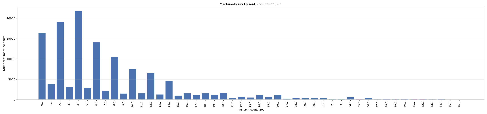

### mnt_prov_count_30d

- **dtype** float64 · **count** 134280 · **unique** 2 · **missing** 0 (0.0%)
- **distinct values**: 0.0 (51.7%), 1.0 (48.3%)

### mnt_corr_count_60d

- **dtype** float64 · **count** 134280 · **unique** 76 · **missing** 0 (0.0%)
- **range** 0.0 → 75.0 (span 75.0) · **Q1/median/Q3** 6.0 / 11.0 / 18.0
- **mean** 14.494 · **std** 13.347 · **skew** 1.745

**Outliers** — flagged values per method:

| method | normal band | below — n (range) | above — n (range) |
|---|---|---|---|
| IQR (k=1.5) | [-12.0, 36.0] | 0 — | 11802 [37.0, 75.0] |
| z-score (k=3) | [-25.547, 54.534] | 0 — | 2572 [55.0, 75.0] |

**Outliers by machine** (IQR k=1.5 and z-score k=3, fences recomputed per machine):

| machine | n | IQR below | IQR above | z-score below | z-score above |
|---|---|---|---|---|---|
| MACH-01 | 8952 | 537 | 72 | 286 | 0 |
| MACH-02 | 8952 | 0 | 1070 | 0 | 0 |
| MACH-03 | 8952 | 0 | 0 | 0 | 0 |
| MACH-04 | 8952 | 0 | 0 | 0 | 0 |
| MACH-05 | 8952 | 0 | 0 | 0 | 0 |
| MACH-06 | 8952 | 0 | 0 | 0 | 0 |
| MACH-07 | 8952 | 0 | 0 | 0 | 0 |
| MACH-08 | 8952 | 0 | 0 | 0 | 0 |
| MACH-09 | 8952 | 0 | 0 | 0 | 0 |
| MACH-10 | 8952 | 110 | 0 | 0 | 0 |
| MACH-11 | 8952 | 0 | 0 | 0 | 0 |
| MACH-12 | 8952 | 0 | 0 | 0 | 0 |
| MACH-13 | 8952 | 346 | 0 | 0 | 0 |
| MACH-14 | 8952 | 0 | 0 | 0 | 0 |
| MACH-15 | 8952 | 39 | 0 | 0 | 0 |
| **total** | 134280 | 1032 | 1142 | 286 | 0 |

### mnt_prov_count_60d

- **dtype** float64 · **count** 134280 · **unique** 3 · **missing** 0 (0.0%)
- **range** 0.0 → 2.0 (span 2.0) · **Q1/median/Q3** 1.0 / 1.0 / 1.0
- **mean** 0.961 · **std** 0.197 · **skew** -4.424

**Outliers** — flagged values per method:

| method | normal band | below — n (range) | above — n (range) |
|---|---|---|---|
| IQR (k=1.5) | [1.0, 1.0] | 5300 [0.0, 0.0] | 126 [2.0, 2.0] |
| z-score (k=3) | [0.37, 1.553] | 5300 [0.0, 0.0] | 126 [2.0, 2.0] |

**Outliers by machine** (IQR k=1.5 and z-score k=3, fences recomputed per machine):

| machine | n | IQR below | IQR above | z-score below | z-score above |
|---|---|---|---|---|---|
| MACH-01 | 8952 | 354 | 8 | 354 | 8 |
| MACH-02 | 8952 | 348 | 4 | 348 | 4 |
| MACH-03 | 8952 | 356 | 10 | 356 | 10 |
| MACH-04 | 8952 | 352 | 10 | 352 | 10 |
| MACH-05 | 8952 | 352 | 6 | 352 | 6 |
| MACH-06 | 8952 | 354 | 4 | 354 | 4 |
| MACH-07 | 8952 | 362 | 16 | 362 | 16 |
| MACH-08 | 8952 | 356 | 10 | 356 | 10 |
| MACH-09 | 8952 | 356 | 12 | 356 | 12 |
| MACH-10 | 8952 | 356 | 10 | 356 | 10 |
| MACH-11 | 8952 | 350 | 8 | 350 | 8 |
| MACH-12 | 8952 | 356 | 12 | 356 | 12 |
| MACH-13 | 8952 | 346 | 0 | 346 | 0 |
| MACH-14 | 8952 | 356 | 14 | 356 | 14 |
| MACH-15 | 8952 | 346 | 2 | 346 | 2 |
| **total** | 134280 | 5300 | 126 | 5300 | 126 |
- **distinct values**: 0.0, 1.0, 2.0

### mnt_corr_days_since_last

- **dtype** float64 · **count** 129727 · **unique** 2302 · **missing** 4553 (3.39%)
- **range** 0.0 → 95.875 (span 95.875) · **Q1/median/Q3** 2.25 / 6.875 / 15.792
- **mean** 11.481 · **std** 13.38 · **skew** 2.209

**Outliers** — flagged values per method:

| method | normal band | below — n (range) | above — n (range) |
|---|---|---|---|
| IQR (k=1.5) | [-18.063, 36.104] | 0 — | 7092 [36.125, 95.875] |
| z-score (k=3) | [-28.66, 51.622] | 0 — | 2713 [51.625, 95.875] |

**Outliers by machine** (IQR k=1.5 and z-score k=3, fences recomputed per machine):

| machine | n | IQR below | IQR above | z-score below | z-score above |
|---|---|---|---|---|---|
| MACH-01 | 8847 | 0 | 587 | 0 | 234 |
| MACH-02 | 7996 | 0 | 66 | 0 | 36 |
| MACH-03 | 8719 | 0 | 663 | 0 | 326 |
| MACH-04 | 8607 | 0 | 0 | 0 | 0 |
| MACH-05 | 8595 | 0 | 260 | 0 | 110 |
| MACH-06 | 8924 | 0 | 440 | 0 | 0 |
| MACH-07 | 8663 | 0 | 0 | 0 | 0 |
| MACH-08 | 8548 | 0 | 391 | 0 | 124 |
| MACH-09 | 8341 | 0 | 398 | 0 | 171 |
| MACH-10 | 8888 | 0 | 309 | 0 | 0 |
| MACH-11 | 8451 | 0 | 0 | 0 | 0 |
| MACH-12 | 8603 | 0 | 605 | 0 | 92 |
| MACH-13 | 8789 | 0 | 431 | 0 | 168 |
| MACH-14 | 8843 | 0 | 960 | 0 | 291 |
| MACH-15 | 8913 | 0 | 0 | 0 | 0 |
| **total** | 129727 | 0 | 5110 | 0 | 1552 |

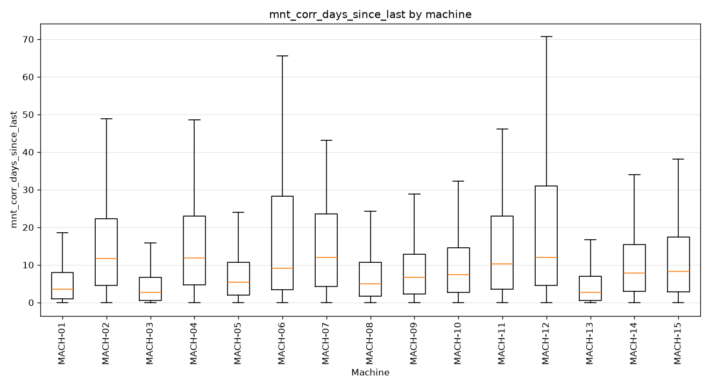

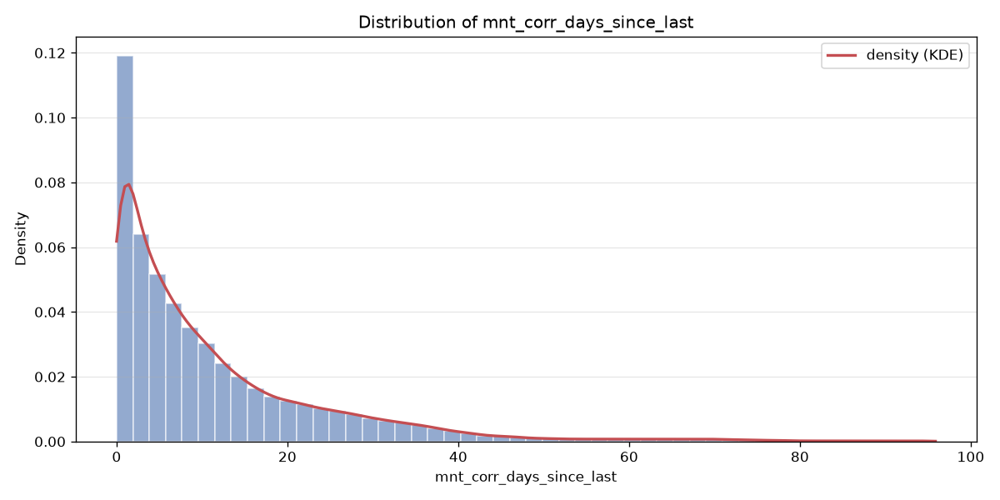

### mnt_prov_days_since_last

- **dtype** float64 · **count** 129088 · **unique** 1448 · **missing** 5192 (3.87%)
- **range** 0.0 → 60.292 (span 60.292) · **Q1/median/Q3** 14.917 / 29.875 / 44.792
- **mean** 29.863 · **std** 17.256 · **skew** 0.001

**Outliers** — flagged values per method:

| method | normal band | below — n (range) | above — n (range) |
|---|---|---|---|
| IQR (k=1.5) | [-29.896, 89.604] | 0 — | 0 — |
| z-score (k=3) | [-21.906, 81.632] | 0 — | 0 — |

**Outliers by machine** (IQR k=1.5 and z-score k=3, fences recomputed per machine):

| machine | n | IQR below | IQR above | z-score below | z-score above |
|---|---|---|---|---|---|
| MACH-01 | 8606 | 0 | 0 | 0 | 0 |
| MACH-02 | 8608 | 0 | 0 | 0 | 0 |
| MACH-03 | 8602 | 0 | 0 | 0 | 0 |
| MACH-04 | 8610 | 0 | 0 | 0 | 0 |
| MACH-05 | 8606 | 0 | 0 | 0 | 0 |
| MACH-06 | 8608 | 0 | 0 | 0 | 0 |
| MACH-07 | 8602 | 0 | 0 | 0 | 0 |
| MACH-08 | 8606 | 0 | 0 | 0 | 0 |
| MACH-09 | 8602 | 0 | 0 | 0 | 0 |
| MACH-10 | 8602 | 0 | 0 | 0 | 0 |
| MACH-11 | 8610 | 0 | 0 | 0 | 0 |
| MACH-12 | 8606 | 0 | 0 | 0 | 0 |
| MACH-13 | 8610 | 0 | 0 | 0 | 0 |
| MACH-14 | 8602 | 0 | 0 | 0 | 0 |
| MACH-15 | 8608 | 0 | 0 | 0 | 0 |
| **total** | 129088 | 0 | 0 | 0 | 0 |

### label_failure_next_6h

- **dtype** Int64 · **count** 134190 · **unique** 2 · **missing** 90 (0.07%)
- **distinct values**: 0 (99.1%), 1 (0.9%)

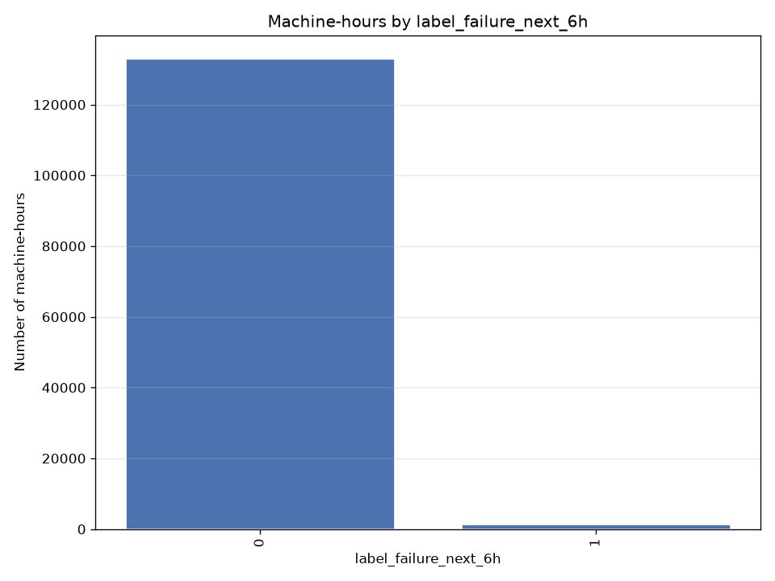

### label_failure_next_12h

- **dtype** Int64 · **count** 134100 · **unique** 2 · **missing** 180 (0.13%)
- **distinct values**: 0 (98.2%), 1 (1.8%)

### label_failure_next_24h

- **dtype** Int64 · **count** 133920 · **unique** 2 · **missing** 360 (0.27%)
- **distinct values**: 0 (96.4%), 1 (3.6%)

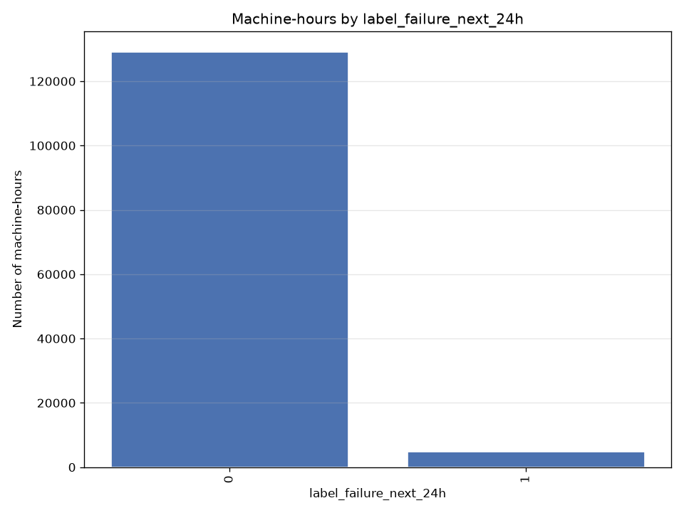

### label_failure_next_48h

- **dtype** Int64 · **count** 133560 · **unique** 2 · **missing** 720 (0.54%)
- **distinct values**: 0 (93.1%), 1 (6.9%)

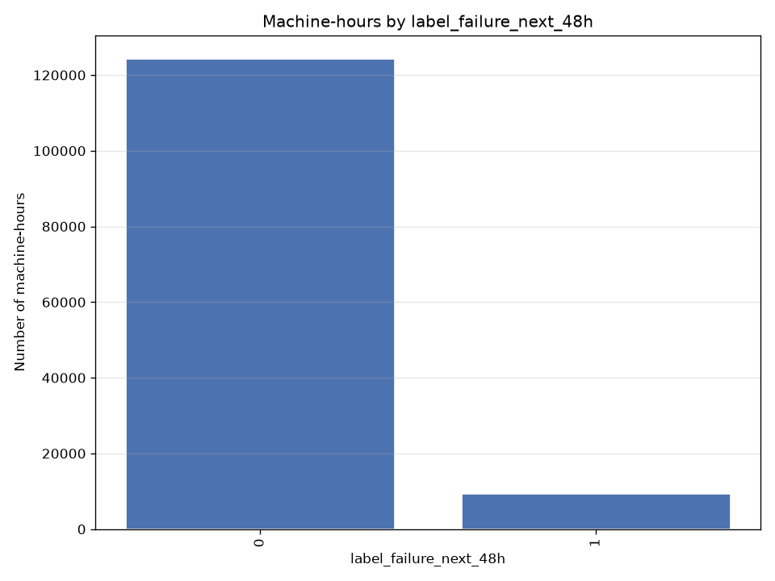

## Notes for business teams

- High `pct_missing` or `n_outliers_iqr` flags columns to clean in Silver (imputation / outliers, configured in src/sources/registry.py).
- Compare Bronze vs Silver to see the effect of the treatment.
