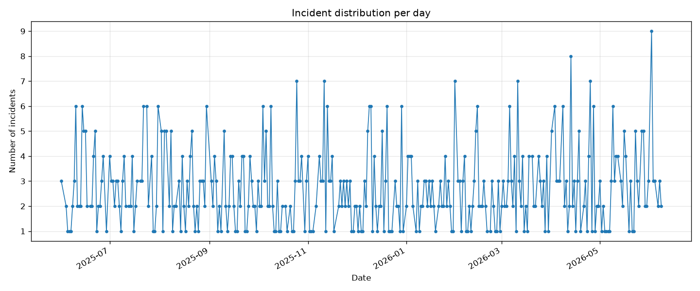
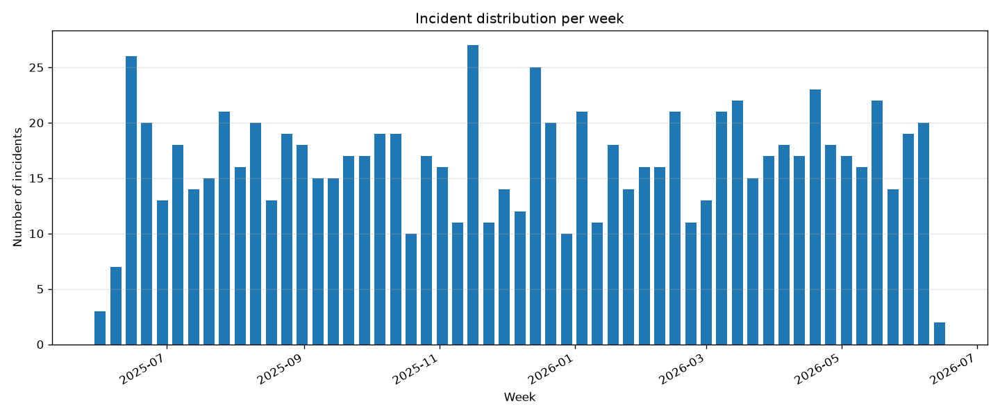
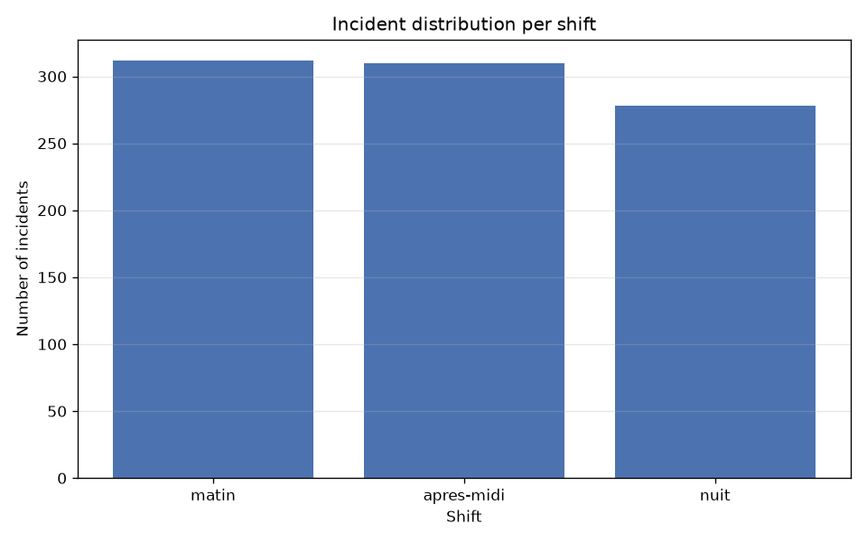
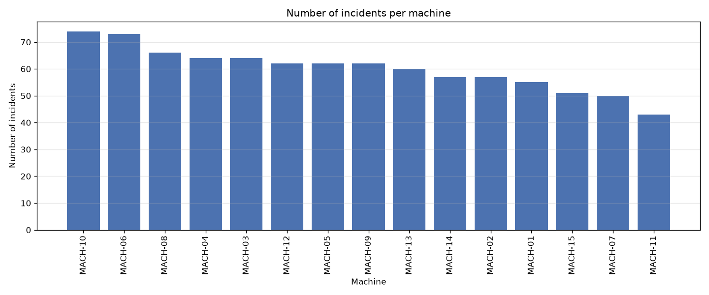
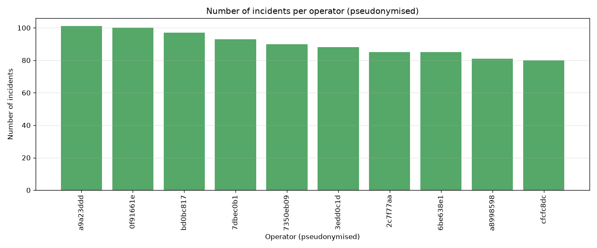
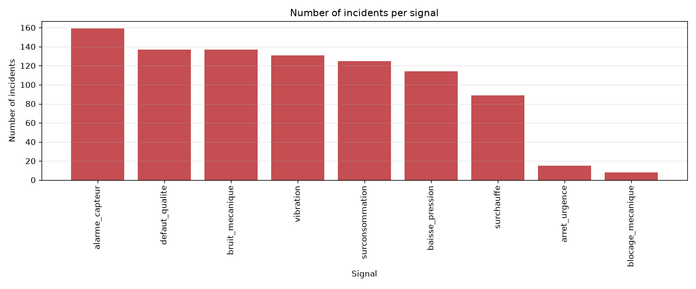
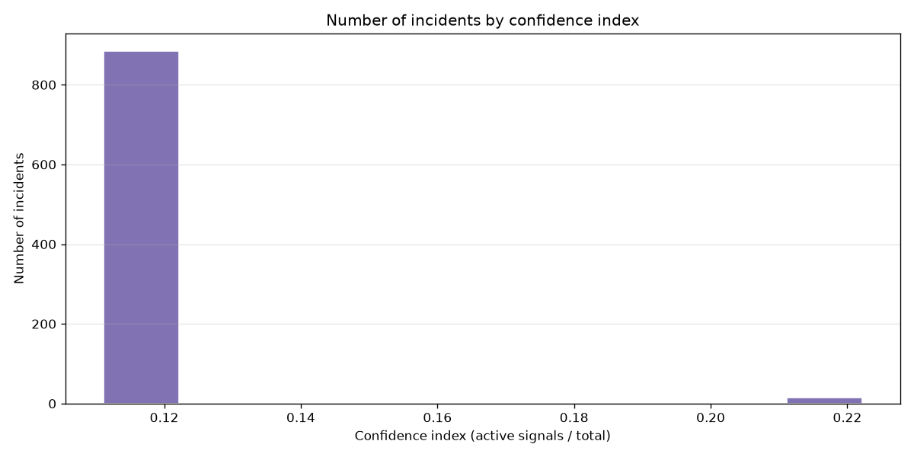
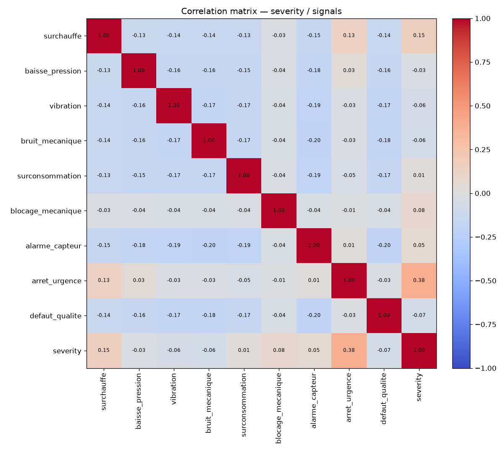
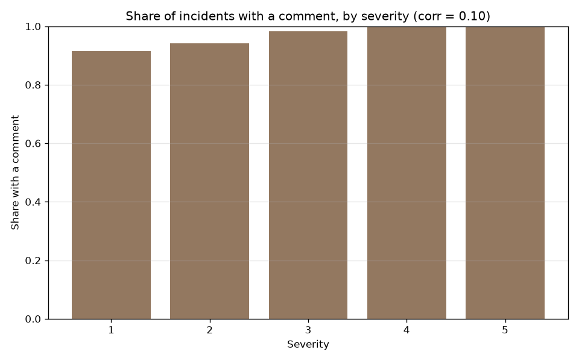

# Incident dataset — synthesis report

> Run `202606161715` · shareable summary for business teams. The data is anonymised:
> operators are pseudonymised and cannot be re-identified.

## Dataset at a glance

| Indicator | Value |
|---|---|
| Reporting period | 2025-06-01 → 2026-06-08 |
| Number of incidents | 900 |
| Unique machines | 15 |
| Unique operators (pseudonymised) | 10 |
| Signals tracked | 9 |
| Missing values (total) | 59 |
| Mean confidence index | 0.113 |

**How to read this report.** Each incident records the machine, the shift, the
severity and the set of *signals* (anomaly types prefixed by `type_`) that fired.
The **confidence index** of an incident is the share of signals active at once:
an incident corroborated by several signals is considered more reliable than one
relying on a single isolated signal.

## 1. Temporal distributions

### Incident distribution per day

### Incident distribution per week

### Incident distribution per shift

## 2. Incident histograms

### Incidents per machine

### Incidents per operator (pseudonymised)

### Incidents per signal

### Incidents per confidence index

## 3. Correlations

### Correlation: severity / signals

### Correlation: severity / comment presence

## Notes for business teams

- Machines and shifts concentrating the most incidents (sections 1 & 2) are
  natural priorities for preventive maintenance.
- The severity / signals correlation (3.1) highlights which signals tend to go
  with more severe incidents.
- Incidents with a low confidence index (single signal) may deserve a closer
  manual review.
