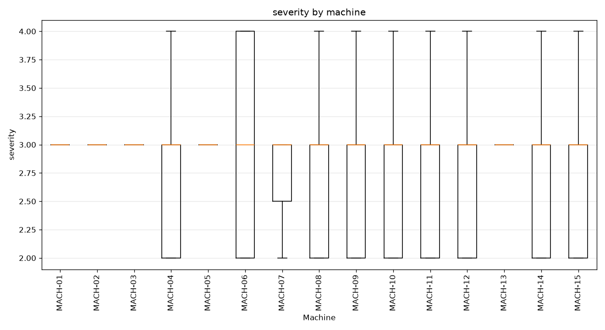
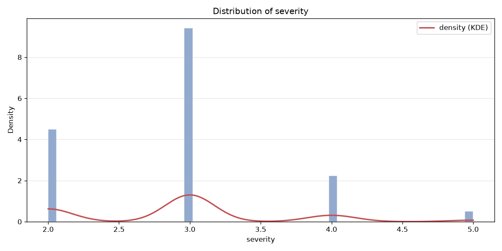

# incidents — bronze dataset report

> Bronze layer · per-feature understanding.

## Dataset at a glance

| Indicator | Value |
|---|---|
| Layer | bronze |
| Rows | 1245 |
| Columns | 18 |
| Unique machines | 15 |
| Missing values (total) | 0 |

**How to read this report.** Each feature shows a type-aware synthesis (range, missing, spread, skew, outliers, top values…) and, for numeric features, a boxplot across machines and its distribution (histogram + KDE).

## Per-feature analysis

### incident_id

- **dtype** str · **count** 1245 · **unique** 1245 · **missing** 0 (0.0%)
- **most frequent** `INC-000001` (1, 0.08%)

### date

- **dtype** datetime64[us] · **count** 1245 · **unique** 353 · **missing** 0 (0.0%)
- **range** 2025-06-01 00:00 → 2026-06-08 00:00 (span 372 days)

### time

- **dtype** str · **count** 1245 · **unique** 620 · **missing** 0 (0.0%)
- **most frequent** `16:03` (13, 1.04%)

### operator_name

- **dtype** str · **count** 1245 · **unique** 15 · **missing** 0 (0.0%)
- **most frequent** `a9a23ddd3ed5035f` (155, 12.45%)
- **distinct values**: 0f91661e3337f8f5, 1c11f450b7c62613, 2c7f77aaeb432773, 3edd0c1d48105a72, 42249941bae3bba5, 6ab161075c1cdd35, 6be638e1d5e0f619, 7350eb0988b06c76, 7dbec0b1e9bc4bb2, a3a20f381c1923b5, a89985989bad7e23, a9a23ddd3ed5035f, acd02d036a657382, bd0bc817907ee4ef, cfcfc8dc82a39012

### machine_id

- **dtype** str · **count** 1245 · **unique** 15 · **missing** 0 (0.0%)
- **most frequent** `MACH-03` (200, 16.06%)
- **distinct values**: MACH-01, MACH-02, MACH-03, MACH-04, MACH-05, MACH-06, MACH-07, MACH-08, MACH-09, MACH-10, MACH-11, MACH-12, MACH-13, MACH-14, MACH-15

### severity

- **dtype** int64 · **count** 1245 · **unique** 4 · **missing** 0 (0.0%)
- **range** 2.0 → 5.0 (span 3.0) · **Q1/median/Q3** 2.0 / 3.0 / 3.0
- **mean** 2.925 · **std** 0.722 · **skew** 0.601 · **IQR outliers** 38
- **distinct values**: 2, 3, 4, 5

### operator_badge

- **dtype** str · **count** 1245 · **unique** 10 · **missing** 0 (0.0%)
- **most frequent** `OP_BE98CC` (155, 12.45%)
- **distinct values**: OP_0F74D6, OP_1EFDE8, OP_24A324, OP_3E8361, OP_6A17F8, OP_BE98CC, OP_D2B99E, OP_F211AD, OP_F9965E, OP_FDB378

### comment

- **dtype** str · **count** 1245 · **unique** 46 · **missing** 0 (0.0%)
- **most frequent** `bruit mécanique anormal` (129, 10.36%)

### shift

- **dtype** str · **count** 1245 · **unique** 3 · **missing** 0 (0.0%)
- **most frequent** `matin` (427, 34.3%)
- **distinct values**: apres-midi, matin, nuit

### type_surchauffe

- **dtype** Int64 · **count** 1245 · **unique** 2 · **missing** 0 (0.0%)
- **range** 0.0 → 1.0 (span 1.0) · **Q1/median/Q3** 0.0 / 0.0 / 0.0
- **mean** 0.108 · **std** 0.31 · **skew** 2.535 · **IQR outliers** 134
- **distinct values**: 0, 1

### type_baisse_pression

- **dtype** Int64 · **count** 1245 · **unique** 2 · **missing** 0 (0.0%)
- **range** 0.0 → 1.0 (span 1.0) · **Q1/median/Q3** 0.0 / 0.0 / 0.0
- **mean** 0.135 · **std** 0.342 · **skew** 2.14 · **IQR outliers** 168
- **distinct values**: 0, 1

### type_vibration

- **dtype** Int64 · **count** 1245 · **unique** 2 · **missing** 0 (0.0%)
- **range** 0.0 → 1.0 (span 1.0) · **Q1/median/Q3** 0.0 / 0.0 / 0.0
- **mean** 0.144 · **std** 0.351 · **skew** 2.033 · **IQR outliers** 179
- **distinct values**: 0, 1

### type_bruit_mecanique

- **dtype** Int64 · **count** 1245 · **unique** 2 · **missing** 0 (0.0%)
- **range** 0.0 → 1.0 (span 1.0) · **Q1/median/Q3** 0.0 / 0.0 / 0.0
- **mean** 0.166 · **std** 0.372 · **skew** 1.795 · **IQR outliers** 207
- **distinct values**: 0, 1

### type_surconsommation

- **dtype** Int64 · **count** 1245 · **unique** 2 · **missing** 0 (0.0%)
- **range** 0.0 → 1.0 (span 1.0) · **Q1/median/Q3** 0.0 / 0.0 / 0.0
- **mean** 0.12 · **std** 0.325 · **skew** 2.346 · **IQR outliers** 149
- **distinct values**: 0, 1

### type_blocage_mecanique

- **dtype** Int64 · **count** 1245 · **unique** 2 · **missing** 0 (0.0%)
- **range** 0.0 → 1.0 (span 1.0) · **Q1/median/Q3** 0.0 / 0.0 / 0.0
- **mean** 0.006 · **std** 0.08 · **skew** 12.369 · **IQR outliers** 8
- **distinct values**: 0, 1

### type_alarme_capteur

- **dtype** Int64 · **count** 1245 · **unique** 2 · **missing** 0 (0.0%)
- **range** 0.0 → 1.0 (span 1.0) · **Q1/median/Q3** 0.0 / 0.0 / 0.0
- **mean** 0.173 · **std** 0.378 · **skew** 1.734 · **IQR outliers** 215
- **distinct values**: 0, 1

### type_arret_urgence

- **dtype** Int64 · **count** 1245 · **unique** 2 · **missing** 0 (0.0%)
- **range** 0.0 → 1.0 (span 1.0) · **Q1/median/Q3** 0.0 / 0.0 / 0.0
- **mean** 0.015 · **std** 0.123 · **skew** 7.918 · **IQR outliers** 19
- **distinct values**: 0, 1

### type_defaut_qualite

- **dtype** Int64 · **count** 1245 · **unique** 2 · **missing** 0 (0.0%)
- **range** 0.0 → 1.0 (span 1.0) · **Q1/median/Q3** 0.0 / 0.0 / 0.0
- **mean** 0.145 · **std** 0.353 · **skew** 2.015 · **IQR outliers** 181
- **distinct values**: 0, 1

## Notes for business teams

- High `pct_missing` or `n_outliers_iqr` flags columns to clean in Silver (imputation / outliers, configured in src/sources/registry.py).
- Compare Bronze vs Silver to see the effect of the treatment.
