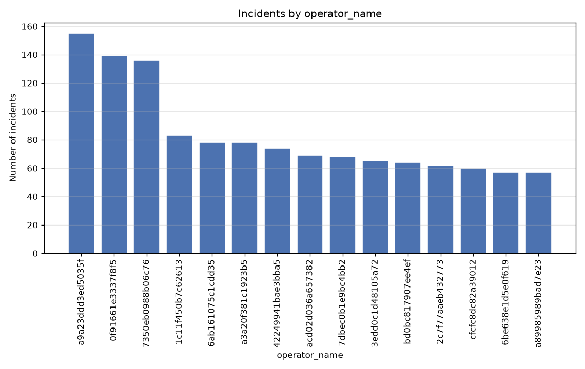
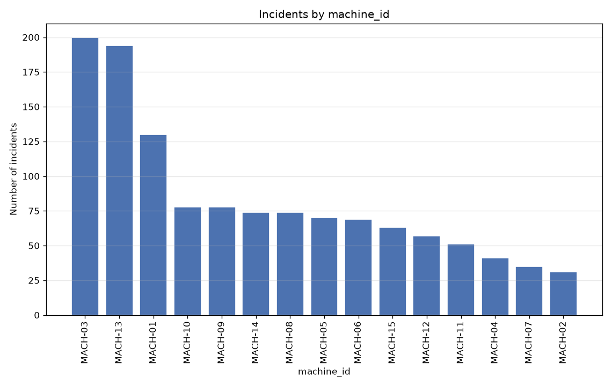
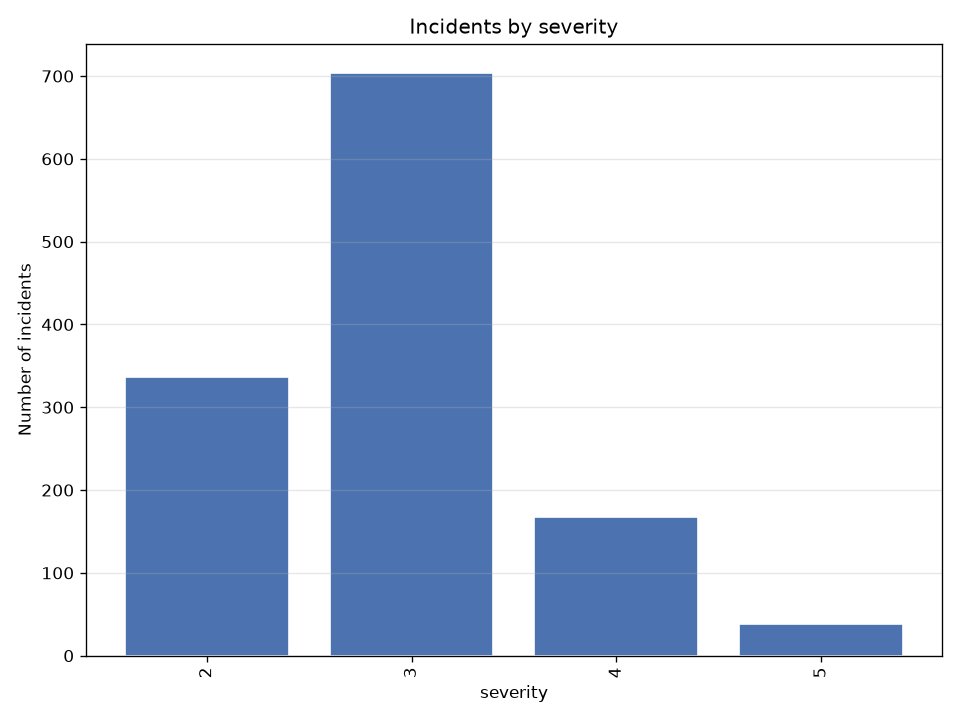
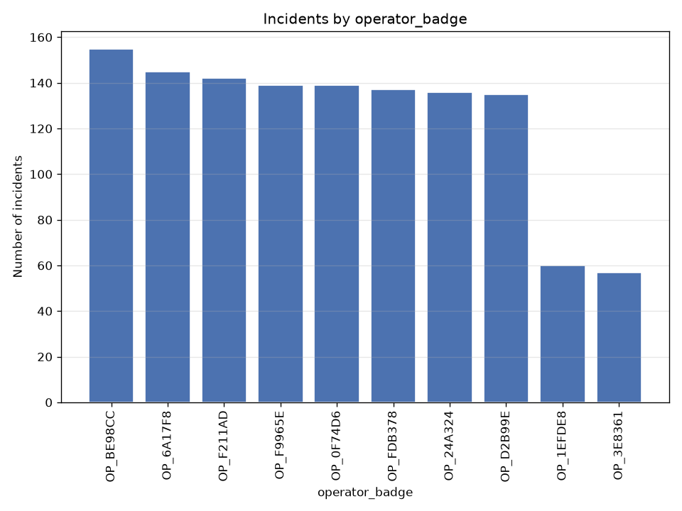
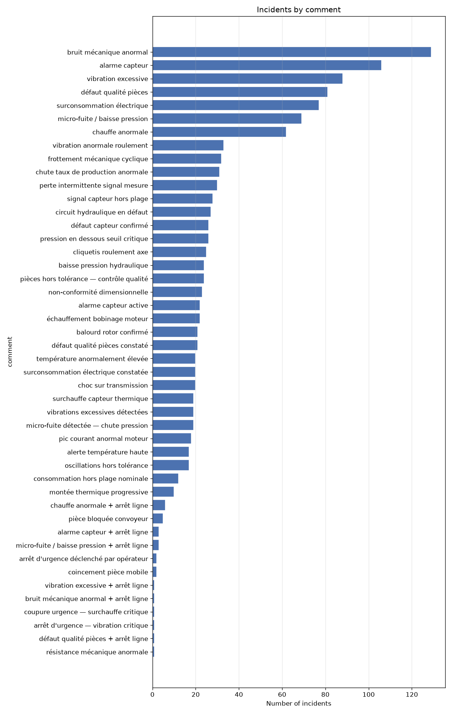
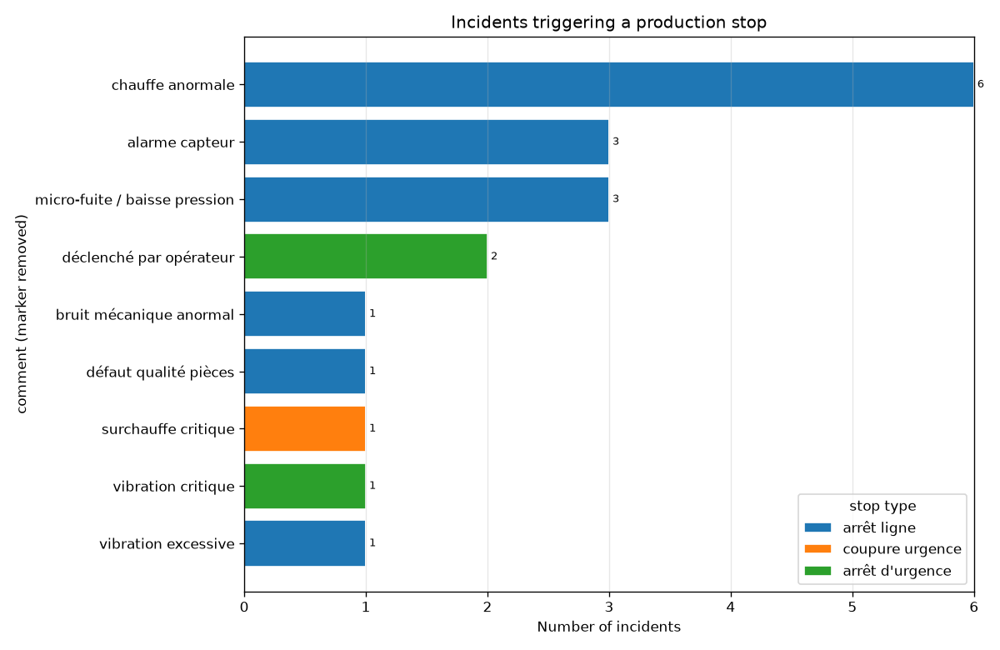
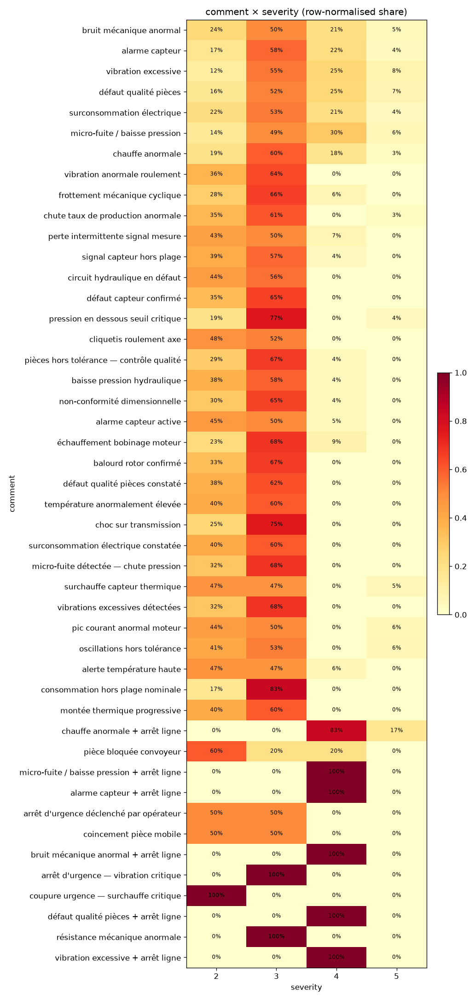
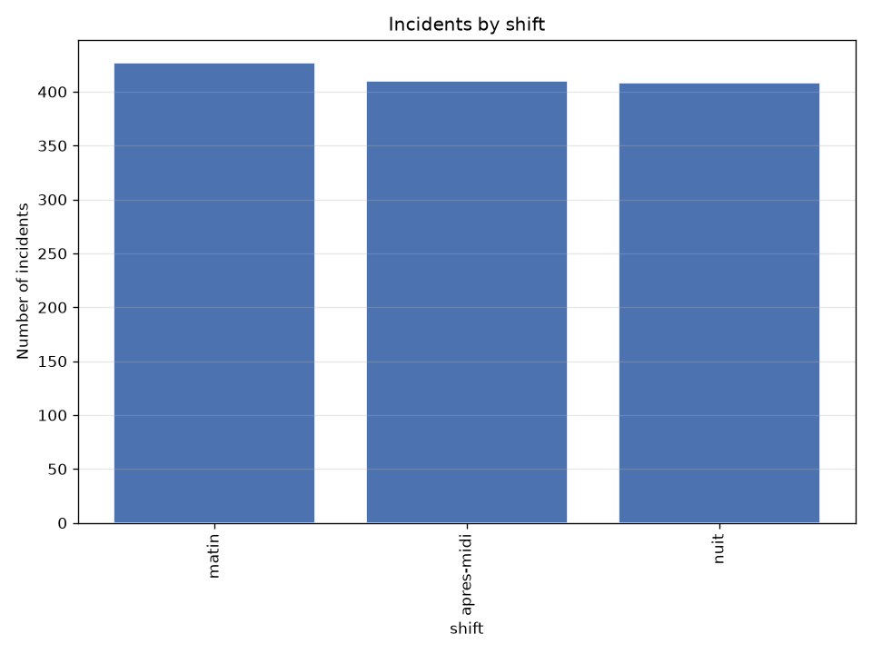

# incidents — bronze dataset report

> Bronze layer · per-feature understanding.

## Dataset at a glance

| Indicator | Value |
|---|---|
| Layer | bronze |
| Rows | 1245 |
| Columns | 18 |
| Unique machines | 15 |
| Missing values (total) | 0 |

**How to read this report.** Each feature shows a type-aware synthesis (range, missing, spread, skew, outliers, top values…) and, for numeric features, a boxplot across machines and its distribution (histogram + KDE).

## Per-feature analysis

### incident_id (OK)

- **dtype** str · **count** 1245 · **unique** 1245 · **missing** 0 (0.0%)

### date (OK)

- **dtype** datetime64[us] · **count** 1245 · **unique** 353 · **missing** 0 (0.0%)
- **range** 2025-06-01 00:00 → 2026-06-08 00:00 (span 372 days)

### time (OK)

- **dtype** str · **count** 1245 · **unique** 620 · **missing** 0 (0.0%)
- **range** 00:06 → 23:55

### operator_name (OK)

- **dtype** str · **count** 1245 · **unique** 15 · **missing** 0 (0.0%)
- **most frequent** `a9a23ddd3ed5035f` (155, 12.45%)
- **distinct values**: 0f91661e3337f8f5, 1c11f450b7c62613, 2c7f77aaeb432773, 3edd0c1d48105a72, 42249941bae3bba5, 6ab161075c1cdd35, 6be638e1d5e0f619, 7350eb0988b06c76, 7dbec0b1e9bc4bb2, a3a20f381c1923b5, a89985989bad7e23, a9a23ddd3ed5035f, acd02d036a657382, bd0bc817907ee4ef, cfcfc8dc82a39012

### machine_id (OK)

- **dtype** str · **count** 1245 · **unique** 15 · **missing** 0 (0.0%)
- **most frequent** `MACH-03` (200, 16.06%)
- **distinct values**: MACH-01, MACH-02, MACH-03, MACH-04, MACH-05, MACH-06, MACH-07, MACH-08, MACH-09, MACH-10, MACH-11, MACH-12, MACH-13, MACH-14, MACH-15

### severity (OK)

- **dtype** int64 · **count** 1245 · **unique** 4 · **missing** 0 (0.0%)
- **range** 2.0 → 5.0 (span 3.0)
- **distinct values**: 2, 3, 4, 5

### operator_badge (NOK)

- **dtype** str · **count** 1245 · **unique** 10 · **missing** 0 (0.0%)
- **most frequent** `OP_BE98CC` (155, 12.45%)
- **distinct values**: OP_0F74D6, OP_1EFDE8, OP_24A324, OP_3E8361, OP_6A17F8, OP_BE98CC, OP_D2B99E, OP_F211AD, OP_F9965E, OP_FDB378
- **NOK reason**: same distinct count as operator_name

### comment (OK)

- **dtype** str · **count** 1245 · **unique** 46 · **missing** 0 (0.0%)
- **most frequent** `bruit mécanique anormal` (129, 10.36%)

### shift (OK)

- **dtype** str · **count** 1245 · **unique** 3 · **missing** 0 (0.0%)
- **most frequent** `matin` (427, 34.3%)
- **distinct values**: apres-midi, matin, nuit

- **time ranges by shift** (derived from `time`):

| shift | time range |
|---|---|
| matin | 06:02 → 13:55 |
| apres-midi | 14:02 → 21:57 |
| nuit | 22:07 → 05:53 (overnight) |

### type_surchauffe (OK)

- **dtype** Int64 · **count** 1245 · **unique** 2 · **missing** 0 (0.0%)
- **distinct values**: 0 (89.2%), 1 (10.8%)

### type_baisse_pression (OK)

- **dtype** Int64 · **count** 1245 · **unique** 2 · **missing** 0 (0.0%)
- **distinct values**: 0 (86.5%), 1 (13.5%)

### type_vibration (OK)

- **dtype** Int64 · **count** 1245 · **unique** 2 · **missing** 0 (0.0%)
- **distinct values**: 0 (85.6%), 1 (14.4%)

### type_bruit_mecanique (OK)

- **dtype** Int64 · **count** 1245 · **unique** 2 · **missing** 0 (0.0%)
- **distinct values**: 0 (83.4%), 1 (16.6%)

### type_surconsommation (OK)

- **dtype** Int64 · **count** 1245 · **unique** 2 · **missing** 0 (0.0%)
- **distinct values**: 0 (88.0%), 1 (12.0%)

### type_blocage_mecanique (OK)

- **dtype** Int64 · **count** 1245 · **unique** 2 · **missing** 0 (0.0%)
- **distinct values**: 0 (99.4%), 1 (0.6%)

### type_alarme_capteur (OK)

- **dtype** Int64 · **count** 1245 · **unique** 2 · **missing** 0 (0.0%)
- **distinct values**: 0 (82.7%), 1 (17.3%)

### type_arret_urgence (OK)

- **dtype** Int64 · **count** 1245 · **unique** 2 · **missing** 0 (0.0%)
- **distinct values**: 0 (98.5%), 1 (1.5%)

### type_defaut_qualite (OK)

- **dtype** Int64 · **count** 1245 · **unique** 2 · **missing** 0 (0.0%)
- **distinct values**: 0 (85.5%), 1 (14.5%)

## Notes for business teams

- High `pct_missing` or `n_outliers_iqr` flags columns to clean in Silver (imputation / outliers, configured in src/sources/registry.py).
- Compare Bronze vs Silver to see the effect of the treatment.
