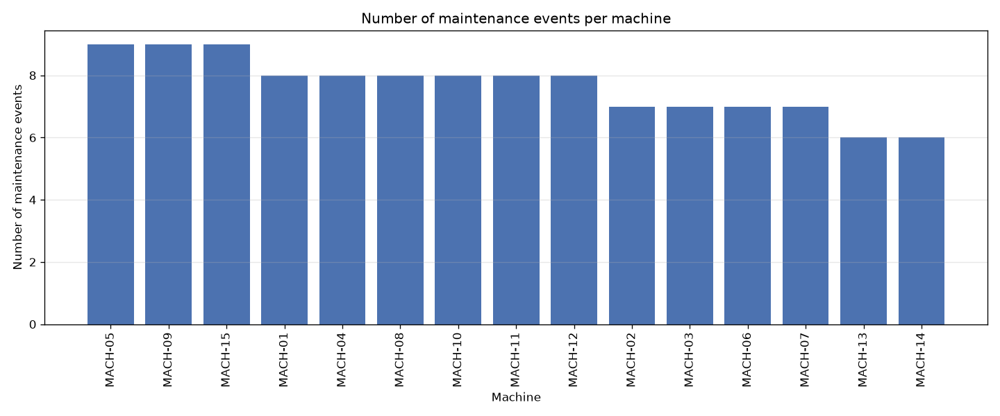
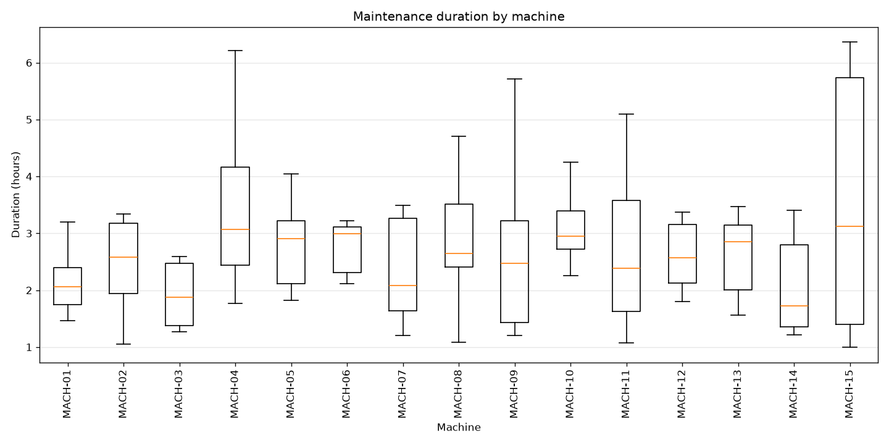
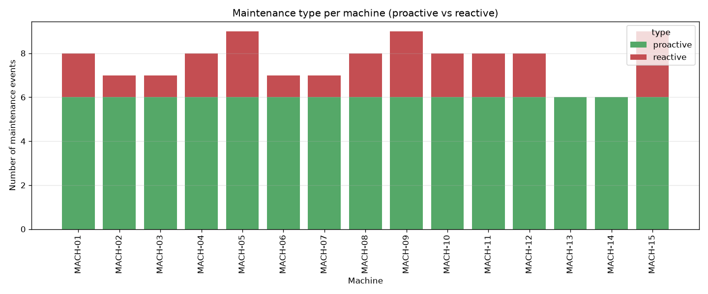
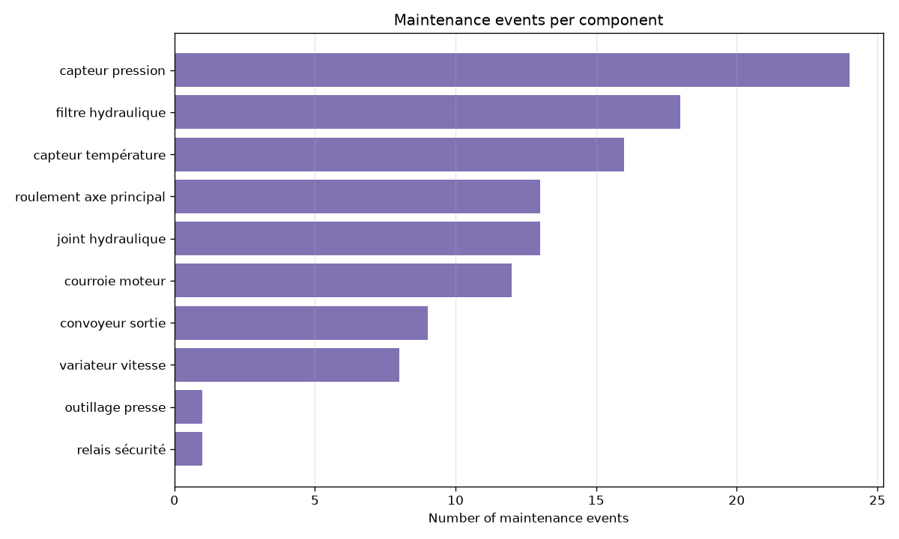

# Machines / maintenance — synthesis report

> Run `202606171538` · shareable summary for business teams.

## Dataset at a glance

| Indicator | Value |
|---|---|
| Reporting period | 2025-06-15 → 2026-05-30 |
| Maintenance events | 115 |
| Unique machines | 15 |
| Proactive | 90 |
| Reactive | 25 |
| Mean duration (hours) | 2.94 |
| Distinct components | 10 |
| Linked to an incident | 25 |

**How to read this report.** Each row is a maintenance event on a machine, either *proactive* (scheduled) or *reactive* (after an incident). The graphs show where maintenance effort concentrates — by machine, duration, type and component.

## 1. Maintenance overview

### Maintenance events per machine

### Maintenance duration by machine

### Proactive vs reactive per machine

### Maintenance events per component

## Notes for business teams

- Machines with many reactive maintenances are candidates for reinforced preventive plans.
- Components appearing most often (1.4) drive spare-parts and inspection priorities.
