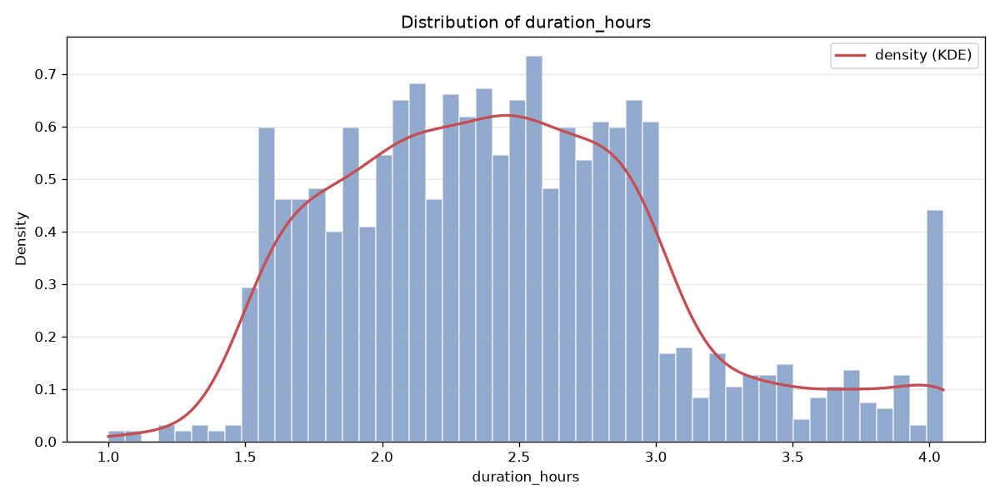

# machines — silver dataset report

> Silver layer · per-feature understanding.

## Dataset at a glance

| Indicator | Value |
|---|---|
| Layer | silver |
| Rows | 1562 |
| Columns | 11 |
| Unique machines | 15 |
| Missing values (total) | 90 |

**How to read this report.** Each feature shows a type-aware synthesis (range, missing, spread, skew, outliers, top values…) and, for numeric features, a boxplot across machines and its distribution (histogram + KDE).

## Per-feature analysis

### maintenance_id

- **dtype** int64 · **count** 1562 · **unique** 1562 · **missing** 0 (0.0%)
- **range** 1.0 → 1562.0 (span 1561.0) · **Q1/median/Q3** 391.25 / 781.5 / 1171.75
- **mean** 781.5 · **std** 451.055 · **skew** 0.0 · **IQR outliers** 0

### machine_id

- **dtype** str · **count** 1562 · **unique** 15 · **missing** 0 (0.0%)
- **most frequent** `MACH-03` (271, 17.35%)
- **distinct values**: MACH-01, MACH-02, MACH-03, MACH-04, MACH-05, MACH-06, MACH-07, MACH-08, MACH-09, MACH-10, MACH-11, MACH-12, MACH-13, MACH-14, MACH-15

### maintenance_at

- **dtype** datetime64[us, UTC] · **count** 1562 · **unique** 1474 · **missing** 0 (0.0%)
- **range** 2025-06-02 04:42 → 2026-06-09 02:29 (span 371 days)

### maintenance_type

- **dtype** str · **count** 1562 · **unique** 2 · **missing** 0 (0.0%)
- **most frequent** `reactive` (1472, 94.24%)
- **distinct values**: proactive, reactive

### action_type

- **dtype** str · **count** 1562 · **unique** 3 · **missing** 0 (0.0%)
- **most frequent** `intervention_corrective` (1447, 92.64%)
- **distinct values**: changement_programme, changement_suite_panne, intervention_corrective

### component

- **dtype** str · **count** 1562 · **unique** 12 · **missing** 0 (0.0%)
- **most frequent** `roulement axe principal` (463, 29.64%)
- **distinct values**: capteur pression, capteur température, convoyeur sortie, courroie moteur, filtre hydraulique, joint hydraulique, outillage presse, relais sécurité, roulement axe principal, système sécurité, transmission, variateur vitesse

### description

- **dtype** str · **count** 1562 · **unique** 42 · **missing** 0 (0.0%)
- **most frequent** `Remplacement capteur + recalibration zéro` (249, 15.94%)

### related_incident_id

- **dtype** str · **count** 1472 · **unique** 1057 · **missing** 90 (5.76%)
- **most frequent** `INC-000037` (3, 0.2%)

### duration_hours

- **dtype** float64 · **count** 1562 · **unique** 246 · **missing** 0 (0.0%)
- **range** 1.0 → 4.05 (span 3.05) · **Q1/median/Q3** 2.0 / 2.41 / 2.82
- **mean** 2.452 · **std** 0.611 · **skew** 0.58 · **IQR outliers** 0

### maintenance_type_code

- **dtype** Int64 · **count** 1562 · **unique** 2 · **missing** 0 (0.0%)
- **range** 0.0 → 1.0 (span 1.0) · **Q1/median/Q3** 1.0 / 1.0 / 1.0
- **mean** 0.942 · **std** 0.233 · **skew** -3.801 · **IQR outliers** 90
- **distinct values**: 0, 1

### component_code

- **dtype** Int64 · **count** 1562 · **unique** 12 · **missing** 0 (0.0%)
- **range** 0.0 → 11.0 (span 11.0) · **Q1/median/Q3** 1.0 / 5.0 / 8.0
- **mean** 5.154 · **std** 3.655 · **skew** -0.02 · **IQR outliers** 0
- **distinct values**: 0, 1, 10, 11, 2, 3, 4, 5, 6, 7, 8, 9

## Notes for business teams

- High `pct_missing` or `n_outliers_iqr` flags columns to clean in Silver (imputation / outliers, configured in src/sources/registry.py).
- Compare Bronze vs Silver to see the effect of the treatment.
