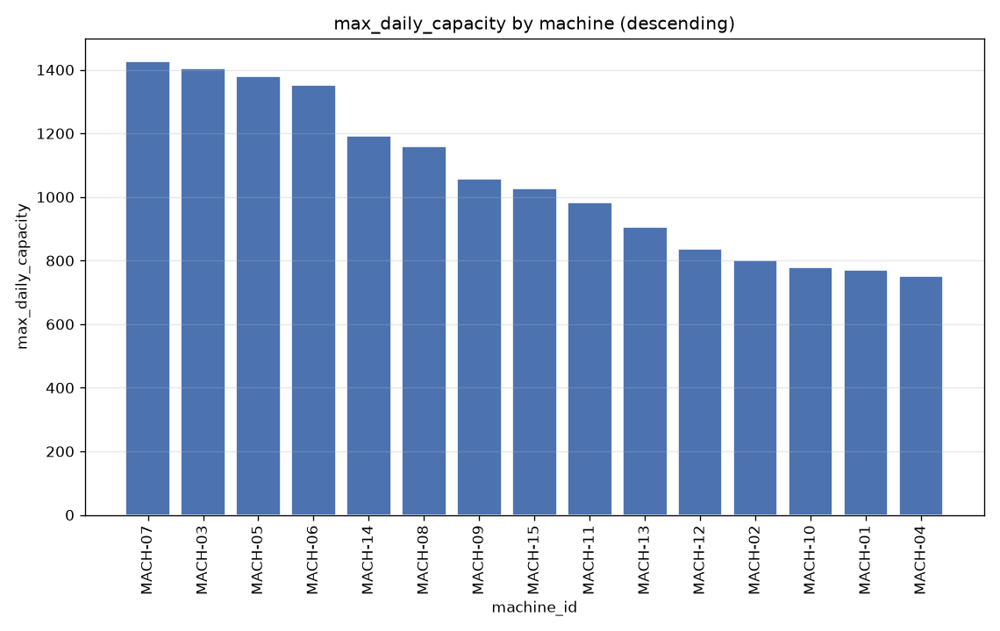
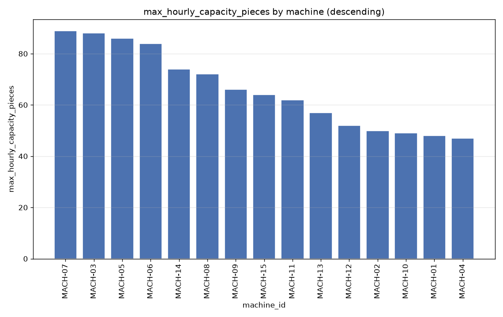
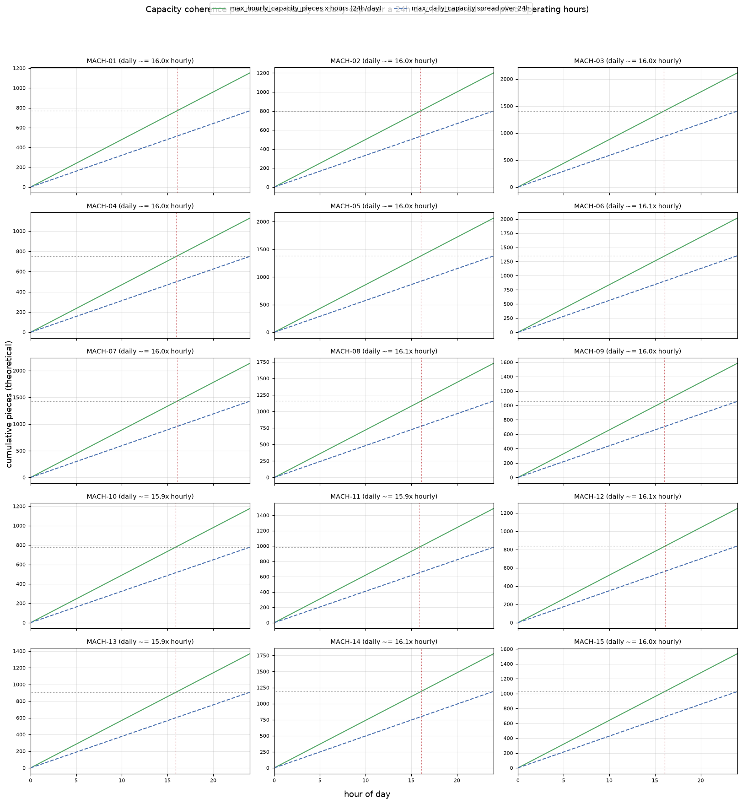
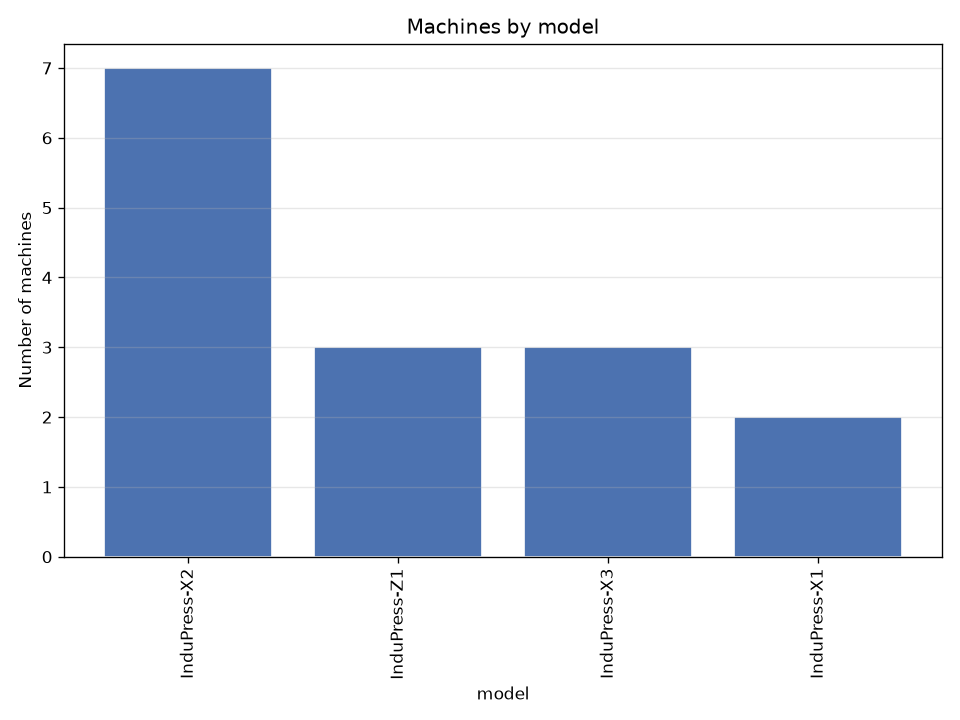
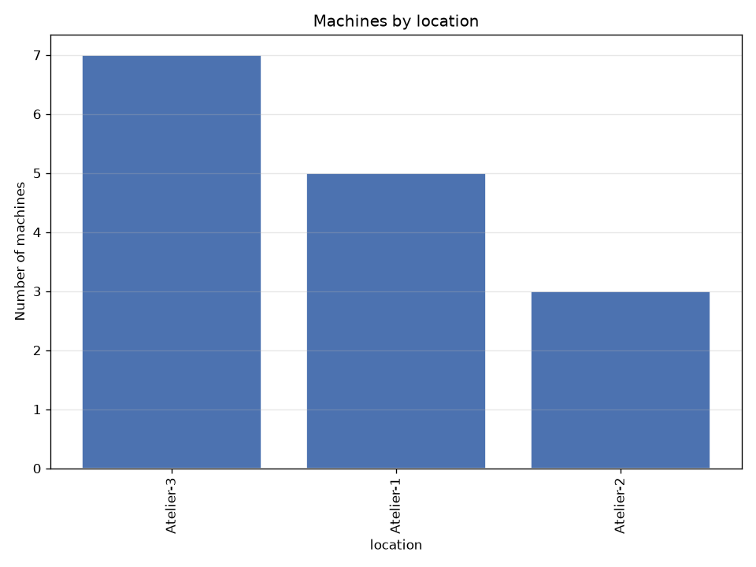
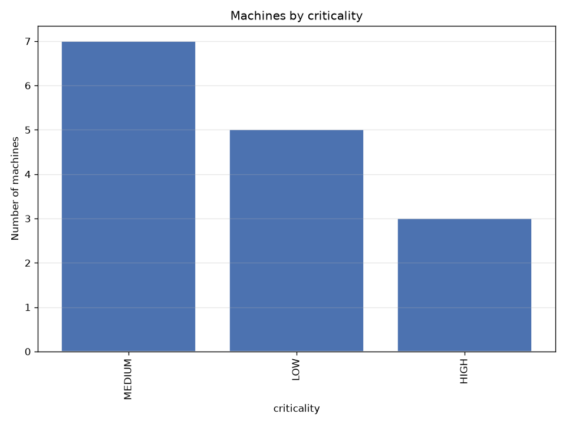

# machine — silver dataset report

> Silver layer · per-feature understanding.

## Dataset at a glance

| Indicator | Value |
|---|---|
| Layer | silver |
| Rows | 15 |
| Columns | 9 |
| Unique machines | 15 |
| Missing values (total) | 0 |

**How to read this report.** Each feature shows a type-aware synthesis (range, missing, spread, skew, outliers, top values…) and, for numeric features, a boxplot across machines and its distribution (histogram + KDE).

## Per-feature analysis

### machine_id (OK)

- **dtype** str · **count** 15 · **unique** 15 · **missing** 0 (0.0%)
- **distinct values**: MACH-01, MACH-02, MACH-03, MACH-04, MACH-05, MACH-06, MACH-07, MACH-08, MACH-09, MACH-10, MACH-11, MACH-12, MACH-13, MACH-14, MACH-15

### commissioning_date (OK)

- **dtype** datetime64[us] · **count** 15 · **unique** 15 · **missing** 0 (0.0%)
- **range** 2019-07-23 00:00 → 2025-05-25 00:00 (span 2133 days)
- **distinct values**: 2019-07-23 00:00:00, 2019-12-30 00:00:00, 2021-04-16 00:00:00, 2021-05-12 00:00:00, 2021-10-21 00:00:00, 2022-01-01 00:00:00, 2022-03-16 00:00:00, 2022-09-15 00:00:00, 2023-01-07 00:00:00, 2023-01-15 00:00:00, 2023-10-18 00:00:00, 2024-02-21 00:00:00, 2024-03-11 00:00:00, 2024-09-07 00:00:00, 2025-05-25 00:00:00

### max_daily_capacity (OK)

- **dtype** int64 · **count** 15 · **unique** 15 · **missing** 0 (0.0%)
- **range** 750.0 → 1428.0 (span 678.0) · **Q1/median/Q3** 819.0 / 1027.0 / 1271.0
- **mean** 1054.867 · **std** 249.971 · **skew** 0.294
- **distinct values**: 1027, 1056, 1158, 1191, 1351, 1380, 1405, 1428, 750, 770, 778, 800, 838, 907, 984

### max_hourly_capacity_pieces (OK)

- **dtype** int64 · **count** 15 · **unique** 15 · **missing** 0 (0.0%)
- **range** 47.0 → 89.0 (span 42.0) · **Q1/median/Q3** 51.0 / 64.0 / 79.0
- **mean** 65.867 · **std** 15.501 · **skew** 0.298
- **distinct values**: 47, 48, 49, 50, 52, 57, 62, 64, 66, 72, 74, 84, 86, 88, 89

### model (OK)

- **dtype** str · **count** 15 · **unique** 4 · **missing** 0 (0.0%)
- **most frequent** `InduPress-X2` (7, 46.67%)
- **distinct values**: InduPress-X1, InduPress-X2, InduPress-X3, InduPress-Z1

### production_line (OK)

- **dtype** str · **count** 15 · **unique** 3 · **missing** 0 (0.0%)
- **most frequent** `Ligne-A` (7, 46.67%)
- **distinct values**: Ligne-A, Ligne-B, Ligne-C

### location (OK)

- **dtype** str · **count** 15 · **unique** 3 · **missing** 0 (0.0%)
- **most frequent** `Atelier-3` (7, 46.67%)
- **distinct values**: Atelier-1, Atelier-2, Atelier-3

### criticality (OK)

- **dtype** str · **count** 15 · **unique** 3 · **missing** 0 (0.0%)
- **most frequent** `MEDIUM` (7, 46.67%)
- **distinct values**: HIGH, LOW, MEDIUM

### criticality_code

- **dtype** Int64 · **count** 15 · **unique** 3 · **missing** 0 (0.0%)
- **range** 0.0 → 2.0 (span 2.0) · **Q1/median/Q3** 0.0 / 1.0 / 1.0
- **mean** 0.867 · **std** 0.743 · **skew** 0.227

**Outliers** — flagged values per method:

| method | normal band | below — n (range) | above — n (range) |
|---|---|---|---|
| IQR (k=1.5) | [-1.5, 2.5] | 0 — | 0 — |
| z-score (k=3) | [-1.363, 3.096] | 0 — | 0 — |
- **distinct values**: 0, 1, 2

## Notes for business teams

- High `pct_missing` or `n_outliers_iqr` flags columns to clean in Silver (imputation / outliers, configured in src/sources/registry.py).
- Compare Bronze vs Silver to see the effect of the treatment.
