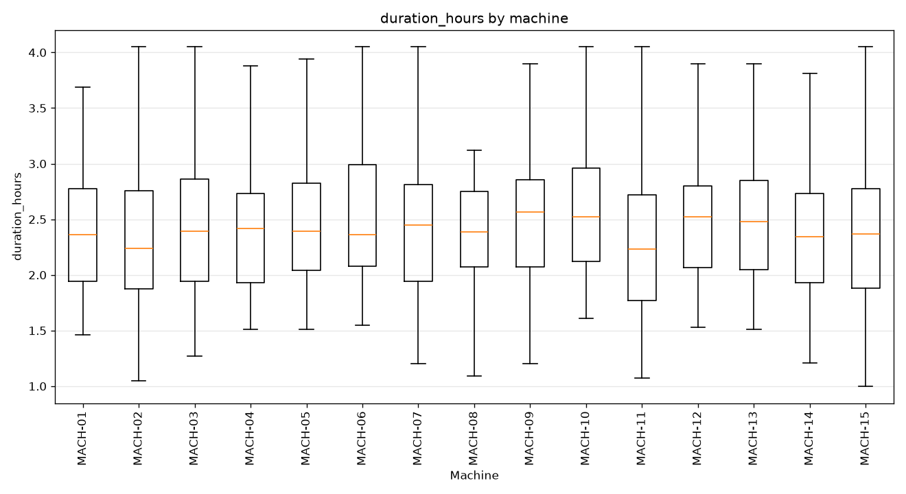
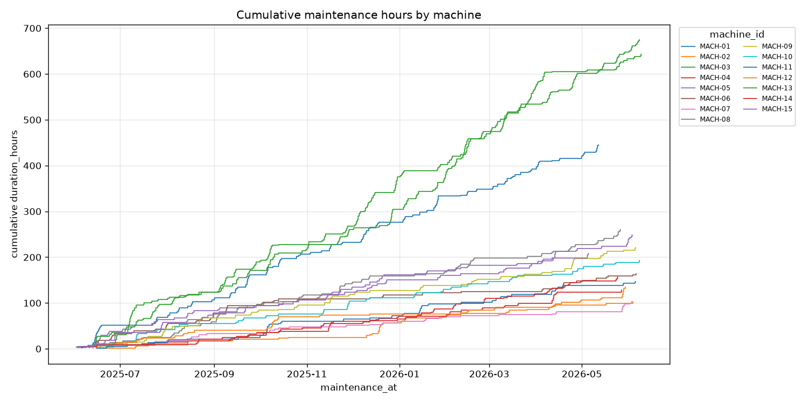

# machines — silver dataset report

> Silver layer · per-feature understanding.

## Dataset at a glance

| Indicator | Value |
|---|---|
| Layer | silver |
| Rows | 1562 |
| Columns | 17 |
| Unique machines | 15 |
| Missing values (total) | 90 |

**How to read this report.** Each feature shows a type-aware synthesis (range, missing, spread, skew, outliers, top values…) and, for numeric features, a boxplot across machines and its distribution (histogram + KDE).

## Per-feature analysis

### maintenance_id (OK)

- **dtype** int64 · **count** 1562 · **unique** 1562 · **missing** 0 (0.0%)

### machine_id (OK)

- **dtype** str · **count** 1562 · **unique** 15 · **missing** 0 (0.0%)
- **most frequent** `MACH-03` (271, 17.35%)
- **distinct values**: MACH-01, MACH-02, MACH-03, MACH-04, MACH-05, MACH-06, MACH-07, MACH-08, MACH-09, MACH-10, MACH-11, MACH-12, MACH-13, MACH-14, MACH-15

### maintenance_at (OK)

- **dtype** datetime64[us, UTC] · **count** 1562 · **unique** 1474 · **missing** 0 (0.0%)
- **range** 2025-06-02 04:42 → 2026-06-09 02:29 (span 371 days)

### maintenance_type (OK)

- **dtype** str · **count** 1562 · **unique** 2 · **missing** 0 (0.0%)
- **distinct values**: proactive (5.8%), reactive (94.2%)

### action_type (OK)

- **dtype** str · **count** 1562 · **unique** 3 · **missing** 0 (0.0%)
- **distinct values**: changement_programme (5.8%), changement_suite_panne (1.6%), intervention_corrective (92.6%)

### component (OK)

- **dtype** str · **count** 1562 · **unique** 12 · **missing** 0 (0.0%)
- **most frequent** `roulement axe principal` (463, 29.64%)
- **distinct values**: capteur pression, capteur température, convoyeur sortie, courroie moteur, filtre hydraulique, joint hydraulique, outillage presse, relais sécurité, roulement axe principal, système sécurité, transmission, variateur vitesse

### description (OK)

- **dtype** str · **count** 1562 · **unique** 42 · **missing** 0 (0.0%)
- **most frequent** `Remplacement capteur + recalibration zéro` (249, 15.94%)

### related_incident_id (OK)

- **dtype** str · **count** 1472 · **unique** 1057 · **missing** 90 (5.76%)
- **most frequent** `INC-000037` (3, 0.2%)

### duration_hours (OK)

- **dtype** float64 · **count** 1562 · **unique** 246 · **missing** 0 (0.0%)
- **range** 1.0 → 4.05 (span 3.05) · **Q1/median/Q3** 2.0 / 2.41 / 2.82
- **mean** 2.452 · **std** 0.611 · **skew** 0.58

**Outliers** — flagged values per method:

| method | normal band | below — n (range) | above — n (range) |
|---|---|---|---|
| IQR (k=1.5) | [0.77, 4.05] | 0 — | 0 — |
| z-score (k=3) | [0.619, 4.285] | 0 — | 0 — |

### maintenance_type_code

- **dtype** Int64 · **count** 1562 · **unique** 2 · **missing** 0 (0.0%)
- **distinct values**: 0 (5.8%), 1 (94.2%)

### component_code

- **dtype** Int64 · **count** 1562 · **unique** 12 · **missing** 0 (0.0%)
- **range** 0.0 → 11.0 (span 11.0) · **Q1/median/Q3** 1.0 / 5.0 / 8.0
- **mean** 5.154 · **std** 3.655 · **skew** -0.02

**Outliers** — flagged values per method:

| method | normal band | below — n (range) | above — n (range) |
|---|---|---|---|
| IQR (k=1.5) | [-9.5, 18.5] | 0 — | 0 — |
| z-score (k=3) | [-5.812, 16.119] | 0 — | 0 — |
- **distinct values**: 0, 1, 10, 11, 2, 3, 4, 5, 6, 7, 8, 9

### criticality (OK)

- **dtype** str · **count** 1562 · **unique** 3 · **missing** 0 (0.0%)
- **most frequent** `MEDIUM` (782, 50.06%)
- **distinct values**: HIGH, LOW, MEDIUM

### production_line (OK)

- **dtype** str · **count** 1562 · **unique** 3 · **missing** 0 (0.0%)
- **most frequent** `Ligne-B` (583, 37.32%)
- **distinct values**: Ligne-A, Ligne-B, Ligne-C

### location (OK)

- **dtype** str · **count** 1562 · **unique** 3 · **missing** 0 (0.0%)
- **most frequent** `Atelier-3` (669, 42.83%)
- **distinct values**: Atelier-1, Atelier-2, Atelier-3

### model (OK)

- **dtype** str · **count** 1562 · **unique** 4 · **missing** 0 (0.0%)
- **most frequent** `InduPress-X2` (635, 40.65%)
- **distinct values**: InduPress-X1, InduPress-X2, InduPress-X3, InduPress-Z1

### max_daily_capacity (OK)

- **dtype** int64 · **count** 1562 · **unique** 15 · **missing** 0 (0.0%)
- **range** 750.0 → 1428.0 (span 678.0) · **Q1/median/Q3** 838.0 / 1027.0 / 1380.0
- **mean** 1070.836 · **std** 246.185 · **skew** 0.225
- **distinct values**: 1027, 1056, 1158, 1191, 1351, 1380, 1405, 1428, 750, 770, 778, 800, 838, 907, 984

### max_hourly_capacity_pieces (OK)

- **dtype** int64 · **count** 1562 · **unique** 15 · **missing** 0 (0.0%)
- **range** 47.0 → 89.0 (span 42.0) · **Q1/median/Q3** 52.0 / 64.0 / 86.0
- **mean** 66.93 · **std** 15.328 · **skew** 0.229
- **distinct values**: 47, 48, 49, 50, 52, 57, 62, 64, 66, 72, 74, 84, 86, 88, 89

## Notes for business teams

- High `pct_missing` or `n_outliers_iqr` flags columns to clean in Silver (imputation / outliers, configured in src/sources/registry.py).
- Compare Bronze vs Silver to see the effect of the treatment.
