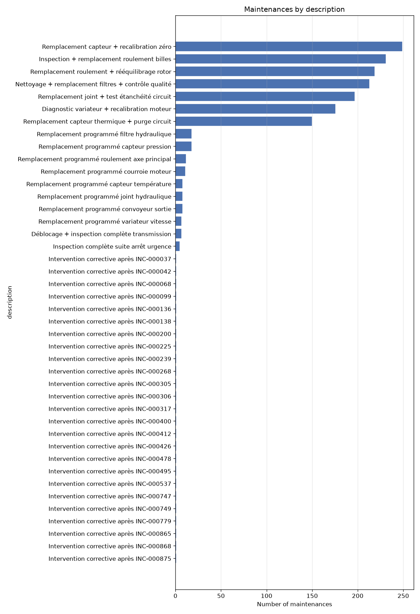

# machines — bronze dataset report

> Bronze layer · per-feature understanding.

## Dataset at a glance

| Indicator | Value |
|---|---|
| Layer | bronze |
| Rows | 1562 |
| Columns | 9 |
| Unique machines | 15 |
| Missing values (total) | 90 |

**How to read this report.** Each feature shows a type-aware synthesis (range, missing, spread, skew, outliers, top values…) and, for numeric features, a boxplot across machines and its distribution (histogram + KDE).

## Per-feature analysis

### maintenance_id (OK)

- **dtype** int64 · **count** 1562 · **unique** 1562 · **missing** 0 (0.0%)

### machine_id (OK)

- **dtype** str · **count** 1562 · **unique** 15 · **missing** 0 (0.0%)
- **most frequent** `MACH-03` (271, 17.35%)
- **distinct values**: MACH-01, MACH-02, MACH-03, MACH-04, MACH-05, MACH-06, MACH-07, MACH-08, MACH-09, MACH-10, MACH-11, MACH-12, MACH-13, MACH-14, MACH-15

### maintenance_at (OK)

- **dtype** datetime64[us, UTC] · **count** 1562 · **unique** 1474 · **missing** 0 (0.0%)
- **range** 2025-06-02 04:42 → 2026-06-09 02:29 (span 371 days)

### maintenance_type (OK)

- **dtype** str · **count** 1562 · **unique** 2 · **missing** 0 (0.0%)
- **distinct values**: proactive (5.8%), reactive (94.2%)

### action_type (OK)

- **dtype** str · **count** 1562 · **unique** 3 · **missing** 0 (0.0%)
- **distinct values**: changement_programme (5.8%), changement_suite_panne (1.6%), intervention_corrective (92.6%)

### component (OK)

- **dtype** str · **count** 1562 · **unique** 12 · **missing** 0 (0.0%)
- **most frequent** `roulement axe principal` (463, 29.64%)
- **distinct values**: capteur pression, capteur température, convoyeur sortie, courroie moteur, filtre hydraulique, joint hydraulique, outillage presse, relais sécurité, roulement axe principal, système sécurité, transmission, variateur vitesse

### description (OK)

- **dtype** str · **count** 1562 · **unique** 42 · **missing** 0 (0.0%)
- **most frequent** `Remplacement capteur + recalibration zéro` (249, 15.94%)

### related_incident_id (OK)

- **dtype** str · **count** 1472 · **unique** 1057 · **missing** 90 (5.76%)
- **most frequent** `INC-000037` (3, 0.2%)

### duration_hours (OK)

- **dtype** float64 · **count** 1562 · **unique** 282 · **missing** 0 (0.0%)
- **range** 1.0 → 8.0 (span 7.0) · **Q1/median/Q3** 2.0 / 2.41 / 2.82
- **mean** 2.482 · **std** 0.731 · **skew** 2.105

**Outliers** — flagged values per method:

| method | normal band | below — n (range) | above — n (range) |
|---|---|---|---|
| IQR (k=1.5) | [0.77, 4.05] | 0 — | 39 [4.06, 8.0] |
| z-score (k=3) | [0.288, 4.676] | 0 — | 22 [4.71, 8.0] |

**Outliers by machine** (IQR k=1.5 and z-score k=3, fences recomputed per machine):

| machine | n | IQR below | IQR above | z-score below | z-score above |
|---|---|---|---|---|---|
| MACH-01 | 187 | 0 | 0 | 0 | 0 |
| MACH-02 | 44 | 0 | 1 | 0 | 1 |
| MACH-03 | 271 | 0 | 13 | 0 | 5 |
| MACH-04 | 52 | 0 | 2 | 0 | 2 |
| MACH-05 | 100 | 0 | 3 | 0 | 1 |
| MACH-06 | 65 | 0 | 1 | 0 | 1 |
| MACH-07 | 43 | 0 | 1 | 0 | 1 |
| MACH-08 | 108 | 0 | 3 | 0 | 2 |
| MACH-09 | 86 | 0 | 6 | 0 | 1 |
| MACH-10 | 74 | 0 | 2 | 0 | 1 |
| MACH-11 | 64 | 0 | 2 | 0 | 2 |
| MACH-12 | 54 | 0 | 2 | 0 | 1 |
| MACH-13 | 260 | 0 | 0 | 0 | 0 |
| MACH-14 | 66 | 0 | 0 | 0 | 0 |
| MACH-15 | 88 | 0 | 3 | 0 | 3 |
| **total** | 1562 | 0 | 39 | 0 | 21 |

## Notes for business teams

- High `pct_missing` or `n_outliers_iqr` flags columns to clean in Silver (imputation / outliers, configured in src/sources/registry.py).
- Compare Bronze vs Silver to see the effect of the treatment.
