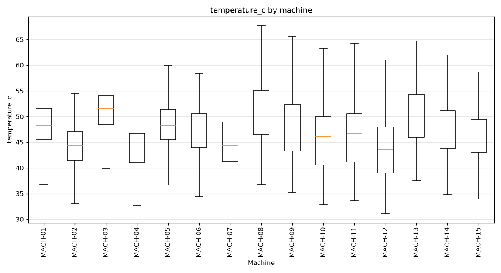
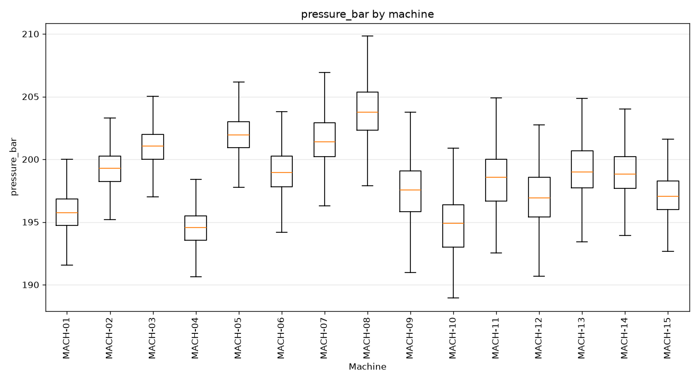
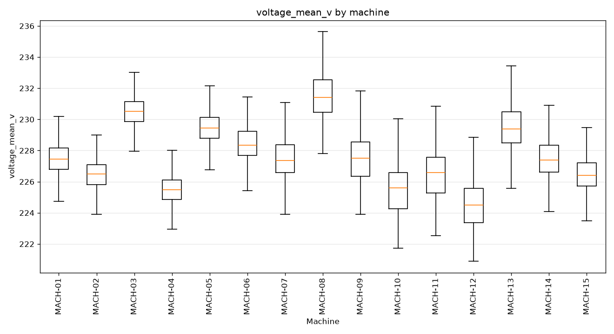
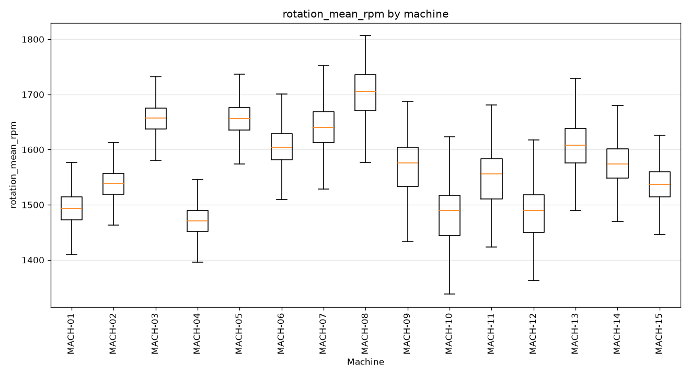
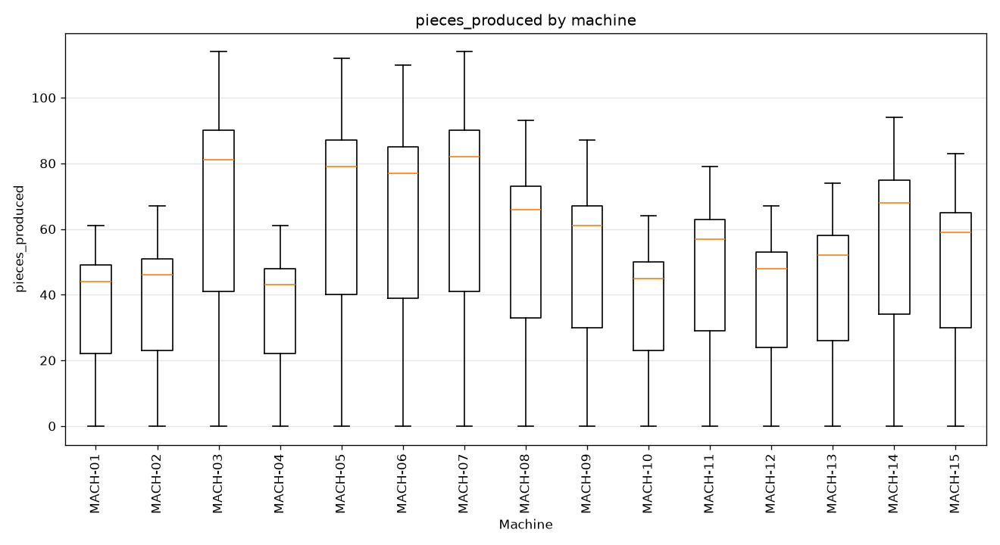

# Machine telemetry — synthesis report

> Run `202606162112` · shareable summary for business teams.

## Dataset at a glance

| Indicator | Value |
|---|---|
| Reporting period | 2025-06-01 00:00 → 2026-06-08 23:00 |
| Number of records | 134280 |
| Unique machines | 15 |
| Parameters tracked | 5 |
| Missing values (total) | 0 |

**How to read this report.** Each row is an hourly reading per machine. Each boxplot shows the distribution of one parameter across machines (median, spread, range) — useful to spot machines that run hotter, faster or more variably than their peers.

## 1. Parameter distributions by machine

### temperature_c by machine

### pressure_bar by machine

### voltage_mean_v by machine

### rotation_mean_rpm by machine

### pieces_produced by machine

## Notes for business teams

- Machines whose boxplots sit clearly above or below their peers may indicate drift or miscalibration worth investigating.
- Wide boxes (high variability) can signal unstable operating conditions.
