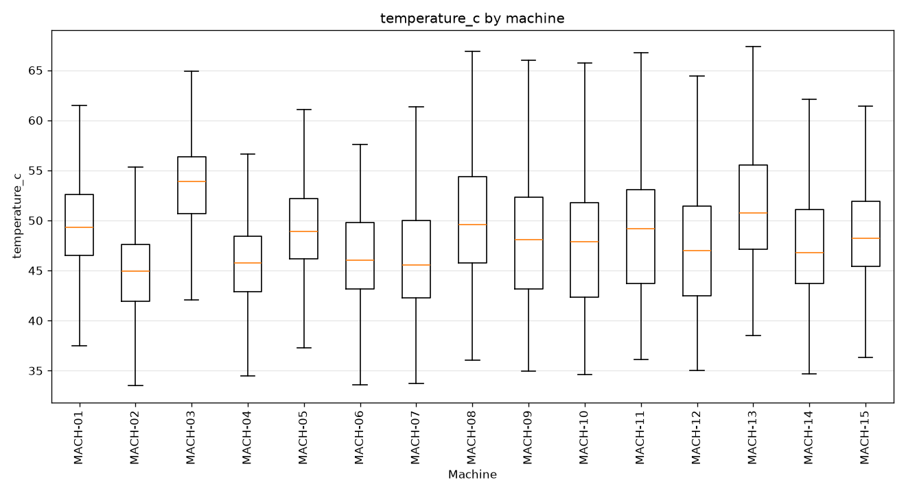
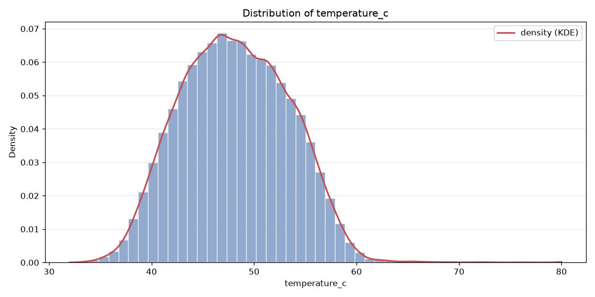
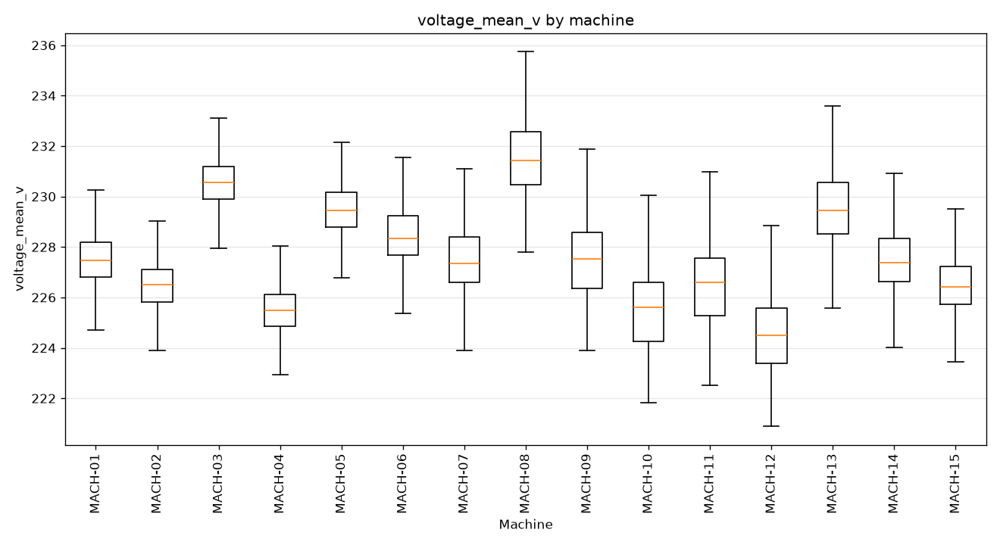
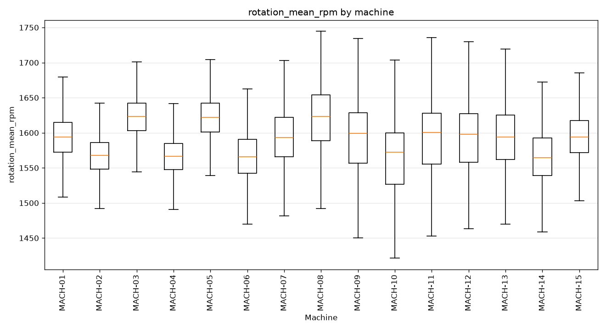
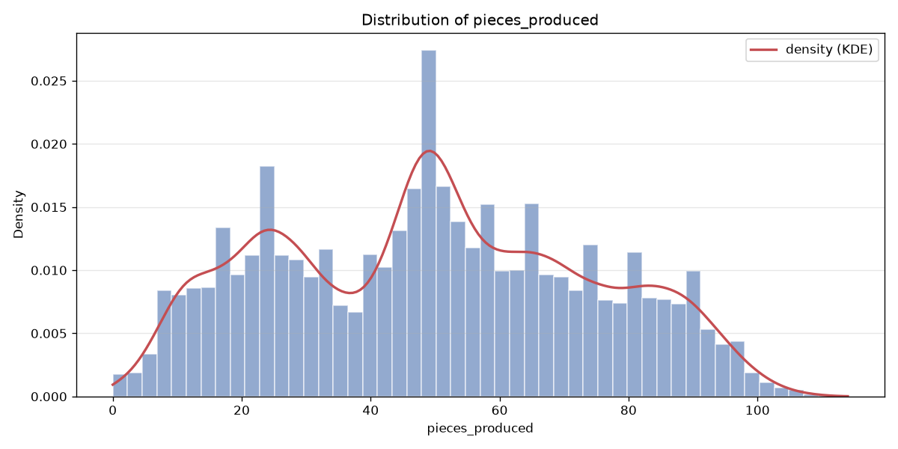

# telemetry — bronze dataset report

> Bronze layer · per-feature understanding.

## Dataset at a glance

| Indicator | Value |
|---|---|
| Layer | bronze |
| Rows | 135626 |
| Columns | 7 |
| Unique machines | 15 |
| Missing values (total) | 2847 |

**How to read this report.** Each feature shows a type-aware synthesis (range, missing, spread, skew, outliers, top values…) and, for numeric features, a boxplot across machines and its distribution (histogram + KDE).

## Per-feature analysis

### machine_id

- **dtype** str · **count** 135626 · **unique** 15 · **missing** 0 (0.0%)
- **most frequent** `MACH-03` (9054, 6.68%)
- **distinct values**: MACH-01, MACH-02, MACH-03, MACH-04, MACH-05, MACH-06, MACH-07, MACH-08, MACH-09, MACH-10, MACH-11, MACH-12, MACH-13, MACH-14, MACH-15

### timestamp

- **dtype** datetime64[us] · **count** 135626 · **unique** 8952 · **missing** 0 (0.0%)
- **range** 2025-06-01 00:00 → 2026-06-08 23:00 (span 372 days)

### temperature_c

- **dtype** float64 · **count** 134732 · **unique** 18312 · **missing** 894 (0.66%)
- **range** 32.0 → 80.0 (span 48.0) · **Q1/median/Q3** 44.248 / 48.055 / 52.054
- **mean** 48.183 · **std** 5.253 · **skew** 0.181 · **IQR outliers** 279

### pressure_bar

- **dtype** float64 · **count** 134631 · **unique** 10708 · **missing** 995 (0.73%)
- **range** 159.982 → 215.814 (span 55.832) · **Q1/median/Q3** 198.573 / 199.866 / 201.19
- **mean** 199.77 · **std** 2.372 · **skew** -4.16 · **IQR outliers** 1529

### voltage_mean_v

- **dtype** float64 · **count** 135626 · **unique** 4392 · **missing** 0 (0.0%)
- **range** 220.9 → 242.0 (span 21.1) · **Q1/median/Q3** 226.03 / 227.42 / 229.15
- **mean** 227.631 · **std** 2.304 · **skew** 0.377 · **IQR outliers** 644

### rotation_mean_rpm

- **dtype** float64 · **count** 134668 · **unique** 27474 · **missing** 958 (0.71%)
- **range** 1100.0 → 1900.0 (span 800.0) · **Q1/median/Q3** 1558.994 / 1590.37 / 1620.832
- **mean** 1589.205 · **std** 45.949 · **skew** -0.367 · **IQR outliers** 840

### pieces_produced

- **dtype** int64 · **count** 135626 · **unique** 115 · **missing** 0 (0.0%)
- **range** 0.0 → 114.0 (span 114.0) · **Q1/median/Q3** 28.0 / 49.0 / 68.0
- **mean** 49.533 · **std** 24.573 · **skew** 0.09 · **IQR outliers** 0

## Notes for business teams

- High `pct_missing` or `n_outliers_iqr` flags columns to clean in Silver (imputation / outliers, configured in src/sources/registry.py).
- Compare Bronze vs Silver to see the effect of the treatment.
