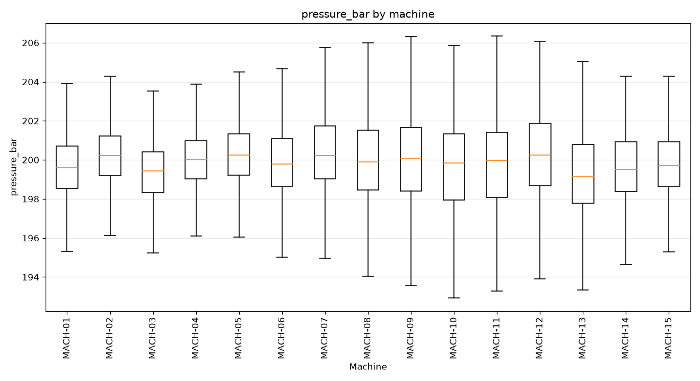
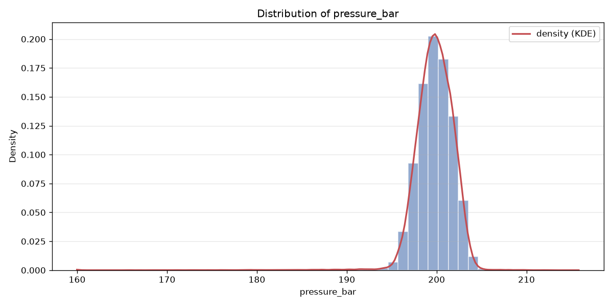
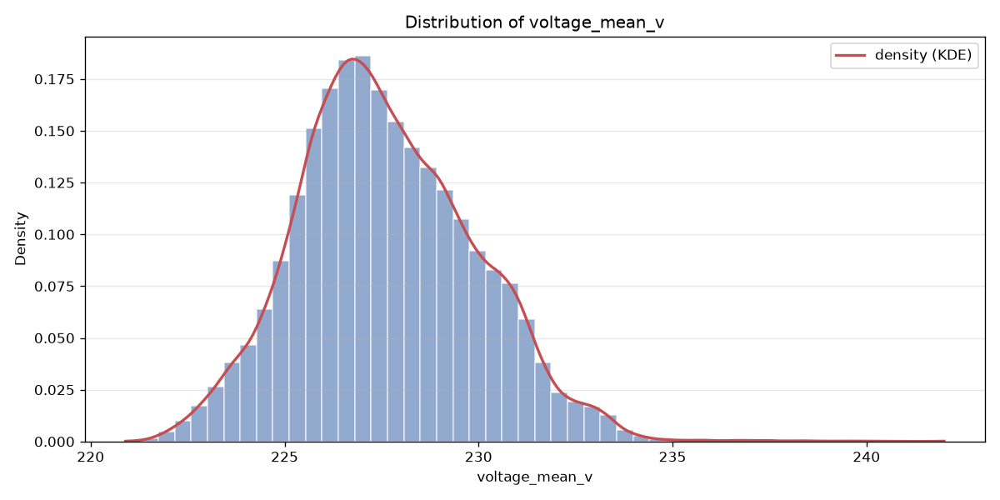
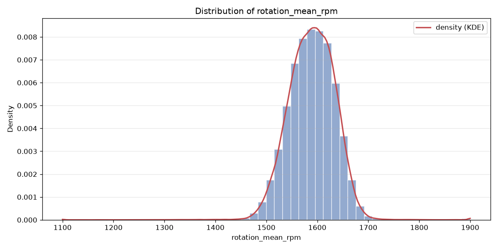
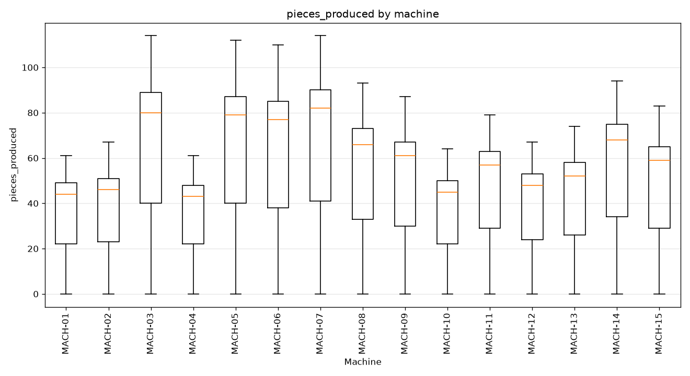
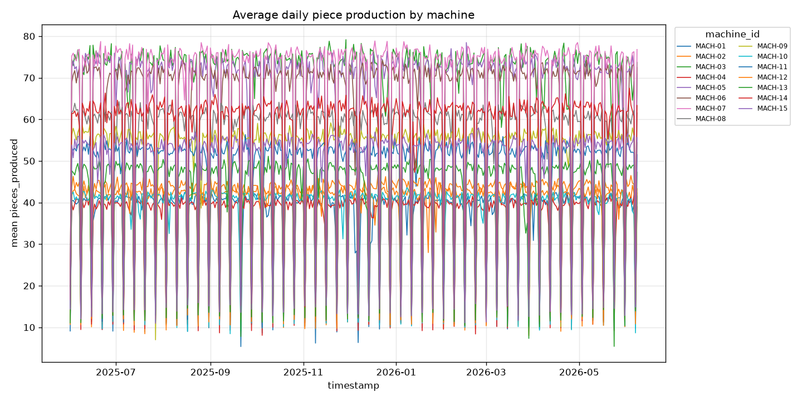
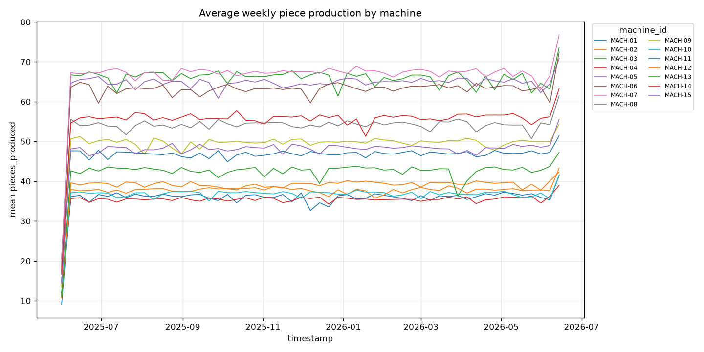

# telemetry — bronze dataset report

> Bronze layer · per-feature understanding.

## Dataset at a glance

| Indicator | Value |
|---|---|
| Layer | bronze |
| Rows | 135626 |
| Columns | 7 |
| Unique machines | 15 |
| Missing values (total) | 2847 |

**How to read this report.** Each feature shows a type-aware synthesis (range, missing, spread, skew, outliers, top values…) and, for numeric features, a boxplot across machines and its distribution (histogram + KDE).

## Per-feature analysis

### machine_id (OK)

- **dtype** str · **count** 135626 · **unique** 15 · **missing** 0 (0.0%)
- **most frequent** `MACH-03` (9054, 6.68%)
- **distinct values**: MACH-01, MACH-02, MACH-03, MACH-04, MACH-05, MACH-06, MACH-07, MACH-08, MACH-09, MACH-10, MACH-11, MACH-12, MACH-13, MACH-14, MACH-15

### timestamp (NOK)

- **dtype** datetime64[us] · **count** 135626 · **unique** 8952 · **missing** 0 (0.0%)
- **range** 2025-06-01 00:00 → 2026-06-08 23:00 (span 372 days)

**Per-machine timestamp QC** (hourly series):

| machine | rows | duplicate timestamps | missing hours |
|---|---|---|---|
| MACH-01 | 9033 | 81 | 0 |
| MACH-02 | 9042 | 90 | 0 |
| MACH-03 | 9054 | 102 | 0 |
| MACH-04 | 9042 | 90 | 0 |
| MACH-05 | 9033 | 81 | 0 |
| MACH-06 | 9049 | 97 | 0 |
| MACH-07 | 9034 | 82 | 0 |
| MACH-08 | 9053 | 101 | 0 |
| MACH-09 | 9048 | 96 | 0 |
| MACH-10 | 9043 | 91 | 0 |
| MACH-11 | 9040 | 88 | 0 |
| MACH-12 | 9031 | 79 | 0 |
| MACH-13 | 9043 | 91 | 0 |
| MACH-14 | 9044 | 92 | 0 |
| MACH-15 | 9037 | 85 | 0 |
| **total** | 135626 | 1346 | 0 |
- **NOK reason**: duplicate timestamp(s) for a machine

### temperature_c (NOK)

- **dtype** float64 · **count** 134732 · **unique** 18312 · **missing** 894 (0.66%)
- **range** 32.0 → 80.0 (span 48.0) · **Q1/median/Q3** 44.248 / 48.055 / 52.054
- **mean** 48.183 · **std** 5.253 · **skew** 0.181

**Outliers** — flagged values per method:

| method | normal band | below — n (range) | above — n (range) |
|---|---|---|---|
| IQR (k=1.5) | [32.539, 63.763] | 2 [32.0, 32.0] | 277 [63.769, 80.0] |
| z-score (k=3) | [32.423, 63.943] | 2 [32.0, 32.0] | 271 [63.955, 80.0] |
- **NOK reason**: no empty value

### pressure_bar (NOK)

- **dtype** float64 · **count** 134631 · **unique** 10708 · **missing** 995 (0.73%)
- **range** 159.982 → 215.814 (span 55.832) · **Q1/median/Q3** 198.573 / 199.866 / 201.19
- **mean** 199.77 · **std** 2.372 · **skew** -4.16

**Outliers** — flagged values per method:

| method | normal band | below — n (range) | above — n (range) |
|---|---|---|---|
| IQR (k=1.5) | [194.648, 205.114] | 1287 [159.982, 194.646] | 242 [205.117, 215.814] |
| z-score (k=3) | [192.654, 206.887] | 929 [159.982, 192.653] | 129 [206.903, 215.814] |
- **NOK reason**: no empty value

### voltage_mean_v (OK)

- **dtype** float64 · **count** 135626 · **unique** 4392 · **missing** 0 (0.0%)
- **range** 220.9 → 242.0 (span 21.1) · **Q1/median/Q3** 226.03 / 227.42 / 229.15
- **mean** 227.631 · **std** 2.304 · **skew** 0.377

**Outliers** — flagged values per method:

| method | normal band | below — n (range) | above — n (range) |
|---|---|---|---|
| IQR (k=1.5) | [221.35, 233.83] | 19 [220.9, 221.33] | 625 [233.84, 242.0] |
| z-score (k=3) | [220.719, 234.543] | 0 — | 365 [234.556, 242.0] |

### rotation_mean_rpm (NOK)

- **dtype** float64 · **count** 134668 · **unique** 27474 · **missing** 958 (0.71%)
- **range** 1100.0 → 1900.0 (span 800.0) · **Q1/median/Q3** 1558.994 / 1590.37 / 1620.832
- **mean** 1589.205 · **std** 45.949 · **skew** -0.367

**Outliers** — flagged values per method:

| method | normal band | below — n (range) | above — n (range) |
|---|---|---|---|
| IQR (k=1.5) | [1466.237, 1713.589] | 486 [1100.0, 1466.224] | 354 [1713.66, 1900.0] |
| z-score (k=3) | [1451.359, 1727.051] | 350 [1100.0, 1451.263] | 276 [1727.567, 1900.0] |
- **NOK reason**: no empty value

### pieces_produced (OK)

- **dtype** int64 · **count** 135626 · **unique** 115 · **missing** 0 (0.0%)
- **range** 0.0 → 114.0 (span 114.0) · **Q1/median/Q3** 28.0 / 49.0 / 68.0
- **mean** 49.533 · **std** 24.573 · **skew** 0.09

**Outliers** — flagged values per method:

| method | normal band | below — n (range) | above — n (range) |
|---|---|---|---|
| IQR (k=1.5) | [-32.0, 128.0] | 0 — | 0 — |
| z-score (k=3) | [-24.186, 123.253] | 0 — | 0 — |

## Notes for business teams

- High `pct_missing` or `n_outliers_iqr` flags columns to clean in Silver (imputation / outliers, configured in src/sources/registry.py).
- Compare Bronze vs Silver to see the effect of the treatment.
