# telemetry — silver dataset report

> Silver layer · per-feature understanding.

## Dataset at a glance

| Indicator | Value |
|---|---|
| Layer | silver |
| Rows | 134280 |
| Columns | 12 |
| Unique machines | 15 |
| Missing values (total) | 0 |

**How to read this report.** Each feature shows a type-aware synthesis (range, missing, spread, skew, outliers, top values…) and, for numeric features, a boxplot across machines and its distribution (histogram + KDE).

## Per-feature analysis

### machine_id (OK)

- **dtype** str · **count** 134280 · **unique** 15 · **missing** 0 (0.0%)
- **most frequent** `MACH-01` (8952, 6.67%)
- **distinct values**: MACH-01, MACH-02, MACH-03, MACH-04, MACH-05, MACH-06, MACH-07, MACH-08, MACH-09, MACH-10, MACH-11, MACH-12, MACH-13, MACH-14, MACH-15

### timestamp (OK)

- **dtype** datetime64[us] · **count** 134280 · **unique** 8952 · **missing** 0 (0.0%)
- **range** 2025-06-01 00:00 → 2026-06-08 23:00 (span 372 days)

**Per-machine timestamp QC** (hourly series):

| machine | rows | duplicate timestamps | missing hours |
|---|---|---|---|
| MACH-01 | 8952 | 0 | 0 |
| MACH-02 | 8952 | 0 | 0 |
| MACH-03 | 8952 | 0 | 0 |
| MACH-04 | 8952 | 0 | 0 |
| MACH-05 | 8952 | 0 | 0 |
| MACH-06 | 8952 | 0 | 0 |
| MACH-07 | 8952 | 0 | 0 |
| MACH-08 | 8952 | 0 | 0 |
| MACH-09 | 8952 | 0 | 0 |
| MACH-10 | 8952 | 0 | 0 |
| MACH-11 | 8952 | 0 | 0 |
| MACH-12 | 8952 | 0 | 0 |
| MACH-13 | 8952 | 0 | 0 |
| MACH-14 | 8952 | 0 | 0 |
| MACH-15 | 8952 | 0 | 0 |
| **total** | 134280 | 0 | 0 |

### temperature_c (OK)

- **dtype** float64 · **count** 134280 · **unique** 18634 · **missing** 0 (0.0%)
- **range** 32.65 → 63.65 (span 31.0) · **Q1/median/Q3** 44.275 / 48.055 / 52.025
- **mean** 48.171 · **std** 5.187 · **skew** 0.077

**Outliers** — flagged values per method:

| method | normal band | below — n (range) | above — n (range) |
|---|---|---|---|
| IQR (k=1.5) | [32.65, 63.65] | 0 — | 0 — |
| z-score (k=3) | [32.609, 63.733] | 0 — | 0 — |

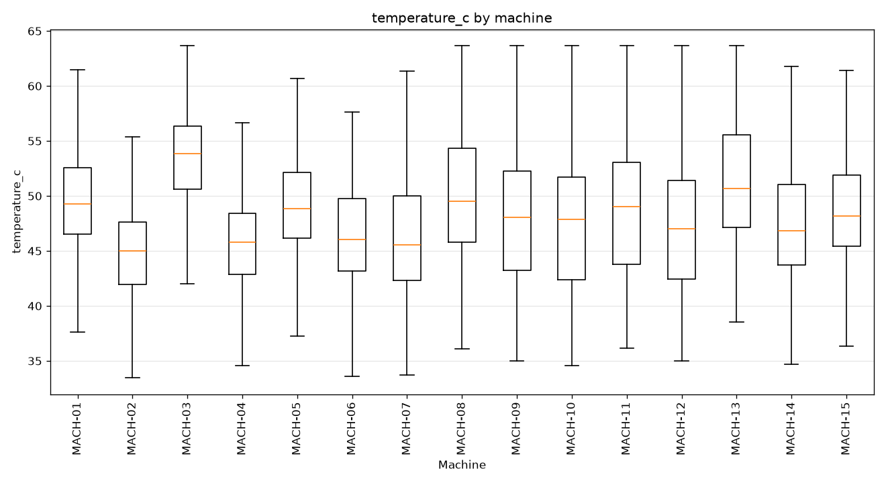

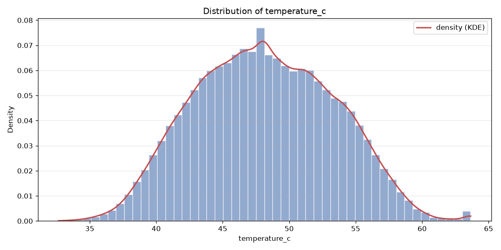

### pressure_bar (OK)

- **dtype** float64 · **count** 134280 · **unique** 10042 · **missing** 0 (0.0%)
- **range** 194.694 → 205.07 (span 10.376) · **Q1/median/Q3** 198.585 / 199.867 / 201.179
- **mean** 199.842 · **std** 1.861 · **skew** -0.15

**Outliers** — flagged values per method:

| method | normal band | below — n (range) | above — n (range) |
|---|---|---|---|
| IQR (k=1.5) | [194.694, 205.07] | 0 — | 0 — |
| z-score (k=3) | [194.26, 205.425] | 0 — | 0 — |

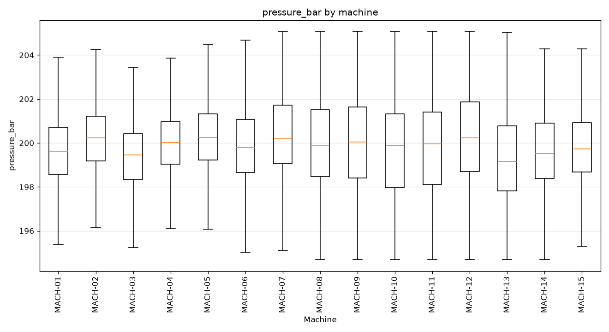

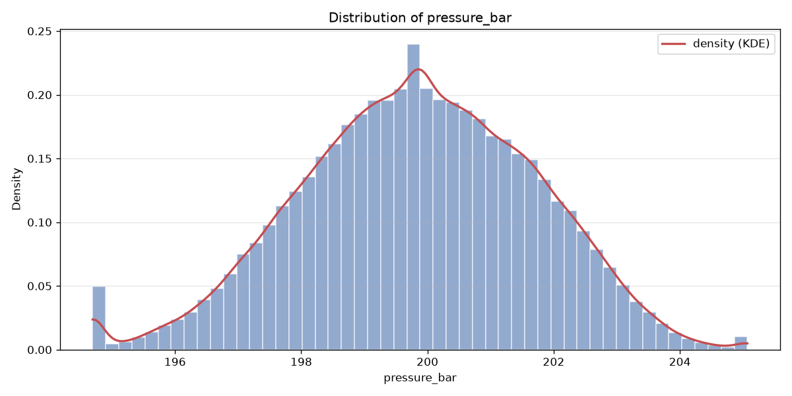

### voltage_mean_v (OK)

- **dtype** float64 · **count** 134280 · **unique** 4134 · **missing** 0 (0.0%)
- **range** 221.35 → 233.83 (span 12.48) · **Q1/median/Q3** 226.03 / 227.42 / 229.15
- **mean** 227.621 · **std** 2.271 · **skew** 0.24

**Outliers** — flagged values per method:

| method | normal band | below — n (range) | above — n (range) |
|---|---|---|---|
| IQR (k=1.5) | [221.35, 233.83] | 0 — | 0 — |
| z-score (k=3) | [220.809, 234.434] | 0 — | 0 — |

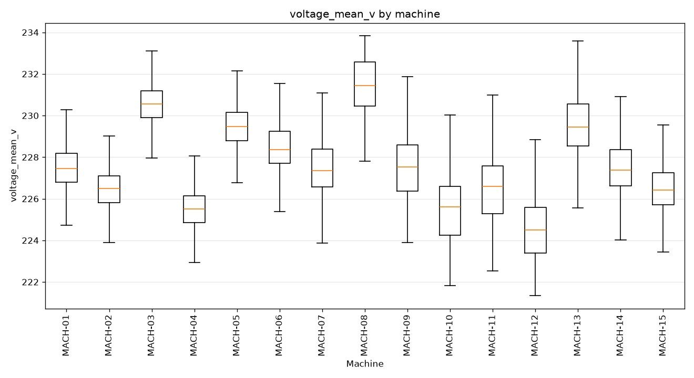

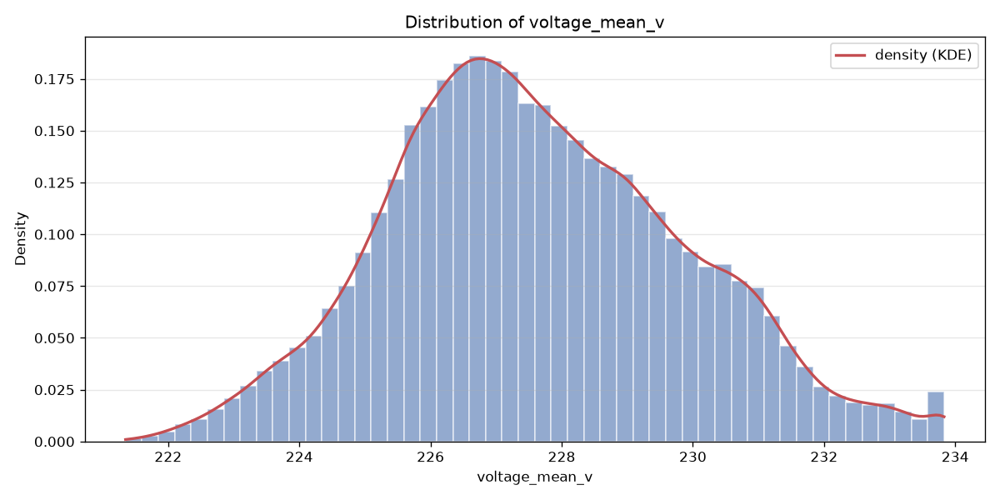

### rotation_mean_rpm (OK)

- **dtype** float64 · **count** 134280 · **unique** 26825 · **missing** 0 (0.0%)
- **range** 1467.162 → 1712.709 (span 245.548) · **Q1/median/Q3** 1559.242 / 1590.378 / 1620.629
- **mean** 1589.308 · **std** 43.211 · **skew** -0.113

**Outliers** — flagged values per method:

| method | normal band | below — n (range) | above — n (range) |
|---|---|---|---|
| IQR (k=1.5) | [1467.162, 1712.709] | 0 — | 0 — |
| z-score (k=3) | [1459.674, 1718.943] | 0 — | 0 — |

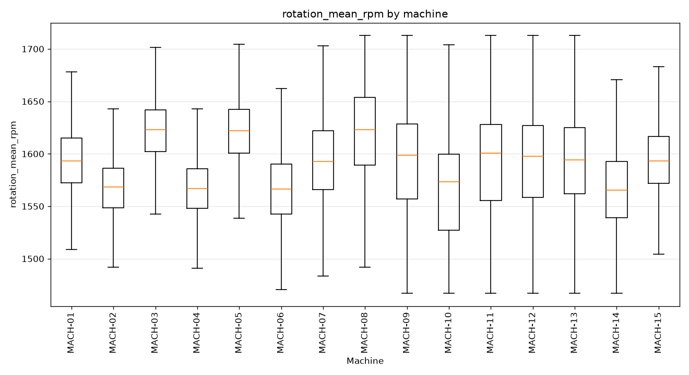

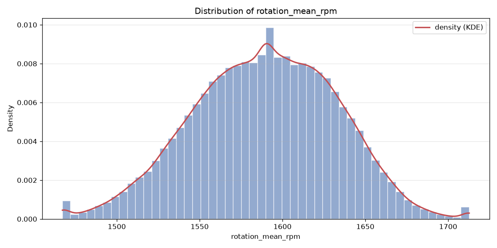

### pieces_produced (OK)

- **dtype** float64 · **count** 134280 · **unique** 115 · **missing** 0 (0.0%)
- **range** 0.0 → 114.0 (span 114.0) · **Q1/median/Q3** 28.0 / 49.0 / 68.0
- **mean** 49.537 · **std** 24.571 · **skew** 0.09

**Outliers** — flagged values per method:

| method | normal band | below — n (range) | above — n (range) |
|---|---|---|---|
| IQR (k=1.5) | [-32.0, 128.0] | 0 — | 0 — |
| z-score (k=3) | [-24.176, 123.25] | 0 — | 0 — |

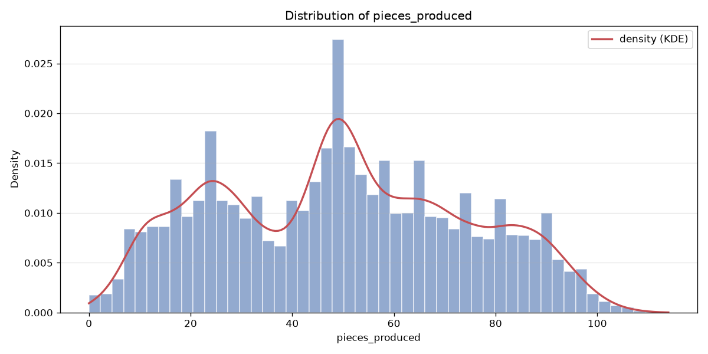

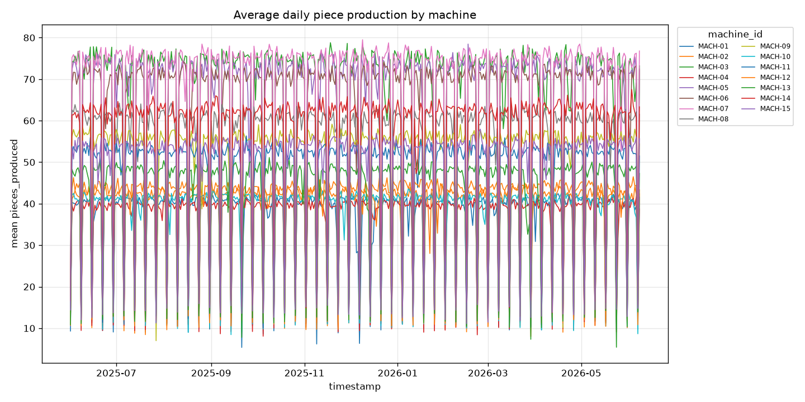

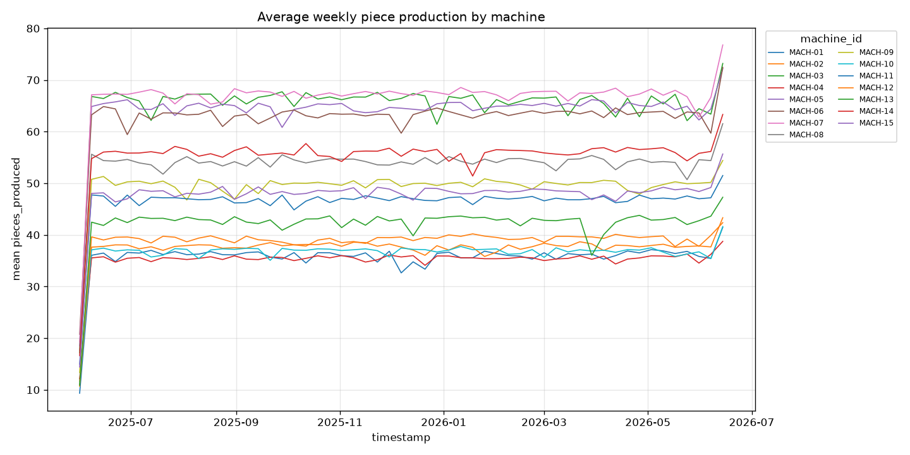

### temperature_c_norm

- **dtype** float64 · **count** 134280 · **unique** 18634 · **missing** 0 (0.0%)
- **range** -2.992 → 2.984 (span 5.976) · **Q1/median/Q3** -0.751 / -0.022 / 0.743
- **mean** -0.0 · **std** 1.0 · **skew** 0.077

**Outliers** — flagged values per method:

| method | normal band | below — n (range) | above — n (range) |
|---|---|---|---|
| IQR (k=1.5) | [-2.992, 2.984] | 0 — | 0 — |
| z-score (k=3) | [-3.0, 3.0] | 0 — | 0 — |

### pressure_bar_norm

- **dtype** float64 · **count** 134280 · **unique** 10042 · **missing** 0 (0.0%)
- **range** -2.767 → 2.809 (span 5.576) · **Q1/median/Q3** -0.676 / 0.013 / 0.718
- **mean** -0.0 · **std** 1.0 · **skew** -0.15

**Outliers** — flagged values per method:

| method | normal band | below — n (range) | above — n (range) |
|---|---|---|---|
| IQR (k=1.5) | [-2.767, 2.809] | 0 — | 0 — |
| z-score (k=3) | [-3.0, 3.0] | 0 — | 0 — |

### voltage_mean_v_norm

- **dtype** float64 · **count** 134280 · **unique** 4134 · **missing** 0 (0.0%)
- **range** -2.762 → 2.734 (span 5.496) · **Q1/median/Q3** -0.701 / -0.089 / 0.673
- **mean** -0.0 · **std** 1.0 · **skew** 0.24

**Outliers** — flagged values per method:

| method | normal band | below — n (range) | above — n (range) |
|---|---|---|---|
| IQR (k=1.5) | [-2.762, 2.734] | 0 — | 0 — |
| z-score (k=3) | [-3.0, 3.0] | 0 — | 0 — |

### rotation_mean_rpm_norm

- **dtype** float64 · **count** 134280 · **unique** 26825 · **missing** 0 (0.0%)
- **range** -2.827 → 2.856 (span 5.682) · **Q1/median/Q3** -0.696 / 0.025 / 0.725
- **mean** 0.0 · **std** 1.0 · **skew** -0.113

**Outliers** — flagged values per method:

| method | normal band | below — n (range) | above — n (range) |
|---|---|---|---|
| IQR (k=1.5) | [-2.827, 2.856] | 0 — | 359 [2.856, 2.856] |
| z-score (k=3) | [-3.0, 3.0] | 0 — | 0 — |

### over_capacity_flag (OK)

- **dtype** Int64 · **count** 134280 · **unique** 2 · **missing** 0 (0.0%)
- **distinct values**: 0 (72.6%), 1 (27.4%)

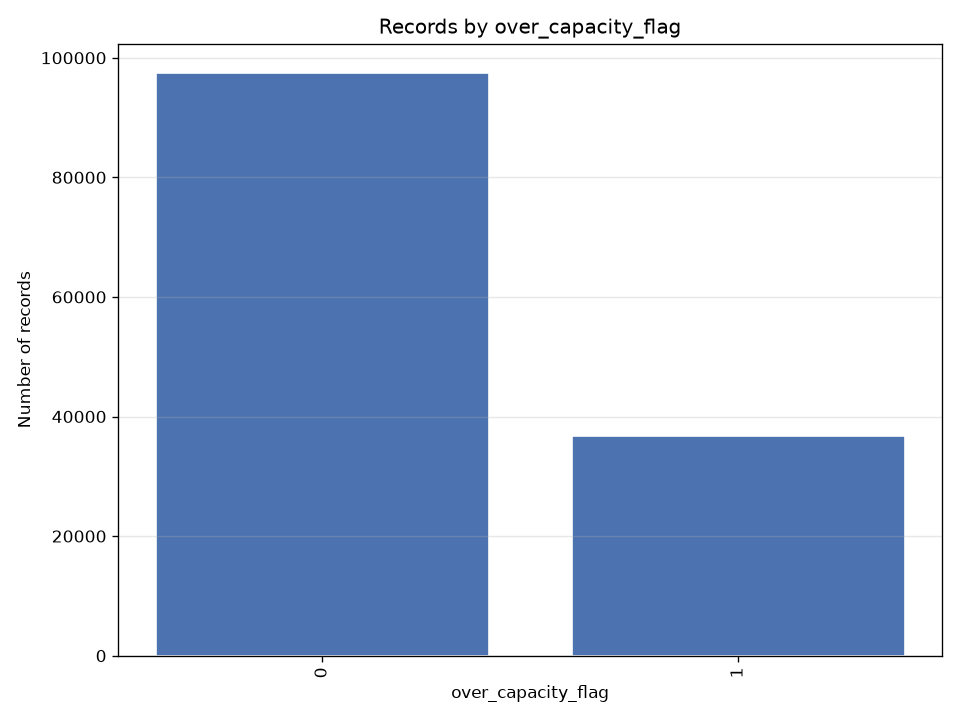

## Notes for business teams

- High `pct_missing` or `n_outliers_iqr` flags columns to clean in Silver (imputation / outliers, configured in src/sources/registry.py).
- Compare Bronze vs Silver to see the effect of the treatment.
