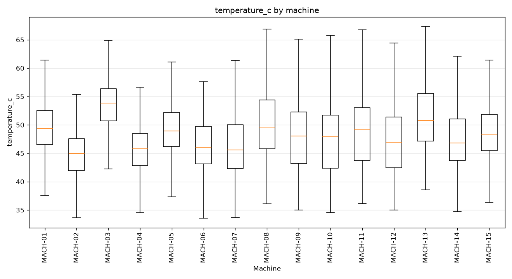
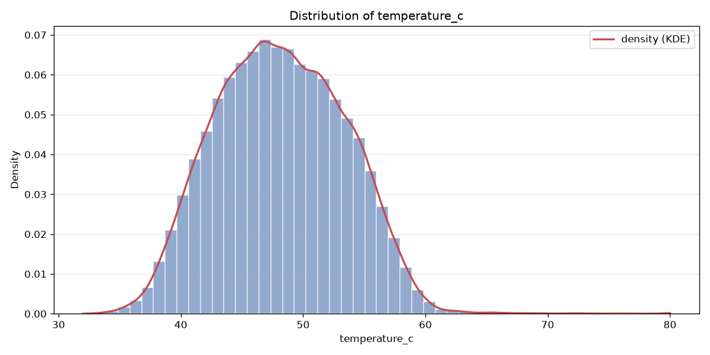
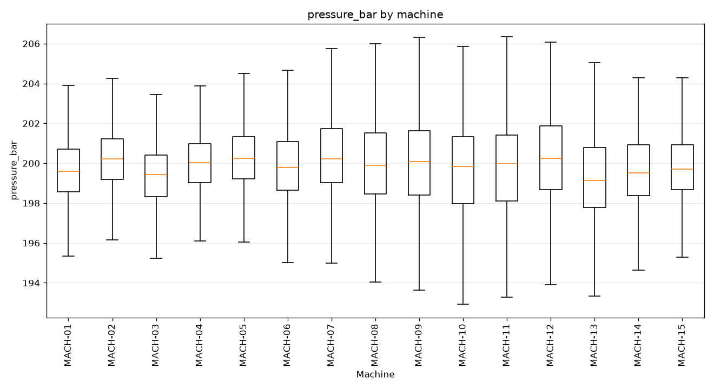
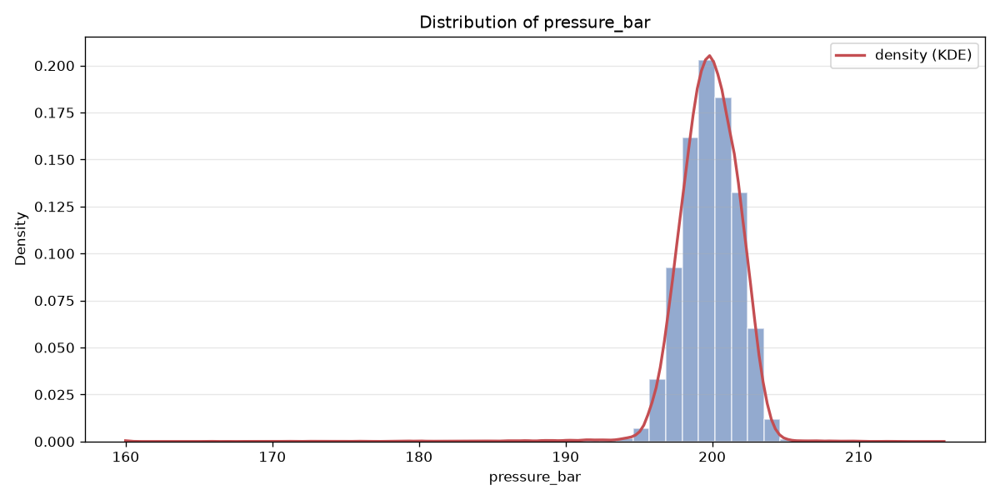
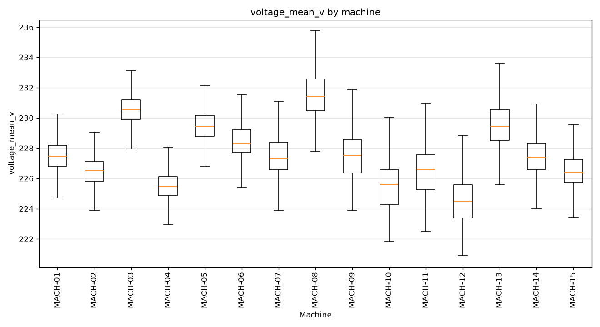
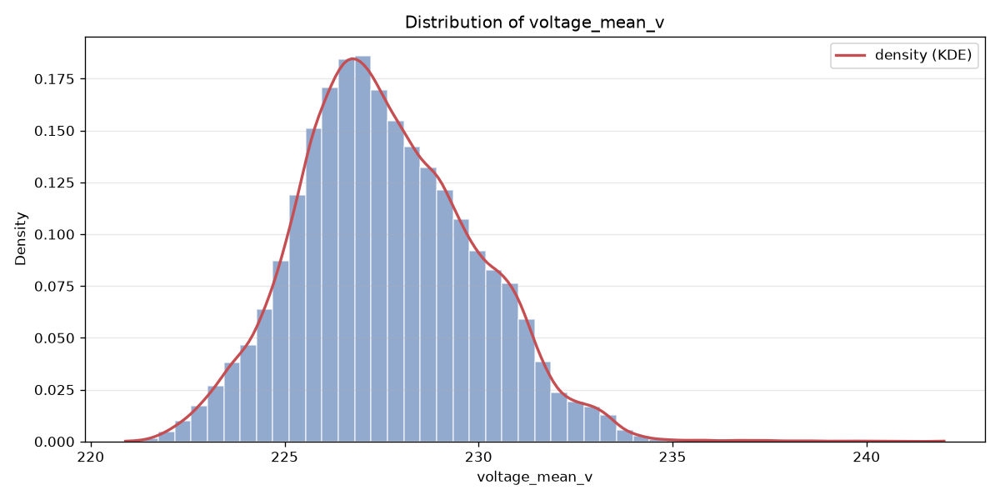
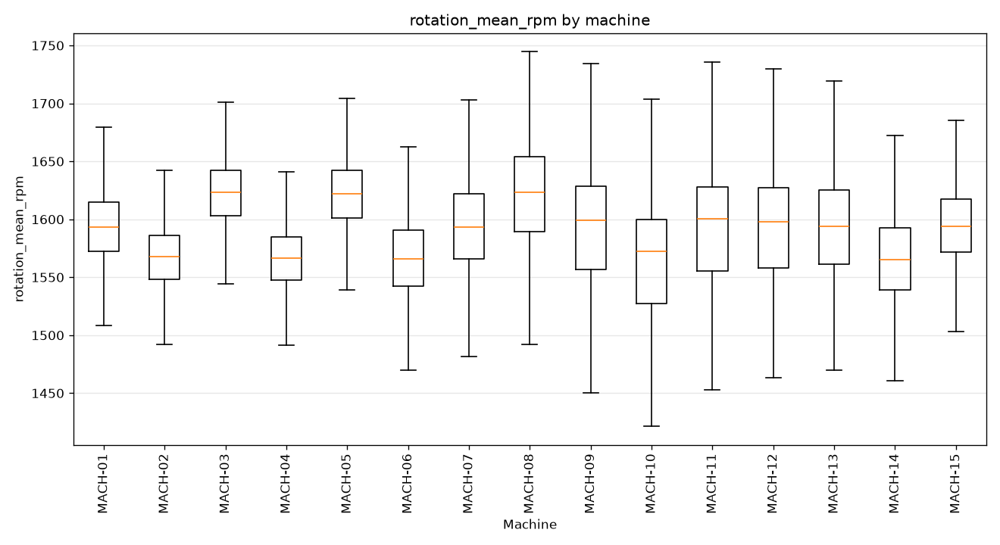
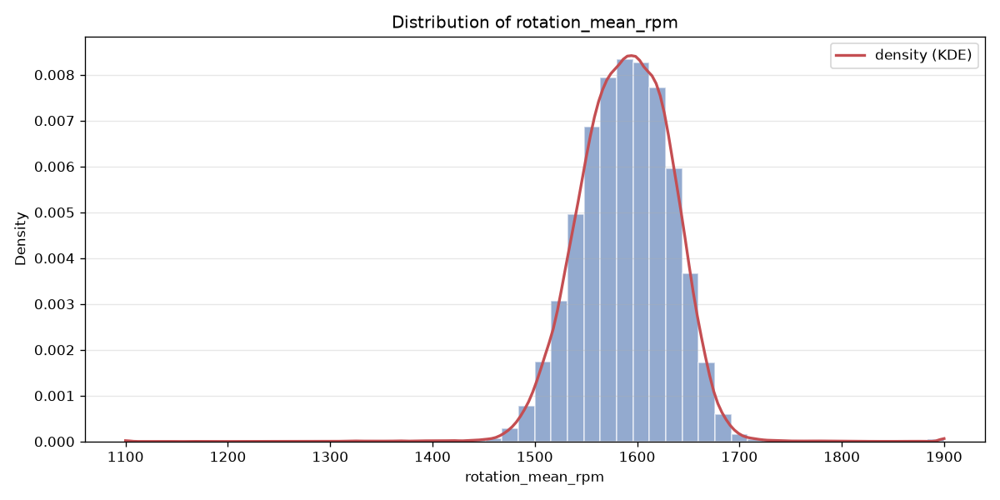

# telemetry — silver dataset report

> Silver layer · per-feature understanding.

## Dataset at a glance

| Indicator | Value |
|---|---|
| Layer | silver |
| Rows | 134280 |
| Columns | 12 |
| Unique machines | 15 |
| Missing values (total) | 0 |

**How to read this report.** Each feature shows a type-aware synthesis (range, missing, spread, skew, outliers, top values…) and, for numeric features, a boxplot across machines and its distribution (histogram + KDE).

## Per-feature analysis

### machine_id (OK)

- **dtype** str · **count** 134280 · **unique** 15 · **missing** 0 (0.0%)
- **most frequent** `MACH-01` (8952, 6.67%)
- **distinct values**: MACH-01, MACH-02, MACH-03, MACH-04, MACH-05, MACH-06, MACH-07, MACH-08, MACH-09, MACH-10, MACH-11, MACH-12, MACH-13, MACH-14, MACH-15

### timestamp (OK)

- **dtype** datetime64[us] · **count** 134280 · **unique** 8952 · **missing** 0 (0.0%)
- **range** 2025-06-01 00:00 → 2026-06-08 23:00 (span 372 days)

**Per-machine timestamp QC** (hourly series):

| machine | rows | duplicate timestamps | missing hours |
|---|---|---|---|
| MACH-01 | 8952 | 0 | 0 |
| MACH-02 | 8952 | 0 | 0 |
| MACH-03 | 8952 | 0 | 0 |
| MACH-04 | 8952 | 0 | 0 |
| MACH-05 | 8952 | 0 | 0 |
| MACH-06 | 8952 | 0 | 0 |
| MACH-07 | 8952 | 0 | 0 |
| MACH-08 | 8952 | 0 | 0 |
| MACH-09 | 8952 | 0 | 0 |
| MACH-10 | 8952 | 0 | 0 |
| MACH-11 | 8952 | 0 | 0 |
| MACH-12 | 8952 | 0 | 0 |
| MACH-13 | 8952 | 0 | 0 |
| MACH-14 | 8952 | 0 | 0 |
| MACH-15 | 8952 | 0 | 0 |
| **total** | 134280 | 0 | 0 |

### temperature_c (OK)

- **dtype** float64 · **count** 134280 · **unique** 19497 · **missing** 0 (0.0%)
- **range** 32.0 → 80.0 (span 48.0) · **Q1/median/Q3** 44.258 / 48.058 / 52.047
- **mean** 48.185 · **std** 5.245 · **skew** 0.181

**Outliers** — flagged values per method:

| method | normal band | below — n (range) | above — n (range) |
|---|---|---|---|
| IQR (k=1.5) | [32.575, 63.73] | 3 [32.0, 32.543] | 275 [63.755, 80.0] |
| z-score (k=3) | [32.449, 63.921] | 2 [32.0, 32.0] | 268 [63.955, 80.0] |

**Outliers by machine** (IQR k=1.5 and z-score k=3, fences recomputed per machine):

| machine | n | IQR below | IQR above | z-score below | z-score above |
|---|---|---|---|---|---|
| MACH-01 | 8952 | 6 | 23 | 2 | 20 |
| MACH-02 | 8952 | 18 | 2 | 8 | 2 |
| MACH-03 | 8952 | 9 | 23 | 5 | 22 |
| MACH-04 | 8952 | 11 | 25 | 3 | 25 |
| MACH-05 | 8952 | 2 | 41 | 1 | 36 |
| MACH-06 | 8952 | 0 | 0 | 0 | 0 |
| MACH-07 | 8952 | 0 | 6 | 0 | 7 |
| MACH-08 | 8952 | 0 | 23 | 0 | 27 |
| MACH-09 | 8952 | 0 | 27 | 0 | 30 |
| MACH-10 | 8952 | 0 | 11 | 0 | 14 |
| MACH-11 | 8952 | 0 | 23 | 0 | 28 |
| MACH-12 | 8952 | 0 | 17 | 0 | 20 |
| MACH-13 | 8952 | 0 | 11 | 0 | 15 |
| MACH-14 | 8952 | 0 | 28 | 0 | 31 |
| MACH-15 | 8952 | 0 | 25 | 0 | 24 |
| **total** | 134280 | 46 | 285 | 19 | 301 |

### pressure_bar (OK)

- **dtype** float64 · **count** 134280 · **unique** 12320 · **missing** 0 (0.0%)
- **range** 159.991 → 215.814 (span 55.823) · **Q1/median/Q3** 198.578 / 199.866 / 201.185
- **mean** 199.77 · **std** 2.367 · **skew** -4.155

**Outliers** — flagged values per method:

| method | normal band | below — n (range) | above — n (range) |
|---|---|---|---|
| IQR (k=1.5) | [194.668, 205.096] | 1282 [159.991, 194.665] | 243 [205.1, 215.814] |
| z-score (k=3) | [192.67, 206.87] | 923 [159.991, 192.666] | 129 [206.885, 215.814] |

**Outliers by machine** (IQR k=1.5 and z-score k=3, fences recomputed per machine):

| machine | n | IQR below | IQR above | z-score below | z-score above |
|---|---|---|---|---|---|
| MACH-01 | 8952 | 118 | 18 | 74 | 4 |
| MACH-02 | 8952 | 123 | 59 | 45 | 31 |
| MACH-03 | 8952 | 297 | 21 | 135 | 6 |
| MACH-04 | 8952 | 89 | 17 | 33 | 4 |
| MACH-05 | 8952 | 153 | 29 | 89 | 3 |
| MACH-06 | 8952 | 101 | 49 | 65 | 20 |
| MACH-07 | 8952 | 46 | 22 | 35 | 14 |
| MACH-08 | 8952 | 57 | 15 | 51 | 14 |
| MACH-09 | 8952 | 53 | 12 | 42 | 9 |
| MACH-10 | 8952 | 77 | 17 | 63 | 12 |
| MACH-11 | 8952 | 21 | 3 | 22 | 5 |
| MACH-12 | 8952 | 78 | 0 | 63 | 0 |
| MACH-13 | 8952 | 120 | 0 | 96 | 0 |
| MACH-14 | 8952 | 40 | 2 | 30 | 0 |
| MACH-15 | 8952 | 74 | 19 | 55 | 7 |
| **total** | 134280 | 1447 | 283 | 898 | 129 |

### voltage_mean_v (OK)

- **dtype** float64 · **count** 134280 · **unique** 4611 · **missing** 0 (0.0%)
- **range** 220.9 → 242.0 (span 21.1) · **Q1/median/Q3** 226.03 / 227.42 / 229.15
- **mean** 227.63 · **std** 2.304 · **skew** 0.377

**Outliers** — flagged values per method:

| method | normal band | below — n (range) | above — n (range) |
|---|---|---|---|
| IQR (k=1.5) | [221.35, 233.83] | 19 [220.9, 221.33] | 620 [233.84, 242.0] |
| z-score (k=3) | [220.719, 234.542] | 0 — | 362 [234.556, 242.0] |

**Outliers by machine** (IQR k=1.5 and z-score k=3, fences recomputed per machine):

| machine | n | IQR below | IQR above | z-score below | z-score above |
|---|---|---|---|---|---|
| MACH-01 | 8952 | 52 | 115 | 1 | 73 |
| MACH-02 | 8952 | 91 | 47 | 19 | 29 |
| MACH-03 | 8952 | 88 | 134 | 8 | 91 |
| MACH-04 | 8952 | 89 | 47 | 24 | 28 |
| MACH-05 | 8952 | 48 | 149 | 4 | 82 |
| MACH-06 | 8952 | 17 | 26 | 3 | 19 |
| MACH-07 | 8952 | 1 | 5 | 1 | 5 |
| MACH-08 | 8952 | 0 | 82 | 0 | 74 |
| MACH-09 | 8952 | 0 | 26 | 0 | 29 |
| MACH-10 | 8952 | 0 | 21 | 0 | 26 |
| MACH-11 | 8952 | 0 | 13 | 0 | 16 |
| MACH-12 | 8952 | 0 | 9 | 0 | 18 |
| MACH-13 | 8952 | 1 | 120 | 0 | 99 |
| MACH-14 | 8952 | 3 | 52 | 1 | 38 |
| MACH-15 | 8952 | 21 | 63 | 1 | 49 |
| **total** | 134280 | 411 | 909 | 62 | 676 |

### rotation_mean_rpm (OK)

- **dtype** float64 · **count** 134280 · **unique** 28381 · **missing** 0 (0.0%)
- **range** 1100.0 → 1900.0 (span 800.0) · **Q1/median/Q3** 1559.026 / 1590.37 / 1620.829
- **mean** 1589.186 · **std** 45.965 · **skew** -0.377

**Outliers** — flagged values per method:

| method | normal band | below — n (range) | above — n (range) |
|---|---|---|---|
| IQR (k=1.5) | [1466.322, 1713.533] | 506 [1100.0, 1466.281] | 353 [1713.548, 1900.0] |
| z-score (k=3) | [1451.291, 1727.081] | 367 [1100.0, 1451.263] | 274 [1727.567, 1900.0] |

**Outliers by machine** (IQR k=1.5 and z-score k=3, fences recomputed per machine):

| machine | n | IQR below | IQR above | z-score below | z-score above |
|---|---|---|---|---|---|
| MACH-01 | 8952 | 142 | 81 | 30 | 51 |
| MACH-02 | 8952 | 254 | 25 | 61 | 3 |
| MACH-03 | 8952 | 243 | 91 | 61 | 36 |
| MACH-04 | 8952 | 181 | 63 | 17 | 30 |
| MACH-05 | 8952 | 135 | 58 | 24 | 28 |
| MACH-06 | 8952 | 74 | 21 | 37 | 11 |
| MACH-07 | 8952 | 29 | 30 | 20 | 21 |
| MACH-08 | 8952 | 19 | 5 | 20 | 5 |
| MACH-09 | 8952 | 23 | 5 | 27 | 8 |
| MACH-10 | 8952 | 13 | 7 | 17 | 9 |
| MACH-11 | 8952 | 4 | 8 | 5 | 11 |
| MACH-12 | 8952 | 4 | 9 | 5 | 12 |
| MACH-13 | 8952 | 95 | 62 | 69 | 47 |
| MACH-14 | 8952 | 17 | 15 | 8 | 12 |
| MACH-15 | 8952 | 85 | 21 | 26 | 13 |
| **total** | 134280 | 1318 | 501 | 427 | 297 |

### pieces_produced (OK)

- **dtype** float64 · **count** 134280 · **unique** 115 · **missing** 0 (0.0%)
- **range** 0.0 → 114.0 (span 114.0) · **Q1/median/Q3** 28.0 / 49.0 / 68.0
- **mean** 49.537 · **std** 24.571 · **skew** 0.09

**Outliers** — flagged values per method:

| method | normal band | below — n (range) | above — n (range) |
|---|---|---|---|
| IQR (k=1.5) | [-32.0, 128.0] | 0 — | 0 — |
| z-score (k=3) | [-24.176, 123.25] | 0 — | 0 — |

**Outliers by machine** (IQR k=1.5 and z-score k=3, fences recomputed per machine):

| machine | n | IQR below | IQR above | z-score below | z-score above |
|---|---|---|---|---|---|
| MACH-01 | 8952 | 0 | 0 | 0 | 0 |
| MACH-02 | 8952 | 0 | 0 | 0 | 0 |
| MACH-03 | 8952 | 0 | 0 | 0 | 0 |
| MACH-04 | 8952 | 0 | 0 | 0 | 0 |
| MACH-05 | 8952 | 0 | 0 | 0 | 0 |
| MACH-06 | 8952 | 0 | 0 | 0 | 0 |
| MACH-07 | 8952 | 0 | 0 | 0 | 0 |
| MACH-08 | 8952 | 0 | 0 | 0 | 0 |
| MACH-09 | 8952 | 0 | 0 | 0 | 0 |
| MACH-10 | 8952 | 0 | 0 | 0 | 0 |
| MACH-11 | 8952 | 0 | 0 | 0 | 0 |
| MACH-12 | 8952 | 0 | 0 | 0 | 0 |
| MACH-13 | 8952 | 0 | 0 | 0 | 0 |
| MACH-14 | 8952 | 0 | 0 | 0 | 0 |
| MACH-15 | 8952 | 0 | 0 | 0 | 0 |
| **total** | 134280 | 0 | 0 | 0 | 0 |

### temperature_c_norm

- **dtype** float64 · **count** 134280 · **unique** 19497 · **missing** 0 (0.0%)
- **range** -3.086 → 6.065 (span 9.151) · **Q1/median/Q3** -0.749 / -0.024 / 0.736
- **mean** 0.0 · **std** 1.0 · **skew** 0.181

**Outliers** — flagged values per method:

| method | normal band | below — n (range) | above — n (range) |
|---|---|---|---|
| IQR (k=1.5) | [-2.976, 2.964] | 3 [-3.086, -2.982] | 275 [2.968, 6.065] |
| z-score (k=3) | [-3.0, 3.0] | 2 [-3.086, -3.086] | 268 [3.006, 6.065] |

**Outliers by machine** (IQR k=1.5 and z-score k=3, fences recomputed per machine):

| machine | n | IQR below | IQR above | z-score below | z-score above |
|---|---|---|---|---|---|
| MACH-01 | 8952 | 6 | 23 | 2 | 20 |
| MACH-02 | 8952 | 18 | 2 | 8 | 2 |
| MACH-03 | 8952 | 9 | 23 | 5 | 22 |
| MACH-04 | 8952 | 11 | 25 | 3 | 25 |
| MACH-05 | 8952 | 2 | 41 | 1 | 36 |
| MACH-06 | 8952 | 0 | 0 | 0 | 0 |
| MACH-07 | 8952 | 0 | 6 | 0 | 7 |
| MACH-08 | 8952 | 0 | 23 | 0 | 27 |
| MACH-09 | 8952 | 0 | 27 | 0 | 30 |
| MACH-10 | 8952 | 0 | 11 | 0 | 14 |
| MACH-11 | 8952 | 0 | 23 | 0 | 28 |
| MACH-12 | 8952 | 0 | 17 | 0 | 20 |
| MACH-13 | 8952 | 0 | 11 | 0 | 15 |
| MACH-14 | 8952 | 0 | 28 | 0 | 31 |
| MACH-15 | 8952 | 0 | 25 | 0 | 24 |
| **total** | 134280 | 46 | 285 | 19 | 301 |

### pressure_bar_norm

- **dtype** float64 · **count** 134280 · **unique** 12320 · **missing** 0 (0.0%)
- **range** -16.809 → 6.779 (span 23.588) · **Q1/median/Q3** -0.504 / 0.04 / 0.598
- **mean** -0.0 · **std** 1.0 · **skew** -4.155

**Outliers** — flagged values per method:

| method | normal band | below — n (range) | above — n (range) |
|---|---|---|---|
| IQR (k=1.5) | [-2.156, 2.25] | 1282 [-16.809, -2.157] | 243 [2.252, 6.779] |
| z-score (k=3) | [-3.0, 3.0] | 923 [-16.809, -3.002] | 129 [3.006, 6.779] |

**Outliers by machine** (IQR k=1.5 and z-score k=3, fences recomputed per machine):

| machine | n | IQR below | IQR above | z-score below | z-score above |
|---|---|---|---|---|---|
| MACH-01 | 8952 | 118 | 18 | 74 | 4 |
| MACH-02 | 8952 | 123 | 59 | 45 | 31 |
| MACH-03 | 8952 | 297 | 21 | 135 | 6 |
| MACH-04 | 8952 | 89 | 17 | 33 | 4 |
| MACH-05 | 8952 | 153 | 29 | 89 | 3 |
| MACH-06 | 8952 | 101 | 49 | 65 | 20 |
| MACH-07 | 8952 | 46 | 22 | 35 | 14 |
| MACH-08 | 8952 | 57 | 15 | 51 | 14 |
| MACH-09 | 8952 | 53 | 12 | 42 | 9 |
| MACH-10 | 8952 | 77 | 17 | 63 | 12 |
| MACH-11 | 8952 | 21 | 3 | 22 | 5 |
| MACH-12 | 8952 | 78 | 0 | 63 | 0 |
| MACH-13 | 8952 | 120 | 0 | 96 | 0 |
| MACH-14 | 8952 | 40 | 2 | 30 | 0 |
| MACH-15 | 8952 | 74 | 19 | 55 | 7 |
| **total** | 134280 | 1447 | 283 | 898 | 129 |

### voltage_mean_v_norm

- **dtype** float64 · **count** 134280 · **unique** 4611 · **missing** 0 (0.0%)
- **range** -2.922 → 6.237 (span 9.159) · **Q1/median/Q3** -0.695 / -0.091 / 0.66
- **mean** 0.0 · **std** 1.0 · **skew** 0.377

**Outliers** — flagged values per method:

| method | normal band | below — n (range) | above — n (range) |
|---|---|---|---|
| IQR (k=1.5) | [-2.726, 2.691] | 19 [-2.922, -2.735] | 620 [2.695, 6.237] |
| z-score (k=3) | [-3.0, 3.0] | 0 — | 362 [3.006, 6.237] |

**Outliers by machine** (IQR k=1.5 and z-score k=3, fences recomputed per machine):

| machine | n | IQR below | IQR above | z-score below | z-score above |
|---|---|---|---|---|---|
| MACH-01 | 8952 | 52 | 115 | 1 | 73 |
| MACH-02 | 8952 | 91 | 47 | 19 | 29 |
| MACH-03 | 8952 | 88 | 134 | 8 | 91 |
| MACH-04 | 8952 | 89 | 48 | 24 | 28 |
| MACH-05 | 8952 | 48 | 149 | 4 | 82 |
| MACH-06 | 8952 | 17 | 26 | 3 | 19 |
| MACH-07 | 8952 | 1 | 5 | 1 | 5 |
| MACH-08 | 8952 | 0 | 82 | 0 | 74 |
| MACH-09 | 8952 | 0 | 26 | 0 | 29 |
| MACH-10 | 8952 | 0 | 21 | 0 | 26 |
| MACH-11 | 8952 | 0 | 13 | 0 | 16 |
| MACH-12 | 8952 | 0 | 9 | 0 | 18 |
| MACH-13 | 8952 | 1 | 120 | 0 | 99 |
| MACH-14 | 8952 | 3 | 52 | 1 | 38 |
| MACH-15 | 8952 | 21 | 63 | 1 | 49 |
| **total** | 134280 | 411 | 910 | 62 | 676 |

### rotation_mean_rpm_norm

- **dtype** float64 · **count** 134280 · **unique** 28381 · **missing** 0 (0.0%)
- **range** -10.643 → 6.762 (span 17.405) · **Q1/median/Q3** -0.656 / 0.026 / 0.688
- **mean** 0.0 · **std** 1.0 · **skew** -0.377

**Outliers** — flagged values per method:

| method | normal band | below — n (range) | above — n (range) |
|---|---|---|---|
| IQR (k=1.5) | [-2.673, 2.705] | 506 [-10.643, -2.674] | 353 [2.706, 6.762] |
| z-score (k=3) | [-3.0, 3.0] | 367 [-10.643, -3.001] | 274 [3.011, 6.762] |

**Outliers by machine** (IQR k=1.5 and z-score k=3, fences recomputed per machine):

| machine | n | IQR below | IQR above | z-score below | z-score above |
|---|---|---|---|---|---|
| MACH-01 | 8952 | 142 | 81 | 30 | 51 |
| MACH-02 | 8952 | 254 | 25 | 61 | 3 |
| MACH-03 | 8952 | 243 | 91 | 61 | 36 |
| MACH-04 | 8952 | 181 | 63 | 17 | 30 |
| MACH-05 | 8952 | 135 | 58 | 24 | 28 |
| MACH-06 | 8952 | 74 | 21 | 37 | 11 |
| MACH-07 | 8952 | 29 | 30 | 20 | 21 |
| MACH-08 | 8952 | 19 | 5 | 20 | 5 |
| MACH-09 | 8952 | 23 | 5 | 27 | 8 |
| MACH-10 | 8952 | 13 | 7 | 17 | 9 |
| MACH-11 | 8952 | 4 | 8 | 5 | 11 |
| MACH-12 | 8952 | 4 | 9 | 5 | 12 |
| MACH-13 | 8952 | 95 | 62 | 69 | 47 |
| MACH-14 | 8952 | 17 | 15 | 8 | 12 |
| MACH-15 | 8952 | 85 | 21 | 26 | 13 |
| **total** | 134280 | 1318 | 501 | 427 | 297 |

### over_capacity_flag (OK)

- **dtype** Int64 · **count** 134280 · **unique** 2 · **missing** 0 (0.0%)
- **distinct values**: 0 (72.6%), 1 (27.4%)

## Notes for business teams

- High `pct_missing` or `n_outliers_iqr` flags columns to clean in Silver (imputation / outliers, configured in src/sources/registry.py).
- Compare Bronze vs Silver to see the effect of the treatment.
